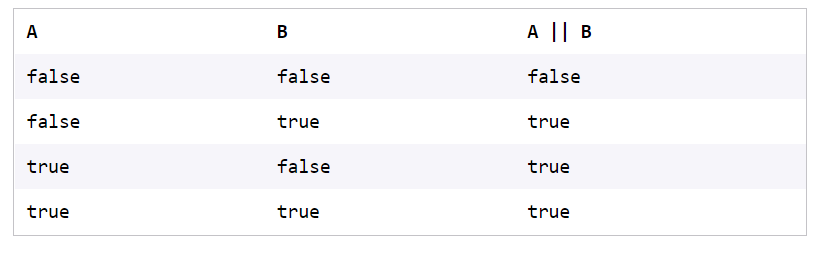
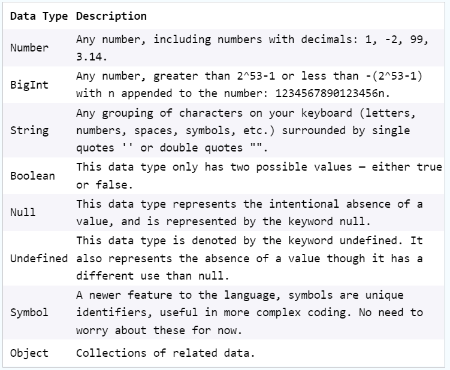

# `LEARN JAVASCRIPT - Code Academy`

 

[cheatsheet](https://www.codecademy.com/learn/introduction-to-javascript/modules/learn-javascript-introduction/cheatsheet)
[stopped](https://www.codecademy.com/courses/introduction-to-javascript/lessons/introduction-to-javascript/exercises/intro)

 

## `INTRODUCTION`

### console.log()

The console.log() method is used to log or print messages to the console. It can also be used to print objects and other info.

~~~
console.log('Hi there!');
// Prints: Hi there!
~~~

 

### JavaScript

JavaScript is a programming language that powers the dynamic behavior on most websites. Alongside HTML and CSS, it is a core technology that makes the web run.

 

### Methods

Methods return information about an object, and are called by appending an instance with a period ., the method name, and parentheses.

~~~
// Returns a number between 0 and 1
Math.random();
~~~

 

### Libraries

Libraries contain methods that can be called by appending the library name with a period ., the method name, and a set of parentheses.

~~~
Math.random();
// ☝️ Math is the library
~~~

 

### Numbers

Numbers are a primitive data type. They include the set of all integers and floating point numbers.

~~~
let amount = 6;
let price = 4.99;
~~~ 

 

### String.length

The `.length` property of a string  returns the number of characters that make up the string.

~~~
let message = 'good nite';
console.log(message.length);
// Prints: 9
 
console.log('howdy'.length);
// Prints: 5
~~~

 

### Data Instances

When a new piece of data is introduced into a javaScript program, the program keeps track of it in a instance of that data type. An instance is an individual case of a data type.

 

### Boolean

Booleans are a primitive data type. They can be either `true` or `false`.

~~~
let lateToWork = true;
~~~

 

### Math.random()

The `Math.random()` function returns a floating-point, random number in the range from 0 (inclusive) up to but not including 1.

~~~
console.log(Math.random());
// Prints: 0 - 0.9
~~~

 

### Math.floor()

The `Math.floor()` function returns the largest integer less than or equal to the given number.

~~~
console.log(Math.floor(5.95)); 
// Prints: 5
~~~

 

### Single Line comments

In JavaScript, single-line comments are created with two consecutive forward slashes `//`.

~~~
// This line will denote a comment
~~~

 

### Null

Null is a primitive data type. It represents the intentional absence of value. In code, it is represented as `null`.

~~~
let x = null;
~~~

 

### Strings 

Strings are a primitive data type. They are any grouping of characters (letters, spaces, numbers, or symbols) surrounded by single quotes `'` or double quotes `""`.

~~~
let single = 'Wheres my bandit hat?';
let double = "Wheres my bandit hat?";
~~~

 

### Arithmetic Operators

JavaScript supports arothmetic operators for:

- `+` addition
- `-` subtraction
- `*` multiplication
- `/` division
- `%` module

~~~
// Addition
5 + 5
// Subtraction
10 - 5
// Multiplication
5 * 10
// Division
10 / 5
// Modulo
10 % 5
~~~

 

### Multi-line Comments

In JavaScript, multi-line comments are created by surrounding the lines with `/*` at the beginning and `*/` at the end. Comments are good ways for a variety of reasons like explaining a code block or indicating some hints, etc...

~~~
/*  
The below configuration must be 
changed before deployment. 
*/
 
let baseUrl = 'localhost/taxwebapp/country';
~~~

 

### Remainder / Module Operator

The remainder operator, sometimes called module, returns the number that remains after the right-hand number divides into the left-hand number as many times as it evenly can.

~~~
// calculates # of weeks in a year, rounds down to nearest integer
const weeksInYear = Math.floor(365/7);
 
// calcuates the number of days left over after 365 is divded by 7
const daysLeftOver = 365 % 7 ;
 
console.log("A year has " + weeksInYear + " weeks and " + daysLeftOver + " days");
~~~

 

### Assignment Operator

An assignment operator assigns a value to its left operand based on the value of its right operand. Here are some of them:
- `+=` addition assignment
- `-=` subtraction assignment
- `*=` multiplication assignment
- `/=` division assignment

~~~
let number = 100;
 
// Both statements will add 10
number = number + 10;
number += 10;
 
console.log(number); 
// Prints: 120
~~~

 

### String Interpolation

String interpolation is the process of evaluating string literals containing one or more placeholders (expressions, variables, etc).

It can be performed using template literals: `text ${expression} text`.

~~~
let age = 7;
 
// String concatenation
'Tommy is ' + age + ' years old.';
 
// String interpolation
`Tommy is ${age} years old.`;
~~~

 

### Variables 

Variables are used whenever there's a need to store a piece of data. A variable contains data that can be used in the program elsewhere. Using variables also ensures code re-usability since it can be used to replace the same value in multiple places.

~~~
const currency = '$';
let userIncome = 85000; 
 
console.log(currency + userIncome + ' is more than the average income.');
// Prints: $85000 is more than the average income.
~~~

 

### Undefined

`undefined` is a primitive JavaScript value that represents lack of defined value. Variables are declared but not initialized to a value will have the value `undefined`.

~~~
var a;
 
console.log(a); 
// Prints: undefined
~~~

 

### Learn Javascript: Variables

A variable is a container for data that is stored in computer memory. It is referenced by a descriptive name that a programmer can call to assign a specific value and retrieve it.

~~~
// examples of variables
let name = "Tammy";
const found = false;
var age = 3;
console.log(name, found, age);
// Tammy, false, 3
~~~

 

### Declaring Variables

To declare a variable in JavaScript, any of these three keywords can be used along with a variable name:
- `var` is used in pre-ES6 versions of JavaScript.
- `let` is the preferred way to declare a variable when it can be reassigned.
- `const` is the  preferred way to declare a variable with a constant value.

~~~
var age;
let weight;
const numberOfFingers = 20;
~~~

 

### Template Literals

Tempalte literals are strings that allow embedded expressions, `${expression}`. While regular strings use single `'` or double `""` quotes, template literals use backticks instead.

~~~
let name = "CodeAcademy";
console.log(`Hello, ${name}`);
// Prints: Hello, CodeAcademy

console.log(`Billy is ${6+8} years old.`);
// Prints: Billy is 14 years old.
~~~

 

### Let Keyword

`let` creates a local variable in JavaScript & can be re-assigned. Initialization during the declaration of a `let` variale is optional. A `let` variable will contain `undefined` if nothing is assigned to it.

~~~
let count;
console.log(count); // Prints: undefined
count = 10;
console.log(count); // Prints: 10
~~~

 

### Const Keyword

 

A const variable can be declared using the keyword `const`. It must have an assignment. Any attempt of re-assigning a `const` variable will result in JavaScript runtime error.

~~~
const numberOfColumns = 4;
numberOfColumns = 8;
// TypeError: Assignment to constant variable.
~~~

 

### String Conactenation

 

In JavaScript, multiple strings can be concatenated together using the `+` operator. In the example, multiple strings and variables containing string value have been concatenated. After execution of the code block, the `displayText` variable will contain the concatenated string.

~~~
let service = 'credit card';
let month = 'May 30th';
let displayText = 'Your ' + service + 'bill is due on ' + month + '.';

console.log(displayText);
// Prints: Your credit card bill is due on May 30th.
~~~

 

 

## Conditionals

 

### Control Flow

Control flow is the order in which statements are executed in a program. The default control flow is for statements to be read and executed in order from left-to-right, top-to-bottom in a program file.

Control structures such as conditionals (`if` statements and the like) alter control flow by only executing locks of code if certain conditions are met. These structures essentially allow a program to make decisions about which code is executed as the program runs.

 

### Logical Operator ||

The logical OR operator `||` checks two values and returns a boolean. If one or both values are truthy, it returns `true`. If both values are falsy, it returns `false`.

~~~
true || false; // true
10 > 5 || 10 > 20 // true
false || false; // false
10 > 100 || 10 > 20; // false
~~~

 

### Ternary Operator

The ternary operator allows for a compact syntax in the case of binary (choosing between two choices) decisions. It accepts a condition followed by a `?` operator, and then two expressions separated by a `:`. If the condition evaluates to truthy, the first expression is executed, otherwise, the second expression is executed.

~~~
let price = 10.5;
let day = "Monday";

day === "Monday" ? price -= 1.5 : price +=1.5;
~~~

 

### Else Statement

An `else` block can be added to an `if` block or series of `if`-`else if` block. The `else` block will be executed only if the `if` condition fails.

~~~
const isTaskCompleted = false;

if(isTaskCompleted){
    console.log('Task completed');
}else{
    console.log('Task incomplete');
}
~~~

 

### Logical Operator &&

The logical AND operator `&&` checks two values and returns a boolean. If `both` values are truthy, then it returns `true`. If one, or both, of values is falsy, then it returns `false`.

~~~
true && true; // true
1 > 2 && 2 > 1; // false
true && false; // false
4 === 4 && 3 > 1; // true
~~~

 

### Switch Statement

The `switch` statements provide a means of checking an expression against multiple `case`clauses. If a case matches, the code inside that clause is executed.

The `case` clause shoud finish with a `break` keyword. If no case matches but a `default` clause is included, the code inside `default` will be executed.

> Note: If `break` is omitted from the block of a `case`, the `switch` statement will continue to check against `case` values until a break is encountered or the flow is broken.

~~~
const food = 'salad';
 
switch (food) {
  case 'oyster':
    console.log('The taste of the sea 🦪');
    break;
  case 'pizza':
    console.log('A delicious pie 🍕');
    break;
  default:
    console.log('Enjoy your meal');
}
 
// Prints: Enjoy your meal
~~~

 

### If Statement

An `if` statemen accept's an expression with a set of parentheses:
- If the expression evaluates to a truthy value, then the code within its code body executes.
- If the expression evaluates to a falsy value, its code body will not execute.

~~~
const isMailSent = true;

if(isMailSent){
    console.log('Mail sento to recipient');
}
~~~

 

### Logical Operator !

The logical NOT operator `!` can be used to do one of the following:
- Invert a Boolean value.
- Invert the truthiness of non-Boolean values.

~~~
let lateToWork = true;
let oppositeValue = !lateToWork;

console.log(oppositeValue);

// Prints: false
~~~

 

### Comparison Operators

Comparison operators are used to comparing two values and return `true` or `false` depending on the validity of the comparison:
- `===` strict equal
- `!==` strict not equal
- `>` greater than
- `>=` greater than or equal
- `<` less than
- `<=` less than or equal

~~~
1 > 3 // false
3 > 1 // true
250 >= 250 // true
1 === 1 // true
1 === 2 // false
1 === '1' // false
~~~

 

### else if Clause

After an initial `if` block, `else if` blocks can each check an additional condition. An optional `else` block can be added after the `else if` block(s) to run by default if none of the conditionals evaluated to truthy.

~~~
const size = 10;
 
if (size > 100) {
  console.log('Big');
} else if (size > 20) {
  console.log('Medium');
} else if (size > 4) {
  console.log('Small');
} else {
  console.log('Tiny');
}
// Print: Small
~~~

 

###  Truthy and Falsy

In JavaScriipt, values evaluate to `true` or `false` when evaluated as Booleans.
- Values that evaluate to `true` are known as `truthy`
- Values that evaluate to `false` are known as `falsy`

Falsy values include `false`, `0`, `empty strings`, `null`, `undefined`, and `NaN`. All other values are truthy.

 

 

## Functions 

 

### Arrow Functions (ES6)

Arrow function expressions were introduced in ES6. These expressions are clean and concise. The syntax for an arrow function expression does not require the `function` keyword and uses a fat arrow `=>` to separate the parameter(s) from the body.

There are several variations of arrow functions:
- Arrow functions with a single parameter do not require `()` around the parameter list.
- Arrow functions with a single expression can use the concise function body which returns the result of the expression without the `return` keyword.

~~~
// Arrow function with two arguments
const sum = (firstParam, secondParam) => {
    return firstParam + secondParam;
};
console.log(sum(2,5)); // Prints: 7

// Arrow function with no arguments
const printHello = () => {
    console.log('hello');
};
printHello(); // Prints: hello

// Arrow functions with a single argument
const checkWeight = weight => {
    console.log(`Baggage weight : ${weight} Kilograms.`);
};
checkWeight(25); // Prints: Baggage weight : 25 kilograms.

// Concise arrow functions
const multiply = (a,b) => a*b;
console.log(multuply(2,30)); // Prints: 60
~~~

 

### Functions 

Functions are one of the fundamental building blocks in JavaScript. A `function` is a reusable set of statements to perform a task or calculate a value. Functions can be passed one or mre values and can return a value at the end of their execution. In order to use a function, you must define it somewhere in the scope where you wis to call it.

The example code provided contains a function that takes in 2 values and returns the sum of those numbers.

~~~
// Defining the function:
function sum(num1, num2){
    return num1 + num2;
}

// Calling the function:
sum(2,6); // 9
~~~

 

### Anonymous Functions

`Anonymous functions` in JavaScript do not have a name property. They can be defined using the `function` keyword, or as an arrow function. See the code example for the difference between a named function and an anonymous function.

~~~
// Named function
function rocketToMars(){
    return 'Boom!';
}

// Anonymous function
const rocketToMars = function(){
    return 'Boom!';
}
~~~

 

### Function Expressions

Function `expressions` create functions inside ane xpression instead of as a function declaration. They can be anonymous and/or assigned to a variable.

~~~
const dog = function() {
    return 'Woof!';
}
~~~

 

### Function Parameters

Inputs to functions are known as `parameters` when a function is declared or defined. Parameters are used as variables inside te function body. When the function is called, these parameters will have the value of whatever is `passed` in as arguments. It is possible to define a function withut parameters.

~~~
// The parameter is name
function sayHello(name){
    return `Hello, ${name}!`;
}
~~~

 

### return Keyword

Functions return (pass back) values using the `return` keyword. `return` ends function execution and returns the specified value to the location where it was called. A common mistake is to forget the `return` keyword, in which case the function will return `undefiend` by default.

~~~
// With return
function sum(num1, num2){
    return num1 + num2;
}

// Without return, so the function doesn't output the sum
function sum(num1,num2){
    num1 + num2;
}
~~~

 

### Function Declaration

Function `declarations` are used to create named functions. These functions can be called using their declared name. Function declarations are built from:
- The `function keyword`.
- The function name.
- An optional list of parameters separated by commas enclosed by a set of parentheses `()`.
- A function body enclosed in a set of curly braces `{}`.

~~~
function add(num1, num2){
    return num1 + num2;
}
~~~

 

### Calling Functions

Functions can be `called`, or executed, elsewhere in code using parentheses following the function name. When a function is called, the code inside its function body runs. `Arguments` are values passed into a function when it is called.

~~~
// Defining the function
function sum(num1, num2){
    return num1 + num2;
}

// Calling the function
sum(2,4); // 6
~~~

 

 

## Scope
 

### Scope

`Scope` is a concept that refers to where values and functions can be accessed.

Various scopes include:
- `Global` scope (a value/function in the global scope can bu used anywhere in the entire program).
- `File` or `module` scope (the value/function can only be accessed from within the file).
- `Function scope` (only visible within the function).
- `Code block scope` (only visible within a `{...}` codeblock)

~~~
function myFunction(){
    var pizzaName = "Volvo";
    // Code here can use pizzaName
}
// Code here can't use pizzaName
~~~

 

### Block Scoped Variables

`const` and `let` are `block scoped variables`, meaning they are only accessible in their block or nested blocks. In the given code block, trying to print the `statusMessage` using the `console.log()` method will result in a `ReferenceError`. It is accessible only inside that `if` block.

~~~
const isLoggedIn = true;

if(isLoggedIn == true){
    const statusMessage = 'User is logged in.';
}
console.log(statusMessage);

// Uncaught ReferenceError: statusMessage is not defined
~~~

 

### Global Variables

JavaScript variables that are declared outside of blocks or functions can exist in the `global scope`, which means they are accessible throughout a program. Variables declared outside of smaller block or function scopes are accessible inside those smaller scopes.

> Note: It is best practice to keep global variables to a minimum.

~~~
// Variable declared globally

const color = 'blue';

functin printColor(){
    console.log(color);
}

printColor(); // Prints: blue
~~~

 

 

## Arrays

 

### Property .length

The `.length` property of a JavaScript array indicates the number of elements the array contains.

~~~
const numbers = [1,2,3,4];

numbers.length // 4

~~~

 

### Index

Array elements are arranged by `index` values, starting at `0` as the first element index. Elements can be accessed by their index using the array name, and the index surrounded by square brackets `[]`.

~~~
// Acessing an array element

const myArray = [100, 200, 300];

console.log(myArray[0]); // 100
console.log(myArray[1]); // 200
console.log(myArray[2]); // 300
~~~

 

### Method .push()

The `.push()` method of JavaScript arrays can be used to add one or more elements to the end of an array. `.push()` mutates the original array returns the new length of the array.

~~~
// Adding a single element:
const cart = ['apple', 'orange'];
cart.push('pear');

// Adding multiple elements:

const numbers = [1,2];
numbers.push(3, 4, 5);
~~~

 

### Method .pop()

The `.pop()` method removes the last element from an array and returns that element.

~~~
const ingredients = ['eggs', 'flour', 'chocolate'];

const poppedIngredient = ingredients.pop(); // 'chocolate'
console.log(ingredients); // ['eggs', 'flour']
~~~

 

### Mutable

JavaScript arrays are `mutable`, meaning that the values they contain can be changed.

Even if they are declared using `const`, the contents can be manipulated by reassigning internal values or using methods like `.push()` and `.pop()`.

~~~
const names = ['Alice', 'Bob'];

names.push('Carl');
// ['Alice', 'Bob', 'Carl']
~~~

 

###  Arrays

Arrays are lists of ordered, stored data. They can hold items that are of any data type. Arrays are created by using square brackets, with individual elements separated by commas.

~~~
// An Array containing numbers
const numberArray = [0,1,2,3];

// An Array containing different data types
const mixedArray = [1, 'chicken', false];
~~~

 

 

## Loops

 

### While Loop

The `while` loop creates a loop that is executed as long as a specified condition evaluates to `true`. The loop will continue to run until the condition evaluates to `false`. The condition is specified before the loop, and usually, some variable is incremented or altered in the `while` loop body to determine when the loop should stop.

~~~
while(condition){
    // code blok to be executed
}
let i = 0;
while(i < 5){
    console.log(i);
    i++;
}
~~~

 

### Reverse Loop

A `for` loop can iterate "in reverse" by initializing the loop variable to the starting value, testing for when the variable hits the ending value, and decrementing (subtracting from) the loop variable at each iteration.

~~~
const items = ['apricot', 'banana', 'cherry'];

for( let i = items.length -1; i >= 0; i -= 1){
    console.log(`${i}. ${items[i]}`);
}

// Prints: 2. cherry
// Prints: 1. banana
// Prints: 0. apricot
~~~

 

###  Do... While Statement

A `do ... while` statement creates a loop that executes a block of code once, checks if a condition is true, and then repeats the loop as long as the condition is true. They are used when you want the code to always execute at least once. The loop ends when the condition evaluates to false.

~~~
x = 0;
i = 0;

do {
    x = x + i;
    console.log(x)
    i++;
}while(i < 5);

// Prints: 0 1 3 6 10
~~~

 

### For Loop

A `for` loop declares looping instructions, with three important pieces of information separated by semicolons `;`:
- The `initialization` defines where to begin the loop by declaring (or referencing) the iterator variable.
- The `stopping condition` determines when to stop looping (when the expression evaluates to `false`).
- The `iteratin statement` updates the iterator each time the loop is completed.

~~~
for(let i = 0; i < 4; i += 1){
    console.log(i);
};
// Output: 0, 1, 2, 3
~~~

 

###  Looping Through Arrays

An array's length can be evaluated with the `.length` property. This is extremely helpful for looping through arrays, as the `.length` of the array can be used as the stopping condition in the loop.

~~~
for(let i = 0; i < array.length; i++){
    console.log(array[i]);
}

// Output: Every item in the array
~~~ 

 

### Break Keyword

Within a loop, the `break` keyword may be used to exit the loop immediately, continuing execution after the loop body.

Here, the `break` keyword is used to exit the loop when `i` is greater than 5.

~~~
for( let i = 0; i < 99; i +=1){
    if(i > 5){
        break;
    }
    console.log(i);
}

// Output: 0 1 2 3 4 5
~~~

 

###  Nested FOr Loop

A nested `for` loop is when a `for` loop runs inside another `for` loop.

The inner loop will run all its iterations for `each` interation of the outer loop.

~~~
for(let outer = 0; outer < 2; outer +=1){
    for(let inner = 0; inner < 3; inner += 1){
        console.log(`${outer}-${inner}`);
    }
}

/*
Output:
0-0
0-1
0-2
1-0
1-1
1-2
*/
~~~

 

###  Loops

A `loop` is a programming tool that is used to repeat a set of instructions. `Iterate` is a generic term that means "to repeat" in the context of `loops`. A `loop` will continue to `iterate` until a specified condition, commonly known as a s`stopping condition`, is met.

 

 

## Iterators

 

### Functions Assigned to Variables

In JavaScript, functions are data type just as strings, numbers, and arrays are data types. Therefore, functions can be assigned as values to variables, but are different from all other data types because they can be invoked.

~~~
let plusFive = (number) => {
    return number + 5;
}
// f is assigned the value f plusFive
let f = plusFive;

plusFive(3); // 8
// Since f has a function value, it can be invoked.

f(9); // 14
~~~

 

### Callback Function

In JavaScript, a callback function is a function that is passed into another function as an argument. This function can then be invoked during the execution of that higher order function (that it is an argument of).

Since, in JavaScript, functions are objects, functions can be passed as arguments.

~~~
const isEven = (n) => {
    return n % 2 == 0;
}

let printMsg = (evenFunc, num) => {
    const isNumEven = evenFunc(num);
    console.log(`The number ${num} is an even number: ${isNumEven}.`);
}

// Pass in isEven as the callback function
printMsg(isEven, 4);
// Prints: The number 4 is an even number: True.
~~~

 

###  Higher-Order Functions

In JavaScript, functions can be assigned to variables in the same way that strings or arrays can. They can be passed into other functions as parameters or returned from them as well.

A "higher-order function" is a function that accepts functions as parameters and/or returns a function.

 

### JavaScript Functions: First-Class Objects

JavaScript functions are first-class objects. ThereFore:
- They have built-in properties and methods, such as te `name` property and the `.toString()` method.
- Properties and methods can be added to them.
- They can be passed as arguments and returned from other functions.
- They can be assigned to variables, array elements, and other objects.

~~~
// Assign a function to a variable originalFunc
const originalFunc = (num) => { return num + 2};

// Re-assign the function to a new variable newFunc
const newFunc = originalFunc;

// Access the function's name property
newFunc.name; // 'originalFunc'

// Return the function's body as a string
newFunc.toString(); // '(num) => {return num + 2}'

// Add our won isMathFunction property to the function
newFunc.isMathFunction = true;

// Pass the function as an argument
const functionNameLength = (func) => { return func.name.length};
functionNameLength(orignalFunc); // 12

// Return the function
const returnFunc = () => { return newFunc };
returnFunc(); // [Function: orignalFunc]

~~~

 

###  The .reduce() Method

The `reduce()` method iterates through an array and returns a single value.

In the above code example, the `.reduce()` method will sum up all the elements of the array. It takes a callback function with two parameters `(accumulator, currentValue)` as arguments. On each iteration, `accumulator` is the value returned by the last iteration, and the `currentValue` is the current element. Optionally, a second argument can be passed which acts as the initial value of the accumulator.

~~~
const arrayOfNumbers = [1,2,3,4];

const sum = arrayOfNumbers.reduce((accumulator, currentValue) => {
    return accumulator + currentValue;
});

console.log(sum); // 10
~~~

 

### The .forEach() Method

The `.forEach()` method executes a callback function on each of the element in an array in order.

In the above example code, the callback function containing a `console.log()` method will be executed `5` times, once for each element.

~~~
const number = [28,77,45,99,27];

numbers.forEach(number => {
    console.log(number);
});
~~~

 

### The .filter() Method

The `.filter()` method executes a callback function on each element in an array. The callback function for each of the elements mut return either `true` or `false`. The returned arrays is a new array with any elements for which the callback function returns `true`.

In the above code example, the array `filteredArray` will contain all the elements of `randomNumbers` but `4`.

~~~
const randomNumbers = [4,11,42,14,39];
const filteredArray = randomNumbers.filter( n => {
    return n > 5;
})
~~~

 

### The .map() Method

The `.map()` method executes a callback function on each element in an array. It returns a new array made up of the return values from the callback function.

The original array does not get altered, and the returned array may contain different elements than the original array.

In the example code above, the `.map()` method is used to add `' joined the contest.` string at the end of each element in the `finalParticipants` array.

~~~
const finalParticipants = ['Taylor', 'Donald', 'Don', 'Natasha', 'Bobby'];

// add string after each final participant
const announcements = finalParticipants.map(member => {
    return member + ' joined the contest.';
})
console.log(announcements);
~~~

 

 

## Objects

 

### Restrictions in Naming Properties

JavaScript object key names must adhere to some restrictions to be valid. Key names must either be strings or valid identifier or variable names (i.e. special characters such as `-` are not allowed in key names that are not strings).

~~~
// Example of invalid key names
const trainSchedule = {
    platform num: 10, // invalid because of the space between words.
    40 - 10 + 2: 30, // Expressins cannot be keys.
    +compartment: 'C' // The use of a + sign is invalid unless it is enclosed in quaotatins.
}
~~~

 

### Dot Notation for Accessing Object Properties

Properties of a JavaScript object can be accessed using the dot notation in the manner: `object.propertyName`. Nested properties of an object can be accessed by chaining key names in the correct order.

~~~
const apple = {
    color: 'Green',
    price: {
        bulk: '$3/kg',
        smallQty: '$4/kg'
    }
};
console.log(apple.color); // 'Green'
console.log(apple.price.bulk); // '$3/kg'
~~~

 

### Objects

An `object` is a built-in data type for storing key-value pairs. Data inside objects are unoredred, and the values can be of any type.

 

### Accessing non-existent JavaScript properties

When trying to access a JavaScript object property that has not been defined yet, the value of `undefined` will be returned by default.

~~~
const classElection = {
    date: 'January 12'
};
console.log(classElection.place); // undefined
~~~

 

### JavaScript Objects are Mutable

JavaScript objects are `multable`, meaning their contents can be changed, even when they are declared as `const`. New properties can be added, and existing propert values can be changed or deleted.

It is the `reference` to the object, bound to the variable, that cannot be changed.

~~~
const student = {
    name: 'Sheldon',
    score: 100,
    grade: 'A',
}

console.log(student)
// { name: 'Sheldon', score: 10, grade: 'A' }

delete student.score
student.grade = 'F'
console.log(student)
// { name: 'Sheldon', grade: 'F' }

student = {}
// TypeError: Assignment to constant variable   
~~~

 

### JavaScript for ... in loop

The JavaScript `for...in` loop can be used to iterate over the keys of an object. In each iteration, one of the properties from the object is assigned to the variable of that loop.

~~~
let mobile = {
    brand: 'Samsung',
    model: 'Galaxy Note 9',
};

for (let key in mobile){
    console.log(`${key}: ${mobile[key]}`);
}
~~~

### Properties and values of a JavaScript object

A JavaScript object literal is enclosed with curly braces `{}`. Values are mapped to keys in the object with a colon(`:`), and the key-value pairs are separated by commas. All the keys are unique, but values are not.

Key-value pairs of an object are also referred to as `properties`.

~~~
const classOf2018 = {
    students: 38,
    year: 2018,
}
~~~

 

### Delete Operator

Once a object is created in JavaScript, it is possible to remove properties from the object using the `delete` operator. The `delete` keyword deletes both the value of the property and the property itself from the object. The `delete` operator only works on properties, not on variables or functions.

~~~
const person = {
    firstName: "Matilda",
    age: 27,
    hobby: "Knitting",
    goal: "learning JavaScript",
};

delete person.hobby; // or delete person[hobby];

console.log(person);

/*
{
    firstName: "Matilda"
    age: 27
    goal: "learning JavaScript"
}
*/
~~~

 

### Javascript passing objects as arguments

When JavaScript objects are passed as arguments to functions or methods, they are passed by `reference`, not by value. This means that the object itself (not a copy) is accessible and mutable (can be changed) inside that function.

~~~
const origNum = 8;
const origObj = {
    color: 'blue',
};

const changeItUp = (num, obj) => {
    num = 7;
    obj.color = 'red';
};

changeItUp(origNum, OrigObj);

// Will output 8 since integers are passed by value.
console.log(origNum);

// Will output 'red' since objects are passed
// by reference and are therefore mutable.
console.log(origObj.color);
~~~

 

### JavaScript Object Methods

JavaScript objects may have property values that are `functions`. These are referred to as object `methods`.

Methods may be defined using anonymous `arrow function expressions`, or with `shorthand method syntax`.

Objects methods are invoked with the syntax: `objectName.methodsName(arguments)`.

~~~
const engine = {
    // method shorthand, with one argument
    start(adverb){
        console.log(`The engine starts up ${adverb}...`);
    },
    // anonymous arrow function expression with no arguments
    sputter: () => {
        console.log('The engine sputters...');
    },
};

engine.start('nisily');
engine.sputter();

/*
Console output:
The engine starts up noisily...
The engine sputters...
*/
~~~

 

### JavaScript destructuring assignment shorthand syntax

The JavaScript `destructuring assignment` is a shorthand syntax that allows object properties to be extracted into specific variable values.

It uses a pair of curly braces (`{}`) with property names on the left-hand side of an assignment to extract values from objects. The number of variables can be less than the total properties of an object.

~~~
const rubiksCubeFacts = {
    possiblePermutations: '43,252,003,274,489,859,000',
    invented: '1974',
    largestCube: '17x17x17'
};

const {
    possiblePermutations, 
    invented,
    largestCube
} = rubiksCubeFacts;

console.log(possiblePermutations); // '42,252,003,274,489,856,000'

console.log(invented); // '1974'
console.log(largestCube); // '17x17x17'
~~~

 

### Shorthand Property Name Syntax for Object Creation

The `shorthand property name syntax` in JavaScript allows creating objects without explicitly specifying the property names (i.e. explicitly declaring the value after the key). In this process, an object is created where the property names of that object match variables which already exist in that context. Shorthand property names populate an object with a key matching the identifier and a value matching the identifier's value.

~~~
const activity = 'Surfing';
const beach = {
    activity
};
console.log(beach); // { activity: 'Surfing' }
~~~

 

### this Keyword

The reserved keyword `this` refers to a method's calling object, and it can be used to access properties belonging to that object.

Here, using the `this` keyword inside the object function to refer to the `cat` object and access its `name` property.

~~~
const cat = {
    name: 'Pipey',
    age: 8,
    whatName(){
        return this.name
    }
};

console.log(cat.whatName());
// Output: Pipey
~~~

 

###  JavaScript Function This

Every JavaSript function or method has a `this` context. For a function defined inside of an object, `this` will refer to that object itself. For a function defined outside of an object, `this` will refer to the global object (`window` in a browser,`global` in Node.js).

~~~
const restaurant = {
    numCustomers: 45,
    seatCapacity: 100,
    availableSeats(){
        // this refers to the restaurant object
        // and it's used to access its properties
        return this.seatCapacity - this.numCustomers;
    }
}
~~~

 

###  JavaScript Arrow Function this Scope

JavaScript arrow functions do not have their own `this` context, but use the `this` of the surrounding lexical context. Thus, they are generally a poor choice for writing object methods.

Consider the examplec code:

`loggerA` is a property that uses arrow notation to define the function. Since `data` does not exist in the global context, accessing `this.data` returns `undefined`.

`loggerB` uses method syntax. Since `this` refers to the enclosing object, the value of the `data` property is accessed as expected, returning `"abc"`.

~~~
const myObj = {
    data: 'abc',
    loggerA: () => {
        console.log(this.data);
    },
    loggerB() {
        console.log(this.data);
    },
};

myObj.loggerA(); // undefined
muObj.loggerB(); // 'abc'
~~~

 

### Getters and setters intercept property access

JavaScript getter and setter methods are helpful in part because they offer a way to intercept property access and assignment, and allow for additional actions to be performed before these changes go into effect.

~~~
const myCat = {
    _name: 'Snickers',
    get name(){
        return this._name
    },
    set name(newName){
        // Verify that newName is a non-empty string before setting as name property
        if(typeof newName === 'string' && newName.length > 0){
            this._name = newName;
        }else {
            console.log("ERROR: name must be a non-empty string");
        }
    }
}
~~~

 

### JavaScript factory functions

A JavaScript function that returns an object is known as a `factory function`. Factory functions often accept parameters in order to customize the returned object.

~~~
// A factory function that accepts 'name',
// 'age', and 'breed' parameters to return
// a customized dog object.

const dogFactory = (name, age, breed) => {
    return {
        name: name,
        age: age,
        breed: breed,
        bark(){
            console.log('Woof!');
        }
    }
}
~~~

 

### JavaScript getters and setters restricted

JavaScript object properties are not private or protected. Since JavaScript objects are passed by reference, there is no way to fully prevent incorrect interactions with object properties.

One way to implement more restricted interactins with object properties is to use `getter` and `setter` methods.

Typically, the internal value is stored as a property with an identifier that matches the `getter` and `setter` method names, but begins with an underscore(`_`).

~~~
const myCat = {
    _name: 'Dottie',
    get name() {
        return this._name;
    },
    set name(newName){
        this._name = newName;
    }
};

// Reference invokes the getter
console.log(myCat.name);

// Assignment invokes the setter
myCat.name = 'Yankee';
~~~

 

 

## Annotations

 

### Data Types

 

 

### INTRODUCTION TO JAVASCRIPT Review

Let’s take one more glance at the concepts we just learned:

- Data is printed, or logged, to the console, a panel that displays messages, with console.log().
- We can write single-line comments with // and multi-line comments between /* and */.
- There are 7 fundamental data types in JavaScript:
  - strings
  - numbers
  - booleans
  - null
  - undefined
  - symbol
  - object.
- Numbers are any number without quotes: 23.8879
- Strings are characters wrapped in single or double quotes: 'Sample String'
- The built-in arithmetic operators include +, -, *, /, and %.
- Objects, including instances of data types, can have properties, stored information. The properties are denoted with a . after the name of the object, for 
  - example: 'Hello'.length.
- Objects, including instances of data types, can have methods which perform actions. Methods are called by appending the object or instance with a period, the method name, and parentheses. For example: 'hello'.toUpperCase().
- We can access properties and methods by using the ., dot operator.
- Built-in objects, including Math, are collections of methods and properties that JavaScript provides.

Here are a few more resources to add to your toolkit:

- [Codecademy Docs: JavaScript](https://www.codecademy.com/resources/docs/javascript)
- [Codecademy Workspaces: JavaScript](https://www.codecademy.com/workspaces/new)

Make sure to bookmark these links so you have them at your disposal.

 
### VARIABLES (Review Variables)

Nice work! This lesson introduced you to variables, a powerful concept you will use in all your future programming endeavors.

Let’s review what we learned:

- Variables hold reusable data in a program and associate it with a name.
- Variables are stored in memory.
- The var keyword is used in pre-ES6 versions of JS.
- `let` is the preferred way to declare a variable when it can be reassigned, and const is the preferred way to declare a variable with a constant value.
- Variables that have not been initialized store the primitive data type undefined.
- Mathematical assignment operators make it easy to calculate a new value and assign it to the same variable.
- The + operator is used to concatenate strings including string values held in variables.
- In ES6, template literals use backticks ` and ${} to interpolate values into a string.
- The typeof keyword returns the data type (as a string) of a value.
  

To learn more about variables take on these challenges!

- Create variables and manipulate the values.
- Check what happens when you try concatenating strings using variables of different data types.
- Interpolate multiple variables into a string.
- See what happens when you use console.log() on variables declared by different keywords (const, let, var) before they’re defined. For example:
console.log(test1);
 
const test1 = 'figuring out quirks';

- Find the data type of a variable’s value using the typeof keyword on a variable.
- Use typeof to find the data type of the resulting value when you concatenate variables containing two different data types.
  

 

### CONDITIONAL STATEMENTS (Review)
 

Way to go! Here are some of the major concepts for conditionals:

- An if statement checks a condition and will execute a task if that condition evaluates to true.
if...else statements make binary decisions and execute different code blocks based on a provided condition.
- We can add more conditions using else if statements.
- Comparison operators, including <, >, <=, >=, ===, and !== can compare two values.
- The logical and operator, &&, or “and”, checks if both provided expressions are truthy.
- The logical operator ||, or “or”, checks if either provided expression is truthy.
- The bang operator, !, switches the truthiness and falsiness of a value.
- The ternary operator is shorthand to simplify concise if...else statements.
- A switch statement can be used to simplify the process of writing multiple else if statements. The break keyword stops the remaining cases from being checked and executed in a switch statement.

 

### Looping through Objects 

~~~
let spaceship = {
    crew: {
    captain: { 
        name: 'Lily', 
        degree: 'Computer Engineering', 
        cheerTeam() { console.log('You got this!') } 
        },
    'chief officer': { 
        name: 'Dan', 
        degree: 'Aerospace Engineering', 
        agree() { console.log('I agree, captain!') } 
        },
    medic: { 
        name: 'Clementine', 
        degree: 'Physics', 
        announce() { console.log(`Jets on!`) } },
    translator: {
        name: 'Shauna', 
        degree: 'Conservation Science', 
        powerFuel() { console.log('The tank is full!') } 
        }
    }
}; 

// Write your code below
for( let crewMemb in spaceship.crew){
  console.log(`${crewMemb}: ${spaceship.crew[crewMemb].name}`);
}
for( let crewMemb in spaceship.crew){
  console.log(`${spaceship.crew[crewMemb].name}: ${spaceship.crew[crewMemb].degree}`);
}

~~~

 

 

## Objects (review)

 

Review

Way to go! You’re well on your way to understanding the mechanics of objects in JavaScript. By building your own objects, you will have a better understanding of how JavaScript built-in objects work as well. You can also start imagining organizing your code into objects and modeling real world things in code.

Let’s review what we learned in this lesson:

- Objects store collections of key-value pairs.
- Each key-value pair is a property—when a property is a function it is known as a method.
- An object literal is composed of comma-separated key-value pairs surrounded by curly braces.
- You can access, add or edit a property within an object by using dot notation or bracket notation.
- We can add methods to our object literals using key-value syntax with anonymous function expressions as values or by using the new ES6 method syntax.
- We can navigate complex, nested objects by chaining operators.
- Objects are mutable—we can change their properties even when they’re declared with const.
- Objects are passed by reference— when we make changes to an object passed into a function, those changes are permanent.
- We can iterate through objects using the For...in syntax.

 

 

## ADVANCED OBJECTS

 

### Advanced Objects Introduction

 

Remember, objects in JavaScript are containers that store data and functionality. In this lesson, we will build upon the fundamentals of creating objects and explore some advanced concepts.

So if there are no objections, let’s learn more about objects!

In this lesson we will cover these topics:

- how to use the this keyword.
- conveying privacy in JavaScript methods.
- defining getters and setters in objects.
- creating factory functions.
- using destructuring techniques.

 

~~~ 
const robot = {
  model: 'B-4MI',
  mobile: true,
  greeting() {
  	console.log(`I'm model ${this.model}, how may I be of service?`);
  }
}

const massProdRobot = (model, mobile) => {
  return {
    model,
    mobile,
    greeting() {
      console.log(`I'm model ${this.model}, how may I be of service?`);
    }
  }
}

const shinyNewRobot = massProdRobot('TrayHax', true)

const chargingStation = {
  _name: 'Electrons-R-Us',
  _robotCapacity: 120,
  _active: true,
  _chargingRooms: ['Low N Slow', 'Middle of the Road', 'In and Output'],

  set robotCapacity(newCapacity) {
    if (typeof newCapacity === 'number') {
      this._robotCapacity = newCapacity;
    } else {
      console.log(`Change ${newCapacity} to a number.`)
    }
  },
  get robotCapacity() {
    return this._robotCapacity;
  }
}

~~~

 

### The this KEYWORD

Objects are collections of related data and functionality. We store that functionality in methods on our objects:

~~~
const goat = {
  dietType: 'herbivore',
  makeSound(){
    console.log('baaa');
  }
};
~~~

 

In our `goat` object we have a `.makeSound()` method. We can invoke the `.makeSound()` method on `goat`.

~~~
goat.makeSound(); // Prints baaa
~~~

 

Nice, we have a `goat` object that can print `baaa` to the console. Everything seems to be working fine. What if we wanted to add a new method to our `goat` object called `.diet()` that prints the `goat`'s `dietType`?

~~~
const goat = {
  dietType: 'herbivore',
  makeSound() {
    console.log('baaa');
  },
  diet() {
    console.log(dietType);
  }
};
goat.diet();
// Output will be 'ReferenceError: dietType is not defined'.
~~~

 

That’s strange, why is dietType not defined even though it’s a property of goat? That's because inside the scope of the `.diet()` method, we don't automatically have access to other properties of the `goat` object.

Here's where the `this` keyword comes to the rescue. If we change the `.diet()` method to use the `this`, the `.diet()` works!

~~~
const goat = {
  dietType: 'herbivore',
  makeSound(){
    console.log('baaa');
  },
  diet() {
    console.log(this.dietType);
  }
};
goat.diet();
// Output: herbivore
~~~

 

The `this` keyword references the `calling object` which provides access to the calling object's properties. In the example above, the calling object is `goat` and by using `this` we're accessing the `goat` object itself, and then the `dietType` property of `goat` by using property dot notation.

~~~
const robot = {
  model: '1E78V2',
  energyLevel: 100,
  provideInfo() {
    return 'I am ' + this.model + ' and my current energy level is ' + this.energyLevel;
  }
};

console.log(robot.provideInfo());
~~~

 

### Arrow Functinos and THIS

 

We saw in the previous exercise that for a method, the calling object is the object the method belongs to. If we use the `this` keyword in a method then the value of `this` is the calling object. However, it becomes a bit more complicated when we start using `arrow functions` for methods. Take a look at the example below: 

~~~ 
const goat = {
  dietType: 'herbivore',
  makeSound() {
    console.log('baaa');
  },
  diet: () => {
    console.log(this.dietType);
  }
};
 
goat.diet(); // Prints undefined
~~~

 

In the comment, you can see that goat.diet() would log undefined. So what happened? Notice that the .diet() method is defined using an arrow function. 

Arrow functions inherently `bind`, or tie, an already defined `this` value to the function itself that is NOT the calling object. In the code snippet above, the value of `this` is the `global object`, or an object that exists in the global scope, which doesn't have a `dietType` property and therefore returns `undefined`.

To read more about either arrow functions or the global object check out eh MDN documentation of [the global object](https://developer.mozilla.org/en-US/docs/Glossary/Global_object) and [arrow functions](https://developer.mozilla.org/en-US/docs/Web/JavaScript/Reference/Functions/Arrow_functions)

The key takeaway from the example above is to avoid using arrow functions when using this in a method! 

~~~
const robot = {
  energyLevel: 100,
  checkEnergy() {
    console.log(`Energy is currently at ${this.energyLevel}%.`)
  }
}

robot.checkEnergy();
~~~

 

### Privacy

 

Accessing and updating properties is fundamental in working with objects. However, there are cases in which we don't want other code simply accessing and updating an object's properties. When discussing `privacy` in objects, we define it as the idea that only certain properties should be mutable or able to change in value.

Certain languages have privacy built-in for objects, but JavaScript does not have this feature. Rather, JavaScript developers follow naming conventions that signal to other developers how to interact with a property. One common convetion is to place an underscore `_` before the name of a property to mean that the property should not be altered. Here's an example of using `_` to prepend a property.

~~~
const bankAccount = {
    _amount = 1000,
}
~~~

 

In the example above, the `_amount` is not intended to be directly manipulated.

Even so, it is still possible to reassign `_amoun`:

~~~
bankAccount._amount = 1000000;
~~~

 

In later exercises, we'll cover the use of methods called `getters and setters`. Both methods are used to respect the intention of properties prepended, or began, with `_`. Getters can return the value of internal properties and setters can safely reassign property values. For now, let's see what happens if we can change properties that don't have setters or get
ters.

~~~ 
const robot = {
  _energyLevel: 100,
  recharge(){
    this._energyLevel += 30;
    console.log(`Recharged! Energy is currently at ${this._energyLevel}%.`)
  }
};

robot._energyLevel = 'high';
robot.recharge();

~~~

 

### Getters

 

`Getters` are methods that get and return the internal properties of an object. But they can do more than just retrieve the value of a property! Let's take a look at a getter method:

~~~ 
const person = {
    _firstName: 'John',
    _lastName: 'Doe',
    get fullName(){
        if(this._firstName && this._lastName){
            return `${this._firstName} ${this._lastName}`;
        }else{
            return 'Missing a first name or a last name';
        }
    }
}
// To call the getter method:
person.fullName; // 'John Doe'
~~~

 

Notice that in the getter method above:

- We use the `get` keyword followed by a function.
- We use an `if...else` conditional to check if both `_firstName` and `_lastName` exist (by making sure they both return trythy values) and then return a different value depending on the result.
- We can access the calling object's internal properties using `this`. In `fullName`, we're accessing both `this._firstName` and `this._lastName`.
- In the last line we call `fullName` on `person`. In general, getter methods do not need to be called with a set of parentheses. Syntactically, it looks like we're accessing a property.

 

Now that we've gone over syntax, let's discuss some notable advantages of using getter methods:

- Getters can perform an action on the data when getting a property.
- Getters can return different values using conditionals.
- In a getter, we can access the properties of the calling object using `this`.
- The functionality of our code is easier for other developers to understand.

 

Another thing to keep in mind when using getter (and setter) methods is that properties cannot share the same name as the getter/setter function. If we do so, then calling the method will result in an infinite call stack error. One workaround is to add an underscore before the property name like we did in the example above.

~~~
const robot = {
  _model: '1E78V2',
  _energyLevel: 100,
  get energyLevel() {
    if(typeof this._energyLevel == 'number'){
      return `My current energy level is ${this._energyLevel}`;
    }else{
      return 'System malfunction: cannot retrieve energy level';
    }
  }
};
console.log(robot.energyLevel);

~~~

 

### Setters

 

Along with getter methods, we can also create `setter` methods which reassign values of existing properties within an object. Let's see an example of a setter method:

~~~
const person = {
    _age: 37,
    set age(newAge){
        if(typeof newAge === 'number'){
            this._age = newAge;
        }else{
            console.log('You must assign a number to age');
        }
    }
};
~~~

 

Notice that in the example above:

- We can perform a check for what value is being assigned to `this._age`.
- When we use the setter method, only values that are numbers will reassing `this._age`.
- There are different outputs depending on what values are used to reassign `this._age`.

Then to use the setter method:

~~~
person.age = 40;
console.log(person._age); // Logs: 40
person.age = '40'; // Logs: You must assign a number to age. 
~~~

 

Setter methods like `age` do not need to be called with a set of parentheses. Syntactically, it looks like we're reassigning the value of a property.

Like getter methods, there are similar advantages to using setter methods that include checking input, performing actions on properties, and displaying a clear intention for how the object is supposed to be used. Nonetheless, even with a setter method, it is still possible to directly reassign properties. For example, in the example above, we can still set `._age` directly:

~~~
person._age = 'forty-five';
console.log(person._age); // Prints forty-five 
~~~

 

~~~
const robot = {
  _model: '1E78V2',
  _energyLevel: 100,
  _numOfSensors: 15,
  get numOfSensors(){
    if(typeof this._numOfSensors === 'number'){
      return this._numOfSensors;
    } else {
      return 'Sensors are currently down.'
    }
  },
  set numOfSensors(num){
    if(typeof num === 'number' && num >= 0){
      this._numOfSensors = num;
    }else{
      return 'Pass in a number that is greater than or equal to 0';
    }
  }
};

robot.numOfSensors = 100;

console.log(robot.numOfSensors);
~~~

 

### Factory Functions 

 

So far we’ve been creating objects individually, but there are times where we want to create many instances of an object quickly. Here’s where factory functions come in. A real world factory manufactures multiple copies of an item quickly and on a massive scale. A factory function is a function that returns an object and can be reused to make multiple object instances. Factory functions can also have parameters allowing us to customize the object that gets returned.

Let’s say we wanted to create an object to represent monsters in JavaScript. There are many different types of monsters and we could go about making each monster individually but we can also use a factory function to make our lives easier. To achieve this diabolical plan of creating multiple monsters objects, we can use a factory function that has parameters: 

~~~
const monsterFactory = (name, age, energySOurce, cartchPhrase) => {
    return {
        name: name,
        age: age,
        energySource: energySource,
        scare(){
            console.log(catchPhrase);
        }
    }
};
~~~

  

In the `monsterFactory` function above, it has four parameters and returns an object that has the properties: `name`, `age`, `energySource`, and `scare()`. To make an object that represents a specific monster lika a `ghost`, we can call `monsterFactory` with the necessary arguments and assign the return value to a variable:

~~~
const ghost = monsterFactory('Ghouly', 251, 'ectoplasm', 'BOO!');
ghost.scare(); // 'BOO!'
~~~

 

Now we have a ghost object as a result of calling monsterFactory() with the needed arguments. With monsterFactory in place, we don’t have to create an object literal every time we need a new monster. Instead, we can invoke the monsterFactory function with the necessary arguments to take over the world make a monster for us! 

~~~
const robotFactory = (model, mobile) => {
  return {
    model: model,
    mobile: mobile,
    beep() {
      console.log('Beep Boop');
    }
  }
};

const tinCan = robotFactory('P-500',true);

tinCan.beep(); 
~~~

 

### Property Value ShortHand

 

ES6 introduced some new shortcuts for assigning properties to variables known as `destructuring`.

In the previous exercise, we created a factory function that helped us create objects. We had to assign each property a key and value even though the key name was the same as the parameter name we assigned to it. To remind orselves, here's a truncated version of the factory function:

~~~
const monsterFactory = (name, age) => {
    return {
        name: name,
        age: age,
    }
};
~~~

 

Imagine if we had to include more properties, that process would quickly become tedious! But we can use a destructuring technique, called `property value shorthand`, to save ourselves some keystrokes. The example below works exactly like the example above:

~~~
const monsterFactory = (name, age) => {
    return {
        name,
        age,
    }
};
~~~

 

Notice that we don't have to repeat ourselves for property assignments!

~~~ 
function robotFactory(model, mobile){
  return {
    model,
    mobile,
    beep() {
      console.log('Beep Boop');
    }
  }
}

// To check that the property value shorthand technique worked:
const newRobot = robotFactory('P-501', false)
console.log(newRobot.model)
console.log(newRobot.mobile)
~~~ 

 

### Destructured Assignment 

 

We often want to extract key-value pairs from objects and save them as variables. Take for example the following object:

~~~
const vampire = {
    name: 'Dracula',
    residence: 'Transylvania',
    preferences: {
        day: 'stay inside',
        night: 'satisfy appetite',
    }
};
~~~

If we wanted to extract the `residence` property as a variable, we could use the following code:

~~~
const residence = vampire.residence;
console.log(residence);
~~~ 

 

However, we can also take advantage of a destructuring technique called `destructured assignment` to sabe ourselves some keystrokes. In destrucutured assignment we create a variable with the name of an object's key that is wrapped in curly braces `{}` and assign to it the object. Take a look at the example below:

~~~
const { residence } = vampire;
console.log(residence); // Prints 'Transylvania'
~~~ 

 

Look back at the `vampire` object's properties in the first code example. Then, in the example above, we declare a new variable `residence` that extracts the value of `residence` to the console, `Transylvania` is printed.

We can even use destructured assignment to grab nested properties of an object:

~~~
const { day } = vampire.preferences;
console.log(day); // Prinsts 'stay inside'
~~~

 

~~~ 
const robot = {
  model: '1E78V2',
  energyLevel: 100,
  functionality: {
    beep() {
      console.log('Beep Boop');
    },
    fireLaser() {
      console.log('Pew Pew');
    },
  }
};

const { functionality } = robot;

functionality.beep();
~~~

 

### Built-in Object Methods

 

In the previous exercises we’ve been creating instances of objects that have their own methods. But, we can also take advantage of built-in methods for Objects!

For example, we have access to object instance methods like: .hasOwnProperty(), .valueOf(), and many more! Practice your documentation reading skills and check out: [MDN’s object instance documentation](https://developer.mozilla.org/en-US/docs/Web/JavaScript/Reference/Global_Objects/Object#Methods).

There are also useful Object class methods such as Object.assign(), Object.entries(), and Object.keys() just to name a few. For a comprehensive list, browse: [MDN’s object instance documentation](https://developer.mozilla.org/en-US/docs/Web/JavaScript/Reference/Global_Objects/Object#Methods).

Let’s get acquainted with some of these methods and their documentation.

Note: You will see errors as you work through this exercise, but by the end the errors will be fixed!

~~~
const robot = {
	model: 'SAL-1000',
  mobile: true,
  sentient: false,
  armor: 'Steel-plated',
  energyLevel: 75
};

// What is missing in the following method call?
const robotKeys = Object.keys(robot);

console.log(robotKeys);

// Declare robotEntries below this line:
const robotEntries = Object.entries(robot);

console.log(robotEntries);

// Declare newRobot below this line:
const newRobot = Object.assign({
  laserBlaster: true, 
  voiceRecognition: true,
}, robot);

console.log(newRobot);
~~~ 

 

## Advanced Objects (Review)

 

Review

Congratulations on finishing Advanced Objects!

Let’s review the concepts covered in this lesson:

- The object that a method belongs to is called the calling object.
- The this keyword refers to the calling object and can be used to access properties of the calling object.
- Methods do not automatically have access to other internal properties of the calling object.
- The value of this depends on where the this is being accessed from.
- We cannot use arrow functions as methods if we want to access other internal properties.
- JavaScript objects do not have built-in privacy, rather there are conventions to follow to notify other developers about the intent of the code.
- The usage of an underscore before a property name means that the original developer did not intend for that property to be directly changed.
- Setters and getter methods allow for more detailed ways of accessing and assigning properties.
- Factory functions allow us to create object instances quickly and repeatedly.
- There are different ways to use object destructuring: one way is the property value shorthand and another is destructured assignment.
- As with any concept, it is a good skill to learn how to use the documentation with objects!

 

 

