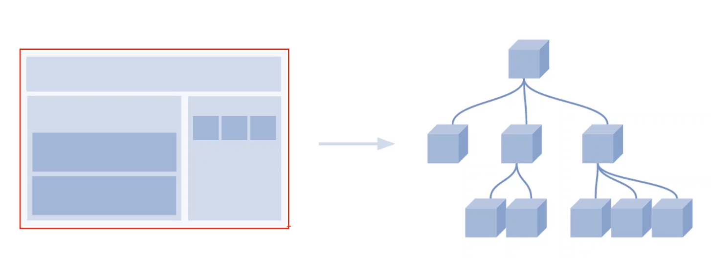

# Seção 05 - DOM (Document Object Model)
 

 

## Introdução
 

- Uma API disponibilizada nos browser que edita o que é mostrado na tela.
- Interface entre o mundo do javascript e o mundo do HTML. Toda vez que quisermos acessar um elemento no mundo HTML para manipula-lo, usamos o DOM (objeto document) para fazer essa ponte.
- Sempre que estamos falando de DOM estamos nos referindo ao objeto `document`.

- Temos um elemento de `body` no html, mas o que estamos fazendo é transformar esse elemento em um objeto onde conseguimos manipular no mundo do `javascript`.
- Na imagem temos varios elementos, que são filhos diretos da tag `body` esses filhos tambem serão transformados em objetos no mundo do javascript.
- Essa estrutura é o que chamamos de `arvore do DOM`, ou seja, uma representação hierarquica do que temos no mundo do `HTML`. Sempre que precisarmos manipular o `HTML` atraves do `Javascript` vamos precisar fazer o acesso ao `DOM`.
- Tudo que fizermos de alteração no `DOM` é automaticamente refletida na tela.

Sempre que falamos de `DOM` estamos nos referindo ao `objeto Document`.

~~~
document.getElementById();
        .getElementsByTagName();
        .getElementsByClassName();
        .querySelector();
        .querySelectorAll();
~~~

 

 

## Selecionar elemento html no Javascript (recursos)
 

A partir de agora todos os nossos exercicios serão criados a partir de um arquivo `HTML`. Vamos abrir nosso `exemplo1.html` no nosso browser. Sempre que tivermos um arquivo `html` no browser, nos conseguimos visualizar o `DOM`. Basta pedirmos para `inspecionar`o arquivo e a `itnerface do DOM` irá aparecer.

~~~
[ARQUIVO EXEMPLO1.HTML]

<!DOCTYPE html>
<html lang="en">
<head>
    <meta charset="UTF-8">
    <meta http-equiv="X-UA-Compatible" content="IE=edge">
    <meta name="viewport" content="width=device-width, initial-scale=1.0">
    <title>DOM - Document Object Model</title>

    

</head>
<body>
    <h1 id="title1">Curso Javascript Completo 2018 </h1>

    <main class="cmain" id="idmain">
        <h2>subtitulo</h2>
        
Lorem ipsum dolor sit amet consectetur, adipisicing elit. Eaque ipsum tempora, repellendus cum distinctio iure, quos suscipit, magnam vel porro alias maiores nostrum magni? Laudantium sed voluptate excepturi voluptatem temporibus.

    </main>

    <section class="csection" id="idsection">
        <h3>subtitulo 3</h3>
        
Lorem ipsum dolor, sit amet consectetur adipisicing elit. Quae, iusto reiciendis! Nobis enim molestias nemo culpa sit distinctio reprehenderit omnis, at error hic animi aspernatur quam eius voluptas veritatis officia.

        
Lorem ipsum dolor, sit amet consectetur adipisicing elit. Amet dignissimos, pariatur, sed aliquid dolorum ipsum libero dolores consequatur, tenetur impedit deserunt voluptatum ullam autem reprehenderit odio sit quo dolore atque.

    </section>
    
</body>
</html>
~~~

A visualização na aba `elements` nos mostra uma visulização hierarquica do nosso HTML. O que estamos inspecionando é o `DOM` e não o `HTML` em si, para visualizar o `HTML` no browser, basta apertamos `ctrl+u` que poderemos ver o `View-source`. 

Caso a gente faça alguma alteração no `DOM` veremos na pagina, porem se atualizarmos a pagina, o nosso codigo fonte não será alterado.

Na aba `Console` conseguimos testar codigos javascript, se quisermos alterar via javascript, precisamos utilizar o nome do `elemento` que queremos fazer as alterações pelo console.

- Existe duas maneiras de no console acessarmos elementos HTML usando o objeto `document`.
- Pela id `document.getElementById("title1")`
  - Para fazer alteração usamos outra propriedade chamada `.textContent`

~~~
document.getElementById('title1').textContent = 'o que queremos alterar'; 
~~~ 

- O segundo metodo seria utilizando o metodo/propriedade chamada de `querySelector`
- Conseguimos passar dentro deste metodo qualquer seletor de css. Para isso precisamos usar o hashtag `#`

~~~ 
document.querySelector('#title1').textContent = "Editado com querySelector"
~~~

- Vamos colocar uma classe nos paragrafos para selecionar com base nas classes.
- Observe que se dermos um enter, ele nos trará um `Array`, porem não é um `array` de verdade. Nos mostrando que é um `HTML Collection`

~~~
document.getElementsByClassName("paragrafo2")
~~~

- Se utilizarmos o `textContent` com essa classe, ele irá imprimir no console o texto alterado, porem nao irá alterar no browser.
- Isso ocorre pois toda vez que acessamos, não uma representação direta do nosso `HTML`, mas um `HTML collection` ou uma `node list`, estamos acessando um objeto, e não conseguimos acessar as propriedadess desse objeto diretamente.

~~~ 
document.getElementsByClassName("paragrafo2").textContent = "teste de alteração de objeto"
~~~

- Ou seja, se quisermos fazer a alteração do texto, iremos precisar colocar o `Indice` do elemento que queremos alterar.

~~~
document.getElementsByClassName("paragrafo2")[0].textContent = "Editado pela classe"
~~~

- Logo precisamos tomar cuidado com isso, sempre que usarmos  o `getElementByID ou querySelector` estamos acessando uma refrencia do objeto.
- Se usarmos `getElementByClassName ou getElementsByTagName ou o querySelectorAll`, precisamos tambem passar o indice do elemento que queremos.
- `querySelectorAll` precisa ser passado exatamente como no `CSS`0
~~~
document.queryselectorAll(".paragrafo2")[0].textContent = "editado com queryselectorAll"
~~~

- O `QuerySelcetorAll` irá nos retornar um `nodeList` enquanto o `getElementsByClassName` nos retornar um `HTML Collection`. 
- Veremos a diferença entre esses dois objetos mais a frente.
- Se fizermos o `querySelectorAll` passando o `h1` como referencia ele irá nos retornar o `H1`. Porem se fizermos o `querySelectorAll("h1").textContent` nos não conseguimos alterar o elemento.
- Isso acontece pois, apesar de estarmos selecionando um elemento so, com o `querySelectorAll` temos o retorno de uma `nodeList`.

~~~
document.querySelectorAll("h1").textContent = "editando com queryselector" ---> não edita
~~~

- Se quisermos que a edição ocorra, temos que passar o `indice` para o `querySelectorAll` selecionar apenas um elemento.

~~~ 
document.querySelectorAll("h1")[0].textContent = "Editado com queryselector + indice 0"
~~~ 

 

 

## Selecionar na árvore DOM
 

Vamos ver um exemplo do `getElementsByTagName` onde poderiamos por exemplo, selecionar todos os paragrafos.

~~~
document.getElementsByTagName("p")

SAIDA: HTMLCollection(3) [p, p.paragrafo2, p.paragrafo2]
~~~

- Vemos na saida que temos `3 paragrafos`. Digamos que queremos pegar o paragrafo apenas do elemento que possui a `id="idmain"`.
- Vamos criar uma variavel para receber esse elemento

~~~
let teste =  document.getElementsById("idmain")

SAIDA: undefined
~~~

- Se digitarmos no console `teste`, essa variavel agora armazena uma referencia para o nosso `main`

~~~
 <main class="cmain" id="idmain"></main>
~~~

- Agora como fazemos para pegar o paragrafo que esta dentro dessa variavel `teste`
- Fazemos uma navegação entre a estrutura hierarquica do `DOM` 

~~~
teste.getElementsByTagName("p")

SAIDA: HTMLCollection [p]
~~~

- Irá nos mostrar um `HTML COllection` com somente um elemento.
- Se fizermos `textContent` não teremos acesso para a edição direta do paragrafo. Porem vimos que se temos uma `Coleção` precisamos passar o `indice` para que a edição funcione.

~~~
teste.getElementsByTagName("p").textContent = "editando sem indice" --> não funcionar a edição

teste.getElementsByTagName("p")[0].textContent = "editando com indice" --> funcionar a edição 

~~~ 

- Observe que agora acessamos somente o paragrafo que se encontra dentro da `id="idmain"`. Os outros dois paragrafos nao foram editados.
- Vamos agora ver um jeito mais facil. Se quisermos pegar o mesmo paragrafo, podemos usar o `querySelector` para editar de forma mais direta da seguinte maneira:

~~~ 
document.querySelector("#idmain p")
~~~

- Lembre que quando usamos o `querySelector` temos que passar exatamente como usariamos no `CSS`, logo basta usar o `#` + `espaço` + `elemento` que queremos selecionar no caso a tag `p`. 

~~~
document.querySelector("#idmain p").textContent = "Editando com querySelector o elemento p" --> Editou o elemento diretamente.
~~~ 

- Vamos ver agora o `idSection` onde possuimos 2 paragrafos.
- Reparem que , dentro do `idSection` temos 2 paragrafos, se a gente fizer `querySelector("#idsection p")` ele irá selecionar, sempre, o primeiro paragrafo.
- Ou seja, o `querySelector` sempre irá nos retornar `um unico objeto`, independente da quantidade de elementos que temos.
- Enquanto que se usarmos o `querySelectorAll` o nosso retorno será uma `Node list` com `2 paragrafos`, precisando de `indice` caso a gente queira fazer a edição.

~~~
document.querySelector("#idsection p")

SAIDA: 
​…​
​

document.querySelectorAll("#idsection p")

SAIDA: NodeList(2) [p.paragrafo2, p.paragrafo2]
~~~ 

 

 

## Relembrar: onde inserir os nossos scripts?
 

Vamos agora fazer umas edições sem utilizar o console e sim o vscode, antes vamos fazer um experimento no console.

~~~
document.querySelector("h1")
<h1 id=​"title1">​Curso Javascript Completo 2018 ​</h1>​

document.querySelector("h1").textContent = "Editado com JS"

~~~

- Vamos copiar o ultimo comando que usamos no console `document.querySelector("h1").textContent = "Editado com JS"`.
- Vamos colocar uma tag `scrip` dentro da tag `head` no nosso arquivo `HTML` no vscode. Vamos salvar e no atualizar o browser para vermos o que acontece.

~~~
<head>
    <meta charset="UTF-8">
    <meta http-equiv="X-UA-Compatible" content="IE=edge">
    <meta name="viewport" content="width=device-width, initial-scale=1.0">
    <title>DOM - Document Object Model</title>

    

</head> 
~~~

- Observe que ao atualizarmos a pagina recebemos um erro. Sempre que algo não funcionar no nosso codigo, o `console` é onde observamos o `erro`

~~~
Uncaught TypeError: Cannot set properties of null (setting 'textContent')
    at exemplo1.html:10:50
  (anonymous)	@	exemplo1.html:10
~~~

- Pq será que no browser, o codigo que usamos para editar funciona, porem no vscode não? 
- O que acontece é que, para que esse codigo seja entendido, no caso, `document.querySelector("h1")`, ou seja, não seja um valor nulo, o nosso `HTML` precisa ter sido `parseado/lido/interpretado` pelo browser.
- Porem como nosso `Browser` ler o codigo de cima para baixo, ele irá ler a tag `head/title/meta` e ao chegar na tag `scrip` ele irá mudar a `chave de interpretação do browser`, informando que não esta mais interpretando `HTML` e sim `javascript` para o `motor de renderização do browser`.
- Como ainda não foi passado a parte da `tag body` não existe `h1`, pois ainda não foi lido, logo nesse ponto do codigo `document.querySelector("h1")` é `nulo` e o `nulo` não possui a propriedade `textContent` que é exatamente o que o erro esta informando.
- Logo, toda vez que que estivermos manipulando o `DOM` da pagina `HTML` precisamos `garantir` que o `HTML` em si ja tenha sido `lido e parseado pelo browser`. 
- Tanto que se pegarmos o codigo `javascrip` e colocarmos antes de fechar a tag `body`, garantimos que os objetos dos `DOM` ja existam na memoria fazendo o codigo funcionar.

~~~
<body>
    <h1 id="title1">Curso Javascript Completo 2018 </h1>

    <main class="cmain" id="idmain">
        <h2>subtitulo</h2>
        
Lorem ipsum dolor sit amet consectetur, adipisicing elit. Eaque ipsum tempora, repellendus cum distinctio iure, quos suscipit, magnam vel porro alias maiores nostrum magni? Laudantium sed voluptate excepturi voluptatem temporibus.

    </main>

    <section class="csection" id="idsection">
        <h3>subtitulo 3</h3>
        
Lorem ipsum dolor, sit amet consectetur adipisicing elit. Quae, iusto reiciendis! Nobis enim molestias nemo culpa sit distinctio reprehenderit omnis, at error hic animi aspernatur quam eius voluptas veritatis officia.

        
Lorem ipsum dolor, sit amet consectetur adipisicing elit. Amet dignissimos, pariatur, sed aliquid dolorum ipsum libero dolores consequatur, tenetur impedit deserunt voluptatum ullam autem reprehenderit odio sit quo dolore atque.

    </section>
    

    

</body> 
~~~

- Por essa razão, colocamos muitas vezes a tag `scrip` antes de fechar o `body`. 
- Existe uma implicação com relação a `performace`, pois o `javascrip` que fica no `head` precisa ser interpretado primeiro antes de mostrar alguma coisa para o usuario. Ja o `javascrip` do `body` nao.

 

 

## Exercicio proposto: saudação
 

A ideia é mostrar onde esta escrito `bemvindo(A)` o nome do usuario. Digamos que para o usuario ver essa pagina, ele precise logar, e uma vez logado, temos acesso ao `nome do usuario`.

- Nesta pagina iremos criar uma `variavel` onde iremos colocar o nome do usuario simulando como se tivesse vindo de um banco de dados ou algo do tipo.
- A primeira coisa será a criação de uma arquivo `javascript` e vamos fazer a importação dele no nosso arquivo `html`, antes de fecharmos a tag `body` pois queremos manipular o `DOM`.
- Vamos pensar em nosso arquivo `javascrip` como se fosse um modulo, logo se colocarmos  `functions, variaveis` tudo entrará no `modo global` o que não seria uma boa pratica. `Devemos evitar variaveis e funções globais a todo custo`.
- Logo a primeira coisa que iremos criar no nosso arquivo `javascrip` é uma `função autoinvocavel / anonymous`. Pois estamos trabalhando com o browser e nao estamos utilizando nenhuma ferramenta de `build`. Se tivessemos trabalhando com `web pack` por exemplo, ou criando para o `NodeJS` não iriamos precisar criar uma função anonima.

~~~
[IMPORTAÇÃO DO JAVASCRIPT NO HTML]

<body>
  ...
  
</body>
~~~

~~~
(function(){
  
}) ()
~~~

- Como vamos receber o `nome do usuario` vamos criar logo uma `constante` para receber esse valor.

~~~
(function(){
  const nomeUsuario = "Angelina(Daniel)"; 
})()
~~~

 

 

## Resolução: Calcular saudação
 

- Agora precisamos acessar o elemento `HTML` onde vamos substituir por nossa variavel no `javascript`.

~~~
(function(){
    const userName = "Angelina(Daniel)";
    document.querySelector(".top-bar").textContent = "Bem-vinda(o), " + userName;
})()
~~~

- Ao salvar e atualizar o browser, vemos que conseguimos alterar o `DOM` usando o `javascript`.

Podemos tambem fazer de uma forma diferente. Queremos guardar uma `referencia` desse objeto do `DOM` em uma `variavel`

~~~

(function(){
    const userName = "Angelina(Daniel)";
    // document.querySelector(".top-bar p").textContent = "Bem-vinda(o), " + userName;
    const element = document.querySelector(".top-bar p");

    element.textContent = "Bem-vinda(o), " + userName;
})()
~~~

- Veja que conseguimos o mesmo resultado utilizando a referencia criada.
- Criamos uma constante e atraves dela conseguimos fazer o acesso.

Outra coisa que podemos observar é, temos o `Bem-vindo,` no nosso HTML e no nosso javascrip, porem, se alterarmos no `HTML` o `Bem-vindo` para `Olá` a alteração não será feita pois o nosso codigo no `javascript` irá prevalecer.

- Gostariamos de poder deixar o texto `Bem-vindo/olá` que é apresentado, somente no `html` e somente ter no `javascript` a concatenação com o nome de usuario.
- A propriedade `textContent` serve tanto para definirmos um valor como para `recuperar um valor`.
- Se colocarmos no `console.log(elemento.textContent)`,irá nos mostrar o texto original.
- Logo podemos fazer o seguinte:

~~~
(function(){
    const userName = "Angelina(Daniel)";
    const element = document.querySelector(".top-bar p")
    element.textContent = element.textContent + userName
})()
~~~

- Agora podemos colocar qualquer texto no `html` que será refletido no browser.
- Quando temos a estrutura de `uma variavel + alguma coisa` podemos escrever de outra formar:

~~~
element.textContent += username
~~~

 

 

## Inserir tags HTML
 

Continuando, agora queremos mostrar o `nome de usuario` em negrito.

- Podemos fazer no proprio javascript a concatenação da tag `b` com a variavel que possui o nome de usuario.
~~~
  element.textContent += " " + userName + "</b>";
~~~

- Se dermos um F5 veremos que não funciou (foi representado no html a tag normal), isso acontece pois estamos utilizando a propriedade `textContent` e ela não compreende `tags html`.
- Vamos precisar utilizar uma propriedade chamada `innerHTML`. Essa propriedade vai pegar as tags que forem inseridas e `renderiza-las`, ou seja, pegar o codigo HTML e mostrar na tela da maneira apropriada.

~~~
  element.innerHTML = " " + userName + "</b>";
~~~ 

- Essa é a diferença entre `textContent` e `innerHTML`.
- Temos tambem a propriedade `innerText`, que pe semelhante quando vamos alterar, porem diferente quando queremos resgatar um valor, veremos mais a frente.

 

 

## Esconder elemento
 

Agora o que iremos fazer é simular essa mesma pagina que estamos trabalhando, mas como se o usuario não estivesse logado.

- Digamos que o usuario irá acessar essa pagina, so que, o que estiver em  `username` será uma string vazia, nulo, ou qualquer coisa do tipo.
- Digamos que fizemos uma requisição para o servidor para recuperar o nome do usuario logado porem esse nome não existe. O que poderiamos fazer?

~~~ 
(function(){
    // checagem para ver se esta logado.
    const username = null;
    const element = document.querySelector(".top-bar p");
    if(username){
        console.log(element.textContent)
        element.innerHTML += "<b>" + username + "</b>";
    }
})()
~~~

- Percebam que se salvarmos da maneira que esta, não iremos receber o nome do usuario, somente o texto do `HTML`.
- Caso não tenha nome de usuario, queremos pegar o nosso paragrafo e esconde-lo, temos varias formas de fazer isso:
  - colocar display:none no css; ou com style in line
  - podemos remover ele da pagina
  - etc..
- Vamos ver como fazer um `display:none`  no elemento,utilizando o `.style` que iremos nos permitir escrever estilos em linha.

~~~ 
const username = null;
    const element = document.querySelector(".top-bar p");
    if(username){
        console.log(element.textContent)
        element.innerHTML += "<b>" + username + "</b>";
    }else{
        element.style.display = "none";
    }
~~~

- Agora quando testamos, nao temos mais o paragrafo, somente mosrtando a barra preta.
- Porem o que queremos esconder não é o paragrafo que seria a `const element` e sim o pai dele, o elemento que possui a classe `top-bar`.
- Poderiamos usar o `querySelector`, mas vamos fazer de uma maneira que a gente veja a `navegação da hierarquia do DOM`. Tanto acessar os filhos, como acessar o pai.
- Vamos observar primeiro o que acontence usando o console.

~~~ 
const element = document.querySelector(".top-bar p");

SAIDA: 
Olá, 

element.parentNode
element.parentElement
~~~

- `parentNode` ou `parentElement`, temos como resposta o elemento pai do elemento `p` que seria o elemento cuja classe é `top-bar`
- Logo, utilizamos o `parentElement` para fazer com que todo o elemento seja escondido. 

~~~
const username = null;
    const element = document.querySelector(".top-bar p");
    if(username){
        console.log(element.textContent)
        element.innerHTML += "<b>" + username + "</b>";
    }else{
        // escondedo tag p especifica
        element.style.display = "none";
        // escondendo todo o elemento pai
        element.parentElement.style.display = "none";
    } 
~~~

- Da mesma forma que acessamos os pais, podemos acessar os filhos.
- `element` é o nosso paragrafo, vamos criar uma variavel `pai` para receber o `parentElement`. Logo o pai será a div que possui o `top-bar`

~~~ 
const element = document.querySelector(".top-bar p");

pai = element.parentElement

​…​
​

pai.children
SAIDA: HTMLCollection [p]
~~~ 

- QUando usamos a propriedade `children` eles nos mostra todos os filhos que esse elemento possui.

~~~ 
document.querySelector("body").children

SAIDA: 

HTMLCollection(3) [div#principal, script, script, principal: div#principal]
~~~ 

 

 

## Remover elemento
 

A abordagem de colocar o `display=none` resolve para o usuario, que não irá mais ver a barra escuro no topo da barra, porem ela ainda esta no `html`. Podemos mudar um pouco essa abordagem, ao inves de dar um `display=none` queremos `remover` o elemento do `DOM`. 

O jeito mais facil de fazer isso é assim: 

- Caso o nome do usuario nao exista, vamos cair no bloco `else{}`, precisamos pegar o elemento `pai` pois é ele que vamos remover.
- Para demonstração vamos primeiro remover o paragrafo
~~~
elemento.remove();
~~~

- Agora quando inspecionamos no `DOM` temos a `div = top-bar` porem o elemento html do paragrafo foi removido da arvore do DOM.
- O problema do `.remove()` é que não irá funcionar em nenhuma versão do `Internet Explorer`.

Vamos agora ver uma outra forma. Para remover um elemento de uma forma que funcione no `IE11`:

- Primeiro precisamos acessar a `Mae` do elemento que queremos remover, por exemplo queremos remover o `top-bar`, para isso temos que acessar a `Mae` do `top-bar` no caso o `hero` e a partir dele pedir que remova o elemento `filho` que é o `top-bar` usando o `.removeChild`.
- Criamos uma constante e damos o valor a ele de `element.parentElement`

~~~ 
const elementForRemove = element.parentElement;
~~~

- A partir dessa constante que criamos vamos acessar a `MAe` dele, ou seja:

~~~
elementForRemove.parentElement .removeChild(elementForRemove);
~~~

- Percebam que agora não existe mais o elemento [`top-bar`].

Percebam que ao fazer constantes atualizações da pagina, o elemento é mostrado rapidamente e depois removido, mostrando que essa abordagem ainda possui falhas, ou seja, ao inves de criar o elemento no hmtl, e no javascript esconder esse elemento temos que fazer o contrario.

Verificar se temos o nome do usuario, vamos `criar dinamicamente` esse elemento de `top-bar` e `inserir` no DOM, e nao fazer a remoção do que foi incluido no HTML. Vamos fazer o oposto:

- `criar o elemento (JS)`
- Se tiver o nome do usuario `incluir um elemento no dom`.

 

 

## Criar elemento
 

Vamos mudar a abordagem, para isso, vamos fazer uma copia do diretorio inteiro para começarmos a exemplificar do zero.

- No `index.html`  vamos remover/comentar a `div=top-bar` e no javascript vamos deixar somente o trecho de codigo abaixo:

~~~ 
(function() {

    const username = null;

})
~~~ 

- A primeira coisa que iremos fazer para `criar um elemento` é fazer uma verificação, no caso, se o nome de usuario existe. Caso exista, vamos incluir o elemento html que tinhamos antes.
- Poderiamos até pensar em utilizar o `innerHTML` porem ele possui alguns problemas. Mais para frente veremos em detalhes o pq dele não ser uma boa opção.
- Precisamos criar um elemento do DOM `dinamicamente` e acrescentar esse elemento no DOM. OU seja, vamos criar um novo `nó`, vamos trabalhar em cima desse novo nó e no final vamos pegar esse `no` e acrescentar na `arvore do DOM`, fazendo com que esse elemento seja refletido no browser.
- Criamos uma consatnte com o nome do elemento que vamos criar e atribuimos a ela o `document.createElement()`. Passamos dentro do `()` o tipo de elemento que estamos criando.

~~~
if(username){
    const topBarElement = document.createElement("div");
}
~~~ 

- Como essa `div` possui uma classe chamada `top-bar`, vamos colocar dentro da `div`[topBarElement] que acabamos de criar o nome dessa classe usando o `.className`
- `.className` é um metodo que da um nome de classe para o elemento criado com `.createElement`.

~~~ 
if(username){
    const topBarElement = document.createElement("div");
    topBarElement.className = "top-bar";
}
~~~

- Por enquanto nada acontece no browser, pois esse elemento so foi ate o momento incluido na memoria, ele ainda não foi incluido na arvore principal do DOM.
- Se quisermos visualizar o elemento criado na pagina, temos acrescentar esse elemento na arvore do DOM.
- Ainda precisamos colocar o texto do  `olá`  que comentamos no `html`.

~~~
<!-- 

        
Olá, 

    
 -->

~~~

- Vamos por hora, usar o `innerHTML` para ganharmos tempo.

~~~
if(username){
    const topBarElement = document.createElement("div");
    topBarElement.className = "top-bar";
    topBarElement.innerHTML = `
Olá, <b>${username}</b>
`
}
~~~

- Agora precisamos acrescentar esse `topBarElement` em algum lugar, temos varias formas de fazer isso.
- A inserção será feita, depois do elemento que possui a classe `hero` e antes do elemento que possui a classe `hero-content`. No caso, iremos usar o metodo `.insertBefore()` antes do `hero-content`

~~~
[sintaxe para a inserção]

elementoMae.insertBefore(novoElemento, elementoReferencia);

~~~

- A partir do elemento mae, vamos inserir um novo elemento antes do elemento de referencia.
- Elemento mae = `hero`, elemento referencia = `hero-content`.
- Vamos criar uma constante para guardar o elemento MAE
~~~ 
if(username){
    const topBarElement = document.createElement("div");
    topBarElement.className = "top-bar";
    topBarElement.innerHTML = `
Olá, <b>${username}</b>
`

    const elementMae = document.querySelector(".hero"); // elemento mae
}
~~~

- Como podemos observar no `console.log()`, observamos o `hero-content`. Porem não precisamos usar novamente o `querySelector` pois dentro da constante `elementoMae` temos um metodo que aponta para o primeiro filho do elemento, puxando assim a referencia.

~~~ 
if(username){
    const topBarElement = document.createElement("div");
    topBarElement.className = "top-bar";
    topBarElement.innerHTML = `
Olá, <b>${username}</b>
`

    const elementMae = document.querySelector(".hero"); // elemento mae
    console.log(elementMae.firstChild);
}
~~~
- Como temos um comentario no nosso `html` ele tbm serve como um `no` do DOM, logo ele irá aparecer como o primeiro elemento de `.hero`. Temos que apagar esse comentario ou usar a propriedade `.ferstElementChild` para ele o DOM não levar o comentario em consideração.

~~~ 
if(username){
    const topBarElement = document.createElement("div");
    topBarElement.className = "top-bar";
    topBarElement.innerHTML = `
Olá, <b>${username}</b>
`

    const elementMae = document.querySelector(".hero"); // elemento mae
    console.log(elementMae.firstChild);
    console.log(elementMae.firstElementChild);
}
~~~

- Logo nosso codigo de inserção de um elemento no DOM ficará da seguinte maneira:

~~~ 
if(username){
    const topBarElement = document.createElement("div");
    topBarElement.className = "top-bar";
    topBarElement.innerHTML = `
 Olá, <b> ${username} </b>
`;

    const elementMae = document.querySelector(".hero"); // elemento mae
    console.log(elementMae.firstChild);
    console.log(elementMae.firstElementChild);
    elementMae.insertBefore(topBarElement, elementMae.firstElementChild);

}
~~~

 

 

## Simular o cadastro de e-mail
 

Vamos agora fazer uma simulçao de cadastro de `newsletter`. A ideia é que a pessoa digite um email (não vamos fazer nenhum tipo de validação por enquanto), a pessoa irá clickar no botão de enviar, que será um evento de click no botão, e ao clickar, iremos mostrar uma mensagem.

Para isso vamos precisar fazer, primeiro precisamos vazer acesso ao valor que o usuario digitou no campo. Vimos que para pegarmos o texto que esta salvo dentro deste h1, basta utilizar a propriedade `.textContent`, que é uma propriedade que serve tanto para `setar`  um novo valor quanto para pegar o `valor` existente. 

~~~
[console]

let h1 = document.querySelector("h1"); // variavel chamada h1 que acessa o h1 do html
h1
h1.textContent
h1.textContent = "lalalal";
~~~
 
O que temos no nosso `html`:
- Uma div com com `id=newsletterForm` onde dentro dela temos os elementos `label`, um `inpu` e um `button`.
- Abaixo dessa div, temos uma outra `div` com `id=newsletterFeedback` que será o lugar onde irá aparecer um paragrafo quando clickarmos no `button`.
  

Usando o javascrip:
- A primeira coisa que iremos fazer será selecionar o elemento do DOM que queremos recuperar o valor. Ou seja, o `input` que possui o tipo `email` e o id `txtEmail`.
- Vamos criar uma constante para receber o valor digitado no `browser`. Estamos armazenando dentro desta constante uma referencia do DOM. 

~~~ 
(function(){

    // recebendo valor do input em uma constante
    const txtEmail = document.getElementById("txtEmail");
})();
~~~

- Se quisermos saber qual o valor que esta sendo digitado no input? Vamos fazer alguns experimentos no console.
- As propriedades `textContent` ou `innerHTML` não servem para acessar `campos de formulario`.
- Para acessarmos o valor de um campo de formulario usamos uma outra propriedade chamada `value`

~~~
[console]

const txtEmail = document.getElementById("txtEmail"); // saida: undefined
txtEmail // saida: <input...>
txtEmail.textContent // "" 
txtEmail.value // saida: "halsiudfhasd";
~~~

> Uma coisa que temos que tomar cuidado, é quando estamos tratando de interação com o usuario, por exemplo, preenchimento de um formulario, a `ordem` com que as coisas acontecem é muito importante.

- Se colocarmos um console.log(txtEmail.value) no codigo abaixo, a constante txtEmail virá com o resultado de vazia.

~~~
(function(){

    // recebendo valor do input em uma constante
    const txtEmail = document.getElementById("txtEmail");
    console.log(txtEmail.value);

})();
~~~ 

- Se colocarmos no nosso input a propriedade `value="email valido", o console.log() irá mostrar a string que colocamos nesse atributo do input.
- COm o codigo assim, se digitarmos o email, ele não irá funcionar no console.

~~~
<input type="email" id="txtEmail" autocomplete="off" value="email valido" /> // saida: email valido
~~~

- O momento que queremos recuperar o valor é apos o click do botão, se recuperarmos o valor antes do usuairo digitar, nao teremos a informação que queremos do usario.
- Para recuperar o valor que o usuario digitou, temos que colocar um `evento de click` no botão que criamos no html. 
- Vamos criar no elemento de `input` um evento chamado `onClick` que recebe uma `função` chamada `cadastrarEmail`.

~~~ 
<button id="btn" onclick="cadastrarEmail()">Enviar</button>
~~~

- Agora, para criarmos essa função, temos que coloca-la fora da nossa função `anonima`. Pois a função anonima não existe no escopo global.
- Provando que a função anonima não existe no escopo global.. erro de referencia.

~~~ 
(function(){

    // recebendo valor do input em uma constante
    const txtEmail = document.getElementById("txtEmail");
    console.log(txtEmail.value);

    function cadastrarEmail(){
        console.log("CadastrarEmail");
    }

})();
~~~

- Para a função começar a funcionar, temos que parar de usar a função anonima (somente nesse exercio).
- Vejam agora que ao clicar no botão, naoa recebemos mais o `erro de referencia`.
~~~

// recebendo valor do input em uma constante
const txtEmail = document.getElementById("txtEmail");
console.log(txtEmail.value);

function cadastrarEmail(){
    console.log("CadastrarEmail");
}
~~~

- Vamos criar uma variavel usando o `let` que irá receber o `txtEmail.value`. Logo essa variavel, teoricamente terá o valor que foi digitado no campo de input.

~~~

// recebendo valor do input em uma constante
const txtEmail = document.getElementById("txtEmail");
console.log(txtEmail.value);
let email = txtEmail.value;

function cadastrarEmail(){
    console.log("CadastrarEmail");
}

~~~

- Quando a gente cadastra o email, queremos mostrar uma mensagem de feedback, logo vamos no nosso html, pegar o `id`  do local onde queremos mostrar a mensagem.
- Vamos criar uma nova constante para referenciar o elemento onde vamos colocar a mensagem:

~~~ 

// recebendo valor do input em uma constante
const txtEmail = document.getElementById("txtEmail");
const msgFeedback = document.getElementById("newsletterFeedback"); // elemento onde vamos mostrar a mensagem
let email = txtEmail.value;

function cadastrarEmail(){
    console.log("CadastrarEmail");
}

console.log(txtEmail.value);

~~~

- Agora na função que criamos `cadastrarEmail` , vamos criar usando o `.innerHTML`  o paragrafo e colcoar a mensagem que queremos que seja mostrada.

~~~

// recebendo valor do input em uma constante
const txtEmail = document.getElementById("txtEmail");
const msgFeedback = document.getElementById("newsletterFeedback"); // elemento onde vamos mostrar a mensagem
let email = txtEmail.value;

function cadastrarEmail(){
    console.log("CadastrarEmail");
    msgFeedback.innerHTML = `O email lalalala foi cadastrado com sucesso!`;
}

console.log(txtEmail.value);

~~~

- Da maneira acima como o codigo se encontra, a variavel `email` esta como uma string vazia, pois no momento que essa linha esta sendo lida, não digitamos nada no input.
- Para resolver isso, colocamos essa variavel que criamos dentro da `função cadastrarEmail()`, para assim que o botão for clicado (o usuario ja digitou o email), o javascript pegar esse valor e colocar dentro da variavel.

~~~

// recebendo valor do input em uma constante
const txtEmail = document.getElementById("txtEmail");
const msgFeedback = document.getElementById("newsletterFeedback"); // elemento onde vamos mostrar a mensagem
console.log("CL1:" + txtEmail.value);

function cadastrarEmail(){
    let email = txtEmail.value;
    console.log("CL3: " + email);
    msgFeedback.innerHTML = `O email ${email} foi cadastrado com sucesso!`;

}

console.log(txtEmail.value);

~~~

- Ou seja, so recuperamos o valor que esta no `input` depois que clicarmos no botão e armazenamos na variavel `email`.

> 1) Recuperar valores de formularios, usamos o `.value`
> 2) Sempre recuperar os dados no momento certo.

 

 

## Habilitar ou desabilitar um input
 

O objetivo deste exercicio é o seguinte, temos um `input` do tipo `email` que possui um `disable` ou seja, não conseguimos editar o valor deste campo. Temos um botão chamado `editar` que ao clicar nele, queremos `habilitar` o `input de email`  para edição, e quando tirarmos o foco do input, queremos que o `desible` volte, ou seja, não poderemos mais editar.

Ou seja, se quisermos editar o valor temos que obrigatoriamente clicar no botão de edição, e ao perder o foco, não conseguimos mais editar.

Vamos usar um html mais enxuto da pagina que estamos utilizando.

- A primeira coisa que queremos fazer, é acrescentar um evento de click no botão `editar`. Como ainda não vimos os eventos do javascript, vamos fazer eles pelo html com o `onClick = "editarEmail()`.

~~~ 
const txtEmail = document.getElementById("txtEmail");

function editarEmail(){
    console.log("btn wirking");
}
~~~ 

- Apos criarmos a função, dentro dela, a primeira coisa que queremos fazer é remover o `atributo disable`. Se a gente tirar o atributo do `html` a edição será possivel sem apertar o botão, o que nao queremos. Ja temos uma variavel chamada `txtEmail` que faz referencia para o campo de `input`
- Vamos acessar a referencia que criamos, ou seja, a variavel  `txtEmail`,  juntamente com um atributo chamado `.disable` que recebe `true` ou `false`.
- Assim, ao clicar no botão de `editar` o campo do input irá poder ser editado.

~~~ 
const txtEmail = document.getElementById("txtEmail");

function editarEmail(){

    txtEmail.disabled = false;

}
~~~ 

- Agora queremos fazer o `blur` ou seja, quando clicarmos fora da caixa de input, queremos que o `disable` volte.
- No nosso `html` colocamos mais um evento chamado `onBlur= "disableEmail()"` que irá executar uma função que vamos programar quando perder o foco do campo.

~~~ 
[html]
<input type="email" id="txtEmail" autocomplete="off" disabled value="daniel@server.com" onblur="disableEmail()" />
~~~ 

~~~ 
const txtEmail = document.getElementById("txtEmail");

function editarEmail(){

    txtEmail.disabled = false;

}

function disableEmail(){
    txtEmail.disabled = true;
}
~~~

- Um outro problema que temos, eh q se clicarmos no editar e logo depois clicarmos fora da area de input, o mesmo ainda continuará habilitado.
- Para fazer o fix disso, quando clicarmos no editar, vamos programar para que o foco vah pro campo de `input` diretamente usando a função `.focus()`.

~~~
const txtEmail = document.getElementById("txtEmail");

function editarEmail(){

    txtEmail.disabled = false;
    txtEmail.focus();

}

function disableEmail(){
    txtEmail.disabled = true;
}
~~~

 

 

## Propriedades
 

Vamos agora ver algumas outras propriedaes que podemos acessar no mundo do javascrip. Vamos criar um novo documento `exemplo_props.html` para exemplificarmos melhor essas propriedades.

~~~
<!DOCTYPE html>
<html lang="en">
<head>
    <meta charset="UTF-8">
    <meta http-equiv="X-UA-Compatible" content="IE=edge">
    <meta name="viewport" content="width=device-width, initial-scale=1.0">
    <title>Document</title>
</head>
<body>
    <h1 id="title1">Curso Javascript Completo 2018</h1>

    <main class="cmain" id="idmain">
        <h2>Subtitulo</h2>
        
Lorem ipsum dolor sit amet consectetur adipisicing elit. Libero nemo aliquam sed delectus mollitia dolorum natus maxime architecto corporis ea, ut ipsam aliquid accusamus. Tenetur dolor itaque facere animi libero?

    </main>

    <form action="#">
        <input type="text" id="txtNome" placeholder="nome" /> 
        <input type="text" id="txtEmail" placeholder="email" />
    </form>

    

</body>
</html>

~~~ 

- A primeira coisa que vamos fazer no javascript é criar uma constante para referenciar os inputs.

~~~

~~~ 

- Ja vimos que se dermos um `console.log(txtNome)` iremos receber uma string vazia.

~~~ 

~~~

- Podemos usando a mesma propriedade `.value`, tanto recuperar um valor, quanto `setar` um valor, assim como fizemos com o `textContent` ou `innerHTML`

~~~ 

~~~ 

- Repare que a propriedade `.value` possui o mesmo nome tanto no Javascript quanto no HTML. A mesma coisa acontece com a propriedade `.disable`.
- Agora não podemos mais editar o campo.

~~~

~~~

-  Agora no email, queremos colocar a propriedade no html do mesmo chamada `readonly`. Vamos ver a diferença de um para o outro...
-  Ambos não irao permitir a edição do campo, porem existe uma diferença visual entre eles.

~~~ 
<form action="#">
        <input type="text" id="txtNome" placeholder="nome" /> 
        <input type="text" id="txtEmail" placeholder="email" readonly/>
    </form>

    
~~~ 

- Se quisermos agora, colocar o `readonly`  atraves do javascript, não iremos conseguir fazer da mesma forma que fizemos com o `disable` .
- Algumas propriedades são escritas de formas diferentes no `html` e no `javascript`.
- No caso do `readonly`  como são duas palavras, precisamos usar o `camelCase` ou seja, o nome da propriedade no javascript é `readOnly`.

~~~
 
~~~

- Outro atributo que acontece a mesma situação seria o atributo `for` que é uma palavra reservada no javascript, logo não podemos simplesmente usar a propriedade `for` com a sintaxe do `disable` por exemplo.
- Vamos criar uma `label` no html para colocar o `for="contrato"`. E embaixo da label, vamos colocar um `input checkbox` com `id="contrato"`.
- Vamos tambem colocar uma `textarea` com o atributo de `readonly`, onde vamos colocar o contrato.

~~~
<form action="#">
    <input type="text" id="txtNome" placeholder="nome" />  
    <input type="text" id="txtEmail" placeholder="email" />  
        
    <input type="checkbox" id="contrato"/>
    <label for="contrato">Li e aceito o contrato</label>  
    <textarea name="" id="" cols="30" rows="10" readonly>
        Este contrato....
    </textarea>
</form>
~~~

- Como o `label` possui o atributo `for="contrato"`  quando clicarmos na label, irá habilitar e desabilitar o checkbox.
- Logo se quisermos alterar o atributo `for` não podemos simplesmente utilizar a a palavra ` for`.
- Vamos criar uma constante no javascript para receber o elemento `label`, para isso, usamos o `querySelector` passando o nome do elemento `label` juntamente com o atributo `for="contrato"` para selecionar a label que possui esse atributo.

~~~

~~~ 

- Se quisermos mostrar no console o atributo `for` não podemos simplesmente fazer `console.log(labelCOntrato.for)`, pois irá nos retornar `undefined`.
- Se quisermos pegar o valor do atributo `for` no javascript, usamos o `htmlFor`.

~~~ 

~~~

- Outro exemplo de utilização dessa sintaxe seria o `maxlength=""` que vamos colocar no `input` do nosso email.

~~~
 <input type="text" id="txtEmail" placeholder="email" maxlength="10" />   
~~~

- No javascript essa propriedade precisa ser escrita com camelCase `maxLength`

~~~ 

~~~

- O que mais usamos, eh ter acesso a uma classe de uma elemento, por exemplo, vamos colocar uma classe qualquer no `input de email` 

~~~

~~~ 

- 

 

 

## Desafio: checkbox
 

Vamos criar um `html` chamado `desafio_checkbox_disabled`. A ideia é que quando clicarmos no `checkbox` , ou seja, o checkbox habilitado, queremos que o botão de cadastrar seja habilitado, pois, se os termos não forem aceitos, ela não pode cadastrar, logo o botão de cadsatro fica desativado.

- O checkbox tem uma `id="contratp`, logo podemos seleciona-lo, se usarmos o `.checked` teremos o valor do checkbox, true or false 

 

 

## Resolução: checkbox
 

- A primeira coisa que temos que fazer é criar um evento no elemento que queremos selecionar para fazer a verificação se ele esta ativo ou nao. Podemos usar o `onClick` ou o `onChange`. O nome do nosso evento será `enableOrDisableButton().

~~~
<input type="checkbox" id="contrato" onclick="enableOrDisableButton()">
~~~

- Vamos colocar um console.log() dentro do evento para ver se esta funcionando.
- Dentro da função queremos verificar se o `input type` esta habilitado ou nao. Criamos uma constante chamada `contrato` que irá receber a referencia para o `input checkbox`.
- Dentro da funçao fazemos uma verificação para ver se o `checkbox` esta habilitado ou nao.
- Poderiamos criar uma `id` para o input, mas como so temos um tipo de `submit button` na pagina, podemos fazer o querySelector da seguinte maneira: `.querySelector('form input[type="submit"]')` 
~~~ 

~~~ 

- Vejam que podemos fazer uma simplificação nesse if(), escrevendo ele em uma unica linha:

~~~

~~~ 

- Podemos melhorar ainda mais o codigo, veja que o nosso `input type submit` esta com disabled por padrão no nosso `html`.
- Porem, se tivermos algum problema com o `javascript` o usuario nunca irá poder cadastrar esse formulario, pois nosso botão esta disabled. Logo estamos impedindo a usabilidade da nossa pagina caso o javasccript nao funcione.
- Vamos tirar o `disabled` do input no nosso `html` e vamos coloca-lo via `javascript`. Vamos colocar nosso btn no escopo global e ativar o `disabled` dele atraves do javascript.

~~~ 
        <input type="submit" value="cadastrar"  />

~~~

 

 