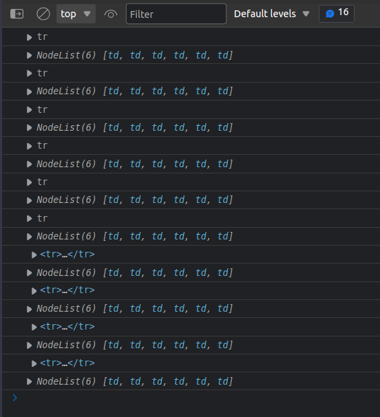
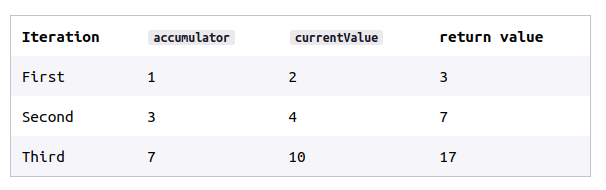
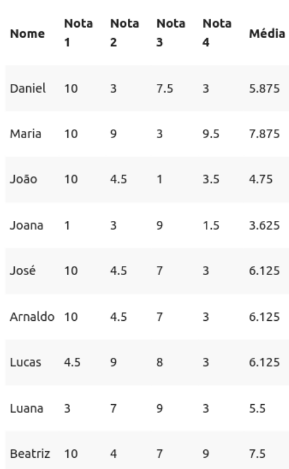

# SEÇÃO 07 - EXERCICIO PROPOSTO: LISTA DE ALUNOS

<br>

## Introdução

<br>

Vamos construir uma pagina de notas e medias dos alunos.

- Dentro da pasta `js` vamos colocar um arquivo javascript chamado `calc.js` que terá as funções de `sum()` e `average()` que criamos em aulas passadas, na versão dos ES6.
- Temos que fazer o import dentro do html desse `calc.js` pois iremos usar ele para calcular a media.

A ideia é que a gente tem que fazer seria pegar todas as `tr` para acessar as `rows` da `tbody` e colocar o valor da media.

- A primeira coisa que iremos fazer no `script` do html, é criar uma função anonima para evitar poluir o escopo global.
- Dentro desta função iremos criar uma constante `trs` para armazenar todas as nossas `tr`, usando o `querySelectorAll()`

```

<script>
    (function(){
        const trs = document.querySelectorAll("tbody tr");
    })()
</script>

// SAIDA:
NodeList(10) [tr, tr, tr, tr, tr, tr, tr, tr, tr, tr]
```

- Vemos na saida desse codigo, todas as `trs` que temos no nosso html/tabela.
- Dentro de cada `tr` queremos selecionar tbm as `tds`, logo criamos outra constante para armazenar essas `tds`.
- Temos que lembrar que toda informação que vem da interface do usuario, vem em forma de `String`.
- Vejam que ao colocar o sinal de `+` os elementos foram concatenados e não somados, mostrando que é uma string.

```
[CONSOLE BROWSER]

teste = document.querySelectorAll("tbody tr");
NodeList(10) [tr, tr, tr, tr, tr, tr, tr, tr, tr, tr]
teste[0]
<tr>​…​</tr>​
teste[0].querySelectorAll("td")
NodeList(6) [td, td, td, td, td, td]
teste[0].querySelectorAll("td")[1]
<td>​10​</td>​
teste[0].querySelectorAll("td")[1].textContent
'10'
teste[0].querySelectorAll("td")[1].textContent + teste[0].querySelectorAll("td")[2].textContent
'103'
```

- São com esses comandos que percorrermos os elementos do DOM no mundo do javascript, claro que não iremos escrever isso para cada elemento, basta colocarmos dentro de um loop.
- Para isso vamos criar uma variavel `x` que irá servir como um contador para usarmos dentro de um loop `while()`, como condição do loop, ou seja, o loop irá rodar, enquanto tivermos `trs` no indice do contador.
- Vamos por enquanto mostrar no console a saida desse loop.

```
<script>
        (function(){
          const trs = document.querySelectorAll("tbody tr");

          let x = 0;

          while(trs[x]){
            console.log(trs[x]);
            x++;
          }
        })()
      </script>

// SAIDA:

> <tr>...</tr>
> <tr>...</tr>
> <tr>...</tr>
> <tr>...</tr>
> <tr>...</tr>
> <tr>...</tr>
> <tr>...</tr>
> <tr>...</tr>
> <tr>...</tr>
> <tr>...</tr>
```

- Podemos ver na saida do `console.lo()` que o loop nos trouxe cada uma das `trs` com seus elementos filhos que no caso são as `tds`.
- Vamos agora recuperar as `tds`, para isso vamos criar uma constante chamada `tds` que recebera as `trs` no indice `x` cuja a primeira iteração será `0`, selecionando a primeira `td`

```
<script>
        (function(){
          const trs = document.querySelectorAll("tbody tr");

          let x = 0;

          while(trs[x]){

            console.log(trs[x]);

            const tds = trs[x].querySelectorAll("td");
            console.log(tds);
            x++;
          }
        })()
      </script>
```


<br>

- Como podemos ver na saida do console.log(), temos a `tr` com suas respectivas `tds` sendo mostradas como uma `nodeList`.
- Agora que temos nossas `tds`, vamos criar uma variavel chamada `media` que irá receber o valor da soma das `tds` que possuem as notas.
- Dentro do loop, iremos chamar a função que criamos para o calculo da media `avarege()`, e dentro dessa função, iremos passar os valores das `tds` nos indices `1,2,3,4` so que convertidos para numero em vez de strings, para não ocorrer a concatenação em vez da soma, e usando o `.textContent` para recuperar os valores.

```
<script>
        (function(){
          const trs = document.querySelectorAll("tbody tr");

          let media = 0;
          let x = 0;

          while(trs[x]){

            console.log(trs[x]);

            const tds = trs[x].querySelectorAll("td");
            console.log(tds);

            media =  avarege(
              parseFloat(tds[1].textContent),
              parseFloat(tds[2].textContent),
              parseFloat(tds[3].textContent),
              parseFloat(tds[4].textContent),
            );
            x++;
          }
        })()
      </script>
```

- No codigo acima, estamos passando `4 parametros` para a função `avarege()`.
- Agora que temos a media sendo calculada pela função, temos que pegar a ultima `td` que seria o lugar onde teriamos a media, ou seja, a `td` com `indice=5`, usando o `.textContent` para atribuir o valor da media que foi calculada nessa `td`.

```
<script>
        (function(){
          const trs = document.querySelectorAll("tbody tr");

          let media = 0;
          let x = 0;

          while(trs[x]){

            console.log(trs[x]);

            const tds = trs[x].querySelectorAll("td");
            console.log(tds);

            media =  avarege(
              parseFloat(tds[1].textContent),
              parseFloat(tds[2].textContent),
              parseFloat(tds[3].textContent),
              parseFloat(tds[4].textContent),
            );
            x++;

            tds[5].textContent = media;
          }
        })()
      </script>
```

- Podemos ver agora no browser que os valores das medias estão sendo colocados via `loop while` em todas as `tds`.

Fizemos assim um pequeno exemplo sobre como percorrer elementos do DOM usando um `loop`, porem temos alguns problemas com a forma que construimos nosso codigo.

Na hora de passar os valores para a função de `avarege()` estamos usando numeros estaticos para acessar as `tds`, isso gera um problema futuro na caso da gente querer adicionar mais elementos na nossa tabela, pois teremos que fazer a alteração individual de cada indice.

Existem varias formas de melhorar nosso codigo, poderiamos criar algumas `classes` nas nossas `tds` que recebem a media, que ao inves de selecionar pelo indice, selecionariamos pela classe.

```
<td class="aluno-media"></td>
```

Poderiamos usar um atributo para fazer essa seleção tbm, e dentro do javascript selecionariamos esse atributo usando o `document.queryselector("[aluno-media]").textContent`.

```
<td aluno-media></td>
```

O que iremos fazer nesse momento para não passar esses valores estaticamente, será colocar um atributo na nossa `ths`, pois o `indice` das nossas `ths` são exetamente os indices correspondentes das nossas `tds`.

Por exemplo, na `th` de `media`, se na `th indice = 5`, significa que o lugar que a media esta sendo representada nas `tds` tbm é no indice `5`. Pois essa coluna dentro do `tbody` esta linkada a posição da `th` dentro da `thead`. Logo usaremos esse `ths` para decidir onde cada informação mora dentro do `tbody`.

- Vamos criar primeiro o atributo dentro das `ths`

```
<thead>
    <tr>
        <th>Nome</th>
        <th aluno-nota="n1">Nota 1</th>
        <th aluno-nota="n2">Nota 2</th>
        <th aluno-nota="n3">Nota 3</th>
        <th aluno-nota="n4">Nota 4</th>
        <th aluno-nota="media">Média</th>

    </tr>
</thead>
```

- Agora temos alguns atributos que vao nos orientar onde reside cada uma dessas `tds/notas`.
- Porem agora, precisamos recuperar no javascript o `indice/posição` de cada um desses elementos dentro dessa `thead tr`.
- Para isso, vamos criar uma constante chamada `INDICES_NOTAS` que será um objeto onde iremos criar variaveis que recembem esses indices.
- Temos que lembrar de colocar o `;` depois desse objeto ou antes do começo da função anonima, pois se nao o codigo não irá funcionar.

```
<script>

        const INDICES_NOTAS = {
          n1: 1,
          n2: 2,
          n3: 3,
          n4: 4,
          media: 5,
        };

        (function(){
          const trs = document.querySelectorAll("tbody tr");

          let media = 0;
          let x = 0;

          while(trs[x]){

            console.log(trs[x]);

            const tds = trs[x].querySelectorAll("td");
            console.log(tds);

            media =  avarege(
              parseFloat(tds[1].textContent),
              parseFloat(tds[2].textContent),
              parseFloat(tds[3].textContent),
              parseFloat(tds[4].textContent),
            );
            x++;
            tds[5].textContent = media;
          }
        })()
```

- Apos a criação desse objeto, alteramos a maneira como passamos as notas para a função e tbm como colocamos o valor que recebemos da função dentro da `td` de media, usando a sintaxe `[INDICES_NOTAS.n1]`.

```
<script>

    const INDICES_NOTAS = {
        n1: 1,
        n2: 2,
        n3: 3,
        n4: 4,
        media: 5,
    };

    (function(){
        const trs = document.querySelectorAll("tbody tr");

        let media = 0;
        let x = 0;

        while(trs[x]){

        console.log(trs[x]);

        const tds = trs[x].querySelectorAll("td");
        console.log(tds);

        media =  avarege(
            parseFloat(tds[INDICES_NOTAS.n1].textContent),
            parseFloat(tds[INDICES_NOTAS.n2].textContent),
            parseFloat(tds[INDICES_NOTAS.n3].textContent),
            parseFloat(tds[INDICES_NOTAS.n4].textContent),
        );
        x++;

        tds[INDICES_NOTAS.media].textContent = media;
        }
    })()
    </script>
```

Porem, mesmo fazendo essas alterações, se mudarmos a estrutura da tabela, ainda teriamos que lembrar de mudar dentro do objeto os valores.

A ideia é que esse objeto seja construido `dinamicamente`, a partir dos elementos com atributos da `th`. Vamos fazer isso na proxima aula, vamos popular o objeto `INDICES_NOTAS`, usando os atributos que criamos no elemento `th` do DOM.

<br>
<hr>
<br>

## ERRATA: Correção de gramatica em ingles
<br>

Como muito bem observado pelo aluno André Torelli, cometi uma falha ao escrever "média" em inglês.

O correto é: average

"Aqui nós aprendemos programação e inglês. Nós somos o bixão memo hein doido."

Pra quem não pegou a referência do meme, lá vai: https://www.youtube.com/watch?v=MiQ_OSW9pLM

Bons estudos

<br>
<hr>
<br>

## MELHORIA: Obter o indice de nossa coleção de objetos DOM

<br>

<br>
<hr>
<br>

## MELHORIA: Gerar INDICE_NOTAS dinamicamente
<br>

Vamos fazer alguma alterações para gerar esse objeto `INDICES_NOTAS` dinamicamente.

- Vamos mudar o escopo do objeto `INDICES_NOTAS` de global para dentro da função anonima.

~~~
<script>

        (function(){
          const INDICES_NOTAS = {
            n1: 1,
            n2: 2,
            n3: 3,
            n4: 4,
            media: 5,
          };
          const trs = document.querySelectorAll("tbody tr");
          
          let media = 0;
          let x = 0;
          
          while(trs[x]){

            console.log(trs[x]);

            const tds = trs[x].querySelectorAll("td");
            console.log(tds);

            media =  avarege(
              parseFloat(tds[INDICES_NOTAS.n1].textContent),
              parseFloat(tds[INDICES_NOTAS.n2].textContent),
              parseFloat(tds[INDICES_NOTAS.n3].textContent),
              parseFloat(tds[INDICES_NOTAS.n4].textContent),
            );
            x++;

            tds[INDICES_NOTAS.media].textContent = media;
          }
        })()
      </script>
~~~

- Agora iremos percorrer as `ths` que estão dentro da `thead tr` para poder recuperar o `indice` dos atributos que criamos nessas `ths`.
- Existem algumas maneiras de fazermos isso, uma mais simples, e uma mais complexa, vamos começar pela simples.
- Basicamente iremos criar uma função(`pegaIndice`), para pegar o indice dos atributos que criamos nas `ths` e chamar essa função dentro do nosso objeto `INDICES_NOTAS`, passando a String/indice que queremos pegar.

~~~
[EXEMPLO]

const INDICES_NOTAS = {
    n1: pegarIndice("n1"),
    n2: pegarIndice("n2"),
    n3: pegarIndice("n3"),
    n4: pegarIndice("n4"),
    media: pegarIndice("media"),
}
~~~

- Como ainda não temos essa função vamos cria-la.
- Esssa função irá receber como parametro uma string `indice` que irá nos auxiliar a achar o indice do elemento que queremos no DOM.
- Vamos usar o metodo `.indexOf()` para recuperarmos os indices das `thd` que queremos recuperar os valores. Ou seja, a partir de todas as ths, vamos usar o `.indexOf()` dos elementos que possuem os atributos. Logo vamos procurar o `.indexOf()` a partir da coleção inteira de ths, pois se no futuro alterarmos a tabela, iria quebrar o codigo.
- A primeira coisa que iremos fazer na função, será criar uma constante chamada `trHeader`, que recebera a `tr` que possui as `ths` que queremos.

~~~ 
function pegaIndice(){
    const trHeader = document.querySelector("thead tr");
    console.log(trHeader);
}
~~~

- Agora iremos criar outra constante chamada `thsHeader` que a partir desta `tr` que recuperamos, irá nos ajudar a selecionar a `th` com o `indice` que queremos.

~~~
function pegaIndice(){
    const trHeader = document.querySelector("thead tr");
    const thsHeader = document.querySelectorAll("th");
    console.log(thsHeader);
}
~~~

- Agora que temos a coleção de `ths` dentro da constante `thsHeader`, precisamos selecionar o objeto/elemento cujo o atributo `aluno-nota`, seja igual ao parametro que foi passado para a função.
- Para isso, tbm criamos uma constante que irá salvar esse valor.

~~~
function pegaIndice(ind){
    const trHeader = document.querySelector("thead tr");
    const thsHeader = trHeader.querySelectorAll("th");
    console.log(thsHeader);

    const th = trHeader.querySelector(`[aluno-nota="${ind}"]`);
    console.log(th);
}
~~~ 

- Agora, temos que recuperar o `indice` dessa consnstante `th` que criamos, na coleção `thsHeader`.
- Teriamos algo do tipo `thsHeader.indexOf(th);` porem `thsHeader` que é uma nodeList não possui o metodo `.indexOf` que seria de um array, temos que transformar esse `thsHeader` em um array ou usar o `prototype`.
- Usando o prototype, como primeira parametro da função `.call()` passariamos o `thsHeader` e como segundo parametro o `th`.
- E colocando como retorno da função a constante que esta recebendo o retorno dessa chamada.

~~~
function pegaIndice(ind){
    const trHeader = document.querySelector("thead tr");
    const thsHeader = trHeader.querySelectorAll("th");

    const th = trHeader.querySelector(`[aluno-nota="${ind}"]`);

    // sintaxe antiga
    const indice = Array.prototype.indexOf.call(thsHeader, th);

    return indice;
}
~~~

- Essa seria uma das formas de fazer a conversão, ou pederiamos tbm utilizar uma sintaxe mais moderna...
- Criamos um `Array` a partir da coleção/nodeList de `thsHeader` usando o `Array.from(thsHeader)`, chamamos o `.indexOf()` passando o `th` que queremos selecionar.

~~~ 
function pegaIndice(ind){
    const trHeader = document.querySelector("thead tr");
    const thsHeader = trHeader.querySelectorAll("th");

    const th = trHeader.querySelector(`[aluno-nota="${ind}"]`);

    const indice = Array.from(thsHeader).indexOf(th);
    return indice;
}
~~~

- Outra forma seria utilizando o `spread operator` que irá transformar essa `nodeLIst` que esta na constante `thsHeader` em elementos individuais.

~~~
function pegaIndice(ind){
    const trHeader = document.querySelector("thead tr");
    const thsHeader = trHeader.querySelectorAll("th");

    const th = trHeader.querySelector(`[aluno-nota="${ind}"]`);

    // spread operator
    const indice = [...thsHeader].indexOf(th);
    return indice;
}
~~~

Quando usamos o `console.lgo()` em cima de `INDICES_NOTAS` vemos que ele retonar um objeto com os indices que recuperamos.

~~~
{n1: 1, n2: 2, n3: 3, n4: 4, media: 5} 
~~~

Existe mais uma forma de melhorarmos o nosso codigo, poderiamos criar uma função que percorre o nosso `th` e alimenta o objeto de `INDICES_NOTAS` dinamicamente usando os atributos, por exemplo, propriedade `n1`  recebe o numero `1` do indice..

No proximo video iremos criar dinamicamente a partir do DOM toda essa logica que ja fizemos.

<br>
<hr>
<br>

## Gerar linhas e colunas a partir de uma estrutura de dados

<br>

Agora iremos popular o nosso objeto `INDICES_NOTAS` de forma dinamica a partir dos atributos que temos dentro do nosso `thead`.

- A primeira coisa que iremos fazer será mudar o escopo das variaveis `trHeader e thsHeader` para o escopo da função anonima, podendo assim acessa-las fora da função de `pegaIndice()`

~~~
<script>
    (function(){
        
        const trHeader = document.querySelector("thead tr");
        const thsHeader = trHeader.querySelectorAll("th");

        function pegaIndice(ind){

        const th = trHeader.querySelector(`[aluno-nota="${ind}"]`);

        // spread operator
        const indice = [...thsHeader].indexOf(th);
        return indice;
        }
        const INDICES_NOTAS = {
        n1: pegaIndice("n1"),
        n2: pegaIndice("n2"),
        n3: pegaIndice("n3"),
        n4: pegaIndice("n4"),
        media: pegaIndice("media"),
        };
        const trs = document.querySelectorAll("tbody tr");
        
        let media = 0;
        let x = 0;
        
        while(trs[x]){
        const tds = trs[x].querySelectorAll("td");
        media =  avarege(
            parseFloat(tds[INDICES_NOTAS.n1].textContent),
            parseFloat(tds[INDICES_NOTAS.n2].textContent),
            parseFloat(tds[INDICES_NOTAS.n3].textContent),
            parseFloat(tds[INDICES_NOTAS.n4].textContent),
        );
        x++;

        tds[INDICES_NOTAS.media].textContent = media;
        }
    })()
    </script>
~~~

- Agora iremos apagar o codigo que temos dentro do objeto `INDICES_NOTAS` tornando ele um objeto vazio, para servir de estrutura para quando formos popular ele dinamicamente.

~~~
const INDICES_NOTAS = {} 
~~~

- Temos que percorrer as `ths` que possui o atributo `aluno-nota` que queremos, para isso, temos que criar uma coleção/nodeList que possua `somente` essas `ths` com atributo `aluno-nota`, excluindo por exemplo o `th nome`, ou qualquer outra `th` que possa aparecer no futuro e não tenha esse atributo.
- Para isso vamos criar uma constante chamada `thsAlunoNota` para receber a coleção de `ths` que possuem o atributo `aluno-nota`.

~~~
const trHeader = document.querySelector("thead tr");
const thsHeader = trHeader.querySelectorAll("th");
const thsAlunoNota = trHeader.querySelectorAll("[aluno-nota]");
console.log(thsAlunoNota); 

// SAIDA:
NodeList(5) [th, th, th, th, th]
~~~

- Vemos pelo console.log() que a nossa coleção `thsAlunoNota` so possui os `ths` com o atributo `[aluno-nota]` que especificamos, excluindo assim o `th`que possui o `nome` do aluno.
- Agora iremos percorrer essa coleção de `ths` chamada `thsAlunoNotas` e vamos armazenar dentro do nosso objeto `INDICES_NOTAS`, propriedade `n1,n2...` e o valor `indice do th na coleção thsAlunoNota`.
- Para isso, transformamos nossa coleção `thsAlunoNotas` em um `array` para podermos usar o metood `.forEach()`.
- No `.forEach()` iremos passar como primeiro parametro uma função que recebera como parametro o `th` que queremos. Não vamos precisar colocar o indice da função como segundo parametro pois não é o indice que estamos buscando. 

~~~
(function(){

    const trHeader = document.querySelector("thead tr");
    const thsHeader = trHeader.querySelectorAll("th");
    const thsAlunoNota = trHeader.querySelectorAll("[aluno-nota]");
    const INDICES_NOTAS = {};

    Array.from(thsAlunoNota).forEach(function(){
    
    });

    function pegaIndice(ind){

    const th = trHeader.querySelector(`[aluno-nota="${ind}"]`);

    // spread operator
    const indice = [...thsHeader].indexOf(th);
    return indice;
    }
    
    const trs = document.querySelectorAll("tbody tr");
    
    let media = 0;
    let x = 0;
    
    while(trs[x]){
    const tds = trs[x].querySelectorAll("td");
    media =  avarege(
        parseFloat(tds[INDICES_NOTAS.n1].textContent),
        parseFloat(tds[INDICES_NOTAS.n2].textContent),
        parseFloat(tds[INDICES_NOTAS.n3].textContent),
        parseFloat(tds[INDICES_NOTAS.n4].textContent),
    );
    x++;

    tds[INDICES_NOTAS.media].textContent = media;
    }
})()
~~~

- Agora dentro da função do `forEach()`, temos que buscar o valor da propriedade do atributo `aluno-nota`. Como fazemos para recuperar uma propriedade de um objeto?
- Ja recuperamos a propriedade `checked`, a propriedade `disable`, `value` de um input. Mas nem todas as propriedades podem ser recuperadas de uma forma tao simples somente colocando o ponto e o nome da propriedade. 
- Para algumas propriedades precisamos usar um metodo especifico para esse objetivo. Vamos ver no console.log() a chamada `th.getAttribute` para vermos o que recebemos como saida.
- O `.getAttribute()` nos permite recuperar o `valor` de uma propriedade. Que no caso, a propriedade que estamos buscando é `aluno-nota`, e o valor sendo `n1,n2,n3..`.

~~~
Array.from(thsAlunoNota).forEach(function(th){
console.log(th.getAttribute("aluno-nota"));    
});

// SAIDA:

n1
n2
n3
n4
media
~~~

- Agora que sabemos como pegar o valor de uma propriedade, vamos utilizar esse valor `n1,n2..` para popular o nosso objeto `INDICE_NOTAS`.
- Para popular o objeto vamos utilizar a sintaxe de `colchetes []` passando uma variavel(`valAtt`) que recebe o `th.getAttribute("aluno-nota");`.
- O valor que o `INDICE_NOTAS[valATT]` irá receber como valor o retorno da função `pegaIndice()` onde passamos o `indice` que queremos como atributo, ou seja, a propria `valAtt`.

~~~
[FUNÇÃO ANONIMA]
const trHeader = document.querySelector("thead tr");
    const thsHeader = trHeader.querySelectorAll("th");
    const thsAlunoNota = trHeader.querySelectorAll("[aluno-nota]");
    const INDICES_NOTAS = {};

    Array.from(thsAlunoNota).forEach(function(th){
    let valAtt = th.getAttribute("aluno-nota");
    console.log(valAtt);
    INDICES_NOTAS[valAtt] = pegaIndice(valAtt);
});
~~~

- Agora podemos ver no browser que nosso codigo voltou a funcionar e estamos populando o nosso objeto de forma dinamica, fazendo com que ao adicionar ou remover itens da nossa tabela, o nosso codigo não quebre.
- Podemos ver no console.log() do nosso objeto, que temos o mesmo resultado que antes porem com o objeto sendo populado dinamicamente e nao estaticamente.

Na proxima aula, faremos uma variação desse mesmo exercio, onde teremos um `array de objetos` com todas as informações, e vamos mostrar dentro da `tbody`, essas informações de forma dinamica. Sem que nenhum dado esteja inserido previamente no html.

<br>
<hr>
<br>

## A estrutura de dados mudou. Precisamos refletir no DOM

<br>

Até agora esse exemplo foi importante para evoluir o nosso conhecimento sobre o que vimos ate agora. Porem em 99% das vezes o que faremos de verdade é:

1) Fazer uma requisição para um servidor
2) Recuperar um `JSON`, que seria tipo um `array de objetos` podendo tbm ser um objeto ou um array.
3) A partir do `JSON` mostramos as informações na tela.

- A primeira coisa que iremos fazer será apagar todas as `trs` que temos no nosso `tbody`.

~~~
<table class="striped">
    <thead>
        <tr>
            <th>Nome</th>
            <th aluno-nota="n1">Nota 1</th>
            <th aluno-nota="n2">Nota 2</th>
            <th aluno-nota="n3">Nota 3</th>
            <th aluno-nota="n4">Nota 4</th>
            <th aluno-nota="media">Média</th>
        </tr>
    </thead>
    <tbody>
        
        </tbody>
</table>
~~~

- No nosso javascript, vamos apagar toda a logica para o indice, pois iremos montar dinamicamente todas as nossas `trs`do `tbody`.
- Melhor ainda, vamos construir nossa logica do zero, apagando assim todo o nosso javascript, deixando somente a função anonima.

~~~
<script> 
    (function(){

    })()
</script>
~~~

- Vamos agora construir o nosso `array de objetos` com as informações que irão popular dinamicamente a nossa tabela.
- Relembrando, temos um array `[]` e dentro deste array temos objetos `[{}]`, com suas propriedades e valores.

~~~ 
const alunos = [
    { nome: "Daniel", n1: 10, n2: 3, n3: 7.5, n4: 3 },
    { nome: "Maria", n1: 10, n2: 9, n3: 3, n4: 9.5 },
    { nome: "João", n1: 10, n2: 4.5, n3: 1, n4: 3.5 },
    { nome: "Joana", n1: 1, n2: 3, n3: 9, n4: 1.5 },
    { nome: "José", n1: 10, n2: 4.5, n3: 7, n4: 3 },
    { nome: "Arnaldo", n1: 10, n2: 4.5, n3: 7, n4: 3 },
    { nome: "Lucas", n1: 4.5, n2: 9, n3: 8, n4: 3 },
    { nome: "Luana", n1: 3, n2: 7, n3: 9, n4: 3 },
    { nome: "Beatriz", n1: 10, n2: 4, n3: 7, n4: 9 },
    { nome: "Sergio", n1: 4.5, n2: 9.5, n3: 10, n4: 2 }
];
~~~

- Agora, como fazemos para a partir deste `array de objetos` a gente gere arquivos do `DOM/HTML`?
- Por exemplo, para esse primeiro objeto `{ nome: "Daniel", n1: 10, n2: 3, n3: 7.5, n4: 3 },` vamos ter uma `string` que seria a representação de um `html`.

~~~
const alunos = [
    { nome: "Daniel", n1: 10, n2: 3, n3: 7.5, n4: 3 },
];

<tr>
    <td>Daniel</td>
    <td>10</td>
    <td>3</td>
    <td>7.5</td>
    <td>3</td>
    <td></td>
</tr>
~~~

- Ou seja, a partir do objeto, queremos recuperar uma `string` com o formato acima.
- Agora a primeira coisa que iremos fazer será percorrer esse `array` de alunos, agora sim ele é um array de verdade, `array de objetos` porem um `array`.
- Para isso vamos utilizar o metodo `.forEach()` e vamos ver tbm o conceito de `arrow funtion =>` que passaremos como função para o `.forEach()`.
- A `arrow function` é uma forma um pouco mais abreviada de escrevermos funções. 

~~~ 
[FUNÇÃO SEM ARROW FUNCTION]
alunos.forEach(function(aluno){}); // passamos o aluno no singular pq queremos recuperar um de cada

[ARROW FUNCTION]
alunos.forEach((aluno) => {}); 

[ARROW FUNCTION 1 PARAMETRO]
alunos.forEach(aluno => {});

[ARROW FUNCTION COM + PARAMETROS]
alunos.forEach((aluno, param2) => {}); 

~~~
 
- Agora dentro da função de callback do `.forEach()` vamos colocar uma propriedade `media` que irá receber o valor da `media`. 
- Ou seja, vamos percorrer cada `aluno` no nosso objeto, e adicionar a esse objeto, uma propriedade chamada `media` dinamicamente.
- Selecionamos cada objeto e colocamos a propriedade da seguinte maneira `aluno.media=`, logo, para cada aluno que o `.forEach()` selecionar, ele irá criar essa propriedade `media` que recebe o retorno da função que criamos para calcular a media dos alunos.
- Por enquanto, iremos passar os  para nossa função `avarege()` da maneira mais facil...
- Vamos ver o que teremos no console.log(), a propriedade `media` adicionada a todos os nossos objetos.
~~~
alunos.forEach(aluno => {
    aluno.media = avarege(aluno.n1, aluno.n2, aluno.n3, aluno.n4);
});
console.log(alunos);

// SAIDA:

(10) [{…}, {…}, {…}, {…}, {…}, {…}, {…}, {…}, {…}, {…}]
0: {media: 5.875, n1:10,n2:3,n3:7.5,n4:3,nome:"Daniel"}
1: {nome: 'Maria', n1: 10, n2: 9, n3: 3, n4: 9.5, …}
2: {nome: 'João', n1: 10, n2: 4.5, n3: 1, n4: 3.5, …}
3: {nome: 'Joana', n1: 1, n2: 3, n3: 9, n4: 1.5, …}
4: {nome: 'José', n1: 10, n2: 4.5, n3: 7, n4: 3, …}
5: {nome: 'Arnaldo', n1: 10, n2: 4.5, n3: 7, n4: 3, …}
6: {nome: 'Lucas', n1: 4.5, n2: 9, n3: 8, n4: 3, …}
7: {nome: 'Luana', n1: 3, n2: 7, n3: 9, n4: 3, …}
8: {nome: 'Beatriz', n1: 10, n2: 4, n3: 7, n4: 9, …}
9: {nome: 'Sergio', n1: 4.5, n2: 9.5, n3: 10, n4: 2, …}
~~~

- Agora iremos fazer com que cada objetos de `alunos` nos retorne uma string. Podemos utilizar para isso o metodo `.map()`.
- Vamos criar uma constante chamada `html` que irá ser o codigo `html` que queremos converter nosso objeto `alunos` para.
- Dentro do `.map()` tbm iremos usar uma arrow function para simplificar o codigo e dentro desta função vamos retornar uma string equivalente ao nosso codigo html. Vamos fazer um experimento com esse retorno usando o console.log().

~~~ 
alunos.forEach(aluno => {
    aluno.media = avarege(aluno.n1, aluno.n2, aluno.n3, aluno.n4);
});
console.log(alunos);

const html = alunos.map(aluno => {
    return " - oi - ";
})

// SAIDA:

(10) [{…}, {…}, {…}, {…}, {…}, {…}, {…}, {…}, {…}, {…}]
[' - oi - ', ' - oi - ', ' - oi - ', ' - oi - ', ' - oi - ', ' - oi - ', ' - oi - ', ' - oi - ', ' - oi - ', ' - oi - ']
~~~

- Vejam que estamos recebendo um `array de strings` e não de objetos mais.

> Observação, quando utilizamos o `.map()` se tivermos somente um valor de retorno, não precisamos utilizar os chaves `{}` da função e nem do `return`
> >
> Basicamente podemos escrever da seguinte maneira:
> ~~~
> const html = alunos.map(aluno => " - oi - ");
> ~~~ 

- Agora, se queremos retonar uma string e queremos que essa string tenha `linhas quebras`, temos que usar a sintaxe do `template string`.

~~~
const html = alunos.map(aluno => {
    return `

    `;
});

[ou]

const html = alunos.map(aluno => ``);

~~~

- Agora dentro desta `template literal` colocamos o codigo html que queremos que seja colocado dentro do nosso `array de objetos` que agora eh um `array de string`.

~~~
const html = alunos.map(aluno => {
    return `
        <tr>
        <td>Daniel</td>
        <td>10</td>
        <td>3</td>
        <td>7.5</td>
        <td>3</td>
        <td></td>
        </tr>
    `;
});
console.log(html);

// SAIDA:

(10) ['\n          <tr>\n            <td>Daniel</td>\n      …d>\n            <td></td>\n          </tr>\n        ', '\n          <tr>\n            <td>Daniel</td>\n      …d>\n            <td></td>\n          </tr>\n        ', '\n          <tr>\n            <td>Daniel</td>\n      …d>\n            <td></td>\n          </tr>\n        ', '\n          <tr>\n            <td>Daniel</td>\n      …d>\n            <td></td>\n          </tr>\n        ', '\n          <tr>\n            <td>Daniel</td>\n      …d>\n            <td></td>\n          </tr>\n        ', '\n          <tr>\n            <td>Daniel</td>\n      …d>\n            <td></td>\n          </tr>\n        ', '\n          <tr>\n            <td>Daniel</td>\n      …d>\n            <td></td>\n          </tr>\n        ', '\n          <tr>\n            <td>Daniel</td>\n      …d>\n            <td></td>\n          </tr>\n        ', '\n          <tr>\n            <td>Daniel</td>\n      …d>\n            <td></td>\n          </tr>\n        ', '\n          <tr>\n            <td>Daniel</td>\n      …d>\n            <td></td>\n          </tr>\n        ']
~~~

- Agora nossa constante `html` é um `array` que contem a `tr` e as `tds`.
- Temos agora uma constante chamada `html` que é basicamente uma string.
- Agora, para inserir esse codigo html que colocamos dentro da nossa constante `html`, usamos o metodo que ja vimos chamado `.innerHTML` atribuindo o valor da nossa constante a ele.

~~~
const html = alunos.map(aluno => {
        return `
          <tr>
            <td>Daniel</td>
            <td>10</td>
            <td>3</td>
            <td>7.5</td>
            <td>3</td>
            <td></td>
          </tr>
        `;
      });

      document.querySelector("tbody").innerHTML = html;
~~~

- No browser agora podemos ver que nossa tabela foi preenchida exatamente com os elementos da constante `html`.


<br>

- Porem se observamos nossa pagina, o DOM colocou uma virgula `,` abaixo de cada linha. Isso aconteceu pq o `.innerHTML` espera receber uma `string` e como ele recebeu um `array de string`, por debaixo dos panos ele tentou fazer a conversão desse `array` para `string` trazendo consigo a virgula que utilizamos para separar os arrays.
- Logo podemos utilizar o metodo `.join()` que retorna uma string e  onde podemos selecionar o tipo de caractere que queremos que separe os elementos do array/string.
- Passando uma string vazia para o metodo `.join("")`, ele irá concatenar nosso array com essa string vazia e assim a virgula irá sumir.
- Podemos colocar esse metodo em dois lugares

~~~
[LUGAR 1]
const html = alunos.map(aluno => {
    return `
        <tr>
        <td>Daniel</td>
        <td>10</td>
        <td>3</td>
        <td>7.5</td>
        <td>3</td>
        <td></td>
        </tr>
    `;
}).join("");

[LUGAR 2]
document.querySelector("tbody").innerHTML = html.join("");
~~~

- Agora para terminar, basta colocarmos os dados corretos dos alunos usando o nome de suas propriedades.

~~~
const html = alunos.map(aluno => {
    return `
        <tr>
        <td>${aluno.nome}</td>
        <td>${aluno.n1}</td>
        <td>${aluno.n2}</td>
        <td>${aluno.n3}</td>
        <td>${aluno.n4}</td>
        <td>${aluno.media}</td>
        </tr>
    `;
}).join("");

document.querySelector("tbody").innerHTML = html;
~~~

Vemos agora nossa pagina funcionando corretamente com seus valores passados para a tabela dinamicamente.

;

<br>


<br>
<hr>
<br>

## Resolução: Desafio

<br>

Temos dois desafios agora, basicamente queremos mudar a estrutura de dados, ao invez de termos um objeto com propriedades `n1,n2,n3...`, queremos ter um `array de notas`.

- Para fazermos isso, selecionamos todos os `n1` primeiramente e substituimos por `notas` e depois apagamos os nomes das propriedades `n2,n3,n4` deixando somente seus valores separados por virgula `,` e entre `colchetes []`

~~~ 
const alunos = [
    { nome: "Daniel", notas: [10, 3, 7.5, 3] },
    { nome: "Maria", notas: [10, 9, 3, 9.5] },
    { nome: "João", notas: [10, 4.5,1, 3.5] },
    { nome: "Joana", notas: [1, 3, 9, 1.5] },
    { nome: "José", notas: [10, 4.5, 7, 3] },
    { nome: "Arnaldo", notas: [10, 4.5, 7, 3] },
    { nome: "Lucas", notas: [4.5, 9, 8, 3] },
    { nome: "Luana", notas: [3, 7, 9, 3] },
    { nome: "Beatriz", notas: [10, 4, 7, 9] },
    { nome: "Sergio", notas: [4.5, 9.5, 10, 2] }
];
~~~

- Temos agora que alterar a programação para nossa tabela voltar a funcionar pois a propriedade `aluno.n1, aluno.n2...` não existe mais, resultando no `undefined`.
- O objetivo agora do desafio eh modificar o codigo para que a gente pegue cadas uma dessas notas que estão vindo em um `array` e coloca-las nos seus respectivos lugares.

<br>
<hr>
<br>

## Resolução: Desafio 2

<br>

Agora que temos um `array de notas` , temos que passar para a função `.avarage()`, as notas individualmente.

- Poderiamos fazer algo parecido com a forma anterior `aluno.notas[0],aluno.notas[1]...`

~~~
const alunos = [
    { nome: "Daniel", notas: [10, 3, 7.5, 3] },
    { nome: "Maria", notas: [10, 9, 3, 9.5] },
    { nome: "João", notas: [10, 4.5,1, 3.5] },
    { nome: "Joana", notas: [1, 3, 9, 1.5] },
    { nome: "José", notas: [10, 4.5, 7, 3] },
    { nome: "Arnaldo", notas: [10, 4.5, 7, 3] },
    { nome: "Lucas", notas: [4.5, 9, 8, 3] },
    { nome: "Luana", notas: [3, 7, 9, 3] },
    { nome: "Beatriz", notas: [10, 4, 7, 9] },
    { nome: "Sergio", notas: [4.5, 9.5, 10, 2] }
];
alunos.forEach(aluno => {
    aluno.media = avarege(aluno.notas[0],aluno.notas[1],aluno.notas[2],aluno.notas[3]);
});
console.log(alunos);

const html = alunos.map(aluno => {
    return `
        <tr>
        <td>${aluno.nome}</td>
        <td>${aluno.notas[0]}</td>
        <td>${aluno.notas[1]}</td>
        <td>${aluno.notas[2]}</td>
        <td>${aluno.notas[3]}</td>
        <td>${aluno.media}</td>
        </tr>
    `;
}).join(""); 
~~~

- Vemos agora que nosso codigo voltou a funcionar, porem existem maneiras melhores de se obter o mesmo resultado.
- Poderiamos por exemplo, usar o `rest operator` que ira quebrar esse `array de notas` em valores individuais.

~~~
const alunos = [
    { nome: "Daniel", notas: [10, 3, 7.5, 3] },
    { nome: "Maria", notas: [10, 9, 3, 9.5] },
    { nome: "João", notas: [10, 4.5,1, 3.5] },
    { nome: "Joana", notas: [1, 3, 9, 1.5] },
    { nome: "José", notas: [10, 4.5, 7, 3] },
    { nome: "Arnaldo", notas: [10, 4.5, 7, 3] },
    { nome: "Lucas", notas: [4.5, 9, 8, 3] },
    { nome: "Luana", notas: [3, 7, 9, 3] },
    { nome: "Beatriz", notas: [10, 4, 7, 9] },
    { nome: "Sergio", notas: [4.5, 9.5, 10, 2] }
];
alunos.forEach(aluno => {
    aluno.media = avarege(...aluno.notas);
});
console.log(alunos);

const html = alunos.map(aluno => {
    return `
        <tr>
        <td>${aluno.nome}</td>
        <td>${aluno.notas[0]}</td>
        <td>${aluno.notas[1]}</td>
        <td>${aluno.notas[2]}</td>
        <td>${aluno.notas[3]}</td>
        <td>${aluno.media}</td>
        </tr>
    `;
}).join(""); 
~~~

- Poderiamos tambem utilizar o metodo `.apply()` para browsers caso estejamos utilizando browsers mais antigos.

~~~
alunos.forEach(aluno => {
    // aluno.media = avarege(...aluno.notas);
    // usando metodo .apply()
    aluno.media = avarege.apply(aluno.notas);
});
~~~

- Dessa maneira que esta, o nosso codigo não irá funcionar pq no metodo `.apply()` precisamos passar um valor que será o `this` dentro do `.apply()` como nesse caso não fará diferença, podemos colocar o `this = null`.
- Agora podemos ver que nosso codigo voltou a funcionar.
- Como não faz diferença, no lugar do `null` podemos tbm passar `this`ou ate mesmo `aluno`.
- Deixamos como `null` para que fique explicito que não estamos utilizando aquele parametro.

~~~
[NULL]
alunos.forEach(aluno => {
    // aluno.media = avarege(...aluno.notas);
    // usando metodo .apply()
    aluno.media = avarege.apply(null,aluno.notas);
}); 

[THIS]
alunos.forEach(aluno => {
    // aluno.media = avarege(...aluno.notas);
    // usando metodo .apply()
    aluno.media = avarege.apply(this,aluno.notas);
}); 

[ALUNO]
alunos.forEach(aluno => {
    // aluno.media = avarege(...aluno.notas);
    // usando metodo .apply()
    aluno.media = avarege.apply(aluno,aluno.notas);
}); 
~~~

- Agora vamos melhorar a forma como fizemos o nosso `html`.

~~~
const html = alunos.map(aluno => {
    return `
        <tr>
        <td>${aluno.nome}</td>
        <td>${aluno.notas[0]}</td>
        <td>${aluno.notas[1]}</td>
        <td>${aluno.notas[2]}</td>
        <td>${aluno.notas[3]}</td>
        <td>${aluno.media}</td>
        </tr>
    `;
}).join("");
~~~

- Apesar de não ser muito obvio o que vamos fazer, podemos no caso, remover todas essas `tds` com as notas, e fazer criar uma função que que retorne esses `tds`.
- Ou seja, uma função que irá percorrer o `notas` e irá retornar todo esse trecho de codigo.
- No lugar dessas `tds` vamos retornar uma outra string a partir do array de notas. Se precisamos ter uma outra expressão que será calculada, executada pelo javascript, precisamos utilizar a sintaxe `${}`.
- Dentro dessa sintaxe, chamamos o `aluno.nota` usando o metodo `.map()`.

~~~
const html = alunos.map(aluno => {
    return `
        <tr>
        <td>${aluno.nome}</td>
        ${aluno.notas.map()}
        <td>${aluno.media}</td>
        </tr>
    `;
}).join("");
~~~

- Dentro do `.map()`, teremos uma função que irá percorrer cada uma das notas e retorna-las individualmente, logo usamos a arrow function passando somente uma `propriedade = n` para representar essas notas individuais.

~~~
const html = alunos.map(aluno => {
    return `
        <tr>
            <td>${aluno.nome}</td>
            ${aluno.notas.map(n => {
                
            })}
            <td>${aluno.media}</td>
        </tr>
    `;
}).join("");
~~~

- Agora o retorno da arrow function, precisa ser uma string, logo usamos o `template litera`, e dentro desta string, teremos a nossa `td` para cada nota.
- Dentro da nossa `td` iremos colocar cada uma das notas que esta sendo recuperada pelo `.map()` e colocadas no `n`.

~~~
[SINTAXE COMPLETA]
const html = alunos.map(aluno => {
    return `
        <tr>
            <td>${aluno.nome}</td>
            ${aluno.notas.map(n => {
              return `<td> ${n} </td>`
            })}
            <td>${aluno.media}</td>
        </tr>
    `;
}).join("");

[SINTAXE SIMPLIFICADA]

const html = alunos.map(aluno => `
    <tr>
        <td>${aluno.nome}</td>
        ${aluno.notas.map(n => `<td>${n}</td>`)};
        <td>${aluno.media}</td>
    </tr>
`)

~~~

- Agora vemos que nosso codigo esta funcionando, porem, podemos ver no nosso browser, que esta sendo colocado 3 virgulas depois de cada linha devido ao retorno do `.map()`, representando as virgulas das tres notas, para fazer o fix desse "bug", basta utilizarmos o `.join("")`, passando uma string vazia como fizemos mais cedo.

~~~
const html = alunos.map(aluno => {
    return `
        <tr>
            <td>${aluno.nome}</td>
            ${aluno.notas.map(n => {
                return `<td> ${n} </td>`
            }).join("")}
            <td>${aluno.media}</td>
        </tr>
    `;
}).join("");
~~~

Vamos agora ver outro pequeno desafio, somente visual mesmo, temos que colocar uma cor, na `tr` para os alunos `aprovados` e outra cor para os alunos `reprovados`.


<br>
<hr>
<br>

## Finalizar a seção.

<br>

Para realizar o desafio de mudar a cor da linha onde os alunos foram reprovados e aprovados, vamos primeiramente criar umas classes `css` que irão alterar a cor baseado no indice de aprovação.

~~~
<style type="text/css">
    .underlined {
      border-bottom: 3px solid currentColor;
    }
    .reproved {
      background-color: red;
    }
    .aproved{
      background-color: green;
    }
</style>
~~~

- Agora iremos colocar dentro da `tr` da constante que representa o `html`, uma classe, como o valor irá depender da media do aluno, vamos utilizar a sintaxe de acesso ao javascript `${}` para dentro dela conseguirmos colocar uma expressão.

~~~
const html = alunos.map(aluno => {
    return `
        <tr class="${}">
            <td>${aluno.nome}</td>
            ${aluno.notas.map(n => {
              return `<td> ${n} </td>`
            }).join("")}
            <td>${aluno.media}</td>
        </tr>
    `;
}).join("");
~~~

- Vamos utilizar o `operador ternario (expressao? v1 : v2)`, para fazer a seleção com base no valor da media.

~~~
const html = alunos.map(aluno => {
    return `
        <tr class="${aluno.media < 7 ? "reproved" : "aproved"}">
            <td>${aluno.nome}</td>
            ${aluno.notas.map(n => {
              return `<td> ${n} </td>`
            }).join("")}
            <td>${aluno.media}</td>
        </tr>
    `;
}).join("");
~~~

- Podemos ver agora as linhas com cores verdes e vermelhas. Mas ainda sim, existem algumas linhas que estão com a cor diferente por conta da class `striped` que colocamos na `table` usando o `materialize.css`.
- Para resolver isso, basta remover essa classe do `table`.

<br>
<hr>
<br>
