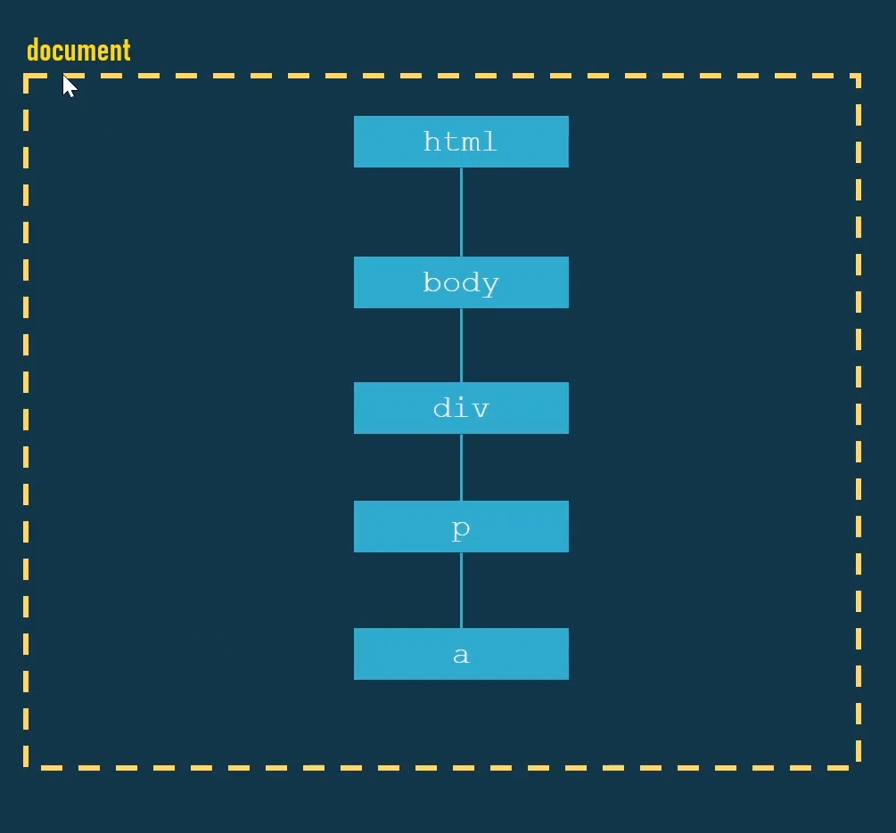

# SEÇÃO 08 - DOM: PARTE 2

 

## HTMLCollection vs NodeList
 

Vamos agora falar sobre a diferença entre `HTMLCollecion` e `NodeList`.

~~~
document.getElementsByTagName()
         getElementsByClassName()
         querySelectorAll()          
~~~

- O `.querySelectorAll()` irá nos retornar uma `nodeList`, onde essa `NodeList` é `estatica`.
- Em contra partida, o `getElementsByTagName() e getElementsByClassName()`, ou toda essa sintaxe que começa com `.getElements`, irá retornar um `HTMLCollection` e ao contrario da `nodeList` essa `HTMLCollection` é `dinamica`.

Vamos criar uma arquivo html chamado `htmlCollection_vs_nodeList` para podermos exemplificar melhor essas diferenças.

- Vamos criar uma estrutura bastante simples para exemplificarmos melhor.

> Obs: Para criar um elemento ja com id, basta fazermos `elemento#id` ou seja `ul#list` e apertar o tab.
> OBS2: Para criar mais de um elemento igual rapidamente, basta a gente fazer `li*5` e apertar o tab novamente.

~~~
<!DOCTYPE html>
<html lang="en">
<head>
    <meta charset="UTF-8">
    <meta http-equiv="X-UA-Compatible" content="IE=edge">
    <meta name="viewport" content="width=device-width, initial-scale=1.0">
    <title>Document</title>
</head>
<body>
    

        <ul id="list">
            <li>Item 1</li>
            <li>Item 2</li>
            <li>Item 3</li>
            <li>Item 4</li>
            <li>Item 5</li>
        </ul>
    

    
</body>
</html>
~~~ 

- Primeiro iremos criar duas constantes uma chamada `nodeList` e a outra chamada `htmlCollection`.
- A `nodeList` é retornada utilizando o `.querySelectorAll()`. Vamos pegar usando o `id` uma coleção de `lis` e salvar nessa constante que criamos.

~~~
 

// SAIDA:
NodeList(5) [li, li, li, li, li]

~~~

- Vamos agora selecionar as nossas `lis` usando o `getElementByTagName()`, o que irá nos retornar um `HTMLCollection`.
- Poderiamos selecionar todas as `lis` diretamente, mas vamos usar o `id= list` da nossa `ul`. Para manter o padrão que usamos no querySelector().
- Porem, ao usar qualquer metodo que utilize essa sintaxe `#list li` não podemos selecionar diretamente, temos que `encadiar 2 metodos`.

~~~

// SAIDA:
NodeList(5) [li, li, li, li, li]
HTMLCollection(5) [li, li, li, li, li]
~~~

Podemos ver pelo retorno no console do browser, que ambos são parecidos. Logo qual seria a diferença?

- Como foi falado antes, o `HTMLCollection` é dinamico, ja o `NodeList` é estatico.
- Vamos fazer um experimento para vermos o que seria essa diferença entre ser `dinamico` e `estatico`.
- Vamos usar o `.innerHTML` para colocarmos uma nova `li` junto com as que ja são existentes.
  
~~~

// SAIDA:

NodeList(5) [li, li, li, li, li]
HTMLCollection(5) [li, li, li, li, li]
NodeList(5) [li, li, li, li, li]
HTMLCollection(6) [li, li, li, li, li, li]
~~~

- Como podemos ver pelo console, temos como o `length` o numero `5` nos dois primeiros console.
- Depois, acrescentamos no meio da execução do codigo mais uma `li`, e agora na saida do console vemos que o nosso `htmlCollection` foi atualizado adicionando a `li` extra que colocamos dentro do seu `length`, mostrando sua `função dinamica`. Ja o `nodeList` uma vez guardado o valor dentro dele, será o mesmo valor para sempre, não irá se atualizar a medida que o DOM sofre alteração.
- Isso não tem nada haver com o fato de termos criado a `li` com o `.querySelector`. Tanto que se fizermos com os metodos que geram uma `nodeList`, o resultado será o mesmo.

~~~

// SAIDA:

NodeList(5) [li, li, li, li, li]
HTMLCollection(5) [li, li, li, li, li]
NodeList(5) [li, li, li, li, li]
HTMLCollection(6) [li, li, li, li, li, li]
NodeList(5) [li, li, li, li, li]
HTMLCollection(7) [li, li, li, li, li, li, li]
~~~

- A mesma coisa acontece quando queremos retirar elementos, o `nodeList` permanecerá intacto, ja o `HTMLCollection` irá atualizar seu `length`.

~~~

// SAIDA:

NodeList(5) [li, li, li, li, li]
HTMLCollection(5) [li, li, li, li, li]
NodeList(5) [li, li, li, li, li]
HTMLCollection(6) [li, li, li, li, li, li]
NodeList(5) [li, li, li, li, li]
HTMLCollection(7) [li, li, li, li, li, li, li]
NodeList(5) [li, li, li, li, li]
HTMLCollection []
~~~

- Vejam que o `HTMLCollection` esta vazia pois limpamos os items da tela, porem o `NodeList` continua contando como `5`.

 

 

## Node vs Element
 

Relembrando o topico passado `HTMLCollection` retorna uma coleção, de `html/objetos` e ela é `dinamica/live`, ja o `.querySelector()`, é estatico e sua utilização retorna uma `NodeList` contendo `nós do tipo elemento`.

Há `12` tipos diferentes de `"nós"` no `DOM HTML` (elemento, atributo, texto, comentário, etc). Um `elemento` é só um tipo especifico de `nó`.

- Vamos ver um exemplo de um HTML simples:

~~~
<!DOCTYPE html>
<html>
    <head></head>
    <body>
        

            
Lorem <a href="#">link</a> .

        

    </body>
</html>
~~~

- Como seria representado esse html, em uma estrutura de DOM?
  

- Esse html nos tras uma `estrutura linear`, uma coisa dentro da outra.

- Para o mesmo html, agora temos a representação de alguns outros `"nós"` que seriam referentes ao `atributo` de cada elemento.

;

- Agora, podemos ver os `"nós"` do tipo `texto` que tambem são representados.
- Logo para essa estrutura html, os `"nós"` que formam a arvaro de DOM podem ser separados pelos tipos:
  - `Elemento`: `html | body | div | p | a `
  - `Atributo`: `class | href`
  - `Texto`: `lorem | . | link `
- Por isso que falamos que o `.querySelector()` retorna uma `NodeList` que possui `nós do tipo elemento`.

Vamos agora ver alguns metodos que podemos usar para manipular o DOM desse html.

### Navegar entre os nós

~~~
Node.parentNode
    .parentElement
    .nextSibling
    .previousSibling
~~~

- Acessando os filhos dos `nós`.

~~~
Node.childNodes
    .children
    .firstChild
    .firstElementChild
    .lastChild
    .lastElementChild
    .hasChildNodes()
~~~

### Adicionando Nós

~~~
ParentNode.prepend()
          .append()

Node.appendChild()
    .insertBefore()
    .cloneNode()

ChildNode.after()
         .before()
~~~

- A partir do `elemento`

~~~
Element.insertAdjacentElement()
       .insertAdjacentHTML()
       .insertAdjacentText()
~~~

### Removendo Nós

~~~
Node.replaceChild()
    .removeChild()

ChildNode.remove()
~~~

> Cuidado com o `.remove()` pois ele não funciona no IE, caso a gente queira usar, basta criar um `polyfill` usando o `removeChild()`

### Criar nós

~~~
document.createElement()
        .createAttribute()
        .createTextNode()
        .write() // não usamos
~~~

- Quando criamos um elemento, estamos tecnicamente criando um elemento `fora da arvore do DOM HTML`, ou seja, ele so foi criado na `memoria` não esta em lugar nenhum da tela.
- Esse elemento so irá ficar visivel para o usuario, quando a gente adicionar ele a `arvore do DOM HTML` ou seja, dentro do `document`, usando os metodos ja mencionados `.appendChild()`. Ou seja, quando usarmos um metodo para adicionar esse `novo nó` dentro de um `nó existente`.

 

 

## Navegar na árvore do DOM
 

Vamos exemplificar agora os seguintes metodos de navagação do DOM HTML, para isso vamos criar um novo documento e chama-lo de `navigate_dom.html`.

~~~
Node.parentNode
    .parentElement
    .nextSibling
    .previousSibling
~~~

- Nesse documento iremos criar uma estrutura basica de `html` para vermos como fazer essa navegação entre `nós`.

~~~
<!DOCTYPE html>
<html lang="en">
<head>
    <meta charset="UTF-8">
    <meta http-equiv="X-UA-Compatible" content="IE=edge">
    <meta name="viewport" content="width=device-width, initial-scale=1.0">
    <title>Document</title>
</head>
<body>
    <h1>Teste DOM</h1>
    

        
Teste 1

        
Lorem <a href="#"> Link </a> .

        
Teste 2

        <h2>Lista</h2>
        <ul>
            <li>Item 1</li>
            <li>
                Item 2
                <ul>
                    <li>Item 2.a</li>
                    <li>Item 2.b</li>
                    <li>Item 2.c</li>
                </ul>
            </li>
            <li>Item <a href="#">link</a></li>
        </ul>
    

</body>
</html>
~~~

- A primeira coisa que iremos ver será `parentNode` e `parentElement`, na maior parte das vezes, ambos serão a mesma coisa. Existem cenários muito especificos onde eles não irão retratar a mesma coisa, na duvida, provavelmente vamos sempre querer utilizar o `parentElement`.
- O objeto `document` tem um "atalho" para a gente acessar o body, para não termos que fazer o `getElementByTag`, podemos acessar de maneira mais facil da seguinte maneira:

~~~ 

~~~

- Vamos ver a diferença entre ambos usando o console.

~~~

// SAIDA:

> <body>...</body>

> <html lang="en">
> <head>...</head>
> <body>...</body>
> </html>

> <html lang="en">
> <head>...</head>
> <body>...</body>
> </html>
~~~

- Observe que ambos possuem a mesma saida, eles irão apontar para o `html`, tanto é que se igualarmos ambos e mostrarmos no console, vamos receber o valor booleano de `true`.

~~~
console.log(document.body.parentElement === document.body.parentNode);

// SAIDA:

> true
~~~

- Vamos criar uma constante chamada html que aponta para o objeto `html lang="en"` que vimos acima, e pedir para ver no console.

~~~

// SAIDA:

> <body>...</body>

> <html lang="en">
> <head>...</head>
> <body>...</body>
> </html>

> <html lang="en">
> <head>...</head>
> <body>...</body>
> </html>

> true

> null

> #document

~~~

- Vejam que na primeira chamada do console, o objeto é `null`, pois o `nó/objeto html` não possue um elemento pai. Porem ele possui um nó pai, que seria do `tipo document`, e um nó do `tipo document` não é um no do `tipo elemento`.
- Por esse motivo, que o `parentNode` nos trouxe o proprio documento `#document`.

> Existe outro cenário onde podemos ver essa diferença que seria quando estivermos falando sobre `fragmento`, que iremos ver em outra aula.
> `Fragmento` seria por exemplo, temos um `no` do tipo `fragmento` e ele não é visivel em nenhum lugar na tela. Dentro dele vamos colocando objetos `div, paragrafo..etc`, e podemos trabalhar em cima dele sem que o mesmo afete o browser.
> Logo, quando estamos trabalhando com o `fragmento` que possui objetos dentro, por exemplo, uma `div` e pedirmos o `parentNode`, será retornado o `fragmento`, porem se pedirmos o `parentElement` irá nos retornar nulo, pois o a `div` não possui um pai do `tipo elemento` e sim do `tipo fragmento`.

- Agora vamos observar o `.nextSibling` e o `.previousSibling`, que servem para navegar entre irmãos.
- Vamos criar uma constante para selecionarmos o nosso `h2` do html.
- Vamos ver no console o `.nextSibling` do `h2`

~~~

// SAIDA:

> <h2>Lista</h2>
> #text
~~~

- O `.nextSibling` nos mostrou um `texto`, pois temos uma `quebra de linha`, ou seja, simplesmente por termos essa `quebra de linha` foi colocado um `irmao` apos o nosso `h2`. Se tirassemos essa quebra de linha e os espaços, ou seja, colocando a `ul` logo apos o fechamento do `h2` o resultado seria diferente.
- Para mudarmos esse resultado, em vez de colocarmos `.nextSibling` podemos usar o `.nextElementSibling`.

~~~
 

// SAIDA:

> <h2>Lista</h2>
> #text
> <ul>...</ul>
~~~

- Podemos fazer a mesma coisa para o `.previousSibling` e o `.previousElementSibling`.

~~~
 

// SAIDA:

> <h2>Lista</h2>
> #text
> <ul>...</ul>
> #text
> 
Teste 2

~~~

- Podemos ver o atributo `parentElement` na saida do console, como sendo o `div.container`.
- Vamos criar uma constante para receber o `h2nextSibling` colocando tbm um estilo `in-line` para fazer uma diferenciação. Ainda iremos falar sobre esse estilo `in-line`. 

~~~ 

~~~

 

 

## children e childNodes
 

Vamos agora ver como funciona as seguintes propriedades e o metodo `hasChildNodes()`.

~~~
childNodes
childrenFirstChild
firstElementChild
lastChild
lastElementChild
hasChildNodes()
~~~ 

- Primeiramente para vermos a diferença entre `childNodes` e `childrenFirstChild`, vamos selecionar no nosso html a tag `a`, criando uma constante chamada `link` para referenciar esse elemento.
- Tbm queremos selecionar nossa primeira `ul` para isso tbm iremos criar uma constante chamada `list`. Mesmo que tenhamos mais de uma `ul`no html, ao usar o `.querySelector()` será selecionado a primeira de todas.

~~~

~~~

- Na verdade, podemos selecionar a segunda `ul` que possui uma estrutura mais simples que a primeira.

~~~
[HTML]

    
Teste 1

    
Lorem <a href="#"> Link </a> .

    
Teste 2

    <h2>Lista</h2>
    <ul>
        <li>Item 1</li>
        <li>
            Item 2
            <ul>
                <li>Item 2.a</li>
                <li>Item 2.b</li>
                <li>Item 2.c</li>
            </ul>
        </li>
        <li>Item <a href="#">link</a></li>
    </ul>

[JAVASCRIPT]

// SAIDA:

> <a href="#">Link </a>
> <ul>...<ul>
~~~

- Vamos fazer o console.log em `list` passando as propriedades `.childNodes` e `.children` para entendermos uma coisinha...

~~~
[HTML]

    
Teste 1

    
Lorem <a href="#"> Link </a> .

    
Teste 2

    <h2>Lista</h2>
    <ul>
        <li>Item 1</li>
        <li>
            Item 2
            <ul>
                <li>Item 2.a</li>
                <li>Item 2.b</li>
                <li>Item 2.c</li>
            </ul>
        </li>
        <li>Item <a href="#">link</a></li>
    </ul>

[JAVASCRIPT]

// SAIDA:

> <a href="#"> Link </a>
> NodeList(7) [text, li, text, li, text, li, text]
>​ HTMLCollection(3) [li, li, li]
~~~

- Vejam que `.childNodes` nos mostra uma coleção (`nodeList`) com `7` elementos.
- Ja o `.children` está nos mostrando uma coleção (`HTMLCollection`) com `3` elementos.
- Ou seja, `.children` irá sempre retornar os elementos que são elementos mesmo. Os nós que são do `tipo elemento`.
- Ja o `nodeList` que seria o `.childNodes` irá nos retornar `todos os nós`. Lembrando que os `text` são nossas quebras de linhas...

- O mesmo irá acontencer caso a gente selecione a tag `p`, que irá aparecer o `text` porem um desses `text` será em vez de `quebra de linha` o texto que esta dentro do elemento.
- Para selecionar esse `p`, vamos da constante `link` usar o `.parentElement`

~~~
[HMTL]

[HTML]

    
Teste 1

    p>Lorem <a <href="#"> Link </a> .

    
Teste 2

    <h2>Lista</h2>
    <ul>
        <li>Item 1</li>
        <li>
            Item 2
            <ul>
                <li>Item 2.a</li>
                <li>Item 2.b</li>
                <li>Item 2.c</li>
            </ul>
        </li>
        <li>Item <a href="#">link</a></li>
    </ul>

[JAVASCRIPT]

// SAIDA: 

> NodeList(3) [text, a, text]
> HTMLCollection [a]
~~~

Essa é a diferença entre o `.children` e o `.childNodes`, o `.childNodes` irá nos mostrar `todos os nós`, independente se for elemento ou não. Ja o `.children` irá nos mostrar um `HTMLCollecion` nos trazendo apenas os `nós do tipo elemento`.

 

 

## firstChild, lastChild
 

Como o nome ja nos diz, o `.firstChild` irá nos mostrar o primeiro filho do elemento selecionado, ja o `.lastChild` irá nos mostrar o ultimo filho do elemento selecionado.

~~~
[HTML]

    
Teste 1

    
Lorem <a href="#"> Link </a> .

    
Teste 2

    <h2>Lista</h2>
    <ul>
        <li>Item 1</li>
        <li>
            Item 2
            <ul>
                <li>Item 2.a</li>
                <li>Item 2.b</li>
                <li>Item 2.c</li>
            </ul>
        </li>
        <li>Item <a href="#">link</a></li>
    </ul>

[JAVASCRIPT]

// SAIDA:

> <a href="#"> Link </a>
> "Lorem "
> <a href="#"> Link </a>
~~~

- Logo o `.fistChild` nos retorna o texto `"Lorem "`, e o `firstElementChild` nos retorna a tag `link` pois estamos usando como elemento selecionado, ou seja, de partida a tag `p`.
- O mesmo se aplica ao `.lastChild` e ao `.lastElementChild`.

~~~
[HTML]

    
Teste 1

    
Lorem <a href="#"> Link </a> .

    
Teste 2

    <h2>Lista</h2>
    <ul>
        <li>Item 1</li>
        <li>
            Item 2
            <ul>
                <li>Item 2.a</li>
                <li>Item 2.b</li>
                <li>Item 2.c</li>
            </ul>
        </li>
        <li>Item <a href="#">link</a></li>
    </ul>

[JAVASCRIPT]

// SAIDA:

> <a href="#"> Link </a>
> ". "
> <a href="#"> Link </a>
~~~

- Ja o metodo `hasChildNodes()`, irá verificar se o elemento que estamos buscando, possui `nó` ou não, se tem algum conteudo dentro dele ou não.
- Para testarmos isso, vamos criar uma tag `li` vazia dentro da nossa segunda `ul`.
- Atraves dessa `ul` vamos selecionar o ultimo `li` verificar se possui nó ou não.

~~~
[HTML]

    
Teste 1

    
Lorem <a href="#"> Link </a> .

    
Teste 2

    <h2>Lista</h2>
    <ul>
        <li>Item 1</li>
        <li>
            Item 2
            <ul>
                <li>Item 2.a</li>
                <li>Item 2.b</li>
                <li>Item 2.c</li>
                <li></li>
            </ul>
        </li>
        <li>Item <a href="#">link</a></li>
    </ul>

[JAVASCRIPT]

// SAIDA:

> false
~~~

- Temos o retorno `false` pois não possuimos nada dentro deste elemento.
- Agora se colocarmos um `texto`, um `espaço`, um `comentario` ou ate mesmo um `enter` ele irá trazer um retorno como `true`.
- Vamos ver como seria tendo um `comentario`. Veremos que temos um nó do tipo `comentario`.

~~~
[HTML]

    
Teste 1

    
Lorem <a href="#"> Link </a> .

    
Teste 2

    <h2>Lista</h2>
    <ul>
        <li>Item 1</li>
        <li>
            Item 2
            <ul>
                <li>Item 2.a</li>
                <li>Item 2.b</li>
                <li>Item 2.c</li>
                <li>
                    <!-- comentario qualquer -->
                </li>
            </ul>
        </li>
        <li>Item <a href="#">link</a></li>
    </ul>

[JAVASCRIPT]

// SAIDA:

> true
​> NodeList(3) [text, comment, text]
~~~

- Se colocarmos o indice dessa nodeList `1 = comment`, e chamar a propriedade `.nodeType` ele irá nos retornar um valor de `8` que seria um codigo para o tipo `comentario`.

~~~
[HTML]

    
Teste 1

    
Lorem <a href="#"> Link </a> .

    
Teste 2

    <h2>Lista</h2>
    <ul>
        <li>Item 1</li>
        <li>
            Item 2
            <ul>
                <li>Item 2.a</li>
                <li>Item 2.b</li>
                <li>Item 2.c</li>
                <li>
                    <!-- comentario qualquer -->
                </li>
            </ul>
        </li>
        <li>Item <a href="#">link</a></li>
    </ul>

[JAVASCRIPT]

// SAIDA:

> true
​> NodeList(3) [text, comment, text]
> 8
~~~

 

 

## Create DOM
 

Agora que aprendemos como navegar entre os nós no DOM, vamos ver como `criar` elementos no mesmo.

Ja vimos como trabalhar com o `.innerHTML` que é bem mais facil do que trabalharmos com os metodos especificos do DOM. Existe uma pequena diferença sobre quando podemos usar o `.innerHTML` ou não que será mostrada mais para frente no curso, especialmente depois que falarmos sobre eventos.

Por enquanto, será mostrado na teoria os metodos e como utiliza-los, para depois vermos porque usar os metodos ou o `.innerHTML`.

Vamos criar um novo arquivo html e chama-lo de `create_dom.html`.

- O primeiro metodo que iremos ver será o `.createElement`.
- Vamos criar uma constante chamada `.title` e iremos atribuir a ela o `document.createElement()`.
- Dentro do metodo, entre aspas, passamos o tipo de elemento que queremos criar, no caso um `h1`.
- Se olharmos o `console.log()` desta constante, veremos o `h1` criado e esta completamente vazio.

~~~

// SAIDA:

> <h1>...</h1>
~~~

- Vamos agora criar um atributo para esse elemento.
- Criamos uma constante chamada `atributo` e a tribuimos a ela o `document.createAttribute()`, passando dentro do parenteses o nome do atributo que queremos criar, no caso um `id`. 

~~~

~~~

- Depois de criarmos o `atributo` precisamos atribuir a ele um valor, usando a sintaxe `nome_atributo.value = `.

~~~

~~~ 

- Agora temos que vincular o nosso atributo do tipo `id` com a nossa constante `title` que representa o elemento `h1`.
- Basicamente utilizamos um metodo chamado, `.setAttributeNode()`, como parametro desse metodo passamos o `tipo do nó`, no caso um `nó do tipo atributo`.  

~~~

// SAIDA:

> <h1 id="title1">...</h1>
~~~

- Podemos ver agora no console um `h1` com uma `id=title1`.
- Agora queremos colocar um `texto` dentre deste `h1`. Vamos criar outra constante e chama-la de `text` que irá receber o `document.createTextNode()` passando dentro dos parenteses o texto que queremos que seja adicionado.

~~~
 
~~~

- Apos nosso `no do tipo texto` ter sido criado, precisamos ( igual ao atributo) , colocar esse nó de tipo texto dentro do nosso `title`, nó do tipo elemento.
- Temos varias maneiras para fazermos isso, o primeiro que iremos ver será o `.appendChild()`, passando como parametro o elemento, no caso `text` que queremos adicionar ao `title`.

~~~

// SAIDA:

> <h1 id="title1">Criar nós no DOM</h1>
~~~ 

- Outro metodo para criar atributos seria utilizando o `.setAttribute`, o que é mais comum.
- Nesse metodo, passamos dois parametros, o primeiro sendo o `tipo de atributo` que queremos, por exemplo `title`, e como segundo parametro passamos o `valor do atributo`.

~~~

// SAIDA:

> <h1 id="title1" title="title inserido dinamicamente" style="color: red;">Criar nós no DOM</h1>
~~~

- Usando o `.textContent`, o mais utilizando juntamente com o `.setAttribute()`.

~~~ 

// SAIDA:

> <h1 id="title1" title="title inserido dinamicamente" style="color: red;">Inserido com TextContent</h1>
~~~ 

- Para vermos esse `h1` no nosso documento, da maneira mais facil.
- Poderiamos utilizar o `.appendChild()` porem o mesmo irá inserir no final do documento.

~~~

~~~

- Em vez de colocarmos no `body` podemos colocar em outros lugares na nossa pagina tbm, por exemplo, dentro da nossa `div container`.

~~~

~~~

 

 

## adicionar DOM
 

Vimos na aula passada o `.appendChild()` , que adiciona um filho depois do ultimo filho do elemento.

Temos tbm os metodos `.append()` e `.preppend()`, com a desvantagem de que esses metodos não irão funcionar no IE.

- Vamos adicionar o `title = h1` que criamos em aulas passadas, a partir do `pai = .container`.

~~~

~~~      

- Vemos que foi adicionado depois do ultimo elemento filho o nosso `title`.
- Podemos tbm utilizar da mesma forma o `.prepend()`, porem, agora o elemento será acionado antes do primeiro elemento filho, se tornando o primeiro filho.

~~~

~~~

As vantagens dos metodos `.append()` e `.prepend()` são que eles aceitam mais de um parametro, inclusive parametros do tipo texto.

~~~

~~~

- O mesmo vale para o `.append()`. Ou seja, odemos passar tanto `texto` quanto `nós`. 
- Alem desses metodos, tbm temos o metodo `.insertBefore()`, este metodo espera receber 2 parametros, `um novo filho` e um `nó de referencia`.
- Vamos criar uma nova constante para exemplificarmos melhor, e inserir esse novo elemento antes da nossa primeira `ul`.

~~~

~~~

- Logicamente poderiamos ter criado uma variavel que referencie a nossa primeira `ul` deixando os parametro do `.insertBefore()` mais "limpos".
- Esse metodo so aceita nos seus parametro `nós` e não strings.

~~~

~~~

  
- Falamos que o metodo `.prepend()` não funciona no IE11, como fariamos se quisessemos inserir um elemento qualquer no inicio de um elemento dando suporte para o IE11?
- Para isso, criamos uma constante que irá receber a referencia do pai usando o metodo `.firstChild()`.

~~~

~~~

- Logo temos o mesmo efeito que o `.prepend()` mas agora irá funcionar em todos os browsers.

~~~

~~~

- No codigo acima, temos duas linhas de codigo que inserem o mesmo elemento, porem somente aparece no browser em 1 lugar.
- Quando a gente manipula um elemento que ja se encontra no DOM, esstamos tecnicamente movendo ele de lugar, ou seja, antes o elemento acima estava sendo inserido antes da nossa `ul`, e na proxima linha de codigo, "movemos" esse elemento para ser inserido depois da `div.container`.
- Vamos pegar a segunda `ul` e trazer ela para depois do `h2=list` para exemplificarmos melhor.
- Vamos criar uma constante chamada `sublevel` para salvar a referencia dessa segunda `ul` que temos.
- Depois iremos criar uma outra constante chamada `h2` para receber o `h2` onde queremos colocar logo apos dele a nossa segunda `ul`.
- Apos criar as referencias usamos o `.insertBefore()` passando como parametro as constantes e na nossa constante `h2` usamos o metodo `.nextElementSibling` para adicionar apos o mesmo.

~~~

~~~

- Podemos ver que nossa `ul` foi movida para logo apos o `h2`.
- Digamos agora que queremos `clonar` essa `ul` que movemos de lugar, para isso, mudamos a variavel de `const` para `let` para ela poder receber novos valores, e depois chamamos o metodo `.cloneNode()`.
- Com isso agora temos `2 uls` onde a nossa `ul` original sssesrá preservada, e a clonada será colocada apos o `h2`.

~~~

~~~

- Podemos ver que nossa `ul` original foi preservada, e o metodo adicionou o clone da nossa `ul` ao lugar que queremos, porem os filhos da `ul` que selecionamos não foram adicionados no processso de clonagem.
- Para isso temos que passar um parametro `booleano` para o `.cloneNode()`, informando que queremos clonar os filhos tbm.

~~~

~~~

- Agora temos nossa `ul` original preservada, e o clone da nossa `ul` com seus filhos sendo mostrados depois do elemento de referencia que queremos.

 

 

## after e before
 

 

 

## Insert
 

 

 

## remove
 

 

 

## Desafio
 

 

 

## Resolução: Desafio
 

 

 