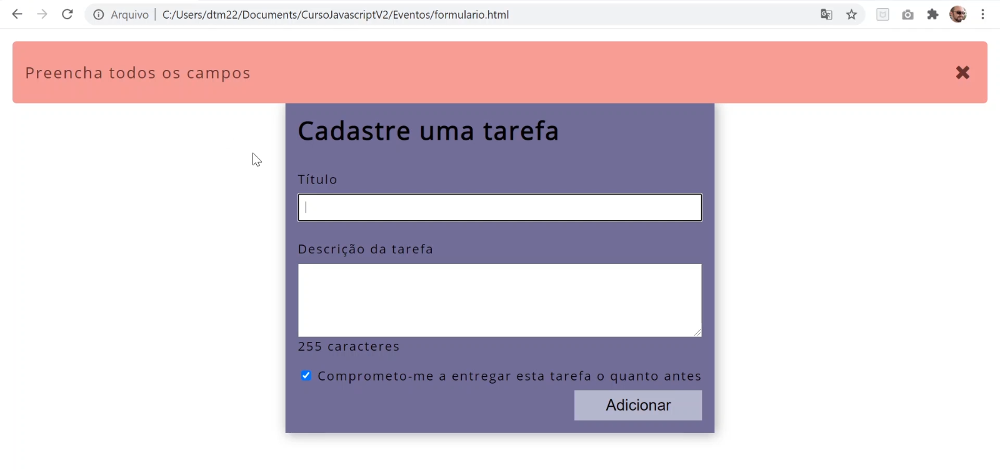

# SEÇÃO 09 - EVENTOS

 

## Introdução
 

### O que são Evento:

`Evento` é uma ocorrencia interativa que ocorre por intervenção do usuario ou não. Por exemplo:
- Sseguir um link
- Submeter um formulario
- Carregar uma página ou recurso do servidor (AJAX)
- Digitar um texto
- Mover o mouse...

### Event Handlers

Uma função que é executada quando um evento ocorre. Ou seja, uma função de `callback` que é executada quando um evento acontence.

### Disparador de eventos

É o elemento que disparou o evento. Ou seja, o elemento ao qual foi atrelado o `event handler`.

### Event Handler - DOM level 0

Vamos agora falar sobre `tipos de event handler`. Temos no `DOM lvl 0` uma maneira um pouco ultrapassada de atrelar uma função no evento.

~~~
<button onClick="funcao()" id="btn">...</button>
~~~

- Temos uma função atrelada a um `atributo = onClick`, onde o evento é o `click` do mouse, porem quando estamos usando o `DOM lvl 0` precisa ser usado uma palavra-chave chamada `on` seguida pelo `nome do evento`, caso `click`.
- Como estamos usando um `atributo do DOM lvl 0` passamos a palavra `onClick` seguida de uma `função entre apas`.
- Observe que nesse tipo de implementação precisamo passar os `parenteses()` da função.

~~~
const btn = document.getElementById("btn");
btn.onClick = funcao;
~~~

- Temos uma outra maneira de fazer o vinculo entre uma função `event handler` em um evento.
- Criamos uma variavel que recebe a referencia do elemento.
- E depoiss vinculamo chamando a `variavel.onEvento`, no exemplo acima, temos o evento `click` que precisamos colocar a palavra `on` na frente e atribuimos a ela a `funcao`;
- Observe que essa função não tem `parenteses`.

> Caracteristicas:
>   - Não conseguimos vincular mais de um evento ao mesmo elemento html.

### Event Handler - DOM lvl 2

Para utilizar o `DOM lvl2` precisamos de um metodo chamado `.addEventListener()`.

~~~
const btn = document.getElementById("btn");
btn.addEventListener(evento, funcao, fase);
~~~

- Esse metodo recebe pelo menos `2 parametros`, o `tipo do evento` e `função`. O parametro `fase` mostrado no codigo é opcional, cujo valor `default = false`.

Vamos agora ver alguns exemplos no nosso vscode. Vamos criar um novo documento html e chama-lo de `introdução.html`.

Para começar a demonstração, vamos criar 3 botões:

~~~
<body>
    <h1>Eventos</h1>
    <button id="btn1">Botão 1</button>
    <button id="btn2">Botão 2</button>
    <button id="btn3">Botão 3</button>
</body>
~~~

- No mundo do javascript iremos criar algumas variaveis que referencie a esses botões.

~~~
const btn1 = document.getElementById("btn1");
const btn2 = document.getElementById("btn2");
const btn3 = document.getElementById("btn3");
~~~

- Ja vimos como utilizar o `DOM lvl 0` porem, vamos ver o porque a utilização dele não é uma boa pratica.
- A primeira coisas é que não conseguimos vincular `2 eventos` ao mesmo elemento html.
- Podemos atribuir uma `função anonima` ao evento do click do botão.

~~~ 
const btn1 = document.getElementById("btn1");
const btn2 = document.getElementById("btn2");
const btn3 = document.getElementById("btn3");

btn1.onclick = function(){
    console.log("click btn1 funcao anonima");
}
~~~ 

- Poderiamos tbm criar uma função nomeada e atribuir ao evento.

~~~ 
const btn1 = document.getElementById("btn1");
const btn2 = document.getElementById("btn2");
const btn3 = document.getElementById("btn3");

function clicou(){
    console.log("click funcao cliclou()");
}

btn1.onclick = function(){
    console.log("click btn1 funcao anonima");
}
btn1.onclick = clicou;
~~~ 

- Como podemos ver, a função `clicou()` sobrescreveu a função anonima que criamos anteriormente, não aceitando assim mais de um evento no mesmo elemento.
- Vamos ver como fazemos para trabalhar com o `DOM lvl 2`. Para isso, usamos o `addEventListener()` passando como `evento = click` (tira o `on`) e coloca o nome do evento entre `"aspas"`, e como segundo parametro, passamos uma função `event handler` e essa função será executada quando ocorrer o `click` no `btn2`.
- Podemos passar tanto uma `função anonima` quanto uma `função nomeada`.

~~~ 

~~~ 

- Poderiamos tbm trabalhar com `função anonima`. Observe que agora podemos ter mais de um evento vinculado ao mesmo elemento html.

~~~

~~~

- Vamos agora imaginar que tbm temos a maneira de criar evento para o mesmo botão usando o `DOM lvl 0 +  DOM lvl 2`.

~~~ 

~~~

- Observe que todas as 3 funções foram executadas ao clicar no botão 2.
- Agora, vamos ver o que acontence se dentro do html do `botao 2` colocarmos o atributo `onClick`, recebendo diretamente um `console.log()`.

~~~
<button id="btn2" onclick="console.log('click com atributo')">Botão 2</button>
~~~

- Ao clicarmos no botão 2, vemos que a `função com atributo` nunca foi executada pois foi sobrescrita pelo `onclick` no javascript.
- Se comentarmos essa linha de codigo, a `função com atributo` irá funcionar.

~~~

~~~

 

 

## Propagação de eventos
 

Falamos na aula passada sobre o `event handler - DOM lvl 2`, onde temos um metodo chamado `.addEventListener()`, que recebe 3 parametros, `nome do evento`, `função`, e a `fase` que é um parametro booleano, que passamos true or false (default).

Este parametro disrespeito sobre `como queremos capturar o evento` se seria na fase de `captura` ou na fase de `bubbling/borbulhamento`.

Quando falamos sobre `Propagação de Eventos` temos `2 tipos de fases` possiveis:
    - `Fase de Captura`
    - `Fase de Bubbling`

Ou seja, quando clicamos no `link` do html acima, não estamos somente clicando no link, mas tbm `no paragrafo`, na `div.container`, no `body`, no `html` e por fim no `DOCTYPE hmlt`.Logo, estamos clicando em toda `hierarquia do DOM`.

Na `Fase de captura` esse evento é capturado, enquanto os eventos se propagam para `baixo`, `html` -> `body` -> `div` -> `p` -> `link(a)`.

Na `Fase de Bubbling` esse evento é disparado quando clicamos no evento e ele vai subindo os niveis até chegar no `document`. Essa seria a fase `default`.

No paramentro de `fase` do metodo `addEventListener()` possui como `default=false`, o que significa que a `Fase de Bubbling` será utilizada quando vincurlarmos o evento. Caso a gente queira que esse evento seja passado na `Fase de Captura` precisamos passar o `true` para o parametro de `fase`.

- Vamos  colocar um evento no `btn3` com uma `função anonima'.
- Vamos tbm colocar um evento no nosso objeto `document`.

~~~ 

// SAIDA:
> Clickou no btn3
> Clickou no document
~~~      

- Podemos observar pelo codigo acima que ao clicarmos no `btn3` tbm clicamos no nosso `document` de forma que o primeiro evento disparado foi o `btn3` mostrando a `Fase de Bubbluing`. E se clicarmos fora do `btn3`, vemos o disparo do evento vinculado ao `document`.
- Para observar a `Fase de Captura` basta adicionar o `true` ao parametro da `fase` do metodo `.addEventListener()`.

~~~ 

btn3.addEventListener("click", function(){
    console.log("Clickou no btn3");
})

document.addEventListener("click", function(){
    console.log("Clickou no document");
},true);

// SAIDA:

> Clickou no document
> Clickou no btn3
~~~

- Para fazermos mais um exemplo, vamos colocar uma `div.container` acima dos botões.
- Depois iremos criar uma constante para referenciar essa `div.container`. E criar um evento para o click dessa constante.

~~~
[HTML]

<h1>Eventos</h1>

    <button id="btn1">Botão 1</button>
    <button id="btn2" onclick="console.log('click com atributo')">Botão 2</button>
    <button id="btn3">Botão 3</button>

[JAVASCRIPT]

btn3.addEventListener("click", function(){
    console.log("Clickou no btn3");
})

document.addEventListener("click", function(){
    console.log("Clickou no document");
});

const container = document.getElementById("container");
container.addEventListener("click",function(){
    console.log("clicou no container");
})

// SAIDA:
> Clickou no btn3
> clicou no container
> Clickou no document
~~~

- Agora queremos colocar o `container` para ser capturado na `Fase de captura`.

~~~
const container = document.getElementById("container");
container.addEventListener("click",function(){
    console.log("clicou no container");
},true);

// SAIDA:
> clicou no container
> Clickou no btn3
> Clickou no document
~~~

 

## O objeto event
 

No video passado, falamos que seria possivel `bloquear` a propagação de eventos, para cpnseguirmos fazer isso, precisariamos ter acesso ao `objedo evento`.

Seja com `DOM 0` ou `DOM 2`, os handlers (funções atreladas à eventos), recebem por parametro um `objeto do tipo evento`. Para ter acesso à esse objeto, basta dar um nome ao `parametro`. E a partir desse objeto, temos acesso a propriedades e metodos, um desses metodos é o que iremos utilizar para pararmos a propagação de eventos.

No nosso vscode, para podermos ter acesso ao `objeto do tipo evento` temos que passar um `nome` dentro da função que é chamada no `.addEventListener()`.

- Digamos que queremos parar a propagação quando for clicado no `btn3`.

~~~
btn3.addEventListener("click", function(abacaxi){
    console.log(abacaxi);
    console.log("Clickou no btn3");
});

// SAIDA:

> clicou no container
> PointerEvent {isTrusted: true, pointerId: 1, width: 1, height: 1, pressure: 0, …}
> Clickou no btn3
> Clickou no document
~~~

- Vejam que recebemos um `PointerEvent` com varias propriedades/parametros dentro deste objeto que podemos utilizar no futuro.
- Vamos agora ver um metodo chamado `.stopPropagation()`. Que indica que não irá mais continuar a propagação deste evento. Ou seja, quando chegar no botão 3, deve parar a propagação.

~~~
btn3.addEventListener("click", function(abacaxi){
    console.log(abacaxi);
    abacaxi.stopPropagation();
    console.log("Clickou no btn3");
});

// SAIDA:

> clicou no container
> PointerEvent {isTrusted: true, pointerId: 1, width: 1, height: 1, pressure: 0, …}
> Clickou no btn3
~~~

- Podemos ver que não temos mais a propagação do evento de `click document`.
- O nome mais comum de utilização seriam:
  - event
  - evt
  - e

 

## Delegação de eventos
 

Util quando temos muitos filhos de um determinado elemento. Imagine que temos uma lista com `20 li's`, por exemplo, se tivermos muitos filhos e em cada filho ter um evento proprio, podemos gerar uma `sobrecarga` ou `problema de memoria` na maquina do usuario.

Quando isso acontence, costumamos colocar o evento no `elemento pai`, e  a partir do elemento pai identificar a `li` clicada.

Especialmente útil quando temos muitos filhos com eventos atrelados individualmente. Delegar um evento é o ato de atrelar um evento ao elemento pai, economizando recursos da máquina.

- Vamos criar uma novo `div.container2` que irá possuir 3 botões.

~~~ 
[HTML]

<h1>Eventos</h1>

    <button id="btn1">Botão 1</button>
    <button id="btn2" onclick="console.log('click com atributo')">Botão 2</button>
    <button id="btn3">Botão 3</button>

<h1>Delegação de Eventos</h1>

    <button>Botão 1</button>
    <button>Botão 2</button>
    <button>Botão 3</button>

~~~

- No nosso javascript vamos criar uma constante para guardar a referencia do `container2`, e mais uma constante para receber a referencia de todos os nossos botões.

~~~ 
const conainter2 = document.querySelector(".container2");
const btns = document.querySelectorAll(".container2 button");
~~~

- Agora iremos colocar um evento em cada um dos botões. Poderiamos utilizar o `spread operator`, o `Array.from()`, pois não podemos simplesmente fazer `btns.addEventListener()`, o que irá gerar um erro pois o `btns` é uma `nodeList`, uma coleção de objetos. Logo, não conseguimos atrelar um evento a uma coleção inteira, precisamos atrelar um evento a cada um dos `botões`.

~~~ 
const conainter2 = document.querySelector(".container2");
const btns = document.querySelectorAll(".container2 button");
console.log(btns);
btns[0].addEventListener("click", function(){
    console.log("cliclou em btns");
});

// SAIDA:

> NodeList(3) [button#btn4, button#btn5, button#btn6]
> cliclou em btns
> Clickou no document
~~~ 

- Vamos replicar esse codigo para os demais botões adicionando o `.stopPropagation()`.

~~~
const conainter2 = document.querySelector(".container2");
const btns = document.querySelectorAll(".container2 button");
console.log(btns);
btns[0].addEventListener("click", function(e){
    e.stopPropagation();
    console.log("cliclou em btns-1");
});

btns[1].addEventListener("click", function(e){
    e.stopPropagation();
    console.log("clicou em btns-2");
})

btns[2].addEventListener("click", function(e){
    e.stopPropagation();
    console.log("clicou em btns-3");
})
~~~

- Apos essas alterações, vimos que o `propagation document` não existe mais.
- Percebam que essa maneira de progamar se torna inviavel no caso de termos mais botões.
- Para não termos que passar o `indice` de todos os elementos da nossa coleção, pegamos ela e transformamos em um `objeto do tipo array` usando o `spread operator`, e executamos um loop para cada objeto desse array.

~~~
const conainter2 = document.querySelector(".container2");
const btns = document.querySelectorAll(".container2 button");
console.log(btns);
[...btns].forEach(button => {
    btn.addEventListener("click", function(e){
        e.stopPropagation();
        console.log("clicou nos btns");
    });
});

// SAIDA:

~~~

- Logo, transformamos nossa `nodeList` em um `array` e a partir desse array, criamos um loop com o metodo `forEach()`. Esse metodo irá executar uma ação para cada botão. Dentro dessa função que ele o loop irá executar para cada botão, colocamos o metodo `.addEventListener()` que irá disparar ao clicarmos em cada um dos botões individualmente.
- Poderiamos tbm mostrar o botão que estamos clicando da seguinte maneira:
  - `event.target`
  - `evt.target`
  - `e.target`
  - `abacaxi.target`.

~~~
const conainter2 = document.querySelector(".container2");
const btns = document.querySelectorAll(".container2 button");
// console.log(btns);
[...btns].forEach(button => {
    button.addEventListener("click", function(e){
        e.stopPropagation();
        console.log(e.target);
    });
}); 
~~~

- Porem, como falamos, quanto mais botões temos, mais `.addEventListener()` será buscados no `forEach()` trazendo um problema de performace para a aplicação.
- Uma maneira mais inteligente, seria colocar o `.addEventListener()`, não no `btns` e sim no `div.container2` que é o pai desse elemento.

~~~ 
const container2 = document.querySelector(".container2");
const btns = document.querySelectorAll(".container2 button");
// console.log(btns);

container2.addEventListener("click",function(e){
    e.stopPropagation();
    console.log(e.target);
});
~~~

- Ainda temos um problema, quando clicamos fora dos botões, porem ainda dentro do `container2`, temos a propagação do evento mostrando a nossa `div.container2`.
- Para deixarmos somente com o click de um dos botões, criamos uma condicional que pergunta se o `e.target` é do tipo `botão`.

~~~ 
const container2 = document.querySelector(".container2");
const btns = document.querySelectorAll(".container2 button");
// console.log(btns);

container2.addEventListener("click",function(e){
    e.stopPropagation();
    if(e.target.nodeName === "BUTTON"){
        console.log(e.target);
    }
});
~~~

- Agora o evento so será disparado se realmente clicarmos no botão.

 

## target vs currentTarget
 

Vamos ver uma curiosidade sobre o `objeto evento`, temos o `e.target` que se refere ao objeto que foi o alvo do evento.

- Vamos no evento do `container2` tirar o `e.stopPropagation` e mostrar no console o `e.target`. E vamos fazer o mesmo para o `document`.
- Primeiro iremos clicar no `documento` depois no `container2` e depois no botão para objservar a diferença.

~~~ 
document.addEventListener("click", function(e){
    console.log(e.target);
    console.log("Clickou no document");
});

container2.addEventListener("click",function(e){
    // e.stopPropagation();
    console.log("cliclou no container2");
    console.log(e.target);
    if(e.target.nodeName === "BUTTON"){
        console.log(e.target);
    }
});
~~~

- Pela saida do console podemos ver que apesar dele estar disparando a função que foi atrelada tanto no `container2` quanto no `document` o alvo é o mesmo, pois o alvo seria quem disparou o evento, por isso temos como saida ao clicarmos no `container2` o console do `document`. O mesmo acontece quando clicamos nos `botões`.
- Alem do `target`, temos o `currentTarget` vamos ver qual seria a diferença entre eles...

~~~

document.addEventListener("click", function(e){
    console.log(e.target);
    console.log(e.currentTarget);
    console.log("Clickou no document");
});

container2.addEventListener("click",function(e){
    // e.stopPropagation();
    console.log("cliclou no container2");
    console.log(e.target);
    console.log(e.currentTarget);
    if(e.target.nodeName === "BUTTON"){
        //console.log(e.target);
    }
});
~~~ 

- Observem que o `target` e o `currentTarget` ao clicar no `document` são iguais (apontam para o mesmo lugar), mas transpostos no console de maneira diferente.
- Se clicarmos no `container 2`, agora teremos o `target` e o `currentTarget` iguais, porem quando a função do documento é chamada, o `target=container2` e o `currentTarget = #document`, ou seja, o `currentTarget` será o elemento a qual foi atrelado a função.

- Podemos ver melhor essa diferença quando clicarmos no botão.

- O `target` agora será o `botão` e o `currentTarget` será o elemento onde a função esta sendo executado, no caso `container2`. 
- Quando passa para o `document` o `target` continua sendo o `botão` ja o `currentTarget` passa a ser o `#document` e não mais o `container2`.

Nesse contexto, temos outra palavra-magica no javascript que seria o `this`. O `this` é uma palavra `dinamica`, ou seja, ela pode mudar. Porem no caso desse tipo de evento com esse tipo de função, o `this = currentTarget`. Ou seja, o `this` nesse contexto será o elemento ao qual foi atrelado a função.

~~~ 
~~~

1) Clicando primeiro no `document`

;

2) Clicando no `container2`

3) Clicando no `botão`.

Quando não tivermos trabalhando com uma `função anonima` e sim uma `arrow function` o que irá mudar alem do codigo ficar mais enxuto, é que o `this` dentro de uma `arro function` não é mais `dinamico`. 

~~~
console.log("this-----"+this);
container2.addEventListener("click",(e) => {
    // e.stopPropagation();
    console.log("cliclou no container2");
    console.log(e.target);
    console.log(e.currentTarget);
    console.log(this);
    if(e.target.nodeName === "BUTTON"){
        //console.log(e.target);
    }
});
~~~

- O `this` dentro da nossa função será igual ao `this` que esta fora da mesma.

 

## Exercicio proposto: Validar formulário
 

Agora que vimos a parte teoria com relação a `eventos` conseguimos agora desenvolver uma pagina um pouco mais complexa.

Como exercicio, vamos desenvolver uma pagina que desrespeita sobre a validação de um formulário. A ideia é desenolver uma pagina parecida com a foto abaixo que possui um botão `Adicionar` que so será habilitado quando marcarmos o `checkbox`. Quando clicarmos em adicionar, será mostrado uma mensagem de feedback como na foto 2.

Resumo:
1) Validar se o `title` esta vazio ou nao
2) Mostrar um contador de caractere
3) Habilitar o botão apenas quando o checkbox for selecionado.

 

## Cancelar o envio de formulário
 

A primeira coisa que iremos fazer será no javascript criar as variaveis que precisamos.

- Vamos ter uma variavel que irá armazenar o `titulo` e outra para armazenar o `botão`.
- Queremos que ao clicar no botão adicionar, verificar se o  `input` do titulo esta vazio ou nao.
  - Vazio = alert
  - Cheio = envia formulario

~~~
(function(){
    'use-strict';

    const txtTitulo = document.getElementById("txtTitulo");
    const btn = document.getElementById("btn");
});
~~~

- Agora iremos adicionar um `listener` no nosso botão. Ou seja, no momento que clicarmos no botão, queremos verficiar se o nosso txtTitulo possui algum valor la dentro.
> Vamos ter um pequeno problema, será mostrado o texto digitado no titulo no console, porem ele irá sumir rapidamente. Isso acontence pq nossa pagina esta sendo recarregada o tempo todo, como se tivessemos mandando a requisição para o servidor, logo o console é "limpo" e se abre um novo console.
> Para que isso não acontença, precisamos configurar o `dev-tools` para manter o historico de logs mesmo que a pagina seja recarregada. COnsole>engrenagem>preserve log

- Dentro do `listener` precisamos fazer uma verificação para saber se o titulo possui ou não algum valor.

~~~
(function(){
    'use-strict';
    const txtTitulo = document.getElementById("txtTitulo");
    const btn = document.getElementById("btn");

    btn.addEventListener("click", function(){
        console.log(txtTitulo.value);
        if(!txtTitulo.value){
            alert("Preencha todos os campos!");
        }
    });
})();
~~~

- Uma outra coisa que temos podemos observar é que ao clicar no `ok` do alert, o formulario ainda sim esta sendo enviado para o servidor, o que nao poderia acontencer.
- Precisamos impedir o comportamento padrão do browser caso esteja vazio. Para isso, passamos o `evt`para a função anonima, e chamamos um metodo usando esse objeto chamado `evt.preventDefault()`.

~~~
(function(){
    'use-strict';
    const txtTitulo = document.getElementById("txtTitulo");
    const btn = document.getElementById("btn");

    btn.addEventListener("click", function(evt){
        console.log(txtTitulo.value);
        if(!txtTitulo.value){
            alert("Preencha todos os campos!");
            evt.preventDefault();
        }
    });
})();
~~~ 

- Outra coisa que queremos fazer seria, quando o usuario clickar no `ok` do alert, o foco ir para o `input`.
- Apos o `evt.preventDefault()` ser adicionado, o formulario não é mais enviado mesmo clicando no `ok` do alert.
- Vamos usar o metodo do input `.focus()` para que ao clicar no `ok` do alert() o foco mude para o `input`.

~~~
(function(){
    'use-strict';
    const txtTitulo = document.getElementById("txtTitulo");
    const btn = document.getElementById("btn");

    btn.addEventListener("click", function(evt){
        console.log(txtTitulo.value);
        if(!txtTitulo.value){
            alert("Preencha todos os campos!");
            evt.preventDefault();
            txtTitulo.focus();
        }
    });
})();
~~~

- Outro detalhe, colocamos o eento de click no nosso `input`, porem podemos melhorar isso, se apertamos o `enter` o formulario será enviado mesmo se não clicarmos no botão de adicionar, isso ocorre pois o browser é suficientemente inteligente para saber que ao apertar o `enter` estamos ativando o evento de click que existe no nosso botão.
- Porem pode ser que em alguns browsers isso não seja tratado da mesma forma.
- Para podermos mudar isssso, temos que mudar o lugar do evento para ele não ocorrer no click do botao e sim no `submit` do formulario.
- Vamos criar uma nova constante chamada `formCadastro` que recebera a referencia do `form`. O evento que iremos adicionar nesse formulario será do tipo `submit` que é um evento de formulario.

~~~ 
(function(){
    'use-strict';
    const txtTitulo = document.getElementById("txtTitulo");
    const btn = document.getElementById("btn");
    const formCadastro = document.querySelector(".formCadastro");
    console.log(formCadastro);

    formCadastro.addEventListener("submit", function(evt){
        if(!txtTitulo.value){
            alert("Preencha todos os campos!");
            evt.preventDefault();
            txtTitulo.focus();
        }
    });

    btn.addEventListener("click", function(evt){});
})();
~~~

Agora tudo irá continuar funcionando, porem dessa maneira, temoss um codigo mais semantico do que antes, colocar o evento de `submit` no formulario do que o de `click` no botão.

 

## Exercicio proposto: Contador de caracteres
 

Até agora vimos como `validar o input`, e colocamos essa validação não no click do botão e sim no `envio` do formulario. Agora vamos tratar sobre o contador de caracteres.

- Atualmente temos um `255 caracteres` na pagina que não esta fazendo nada, digitamos no campo de descrição porem, o mesmo não contabiliza a quantidade de caracteres que esta sendo digitada.
- A primeira coisa que iremos fazer será deixar o formulario funcinando sem o javascript e sem o javascript o texto que temos `255 caracteres` não faz nenhum sentido.
- Vamos então esconder o nosso contador no html, colocando nele um `style in-line` adicionando a propriedade `display:none`.

~~~
<form action="#" class="formCadastro" id="shopping-add">
    <label for="txtTitulo" >Titulo</label>
    <input type="text" id="txtTitulo" name="txtTitulo">

    <label for="txtDescricao">Descrição da Tarefa</label>
    <textarea name="txtDescricao" id="txtDescricao" rows="5" maxlength="255"></textarea>
    
255caracteres

    <label for="">
        <input type="checkbox" name="" id="chkAceito">
        Comprometo-me a entregar esta tarefa o quanto antes
    </label>

    <input type="submit" id="btn" value="Adicionar">
</form>
~~~

- Com o javascript habilitado, queremos mostrar o contador que "escondemos" da pagina. Para isso vamos criar umas constantes que referencie esses a nossa `textArea` e o `div.contador`.

> Por didatica, vamos criar as constante abaixo do ultimo exercicio que fizemos, porem na vida real, as constantes são colocadas nas primeiras linhas de codigo.

~~~
(function(){
    'use-strict';

    // input titulo e validações
    const txtTitulo = document.getElementById("txtTitulo");
    const btn = document.getElementById("btn");
    const formCadastro = document.querySelector(".formCadastro");
    
    btn.addEventListener("click", function(evt){});

    formCadastro.addEventListener("submit", function(evt){
        if(!txtTitulo.value){
            alert("Preencha todos os campos!");
            evt.preventDefault();
            txtTitulo.focus();
        }
    });

    // input descrição e contador
    const txtDescricao = document.getElementById("txtDescricao");
    const contadorContainer = document.getElementById("contador");

})();
~~~

- Criamos a constante `contadorContainer` pois iremos criar uma outra constante chamada `contador` que será a descrição que temos no html `span 255`.
- No `contadorContainer` temos o `display:none` onde poderiamos tanto remover o atributo, como colocar um `display:block`. Vamos ver como fazer das duas formas:
  - Removendo o atributo, utilizarmos o metodo `.removeAttribute()`, passando como parametro o atributo que colocamos no html `style`.
  - Outra forma seria chamando o `style.display` e igualando ao valor que queremos, no caso `block`.

~~~ 
(function(){
    'use-strict';

    // input titulo e validações
    const txtTitulo = document.getElementById("txtTitulo");
    const btn = document.getElementById("btn");
    const formCadastro = document.querySelector(".formCadastro");
    
    btn.addEventListener("click", function(evt){});

    formCadastro.addEventListener("submit", function(evt){
        if(!txtTitulo.value){
            alert("Preencha todos os campos!");
            evt.preventDefault();
            txtTitulo.focus();
        }
    });

    // input descrição e contador
    const txtDescricao = document.getElementById("txtDescricao");
    const contadorContainer = document.getElementById("contador");

    contadorContainer.removeAttribute("style"); // removendo atributo
    contadorContainer.style.display = "block";  // alterando o atributo

})();
~~~

- Sempre que estivermos trabalhando com o `.style` estamos acessando os estilos `in-line` no html. Basta colocar o `.style.propriedade = "valor_propriedade"`.
- Vamos criar uma outra constante para o `span`, ela pode ser escrita como constante pois ela so irá representar um objeto do DOM.
- Como queremos acessar o `span` podemos usar o `.getElementsByTagName()` porem teremos como retorno uma `coleção`, mesmo so tendo um elemento, para que o retorno não seja de coleção e sim do elemento em si, bata colocarmos o `indice=0`.

~~~ 
(function(){
    'use-strict';

    // input titulo e validações
    const txtTitulo = document.getElementById("txtTitulo");
    const btn = document.getElementById("btn");
    const formCadastro = document.querySelector(".formCadastro");
    
    btn.addEventListener("click", function(evt){});

    formCadastro.addEventListener("submit", function(evt){
        if(!txtTitulo.value){
            alert("Preencha todos os campos!");
            evt.preventDefault();
            txtTitulo.focus();
        }
    });

    // input descrição e contador
    const txtDescricao = document.getElementById("txtDescricao");
    const contadorContainer = document.getElementById("contador");
    const restaContador = contadorContainer.getElementsByTagName("span")[0];
    console.log(restaContador);
    console.log(restaContador[0]);

    // contadorContainer.removeAttribute("style");
    contadorContainer.style.display = "block";

})();
~~~

- Agora tbm queremos ter acesso ao atributo `maxLength="255"` que temos na nossa `textarea`. Para isso vamos criar outra constante (pois o valor n ira mudar).

~~~
const maxima = txtDescricao.maxLength;
~~~

- A forma acima nos tras o valor desse atributo `maxLength` que temos no html, recuperamos essse valor de forma dinamica e não de forma estatica (colocando o 255 direto na cosnstante), pois caso no futuro a gente queira aumentar esse numero de caracteres, não precisaremos alterar todo o codigo.
- Agora vamos criar um evento no nosso `txtDescrição`, temos varios tipos de eventos que poderiamos utilizar, vamos ve-los no console para nos familiarizar.

~~~ 
txtDescricao.addEventListener("keyup", function(){
    console.log("keyup");
});
txtDescricao.addEventListener("keydown", function(){
    console.log("keydown");
});
txtDescricao.addEventListener("keypress", function(){
    console.log("keypress");
});
txtDescricao.addEventListener("change", function(){
    console.log("change");
});
txtDescricao.addEventListener("input", function(){
    console.log("input");
});

// SAIDA:

> keydown
> keypress
> input
> keyup
~~~

- Essa é a ordem que acontence essses eventoss ao pressionar uma tecla.
- Porem o evento que iremos utilizar na pratica será o de input, vamos ver o pq disso...
- O `change` nunca aparece no console, logo podemos remove-lo.
- O evento de `keyup` acontence quando precionamos uma tecla e depois a soltamos, ja o `keydown` ocorre quando apertamos a tecla. Como o nome de ambos nos diz.
- Vamos trabalhar com o evento de `input` pois caso a gente "cole" com o mouse um texto, somente o `input` será disparado e os outros eventos não. O `evento input` dispara sempre que ocorrer uma alteração no `input`.
- Dentro da função do `input` vamos criar uma variavel chamada `numeroLetrasDigitadas` que irá receber o `value.length` do texto que será digitado em `txtDescricao`, poderiamos usar o `this` para isso, pois estamos usando uma function expression, e não uma Arrow function, fazendo com que o  `this` nese caso seja o elemento ao qual foi atrelado o evento, ou seja, `txtDescricao`.

~~~ 
txtDescricao.addEventListener("input", function(){
    let numeroLetrasDigitadas = this.value.length;
    console.log(numeroLetrasDigitadas);
});
~~~

- Agora que ja temos o numero de letrass digitadas, temos que fazer uma conta, subtraindo o `maxLength do textarea` pelo o que ja digitamos.
- Temos que tomar cuidado pois, a constante `maxima` que criamos pode vir como string, ou seja, sempre que temos uma informação que vem da interface grafica do usuario, temos que converte-la para o tipo de dado que queremos, no caso, numero.
- Vamos criar outra variavel chamada `caracteresRestantes` que irá guardar o resultado dessa subtração. Depois iremos pegar a constante que criamos para referenciar o nossso `span`, e atribuir o valor de `caracteresRetantes` a ele usando o `.textContent`.

~~~ 
(function(){
    'use-strict';

    // input titulo e validações
    const txtTitulo = document.getElementById("txtTitulo");
    const btn = document.getElementById("btn");
    const formCadastro = document.querySelector(".formCadastro");
    
    btn.addEventListener("click", function(evt){});

    formCadastro.addEventListener("submit", function(evt){
        if(!txtTitulo.value){
            alert("Preencha todos os campos!");
            evt.preventDefault();
            txtTitulo.focus();
        }
    });

    // input descrição e contador
    const txtDescricao = document.getElementById("txtDescricao");
    const contadorContainer = document.getElementById("contador");
    const restaContador = contadorContainer.getElementsByTagName("span")[0];
    const maxima = txtDescricao.maxLength;

    // contadorContainer.removeAttribute("style");
    contadorContainer.style.display = "block";

    txtDescricao.addEventListener("input", function(){
        let numeroLetrasDigitadas = this.value.length;
        let caracteresRestantes = parseInt(maxima) - parseInt(numeroLetrasDigitadas);
        restaContador.textContent = caracteresRestantes;
    });

})();
~~~

- Poderiamos tbm em vez de utilizar uma função anonima, usar uma função nomeada chamada `checkLength()`.

~~~ 
(function(){
    'use-strict';

    // input titulo e validações
    const txtTitulo = document.getElementById("txtTitulo");
    const btn = document.getElementById("btn");
    const formCadastro = document.querySelector(".formCadastro");
    
    btn.addEventListener("click", function(evt){});

    formCadastro.addEventListener("submit", function(evt){
        if(!txtTitulo.value){
            alert("Preencha todos os campos!");
            evt.preventDefault();
            txtTitulo.focus();
        }
    });

    // input descrição e contador
    const txtDescricao = document.getElementById("txtDescricao");
    const contadorContainer = document.getElementById("contador");
    const restaContador = contadorContainer.getElementsByTagName("span")[0];
    const maxima = txtDescricao.maxLength;

    // contadorContainer.removeAttribute("style");
    contadorContainer.style.display = "block";

    function checkLength(){
        let numLetrasDigitadas = this.value.length;
        let caracteresRestantes = parseInt(maxima) - parseInt(numLetrasDigitadas);
        restaContador.textContent = caracteresRestantes;
    }

    txtDescricao.addEventListener("input",checkLength);

})();
~~~

 

## Melhoria: evitar números "mágicos"
 

Olhando o codigo html, nosso numero `255` que aparece no browser, foi colocado de uma maneira estatica, logo, se mudarmos por exemplo o `maxLength` teriamos que alterar tbm o codigo que mostra o valor da quantidade de caracteres no browser.

- Vamos remover esse numero estatico da `span` e colocar esse valor dinamicamente, ou seja, vamos alterar o `.textContent` da consnante que referencia o `span` e iguala-lo a consntante que referencia o atributo `maxLength` do html que criamos, no caso `maxima`.

~~~
(function(){
    'use-strict';

    // input titulo e validações
    const txtTitulo = document.getElementById("txtTitulo");
    const btn = document.getElementById("btn");
    const formCadastro = document.querySelector(".formCadastro");
    
    btn.addEventListener("click", function(evt){});

    formCadastro.addEventListener("submit", function(evt){
        if(!txtTitulo.value){
            alert("Preencha todos os campos!");
            evt.preventDefault();
            txtTitulo.focus();
        }
    });

    // input descrição e contador
    const txtDescricao = document.getElementById("txtDescricao");
    const contadorContainer = document.getElementById("contador");
    const restaContador = contadorContainer.getElementsByTagName("span")[0];
    const maxima = txtDescricao.maxLength;

    restaContador.textContent = maxima;

    // contadorContainer.removeAttribute("style");
    contadorContainer.style.display = "block";

    function checkLength(){
        let numLetrasDigitadas = this.value.length;
        let caracteresRestantes = parseInt(maxima) - parseInt(numLetrasDigitadas);
        restaContador.textContent = caracteresRestantes;
    }

    txtDescricao.addEventListener("input",checkLength);

})();
~~~

- Agora se objervamos o codigo, temos `resta.textContent = maxima;` e `resta.textContent = caracteresRestantes`, ou seja, `duplicação de codigo`, logo é preferivel escrevermos uma função para que ela escreva o numero de caracteres da `span`.
- Vamos criar a função e chama-la de `mostrarNumero()` elá irá receber um parametro `n`, e dentro dela alteramos o `.textContent` de `resta` para o valor do parametro, que será passado quando chamamos a função, como se fose um `setter`.
- Resolvendo assim a duplicação de codigo.

~~~
(function(){
    'use-strict';

    // input titulo e validações
    const txtTitulo = document.getElementById("txtTitulo");
    const btn = document.getElementById("btn");
    const formCadastro = document.querySelector(".formCadastro");
    
    btn.addEventListener("click", function(evt){});

    formCadastro.addEventListener("submit", function(evt){
        if(!txtTitulo.value){
            alert("Preencha todos os campos!");
            evt.preventDefault();
            txtTitulo.focus();
        }
    });

    // input descrição e contador
    const txtDescricao = document.getElementById("txtDescricao");
    const contadorContainer = document.getElementById("contador");
    const restaContador = contadorContainer.getElementsByTagName("span")[0];
    const maxima = txtDescricao.maxLength;

    mostrarNumero(maxima);

    // contadorContainer.removeAttribute("style");
    contadorContainer.style.display = "block";

    function checkLength(){
        let numLetrasDigitadas = this.value.length;
        let caracteresRestantes = parseInt(maxima) - parseInt(numLetrasDigitadas);
        mostrarNumero(caracteresRestantes);
    }

    function mostrarNumero(num){
        restaContador.textContent = num;
    }

    txtDescricao.addEventListener("input",checkLength);

})();
~~~

Fizemos nessa aula uma pequena `refatoração` para a retirada de `numeros magicos` e `duplicação de codigo`.

 

## Exercicio Proposto: Aceitar os termos para usar o form
 

- A primeira coisa que iremos fazer será desabilitar o `botão`, para que o usuario não possa enviar o formulario sem que o `checkbox` esteja selecionado.
- Poderiamos fazer essa alteração no nosso html, porem vamos fazer utilizando o javascript.

~~~
btn.disabled = true; //  desabilitando o uso do botão
~~~

- Agora vamos criar um evento para que assim que clicarmos no `checkbox` uma ação ssessrá executada, ou seja, o botão `adicionar` irá ser habilitado.
- Poderiamos trabalhar tanto com o evento `click`quanto com o evento `change` no checkbox.
- Dentro da função, temos algumas maneiras de fazer esse codigo, colocando um `if` que irá ver se o checkbox esta selecionado ou nao e alterar conforme, ou chamando o usando o `chkAceito.checked`, negando ele a depender de como esteja seu estado atual...

~~~ 
// usando if
chkAceito.addEventListener("change", function(){ 
    if(btn.disabled == true){
        btn.disabled = false;
    }else{
        btn.disabled = true;
    }
});

// usando o botão
// checkbox event change
chkAceito.addEventListener("change", function(){ 
    btn.disabled = !this.checked;
});

~~~

- O `this` nesse codigo se refere ao `checkbox` ou seja, o estado atual em que ele se encontra.
- O proximo passo agora será criar uma função chamada `showFeedback()`  que irá substituir a função do `aler()` que usamos para alertar o usuario que os campos estao vazios, impedindo o envio do formulario.

 

## Exercicio Proposto: Feedback Message
 

Vamoss criar uma função chamada `showErrorMessage` que irá aparecer no lugar do nosso `alert()` quando o usuario tentar enviar o formulario sem digitar o `titulo`.

- Vamos criar a função e por enquanto so colocar um alert dentro dela.

~~~
function showErrorMessage(msg){
    alert(msg);
}
~~~

- Vamos agora entender qual seria o `conceito` de mostrar o `feedbackMessage`.

- Dentro do nosso `formCadastro__ap` temos a nossa div `feedbackMessage`, observe que no css desse elemento, temos um `position:fixed` e um `transform` que fica escondido na tela.
- Porem ses colocarmos uma classe `show` no html do `feedbackMessage` nossa `div#feedbackMessage` irá aparecer.
  

- E o css que indica o `transform` é riscado. Logo o que irá determinar se esse elemento aparece ou não é a classe `show`.
- A primeira coisas que iremos fazer será criar constante para referenciar os elementos que iremos precisar acessar. No caso a `div#feedbackMessage`.
- Dentro da função, queremos adicionar uma classe ao elemento chamada `class="show"`. Para isso, poderiamos usar o `.setAttribute("class", "show");`.
- Porem quando estamos trabalhando com `classe` não é ideial usar o `.steAttribute()`, pois poderiamos ter mais de uma classe no elemento e ela seria `sobrescrita`.

~~~ 
[FORMA 1]
function showErrorMessage(msg){
    // alert(msg);
    feedbackMesssage.setAttribute("class", "show");
    // feedbackMesssage.textContent = msg; // removes the X that closes the feedback
    feedbackMesssage.querySelector("p").textContent = msg;
    
}
~~~

- Logo, quando estamos trabalhando com `classes` o ideial seria utilizar uma `api` especifica para isso, ou seja, seja, utilizar um cara chamado `classList`, que é uma `api/objeto` que irá nos permitir usar varios `metodo` convenientes para a gente trabalhar com `classes`.
- O metodo que irá adicionar a classe  com o valor `show` que queremos será o `.add()`

~~~
function showErrorMessage(msg){
    // alert(msg);
    feedbackMesssage.classList.add("show");
    feedbackMesssage.querySelector("p").textContent = msg;  
}

[VARIAÇÃO]

function showErrorMessage(msg){
    // alert(msg);
    feedbackMesssage.classList.add("show");
    feedbackMesssage.getElementsByTagName("p")[0].textContent = msg;  
}
~~~

> Outro metodo que usamos bastante tbm dessa api seria `remove("show")`, que remove a classe que passamos como parametro.

- Agora iremos fazer a progamação do botão de `fechar` da nossa mensagem de feedback.
- Começamos criando uma constante que referencie esse botão e depois criamos um evento para realizar a ação de fechar do mesmo.
- No função do evento, basta em vez de adicionar a classe `show` como fizemos anteriormente, iremos `remove-la`.

~~~
// feedbackmessage close button event
closeFeedbackMessage.addEventListener("click", function(){
    feedbackMesssage.classList.remove("show");
    chkAceito.checked = false;
});
~~~

- Precisamos adicionar tbm codigo para remover o `checked` ao clicar no `close` e para que o `focus()` vah para o `titulo`.
- Poderiamos fazer isso usando o `txtTitulo.focus()` porem estaremos atrelando duas ações diferentes a mesma constante, no caso, `feedbackMessage`.
- Vamos fazer da seguinte maneira, quando chamarmos a função que irá mostrar o `feedbackMessage`, no caso, `showErrorMesage()`, iremos queremos passar como parametro para essa função, uma função de `callback` que sesrá realizada depois que a função `showErrorMessage()` terminar sua execução.
- Ou seja, quando chamarmos a função `showErrorMessage()` vamos passar 2 parametros, a `string` que será mostrada, e uma função de `callback` que será executada quando clicarmos no `close`.
- Na função de mostrar o feedback, criamos uma verificação que irá ver se a funçao de `callback` é do `tipo funçao` caso seja, ele irá executar essa função.

~~~

// forms event
formCadastro.addEventListener("submit", function(evt){
    if(!txtTitulo.value){
        showErrorMessage("Preencha todos os campos!", function(){
            txtTitulo.focus();
        });
        evt.preventDefault();
    }
});

function showErrorMessage(msg,cb){
    // alert(msg);
    feedbackMesssage.classList.add("show");
    feedbackMesssage.getElementsByTagName("p")[0].textContent = msg;  

    if(typeof cb === "function"){
        cb();
    }
}
~~~

- Porem, como esta agora, o `focus` irá ocorrer imediatamente quando mostrarmos o `feedback`, na proxima aula iremos atrelar a execução da função de `callback` ao click do `close`.

 

## Executar callback quando fechar
 

Para resolvermos essa historia de executar uma função de `callback` quando chamarmos a função de `click` no botão de `close`, ou seja, a função `closeBtnFeedbackMessage`. Teremos que adicionar esse evento, não quando nosso programa for executado mas sim, quando chamarmos a função `showErrorMessage`.

Quando chamarmos a função `showErrorMesasge` iremos adicionar um evento.

- Vamos fazer essa alteração e verificar o que acontence usando um `console.log()`.

~~~
function showErrorMessage(msg,cb){
    // alert(msg);
    feedbackMesssage.classList.add("show");
    feedbackMesssage.getElementsByTagName("p")[0].textContent = msg;  

    // feedbackmessage close button event
    closeBtnFeedbackMessage.addEventListener("click", function(){
        feedbackMesssage.classList.remove("show");
        chkAceito.checked = false;
        txtTitulo.focus();
    });

    if(typeof cb === "function"){
        cb();
    }
    
}
~~~

- Porem, quando fazemos aparecer o feedback 2x, no console vemos que a chamada da função ocorreu 2 vezes. Isso acontence pq sempre que a função `showErrorMessage` for executada, é adicionado outro `event listener` ao botão, ou seja, se a função de `showErrorMessage` for chamada 20x, teremos `20 event listener` no botão que fazem a mesma coisa.
- Para consertar isso, toda vez que fecharmos usando o `botão close` iremos `remover o listener`, porem não conseguimos `remover listener` quando utilizamos uma `função anonima`.
- Teremos que escrever uma `função nomeada` para removermos o `listener` pois com a `função anonima` não temos uma `referencia` para acessa-la usando o `removeEventLisstener`.
- Podemos criar essa `função nomeada` dentro da propria função `showErrorMessage`.

~~~
function showErrorMessage(msg,cb){
    // alert(msg);
    feedbackMesssage.classList.add("show");
    feedbackMesssage.getElementsByTagName("p")[0].textContent = msg;  

    function hideErrorMessage(){
        console.log("clicado close");
        feedbackMesssage.classList.remove("show");
        chkAceito.checked = false;
        closeBtnFeedbackMessage.removeEventListener("click",hideErrorMessage);
    }

    // feedbackmessage close button event
    closeBtnFeedbackMessage.addEventListener("click", hideErrorMessage);

    if(typeof cb === "function"){
        cb();
    }
    
}
~~~

- Agora para o `focus` so acontecer quando clicarmos no evento de `click` do botão de feedback, basta colocarmos a nossa validação dentro da função `hideErrorMessasge()` que criamos.

~~~
function showErrorMessage(msg,cb){
    // alert(msg);
    feedbackMesssage.classList.add("show");
    feedbackMesssage.getElementsByTagName("p")[0].textContent = msg;  

    function hideErrorMessage(){
        console.log("clicado close");
        feedbackMesssage.classList.remove("show");
        chkAceito.checked = false;
        closeBtnFeedbackMessage.removeEventListener("click",hideErrorMessage);
        if(typeof cb === "function"){
            cb();
        }
    }
    // feedbackmessage close button event
    closeBtnFeedbackMessage.addEventListener("click", hideErrorMessage);
}
~~~

 

## Acessibilidade: Fechar com o ESC do teclado
 

Outra alteração que iremos fazer será que, quando o `feedback mesage` fique visivel para o usuario, o `foco` mude do `botão adicionar` para o `botão close`. Poderiamos tratar com `css` porem iremos fazer de uma maneira mais dinamica usando o javascript, simplesmente colocando o `.focus()` na constante que criamos que referencia esse botão.

Outra coisa que iremos fazer será quando o `showErrorMessage` ficar visivel na tela, iremos adicionar um evento de `keyup` no `botão de close` não de `click`. Outra coisa será quando o usuario pressionar `esc` quando o `botão de close` estiver em foco, iremos fechar o `showErrorMesage`.

- Colocando o focos `.focus` no botão.

~~~
function showErrorMessage(msg,cb){
    // alert(msg);
    closeBtnFeedbackMessage.focus();
    feedbackMesssage.classList.add("show");
    feedbackMesssage.getElementsByTagName("p")[0].textContent = msg;  

    closeBtnFeedbackMessage.focus();

    function hideErrorMessage(){
        console.log("clicado close");
        feedbackMesssage.classList.remove("show");
        chkAceito.checked = false;
        closeBtnFeedbackMessage.removeEventListener("click",hideErrorMessage);
        if(typeof cb === "function"){
            cb();
        }
    }
    // feedbackmessage close button event
    closeBtnFeedbackMessage.addEventListener("click", hideErrorMessage);
}
~~~

- Agora quando iremos criar no nosso `botão closse` um outro evento (`ja temos o de click`), que irá ser acionado com uma tecla do teclado for pressionada, ou seja, o evento de `keyup`.
- Poderiamos utilizar a função que criamos para esconder o feedbback, no caso, `hideErrorMessage()`, porem se a utilizarmos qualquer tecla que clicarmos irá fechar o feedback, e queremos que ele seja fechado quando pressionarmos a tecla `esc` do teclado.
- Logo , iremos criar uma função chamada `pressedKeyboardOnBtn` onde ela que irá receber um como propriedade um objeto `evento`.

~~~
// event for closing on esc
feedbackMesssage.addEventListener("keyup", pressedKeyboardOnBtn);

// functions
function pressedKeyboardOnBtn(evt){
    console.log(evt);
    console.log(evt.key);
    console.log(evt.keycode);
}

// SAIDA:

> KeyboardEvent {isTrusted: true, key: 'Escape', code: 'Escape', location: 0, ctrlKey: false, …}
​> Escape
​> 27

~~~

- Esse evento `evt` é disparado quando apertamos uma tecla quando o feedback é visivel.
- Vamos fazer o resgate da informação de qual tecla usamos, usando a propriedade `evt.keycode`.
- Igualmente ao `listener` do `closeBtnFeedbackMessage` teremos que pedir para remover o `listener` para não criar  mais de um todo vez que apertamos uma tecla.

~~~
function hideErrorMessage(){
    //console.log("clicado close");
    feedbackMesssage.classList.remove("show");
    chkAceito.checked = false;
    closeBtnFeedbackMessage.removeEventListener("click",hideErrorMessage);
    feedbackMesssage.removeEventListener("keyup", pressedKeyboardOnBtn);
    if(typeof cb === "function"){
        cb();
    }
}
~~~

- Vamos utilizar o `keyCode` para resgatar o valor do teclado pois ele é mais crossbrowser.
- Dentro da função `pressedKeyboardOnBtn` vamos fazer uma verificação para sabermos se o botão do teclado pressionado é o `esc`, caso seja, iremos fechar o feedback chamando a função `hideErrorMessage`. E quando essa função for executada, ela irá remover o `lisnetener` criado para a função `pressedKeyboardOnBtn`.

~~~ 
// functions
function pressedKeyboardOnBtn(evt){
    if(evt.keyCode === 27){
        hideErrorMessage();
    }
}
~~~

 

## Eventos de teclado
 

Vamos criar um novo arquivo html para exemplificarmos melhor alguns eventos do teclado existentes:
    - `keyup`
    - `keypress`
    - `keydown`

~~~
<!DOCTYPE html>
<html lang="en">
<head>
    <meta charset="UTF-8">
    <meta http-equiv="X-UA-Compatible" content="IE=edge">
    <meta name="viewport" content="width=device-width, initial-scale=1.0">
    <title>Keyboard Events</title>
</head>
<body>
    <h1>Keyboard Events</h1>
    <textarea title="msg" name="msg" id="msg" cols="30" rows="10"></textarea>

    
</body>
</html>
~~~

- Para exemplificarmos vamos criar uma constante chamada `msg` que irá referenciar o `textarea` que colocamos no nosso html.
- Para essa constante iremos criar um `eventLIstener` onde iremos incluir alguns eventos.

~~~ 

~~~

- Nas funções que criamos, iremos colocar para elas receberem o parametro `evento` e dentro delas por enquanto iremos ver no console o `this.value` onde o `this` refere-se a `msg` que referencia nossa `textarea`.

~~~
// funções para eventos
function keyup(evt){
    console.log("keyup: " + this.value);
}
function keypress(evt){
    console.log("keypress: " + this.value);
}
function keydown(evt){
    console.log("keydown: " + this.value);
}

// SAIDA: apertando (a) depois (b)
> keydown: 
​> keypress: 
​> keyup: a
​> keydown: a
​> keypress: a
​> keyup: ab
~~~

- Podemos ver pela saida do console que o `this.value` no `keydown` e no `keypress` refere-se ao valor que se encontra no momento no `textarea` enquanto o `keyup` irá nos mostrar o valor do teclado que acabamos de apertar.
- Logo o `keyup` é o unico que conseguimos pegar o dado atualizado.
- A diferença entre o `keydown` e o `keypress` seria que ao clicarmos em teclas especiais, `esc`, `shift` etc, somente o `keydown` consegue captura-la. Pois o `keypress` so dispara quando pressionarmos caracteres `alphanumericos`.

 

