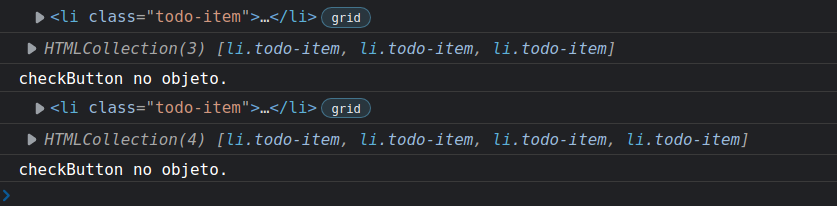
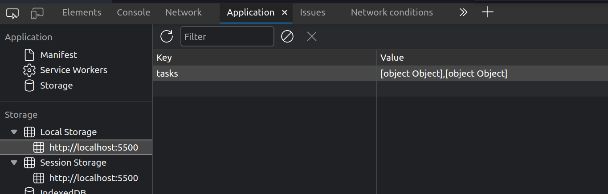

# SEÇÃO 10 - EXERCICIO PROPOSTO: LISTA DE TAREFAS

<br>

## Introdução

<br>

Agora como exercicio vamos construir uma `lista de tarefas`. A primeira coisa interessante que iremos fazer é o seguinte:

- Os dados que são criados, ou seja, as tarefas, estão sendo salvos pelo browser. Ou seja, se atualizarmos ou fecharmos o browser os dados nao serão perdidos.
- Conseguimos fazer isso usando um armazenamento local do browser chamado, `localStorage`.

Temos 3 tipos de armazenamentos locais: - `Cooks` - `Local Storage` - `Session Storage`

Por hora vamos utilizar o `local Storage` que so será "limpado" caso o usuario peça para isso.

Podemos excluir, editar e marcar como done, na nossa lista de tarefas, alem de adicionar novas tarefas.


<br>
<hr>
<br>

## Adicionar LI

<br>

A dica que temos para começarmos a construir nossa lista é, `baby steps` ou seja, vamos fazendo uma tarefa de cada vez. Coisas pequenas que podemos fazer para chegar ao resultado final.

- Podemos começar a fazer a implemetação de `adicionar` uma tarefa a lista de tarefas.
- No nossa html vamos comentar algumas linhas de codigo da nossa lista `ul` para podermos simplificar melhor o codigo e trabalharmos de forma simplificada, um passo de cada vez.

```
 <div class="todo-list__container">
    <ul id="todo-list">
        <li class="todo-item">
            <!-- <button class="button-check" title="checkBtn">
                <i class="fas fa-check displayNone"></i>
             </button> -->
            <p class="task-name">Example</p>
            <!-- <i class="fas fa-edit"></i>
            <i class="fas fa-trash-alt"></i>-->
        </li>
    </ul>
</div>
```

- A ideia é que ao digitar no `input` alguma coisa, e clicarmos no `botão add` seja acrescentado o que digitamos a uma `li` na lista de tarefas, ou seja, dentro da `ul`.
- Para isso, no javascript iremos criar constantes que referencie esses elementos do html para que a gente possa trabalhar com eles.
- Como estamos trabalhando de forma simplificada, vamos começar criando variaveis para o `input` e para o `formulario`.
- Criamos a constante para o `formulario` pois ao inves de incluirmos o evento no `botão adicionar` vamos inclui-lo no `submit` do formulario.

```
;(function(){

    const itemInput = document.getElementById("item-input");
    const todoAddForm = document.getElementById("todo-add");
})();
```

- Agora que ja temos a referencia , vamos criar um `event listener` para o nosso formulario.
- A função de callback do event listener receberá um `evento` como parametro para podermos utilizar o `.preventDefault()` que evita o comportamento padrão do formulario de enviar.
- Como precisamos criar uma `li`na nossa `ul` com o valor do `input` vamos ver como recuperar esse valor no console.log().

```
;(function(){

    const itemInput = document.getElementById("item-input");
    const todoAddForm = document.getElementById("todo-add");

    todoAddForm.addEventListener("submit", function(evt){
        e.preventDefault();
        console.log(itemInput.value);
    });
})();
```

- Agora precisamos criar uma `paragrafo` e uma `li`e incluir-los na nossa `ul` que iremos criar uma constante para referenciar.
- Para incluir a `li` na nossa `ul` vamos primeiramente utilizar o mais facil que seria o metodo `.innerHTML`, utilizando o `template string` para que o `itemInput.value` possa ser passado nessa `li` que iremos criar e colocar esse valor no lugar do `Example`

```
;(function(){

    const itemInput = document.getElementById("item-input");
    const todoAddForm = document.getElementById("todo-add");
    const ul = document.getElementById("todo-list");

    todoAddForm.addEventListener("submit", function(evt){
        e.preventDefault();
        console.log(itemInput.value);
        ul.innerHTML = `
            <li class="todo-item">
                <p class="task-name">${itemInput.value}</p>
            </li>
        `
    });
})();
```

- Porem, esse codigo que escrevemos acima, irá substituir o item que ja temos. Isso acontence pois o `innerHTML` esta definindo um `novo valor` na nossa `ul`.
- Para consertar esse `bug` temos que substituir o `=` por `+=`.

~~~
;(function(){

    const itemInput = document.getElementById("item-input");
    const todoAddForm = document.getElementById("todo-add");
    const ul = document.getElementById("todo-list");

    todoAddForm.addEventListener("submit", function(evt){
        e.preventDefault();
        console.log(itemInput.value);
        ul.innerHTML += `
            <li class="todo-item">
                <p class="task-name">${itemInput.value}</p>
            </li>
        `
    });
})();
~~~

- Agora ja temos a inclusão de todas as `lis` que criarmos.


<br>
<hr>
<br>

## Melhoria de Usabilidade
<br>

- Uma melhoria que podemos fazer é, quando incluirmos uma `task`, seria `limpar o input` e dar um foco no mesmo. 
- Para isso, apos incluir a task, setamos o `input` com uma string vazia, e colocamos o foco para o `input`.

~~~ 
;(function(){

    const itemInput = document.getElementById("item-input");
    const todoAddForm = document.getElementById("todo-add");
    const ul = document.getElementById("todo-list");

    todoAddForm.addEventListener("submit", function(evt){
        e.preventDefault();
        console.log(itemInput.value);
        ul.innerHTML += `
            <li class="todo-item">
                <p class="task-name">${itemInput.value}</p>
            </li>
        `
        itemInput.value = "";
        itemInput.focus();
    });
})();
~~~


<br>
<hr>
<br>

## Criar tarefa sem perder o Listener
<br>

Agora iremos mostrar no console sempre que clicarmos numa `li` para simular o evento de `click`.

- Vamos criar uma constante para as nossas `lis`. Essa constante será uma coleção de elementos do `tipo li`.

~~~ 
;(function(){

    const itemInput = document.getElementById("item-input");
    const todoAddForm = document.getElementById("todo-add");
    const ul = document.getElementById("todo-list");
    const lis = ul.getElementByTagName("li");

    todoAddForm.addEventListener("submit", function(evt){
        e.preventDefault();
        console.log(itemInput.value);
        ul.innerHTML += `
            <li class="todo-item">
                <p class="task-name">${itemInput.value}</p>
            </li>
        `
        itemInput.value = "";
        itemInput.focus();
    });
})();
~~~

- Agora queremos acrescentar um `listener` para cada uma dessas `lis`, porem não podemos criar um `event listener` diretamente na coleção, como vimos em aulas anteriores.
- Temos que percorrer cada uma das `lis` e acrescentar um `listener` individualmente.
- Poderiamos usar o `Array.from()`, o `spread operator` ou ate mesmo sintaxes mais antigas utilizando o loop normal, porem iremos usar o `spread operator` pela facilidade de escrita.
- 

~~~ 
;(function(){

    const itemInput = document.getElementById("item-input");
    const todoAddForm = document.getElementById("todo-add");
    const ul = document.getElementById("todo-list");
    const lis = ul.getElementByTagName("li");

    todoAddForm.addEventListener("submit", function(evt){
        e.preventDefault();
        console.log(itemInput.value);
        ul.innerHTML += `
            <li class="todo-item">
                <p class="task-name">${itemInput.value}</p>
            </li>
        `
        itemInput.value = "";
        itemInput.focus();
    });

    [...lis].forEach(element => {
        element.addEventListener("click", function(evt){
            console.log(this);
        });
    });

})();
~~~

- Agora se clicarmos na `li` existente ele irá nos mostrar o elemento referente no html, porem se criarmos outra `li` e tentarmos clicar nela, não irá funcionar e o evento de click do primeiro elemento tbm nao.
- O que esta acontencendo é que no codigo acima, estamos acrescentando o `event click` antes de acrescentar uma `li` nova.
- Isso acontence pq quando usarmos o `innerHTML +=` estamos `limpando` todos os elementos do DOM que estavam antes e acrescentando um novo. Logo, todo evento que tinhamos atrelado no DOM antes esta sendo sobrescrito.
- Ou seja, quando trabalhamos com `eventos` não podemos utilizar, nesse caso, o `innerHTML`, e sim os metodos que vimos em aulas passadas, `.createElement()`, `.appendChild()`...
- Vamos criar uma função chamada `addTask` que irá receber como parametro uma `string`. Dentro desta função iremos criar uma constante para receber a `li` que iremos criar usando o `.createElement()`.
  - Iremos tbm adicionar um `classe` para essa `li` que estamos criando chamada `todo-item`.
- Vamos tbm criar uma constante para receber um paragrafo `p` que iremos criar usando o `.taskContent` para adicionar a `task` que estamos recebendo como propriedade da função `addTask()`. Esse paragrafo tbm irá possuir um `class="task-name"`.

~~~
;(function(){

    const itemInput = document.getElementById("item-input");
    const todoAddForm = document.getElementById("todo-add");
    const ul = document.getElementById("todo-list");
    const lis = ul.getElementByTagName("li");

    function addTask(task){
        const li = document.createElement("li");
        li.className = "todo-item";
        const p = document.createElement("p");
        p.className = "task-name";
        p.textContent = task;
    }

    todoAddForm.addEventListener("submit", function(evt){
        e.preventDefault();
        console.log(itemInput.value);
        ul.innerHTML += `
            <li class="todo-item">
                <p class="task-name">${itemInput.value}</p>
            </li>
        `
        itemInput.value = "";
        itemInput.focus();
    });

    [...lis].forEach(element => {
        element.addEventListener("click", function(evt){
            console.log(this);
        });
    });

})();
~~~ 

- Agora que criamos a `li` e o `p`, temos que associar o `p` a `li` e o `li` a nossa `ul`.
- Apos feito isso, usamos a função dentro do `event listener` do formulario.

~~~
;(function(){

    const itemInput = document.getElementById("item-input");
    const todoAddForm = document.getElementById("todo-add");
    const ul = document.getElementById("todo-list");
    const lis = ul.getElementByTagName("li");

    function addTask(task){
        const li = document.createElement("li");
        li.className = "todo-item";
        const p = document.createElement("p");
        p.className = "task-name";
        p.textContent = task;
        li.appendChild(p);
        ul.appendChild(li);
    }

    todoAddForm.addEventListener("submit", function(evt){
        e.preventDefault();
        console.log(itemInput.value);
        
        addTask(itemInput.value);
        itemInput.value = "";
        itemInput.focus();
    });

    [...lis].forEach(element => {
        element.addEventListener("click", function(evt){
            console.log(this);
        });
    });

})();
~~~ 

- Feito essa função, o codigo funciona, porem se criarmos uma nova `li` e clicarmos nela, ainda não irá funcionar. Pois quando criamos nossa nova `li` não atribuimos um `evento` a ela.
- Temos que adicionar um `event listener` ao criar uma nova `li`.

~~~
;(function(){

    const itemInput = document.getElementById("item-input");
    const todoAddForm = document.getElementById("todo-add");
    const ul = document.getElementById("todo-list");
    const lis = ul.getElementByTagName("li");

    function addTask(task){
        const li = document.createElement("li");
        li.className = "todo-item";
        const p = document.createElement("p");
        p.className = "task-name";
        p.textContent = task;
        li.appendChild(p);
        ul.appendChild(li);

        li.addEventListener("click", function(){
            console.log(this);
        });
    }

    todoAddForm.addEventListener("submit", function(evt){
        e.preventDefault();
        console.log(itemInput.value);
        
        addTask(itemInput.value);
        itemInput.value = "";
        itemInput.focus();
    });

    [...lis].forEach(element => {
        element.addEventListener("click", function(evt){
            console.log(this);
        });
    });

})();
~~~ 

- Agora quando clicamos tanto na `task` existente, quanto nas novas, o `evento de click` funciona.

Vamos agora ver algumas diferenças entre o `this`, `this.textContent`, `this.innerHTML`, `this.outerHTML` e o `this.innerText`, lembrando que o `this` nesse caso se refere a `li`.

~~~ 
;(function(){

    const itemInput = document.getElementById("item-input");
    const todoAddForm = document.getElementById("todo-add");
    const ul = document.getElementById("todo-list");
    const lis = ul.getElementByTagName("li");

    function addTask(task){
        const li = document.createElement("li");
        li.className = "todo-item";
        const p = document.createElement("p");
        p.className = "task-name";
        p.textContent = task;
        li.appendChild(p);
        ul.appendChild(li);

        li.addEventListener("click", function(){
            console.log(this);
            console.log(this.textContent);
            console.log(this.innerText);
            console.log(this.innerHTML);
            console.log(this.outerHTML);

        });
    }

    todoAddForm.addEventListener("submit", function(evt){
        e.preventDefault();
        console.log(itemInput.value);
        
        addTask(itemInput.value);
        itemInput.value = "";
        itemInput.focus();
    });

    [...lis].forEach(element => {
        element.addEventListener("click", function(evt){
            console.log(this);
        });
    });

})();
~~~ 

- Nessa saida, temos o `.textContent` e o `.innerText` com o resultado bastante parecido, logo mais iremos ver a diferença entre eles.
- Ja o `.innerHTML` e o `.outerHTML` vemos na diferença que o `.innerHTML` é so o elemento de dentro do elemento de referencia, ja o `.outerHTML` mostra todo o elemento de referencia e seus filhos.
- A diferença entre o `.textContent` e o `.innerText` pode ser observada fazendo algumas alterações no nosso html. E colocando os `console.log()` dentro do event listener que ocorre assim que a pagina é carregada.

~~~ 
[HTML]
<ul id="todo-list">
    <li class="todo-item">
        <p class="task-name">Example - <b>teste negrito</b>
            <br>
            <em>teste italico</em>
        </p> 
    </li>
</ul>

[JAVASCRIPT]

;(function(){

    const itemInput = document.getElementById("item-input");
    const todoAddForm = document.getElementById("todo-add");
    const ul = document.getElementById("todo-list");
    const lis = ul.getElementByTagName("li");

    function addTask(task){
        const li = document.createElement("li");
        li.className = "todo-item";
        const p = document.createElement("p");
        p.className = "task-name";
        p.textContent = task;
        li.appendChild(p);
        ul.appendChild(li);

        li.addEventListener("click", function(){
            console.log(this);
            console.log(this.textContent);
            console.log(this.innerText);
            console.log(this.innerHTML);
            console.log(this.outerHTML);

        });
    }

    todoAddForm.addEventListener("submit", function(evt){
        e.preventDefault();
        console.log(itemInput.value);
        
        addTask(itemInput.value);
        itemInput.value = "";
        itemInput.focus();
    });

    [...lis].forEach(element => {
        element.addEventListener("click", function(evt){
            console.log(this);
            console.log(this.textContent);
            console.log(this.innerText);
            console.log(this.innerHTML);
            console.log(this.outerHTML);
        });
    });
})();
~~~


- Vejam que a diferença esta quando recuperamos o valor, no `.textContet` o valor é recuperado juntamente com os `espaços e quebras de linhas`, ja com o `.innerText` temos somente o valor de texto que temos no elemento.

~~~
;(function(){

    const itemInput = document.getElementById("item-input");
    const todoAddForm = document.getElementById("todo-add");
    const ul = document.getElementById("todo-list");
    const lis = ul.getElementByTagName("li");

    function addTask(task){
        const li = document.createElement("li");
        li.className = "todo-item";
        const p = document.createElement("p");
        p.className = "task-name";
        p.textContent = task;
        li.appendChild(p);
        ul.appendChild(li);

        li.addEventListener("click", function(){
            console.log(this);
            console.log(this.textContent);
            console.log(this.innerText);
            console.log(this.innerHTML);
            console.log(this.outerHTML);

        });
    }

    todoAddForm.addEventListener("submit", function(evt){
        e.preventDefault();
        console.log(itemInput.value);
        
        addTask(itemInput.value);
        itemInput.value = "";
        itemInput.focus();
    });

    [...lis].forEach(element => {
        element.addEventListener("click", function(evt){
            console.log(this);
            console.log(this.textContent);
            console.log(this.innerText);
            console.log(this.innerHTML);
            console.log(this.outerHTML);
        });
    });
})();
~~~

<br>
<hr>
<br>

## Melhoria: Reaproveitar o codigo
<br>

Vamos fazer algumas melhorias. Por exemplo, na criação de `listener` das `lis` temos um codigo duplicado.

- Para isso iremos criar uma função externa que irá rodar o codigo que esta sendo duplicado, que seria na função de callback.
- Iremos criar uma função chamada `addEventLi()` que irá receber uma `li` por parametro e dentro da função iremos adicionar os `event listener`.

~~~
;(function(){

    const itemInput = document.getElementById("item-input");
    const todoAddForm = document.getElementById("todo-add");
    const ul = document.getElementById("todo-list");
    const lis = ul.getElementByTagName("li");

    function addEventLi(li){
        li.addEventListener("click", function(){
            console.log(this);
            console.log(this.textContent);
            console.log(this.innerText);
            console.log(this.innerHTML);
            console.log(this.outerHTML);

        });
    }

    function addTask(task){
        const li = document.createElement("li");
        li.className = "todo-item";
        const p = document.createElement("p");
        p.className = "task-name";
        p.textContent = task;
        li.appendChild(p);
        ul.appendChild(li);

    }

    todoAddForm.addEventListener("submit", function(evt){
        e.preventDefault();
        console.log(itemInput.value);
        
        addTask(itemInput.value);
        itemInput.value = "";
        itemInput.focus();
    });

    [...lis].forEach(li => {
        addEventLi(li);
    });
})();
~~~

<br>
<hr>
<br>

## Consumir uma estrutura de dados
<br>

Agora iremos fazer uma alteração para não termos nenhum tipo de html dentro da nossa `ul`, ou seja, vamos excluir a `li` existente.

~~~
[HTML]

<div class="todo-list__container">
    <ul id="todo-list">
        
    </ul>
</div>
~~~

- Vamos gerar as `lis` dinamicamente dependendo de uma `estrutura de dados` que iremos criar. Essa estrutura poderia ser um `array de objetos` por exemplo, ja que temos uma lista de tarefas.
- Vamos chamar nossa array de tarefas de `arrTasks`, essa array irá ser uma `array de objetos` que irá representar uma tarefa a ser executada.
- Esse objeto terá algumas propriedades:
  - `name: "task 1"`
  - `createdAt: Date.now()` -> Vamos utilizar um metodo estatico do objeto `Date` que irá nos trazer o `timestamp` que representa o numero de milisegundos passados desde o dia `1 jan 1970`.
  - `completed: false`

~~~
;(function(){

    const itemInput = document.getElementById("item-input");
    const todoAddForm = document.getElementById("todo-add");
    const ul = document.getElementById("todo-list");
    const lis = ul.getElementByTagName("li");

    let arrTasks = [
        { name: "task 1", createAt: Date.now(), completed: false},
    ];

    function addEventLi(li){
        li.addEventListener("click", function(){
            console.log(this);
        });
    }

    function addTask(task){
        const li = document.createElement("li");
        li.className = "todo-item";
        const p = document.createElement("p");
        p.className = "task-name";
        p.textContent = task;
        li.appendChild(p);
        ul.appendChild(li);

    }

    todoAddForm.addEventListener("submit", function(evt){
        e.preventDefault();
        console.log(itemInput.value);
        
        addTask(itemInput.value);
        itemInput.value = "";
        itemInput.focus();
    });

    [...lis].forEach(li => {
        addEventLi(li);
    });
})();
~~~

- Apos criarmos a estrutura de dados, vamos atraves dela, gerar as `lis` a partir desse array de objetos `arrTasks` e depois inserir as `lis` na tela.
- Vamos pensar, temos uma função chamada `addTask` que será chamada quando enviamos o formulario, dentro dela é gerado uma `li` e um `p` que será adicionado a nossa `ul`.
- Temos o evento de `submit` do formulario que chama a função acima.
- Depois dentro de cada `li` adicionamos o evento usando o codigo com o `spread operator`.
- A primeira coisa que iremos mudar depois de construirmos a estrutura de dados será a constante `lis` na qual usamos o `spread operator` pois não teremos mais uma coleção de `lis` na interface grafica.
- Ao invez de fazermos o `loop` em um `array de lis`, vamos fazer o loop em `arrTasks`

~~~ 
;(function(){

    const itemInput = document.getElementById("item-input");
    const todoAddForm = document.getElementById("todo-add");
    const ul = document.getElementById("todo-list");
    const lis = ul.getElementByTagName("li");

    let arrTasks = [
        { name: "task 1", createAt: Date.now(), completed: false},
    ];

    function addEventLi(li){
        li.addEventListener("click", function(){
            console.log(this);
        });
    }

    function addTask(task){
        const li = document.createElement("li");
        li.className = "todo-item";
        const p = document.createElement("p");
        p.className = "task-name";
        p.textContent = task;
        li.appendChild(p);
        ul.appendChild(li);

    }

    todoAddForm.addEventListener("submit", function(evt){
        e.preventDefault();
        console.log(itemInput.value);
        
        addTask(itemInput.value);
        itemInput.value = "";
        itemInput.focus();
    });

    arrTasks.forEach(task => {
        
    });
})();
~~~

- Iremos fazer o loop na nossa estrutura de dados, e para cada `iteração` iremos gerar uma `li` com base na nossa estrutura de dados.
- Porem, como iremos gerar a nossa `li` se o codigo que a gera esta dentro da função `addTask`?
- Teremos que separar essa funções criando uma outra função chamada `generateLiTask()`, essa função irá receber um `objeto`, e dentro desta função iremos colocar o codigo que temos na função `addTask()` no final retornando a `li` gerada.
 
~~~ 
;(function(){

    const itemInput = document.getElementById("item-input");
    const todoAddForm = document.getElementById("todo-add");
    const ul = document.getElementById("todo-list");
    const lis = ul.getElementByTagName("li");

    let arrTasks = [
        { name: "task 1", createAt: Date.now(), completed: false},
    ];

    function addEventLi(li){
        li.addEventListener("click", function(){
            console.log(this);
        });
    }

    function generateLiTask(obj){
        const li = document.createElement("li");
        li.className = "todo-item";
        const p = document.createElement("p");
        p.className = "task-name";
        p.textContent = task;
        li.appendChild(p);
        ul.appendChild(li);

        return li;
    }

    function addTask(task){
        

    }

    todoAddForm.addEventListener("submit", function(evt){
        e.preventDefault();
        console.log(itemInput.value);
        
        addTask(itemInput.value);
        itemInput.value = "";
        itemInput.focus();
    });

    arrTasks.forEach(task => {
        
    });
})();
~~~

- Na função `addTask` quando for chamada, ela irá acrescentar a `task` que estamos criando em `generateLiTask` dentro do nosso `arrTask` e vamos chamar uma função que a partir desses dados irá renderizar as `lis` na tela.
- Vamos utilizar o metodo `.push()` para acrescentar um objeto que possui como propriedades `name,createAt e completed`. Porem no lugar do `name` iremos passar a propriedade recebida pela função, no caso, `task`.

~~~ 
;(function(){

    const itemInput = document.getElementById("item-input");
    const todoAddForm = document.getElementById("todo-add");
    const ul = document.getElementById("todo-list");
    const lis = ul.getElementByTagName("li");

    let arrTasks = [
        { name: "task 1", createAt: Date.now(), completed: false},
    ];

    function addEventLi(li){
        li.addEventListener("click", function(){
            console.log(this);
        });
    }

    function generateLiTask(obj){
        const li = document.createElement("li");
        li.className = "todo-item";
        const p = document.createElement("p");
        p.className = "task-name";
        p.textContent = task;
        li.appendChild(p);
        ul.appendChild(li);

        return li;
    }

    function addTask(task){
        arrTask.push({
            name: task,
            createAt: Date.now(),
            completed: false,
        });
    }

    todoAddForm.addEventListener("submit", function(evt){
        e.preventDefault();
        console.log(itemInput.value);
        
        addTask(itemInput.value);
        itemInput.value = "";
        itemInput.focus();
    });

    arrTasks.forEach(task => {
        
    });
})();
~~~

- Agora vamos criar uma função que será responsavel por `olhar` a array `arrTasks` e gerar as `lis` e inclui-las na nossa `lista`. 
- Logo iremos remover o codigo `ul.appendChild()` da função `generateLiTasks()` e coloca-la dentro desta função que será responsavel por renderizar na tela as `lis` que foram devolvidas por essa `generateLiTasks()`.
- O nome da função que irá fazer tudo isso será `renderTasks()`, essa função depende da `arrTasks`, que poderiamos passar para a função como parametro, porem como ela ja esta dentro do escopo da função, vamos chama-la diretamente.
- Vamos tbm limpar nossa `lista=ul` atribuindo um valor de `string vazia`.
- Dentro da função iremos colocar o `.forEach()` que irá selecionar cada tarefa da `arrTasks` e adicionar dentro da nossa `ul` as `lis` criadas dentro da função `generateLiTasks()` passando como parametro para a função de generate a `task` que é um objeto.

~~~ 
;(function(){

    const itemInput = document.getElementById("item-input");
    const todoAddForm = document.getElementById("todo-add");
    const ul = document.getElementById("todo-list");
    const lis = ul.getElementByTagName("li");

    let arrTasks = [
        { name: "task 1", createAt: Date.now(), completed: false},
    ];

    function addEventLi(li){
        li.addEventListener("click", function(){
            console.log(this);
        });
    }

    function generateLiTask(obj){
        const li = document.createElement("li");
        li.className = "todo-item";
        const p = document.createElement("p");
        p.className = "task-name";
        p.textContent = task;
        li.appendChild(p);
        ul.appendChild(li);

        return li;
    }

    function renderTasks(){
        ul.innerHTML = "";
        arrTasks.forEach(task => {
            ul.appendChild(generateLiTask(task));
        });
    }

    function addTask(task){
        arrTask.push({
            name: task,
            createAt: Date.now(),
            completed: false,
        });
    }

    todoAddForm.addEventListener("submit", function(evt){
        e.preventDefault();
        console.log(itemInput.value);
        
        addTask(itemInput.value);
        itemInput.value = "";
        itemInput.focus();
    });
})();
~~~

- O codigo acima ainda não funciona, pois a nossa função `generateLiTask()` antes recebia um parametro `task` que era uma string, porem agora ela recebe um objeto no lugar.


- Tanto que se colocarmos um `debbuger` e chamarmos no `console` o parametro `obj` teremos na saida o `objeto`.

.

- Logo para o codigo funcionar, em vez de `task` colocamos o `obj.name`.

~~~
;(function(){

    "use strict";

    // armazenar o DOM em variaveis
    const itemInput = document.getElementById("item-input"); // input
    const todoAddForm = document.getElementById("todo-add"); // formulario
    const ul  = document.getElementById("todo-list");
    //const lis = ul.getElementsByTagName("li"); // coleção de todas as lis do html

    let arrTasks = [
        { 
            name: "task 1",
            createAt: Date.now(),
            completed: false
        }
    ];

    // criando função para adicionar evento a uma li
    function addEventLi(li){
        li.addEventListener("click", function(){
            console.log(this);
            console.log(this.textContent);
            console.log(this.innerText);
            console.log(this.innerHTML);
            console.log(this.outerHTML);
        });
    }

    // função para gerar lis
    function generateLiTask(obj){
        // debugger;
        const li = document.createElement("li");
        li.className = "todo-item";
        const p = document.createElement("p");
        p.className = "task-name";
        p.textContent = obj.name;
        li.appendChild(p);
        addEventLi(li);
        return li;
    }

    // função para renderizar as lis/tasks
    function renderTasks(){
        ul.innerHTML = "";
        arrTasks.forEach(task => {
            ul.appendChild(generateLiTask(task));
        });
    };

    // criando função para adicionar tasks
    function addTask(task){
        arrTasks.push({
            name: task,
            createAt: Date.now(),
            completed: false
        });
    };

    // event listener forms
    todoAddForm.addEventListener("submit", function(evt){
        evt.preventDefault();

        addTask(itemInput.value);   

        itemInput.value = ""; // resetando o input
        itemInput.focus(); //  gerando foco para o input
    });
    
    renderTasks();

})();
~~~

- Porem agora quando pedimos para adicionar na lista uma nova tarefa, ainda não funciona. Pois apesar de adicionarmos no `arrTasks` usando a função `addTasks`, não refletimos a mudança na nossa `ul`.
- Logo sempre que atualizarmos nossa array `arrTasks` precisamos solicitar que haja o `refresh/atualização` dos dados na tela, chamando a função `renderTasks()` que criamos.
- Para isso basta adicionar a chamada da função `renderTasks()` dentro da função de adicionar `task` no array.

~~~
// criando função para adicionar tasks
function addTask(task){
    arrTasks.push({
        name: task,
        createAt: Date.now(),
        completed: false
    });
    renderTasks();
};
~~~

- Agora o codigo esta funcionando normalmente usando uma estrutura de dados.

> RECAPITULANDO:
>
> 1) Criamos uma estrutura de dados (array) que irá armazenar `objetos`.
> 2) Cada `objeto` representa uma `tarefa` com 3 propriedades (`name`,`createAt`,`completed`).
> 3) Temos uma função `addEventLi()` que recebe uma `li` como parametro e adiciona um evento de `click` para cada `li` criada.
> 4) Depois temos uma função chamada `generateLiTask()` que recebe um `objeto` como parametro, que é exatamente o objeto que criamos dentro de `arrTask`, e irá retornar uma `li` onde incluimos um `p`, `classes` e o `nome da task`, depois vinculando esses dados gerados a nossa `ul`.
> 5) A função `renderTasks()` ira `limpar` nossa `ul`, e depois irá acrescentar as `lis` novamente dependendo do resultado da função `generateLiTasks()`. Ou seja, para cada objeto de `arrTasks` irá ser gerado uma `li` a partir do objeto e depois usamos o `ul.appendChild()` para vincular a `li` gerada a nossa `ul`.
> 6) A função, `addTask()` adiciona uma `task` a nossa `array de objetos = arrTasks`.
> 7) Depois temos o `event listener` de `submit` em nosso formulario, que dentro desse evento, ao submeter, iremos criar uma objeto novo usando o `addTask()` passando como parametro para essa função o `itemInput.value`, e apos essa adição de nova tarefa, atualizamos a tela usando a chamada da função `renderTasks()` que criamos. Apos a atualização da tela eh feito a "limpeza" do `input` e adicionado `foco` ao mesmo.
> 8) No final do codigo chamamos a função `renderTasks()` novamente para que na primeira vez que o codigo seja rodado ela ja atualize. Por exmeplo, se criarmos outro objeto no nosso array `arrTasks` esse objeto so irá aparecer de primeira, ou seja, primeira execução do codigo, se tivermos a chamada da função.

~~~
;(function(){

    "use strict";

    // armazenar o DOM em variaveis
    const itemInput = document.getElementById("item-input"); // input
    const todoAddForm = document.getElementById("todo-add"); // formulario
    const ul  = document.getElementById("todo-list");
    //const lis = ul.getElementsByTagName("li"); // coleção de todas as lis do html

    let arrTasks = [
        { 
            name: "Task 1",
            createAt: Date.now(),
            completed: false
        },
        { 
            name: "Task 2",
            createAt: Date.now(),
            completed: false
        }
    ];

    // criando função para adicionar evento a uma li
    function addEventLi(li){
        li.addEventListener("click", function(){
            console.log(this);
        });
    }

    // função para gerar lis
    function generateLiTask(obj){
        // debugger;
        const li = document.createElement("li");
        li.className = "todo-item";
        const p = document.createElement("p");
        p.className = "task-name";
        p.textContent = obj.name;
        li.appendChild(p);
        addEventLi(li);
        return li;
    }

    // função para renderizar as lis/tasks
    function renderTasks(){
        ul.innerHTML = "";
        arrTasks.forEach(taskObj => {
            ul.appendChild(generateLiTask(taskObj));
        });
    };

    // criando função para adicionar tasks
    function addTask(task){
        arrTasks.push({
            name: task,
            createAt: Date.now(),
            completed: false
        });
    };

    // event listener forms
    todoAddForm.addEventListener("submit", function(evt){
        evt.preventDefault();

        addTask(itemInput.value);   
        renderTasks();
        itemInput.value = ""; // resetando o input
        itemInput.focus(); //  gerando foco para o input

    });
    
    renderTasks();

})();
~~~

<br>
<hr>
<br>

## Incrementar o DOM
<br>

Agora iremos representar a seguinte estrutura de DOM na nossa função `generateLiTasks()`.

~~~
[HTML]

<li class="todo-item">
    <button class="button-check" title="checkBtn">
        <i class="fas fa-check displayNone"></i>
    </button>
    <p class="task-name">Example</p>
    <i class="fas fa-edit"></i>
    <i class="fas fa-trash-alt"></i>
</li>

[JAVASCRIPT]

// função para gerar lis
function generateLiTask(obj){
    // debugger;
    const li = document.createElement("li");
    li.className = "todo-item";
    const p = document.createElement("p");
    p.className = "task-name";
    p.textContent = obj.name;
    li.appendChild(p);
    addEventLi(li);
    return li;
}
~~~

- Vamos criar todos os objetos nas primeiras linhas da função.
- Precisamos alem do `li` e `p`que ja foram criados, um `botão` com a classe `button-check`, depois uma tag `i` com a classe `fas fa-check displayNone`, e e depois mais duas tags `i` com as classes respectivamente `fas fa-edit` e `fas fa-trash-alt`.
- Vamos criar esses objetos todos e usar o `li.appendChild()` para vincula-los a nossa `li`.
- Vamos primeiramente criar o `botão`, criando uma constante para recebe-lo chamada `checkButton`.
- Depois iremos criar uma outra constante que receberá a tag `i`. O mesmo será feito para o botão de deletar.

~~~
// função para gerar lis
function generateLiTask(obj){
    // debugger;
    const li = document.createElement("li");
    const p = document.createElement("p");
    const checkButton = document.createElement("button");
    const editButton = document.createElement("i");
    const deleteButton = document.createElement("i");

    li.className = "todo-item";
    p.className = "task-name";
    p.textContent = obj.name;
    li.appendChild(p);
    addEventLi(li);
    return li;
}
~~~

- No primeiro botão, temos dentro do mesmo uma `tag i ` que seria o checkbox da `task`.
- Primeiramente iremos criar a `classe` desse botão, usando ou o `className`ou o `classList.ad()`, porem como estamos criando do zero, vamos usar o `.className = "button-check"`.
- Para adicionar a `tag i ` poderiamos criar um outro elemento usando a constante, porem nesse caso iremos utilizar por enquanto o `.innerHTML`.

~~~
// função para gerar lis
function generateLiTask(obj){
    // debugger;
    const li = document.createElement("li");
    const p = document.createElement("p");
    const checkButton = document.createElement("button");
    const editButton = document.createElement("i");
    const deleteButton = document.createElement("i");

    li.className = "todo-item";

    checkButton.className = "button-check";
    checkButton.innerHTML = `
        <i class="fas fa-check displayNone"></i>
    `;

    p.className = "task-name";
    p.textContent = obj.name;
    li.appendChild(p);
    addEventLi(li);
    return li;
}
~~~

- Agora que ja temos o nosso `check button` iremos antes do `p` adiciona-lo na `li`.

~~~
// função para gerar lis
function generateLiTask(obj){
    // debugger;
    const li = document.createElement("li");
    const p = document.createElement("p");
    const checkButton = document.createElement("button");
    const editButton = document.createElement("i");
    const deleteButton = document.createElement("i");

    li.className = "todo-item";

    checkButton.className = "button-check";
    checkButton.innerHTML = `
        <i class="fas fa-check displayNone"></i>
    `;

    li.appendChild(checkButton);

    p.className = "task-name";
    p.textContent = obj.name;
    li.appendChild(p);
    addEventLi(li);
    return li;
}
~~~

- Agora ja temos o `botão` e o `paragrafo` com o `task-name`. Vamos agora criar as outras duas `i` que temos adicionando elas a `li` depois da tag `p` que criamos.
- Primeiro adicionamos as classes as tags. Para relembrar vamos utilizar em um deles o `.classList.add()`. Como nessa classe temos mais de uma string, temos que separa-la dentro de `.add("fas","fa-trash-alt");`

~~~
function generateLiTask(obj){
    // debugger;
    const li = document.createElement("li");
    const p = document.createElement("p");
    const checkButton = document.createElement("button");
    const editButton = document.createElement("i");
    const deleteButton = document.createElement("i");

    li.className = "todo-item";

    checkButton.className = "button-check";
    checkButton.innerHTML = `
        <i class="fas fa-check displayNone"></i>
    `;

    li.appendChild(checkButton);

    p.className = "task-name";
    p.textContent = obj.name;
    li.appendChild(p);

    editButton.className = "fas fa-edit";
    li.appendChild(editButton);
    deleteButton.classList.add("fas","fa-trash-alt");
    li.appendChild(deleteButton);

    addEventLi(li);
    return li;
}
~~~

- Como o elemento que estamos criando não existe no html, ou seja, nao teria uma classe dentro desse elemento pre-existente, é preferivel utilizar o `.className`.

~~~ 
function generateLiTask(obj){
    // debugger;
    const li = document.createElement("li");
    const p = document.createElement("p");
    const checkButton = document.createElement("button");
    const editButton = document.createElement("i");
    const deleteButton = document.createElement("i");

    li.className = "todo-item";

    checkButton.className = "button-check";
    checkButton.innerHTML = `
        <i class="fas fa-check displayNone"></i>
    `;

    li.appendChild(checkButton);

    p.className = "task-name";
    p.textContent = obj.name;
    li.appendChild(p);

    editButton.className = "fas fa-edit";
    li.appendChild(editButton);
    deleteButton.className = "fas","fa-trash-alt";
    li.appendChild(deleteButton);

    addEventLi(li);
    return li;
}
~~~

- Terminamos a parte do DOM, onde agora temos nossa `li` gerada dinamicamente pelo javascript juntamente com seus respectivos elementos internos.
  

<br>
<hr>
<br>

## criar editContainer
<br>

Criamos um html que será gerado dinamicamente que servirá como a caixa de `edição` da task, ou seja, nosso html de `li` ficará da seguinte maneira, porem será gerado dinamicamente.

~~~
[HTML]
<li class="todo-item">
    <button class="button-check">
        <i class="fas fa-check displayNone"></i>
    </button>
    <p class="task-name">Example</p>
    <i class="fas fa-edit"></i>
    <div class="editContainer">
        <input class="editInput" type="text">
        <button class="editButton">Edit</button>
        <button class="cancelButton">Cancel</button>
    </div>
    <i class="fas fa-trash-alt"></i>
</li>
~~~

- Vamos criar todo esse `container de edição` primeiro, juntamente com seus elementos, antes de adiona-lo a nossa `li`.
- Vamos primeiramente criar uma constante `containerEdit` que irá receber a `div` que iremos criar colocando a classe nessa variavel.
- Agora criamos uma constante `inputEdit` para receber o elemento de `input`que iremos criar. Nesse `input` temos alguns parametros (atributo e classe) que iremos precisar adicionar a ele usando o `.setAttribute()`.
- Apos criarmos esse elemento, adicionamos ele a nossa `div container`.


~~~
// função para gerar lis
function generateLiTask(obj){
    // debugger;
    const li = document.createElement("li");
    const p = document.createElement("p");
    const checkButton = document.createElement("button");
    const editButton = document.createElement("i");
    const deleteButton = document.createElement("i");
    const containerEdit = document.createElement("div");
    const inputEdit = document.createElement("input");

    li.className = "todo-item";

    checkButton.className = "button-check";
    checkButton.innerHTML = `
        <i class="fas fa-check displayNone"></i>
    `;

    li.appendChild(checkButton);

    p.className = "task-name";
    p.textContent = obj.name;
    li.appendChild(p);

    editButton.className = "fas fa-edit";
    li.appendChild(editButton);

    containerEdit.className = "editContainer";
    inputEdit.setAttribute("type", "text");
    inputEdit.className = "editInput";
    containerEdit.appendChild(inputEdit);

    deleteButton.className = "fas fa-trash-alt";
    li.appendChild(deleteButton);

    addEventLi(li);
    return li;
}
~~~

- Vamos agora fazer a criação dos botões com as classes `editButton` e `cancelButton`.
- Criamos anteriormente uma constante chamada `editButton` porem ele se refere ao botão de edição que vemos ao lado da lixeira, ou seja, o botão que ao ser clicado irá chamar a nossa `div container` que possui um outro botão de `edição`dentro da mesma. Vamos ter que utilizar para esse botão de edição interno um outro nome, no caso, `containerEditButton`.
- Para ele iremos criar uma classe chamada `editButton` e o texto que irá aparecer `edit` e logo depois adicionar esse elemento na nossa `div container`.


~~~
// função para gerar lis
function generateLiTask(obj){
    // debugger;
    const li = document.createElement("li");
    const p = document.createElement("p");
    const checkButton = document.createElement("button");
    const editButton = document.createElement("i");
    const deleteButton = document.createElement("i");
    const containerEdit = document.createElement("div");
    const inputEdit = document.createElement("input");
    const containerEditButton = document.createElement("button");
    const containerCancelButton = document.createElement("button");

    li.className = "todo-item";

    checkButton.className = "button-check";
    checkButton.innerHTML = `
        <i class="fas fa-check displayNone"></i>
    `;

    li.appendChild(checkButton);

    p.className = "task-name";
    p.textContent = obj.name;
    li.appendChild(p);

    editButton.className = "fas fa-edit";
    li.appendChild(editButton);

    containerEdit.className = "editContainer";
    inputEdit.setAttribute("type", "text");
    inputEdit.className = "editInput";
    containerEdit.appendChild(inputEdit);
    containerEditButton.className = "editButton";
    containerEditButton.textContent = "Edit";
    containerEdit.appendChild(containerEditButton);
    containerCancelButton.className = "cancelButton";
    containerEditButton.textContent = "Cancel";
    containerEdit.appendChild(containerCancelButton);

    deleteButton.className = "fas fa-trash-alt";
    li.appendChild(deleteButton);

    addEventLi(li);
    return li;
}
~~~

- Depois criado a nossa `div container` de edição, temos que vincula-la a nossa `li`.

~~~
// função para gerar lis
function generateLiTask(obj){
    // debugger;
    const li = document.createElement("li");
    const p = document.createElement("p");
    const checkButton = document.createElement("button");
    const editButton = document.createElement("i");
    const deleteButton = document.createElement("i");
    const containerEdit = document.createElement("div");
    const inputEdit = document.createElement("input");
    const containerEditButton = document.createElement("button");
    const containerCancelButton = document.createElement("button");

    li.className = "todo-item";

    checkButton.className = "button-check";
    checkButton.innerHTML = `
        <i class="fas fa-check displayNone"></i>
    `;

    li.appendChild(checkButton);

    p.className = "task-name";
    p.textContent = obj.name;
    li.appendChild(p);

    editButton.className = "fas fa-edit";
    li.appendChild(editButton);

    containerEdit.className = "editContainer";

    inputEdit.setAttribute("type", "text");
    inputEdit.className = "editInput";
    containerEdit.appendChild(inputEdit);

    containerEditButton.className = "editButton";
    containerEditButton.textContent = "Edit";
    containerEdit.appendChild(containerEditButton);

    containerCancelButton.className = "cancelButton";
    containerEditButton.textContent = "Cancel";
    containerEdit.appendChild(containerCancelButton);

    li.appendChild(containerEdit);

    deleteButton.className = "fas fa-trash-alt";
    li.appendChild(deleteButton);

    addEventLi(li);
    return li;
}
~~~


- Por enquanto na renderização do browser não iremos ver os elementos que criamos, mas na aba `elements` podemos ver que ja foi adicionado ao nosso html esses elementos.
- A ideia é que quando clicarmos no `botão de edição`, pegamos a partir da `li` selecionada o `editContainer` e adicionamos o `display:flex`para que esse container apareça no browser e quando clicarmos no `btn cancel` removemos esse `display:flex`. 

<br>
<hr>
<br>

## Aplicar delegação de eventos
<br>

Vamos agora tratar de alguns eventos, temos um ja criado na nossa `li` porem foi so para demonstração sobre o `.innerHTML`, vamos precisar criar eventos para o `checkbox`, para o `edit` e para o `trash`. Onde nao clicar no `botão de edição` iremos abrir uma janela que terá mais dois `botões` que tbm precisaram de eventos `edit = salva a edição` e o `cancel = cancela a edição`.

Ou seja, para cada `li` que gerarmos teremos `5 eventos de click`. Como podemos ter mais de 100 `lis` vamos, como boa-pratica, utilizar um conceito que ja vimos, que seria a `delegação de eventos`, pois assim teremos apenas um unico `listener` aplicado ao evento de `click` onde dependendo do elemento selecionado iremos gerar uma ação.

- A primeira coisa que iremos fazer será remover a função que add um evento de `click` em nossas `lis` ou seja, a função `addEventLi()`.
- Agora iremos criar um `evento de click` na nossa `ul` inteira. Esse evento irá chamar uma função que iremos criar chamada `clickedUL()`.
- Vamos ver essa função no console, sabemos que o `this` dessa função será a propria `ul`, porem se usamos o console para ver o `e.target`, ele irá mudar de acordo com o local que clicarmos.

~~~
;(function(){

    "use strict";

    // armazenar o DOM em variaveis
    const itemInput = document.getElementById("item-input"); // input
    const todoAddForm = document.getElementById("todo-add"); // formulario
    const ul  = document.getElementById("todo-list");
    //const lis = ul.getElementsByTagName("li"); // coleção de todas as lis do html

    let arrTasks = [
        { 
            name: "Task 1",
            createAt: Date.now(),
            completed: false
        },
        { 
            name: "Task 2",
            createAt: Date.now(),
            completed: false
        }
    ];

    // criando função para adicionar evento a uma li
    // function addEventLi(li){
    //     li.addEventListener("click", function(){
    //         console.log(this);
    //     });
    // }

    // função para gerar lis
    function generateLiTask(obj){
        // debugger;
        const li = document.createElement("li");
        const p = document.createElement("p");
        const checkButton = document.createElement("button");
        const editButton = document.createElement("i");
        const deleteButton = document.createElement("i");
        const containerEdit = document.createElement("div");
        const inputEdit = document.createElement("input");
        const containerEditButton = document.createElement("button");
        const containerCancelButton = document.createElement("button");

        li.className = "todo-item";

        checkButton.className = "button-check";
        checkButton.innerHTML = `
            <i class="fas fa-check displayNone"></i>
        `;

        li.appendChild(checkButton);

        p.className = "task-name";
        p.textContent = obj.name;
        li.appendChild(p);

        editButton.className = "fas fa-edit";
        li.appendChild(editButton);

        containerEdit.className = "editContainer";

        inputEdit.setAttribute("type", "text");
        inputEdit.className = "editInput";
        containerEdit.appendChild(inputEdit);

        containerEditButton.className = "editButton";
        containerEditButton.textContent = "Edit";
        containerEdit.appendChild(containerEditButton);

        containerCancelButton.className = "cancelButton";
        containerEditButton.textContent = "Cancel";
        containerEdit.appendChild(containerCancelButton);

        li.appendChild(containerEdit);

        deleteButton.className = "fas fa-trash-alt";
        li.appendChild(deleteButton);

        // addEventLi(li);
        return li;
    }

    // função para renderizar as lis/tasks
    function renderTasks(){
        ul.innerHTML = "";
        arrTasks.forEach(taskObj => {
            ul.appendChild(generateLiTask(taskObj));
        });
    };

    // criando função para adicionar tasks
    function addTask(task){
        arrTasks.push({
            name: task,
            createAt: Date.now(),
            completed: false
        });
    };
    
    function clickedUL(evt){
        console.log(evt.target);
    }

    // event listener forms
    todoAddForm.addEventListener("submit", function(evt){
        evt.preventDefault();

        addTask(itemInput.value);   
        renderTasks();
        itemInput.value = ""; // resetando o input
        itemInput.focus(); //  gerando foco para o input

    });

    ul.addEventListener("click", clickedUL);
    
    renderTasks();

})();
~~~


- Observe que agora sempre que clicarmos na `ul` será mostrado o elemento ao qual ele recebeu o click.
- Vamos fazer uma verificação nessa função `clickedUL()` para dependendo do elemento que foi clicado criaremos uma ação.
- Para não usamos as classes como referencia (podem mudar no futuro), vamos nos elementos que irão receber o click, criar um `atributo` e esse atributo será chamado de `data-action`. 
  - No `checkButton` vamos criar um atributo usando `.setAttribute()` chamado `data-action` que irá receber como valor `checkButton`.
- Iremos fazer o mesmo principio acima para os elementos que serão clicados.


~~~
// função para gerar lis
function generateLiTask(obj){
    // debugger;
    const li = document.createElement("li");
    const p = document.createElement("p");
    const checkButton = document.createElement("button");
    const editButton = document.createElement("i");
    const deleteButton = document.createElement("i");
    const containerEdit = document.createElement("div");
    const inputEdit = document.createElement("input");
    const containerEditButton = document.createElement("button");
    const containerCancelButton = document.createElement("button");

    li.className = "todo-item";

    checkButton.className = "button-check";
    checkButton.innerHTML = `
        <i class="fas fa-check displayNone"></i>
    `;
    checkButton.setAttribute("data-action", "checkButton");

    li.appendChild(checkButton);

    p.className = "task-name";
    p.textContent = obj.name;
    li.appendChild(p);

    editButton.className = "fas fa-edit";
    editButton.setAttribute("data-action", "editButton");
    li.appendChild(editButton);

    containerEdit.className = "editContainer";

    inputEdit.setAttribute("type", "text");
    inputEdit.className = "editInput";
    containerEdit.appendChild(inputEdit);

    containerEditButton.className = "editButton";
    containerEditButton.textContent = "Edit";
    containerEditButton.setAttribute("data-action", "containerEditButton");
    containerEdit.appendChild(containerEditButton);

    containerCancelButton.className = "cancelButton";
    containerCancelButton.textContent = "Cancel";
    containerCancelButton.setAttribute("data-action", "containerCancelButton");
    containerEdit.appendChild(containerCancelButton);

    li.appendChild(containerEdit);

    deleteButton.className = "fas fa-trash-alt";
    deleteButton.setAttribute("data-action", "deleteButton");
    li.appendChild(deleteButton);

    // addEventLi(li);
    return li;
}
~~~ 

- Poderiamos fazer essa verificação com `classes` porem ao criarmos um atributo, deixa as funcionalidades mais separadas.


- Agora que fizemos as alterações necessarias para fazer a `delegação de eventos` vamos dentro da função que criamos `clickedUL()` recuperar o atributo `data-action` que colocamos.

~~~
function clickedUL(evt){
    console.log(evt.target);
    console.log(evt.target.getAttribute("data-action"));
}
~~~


- Agora iremos criar a verificação para cada tipo de valor do `data-action`.


<br>
<hr>
<br>

## Uso de atributo no HTML
<br>

Antes de construirmos a nossa verificação utilizando o atributo que criamos, vamos ver um exemplo do porque não usamos o `class` para selecionar o elemento.

- Dentro da nossa função `clickedUl()` vamos colocar uma verificação para vermos o porque.

~~~ 
function clickedUL(evt){
    console.log(evt.target);
    console.log(evt.target.getAttribute("data-action"));

    if(evt.target.className === "fas fa-edit"){
        console.log("é edit");
    }
}
~~~

- O problema dessa abordagem seria, se no futuro precisarmos alterar essa `classe` teriamos que alterar tbm no codigo javascript.
- Poderiamos tbm fazer esse `if`de outra forma...

~~~
function clickedUL(evt){
    console.log(evt.target);
    console.log(evt.target.getAttribute("data-action"));

    if(evt.target.classList.container("fa-edit")){
        console.log("é edit");
    }
}
~~~

- O metodo `.contains()` irá verficiar se a nossa `classList` contem o `fa-edit`. Porem o mesmo problema do codigo acima persiste.
- Por isso criamos o atributo `data-action` o colocamos nos elementos que precisam ser verificados.

~~~
function clickedUL(evt){
    console.log(evt.target);
    console.log(evt.target.getAttribute("data-action"));

    if(evt.target.getAttribute("data-action") === "editButton"){
        console.log("é edit");
    }
}
~~~ 

- Poderiamos utilizar um `if` para fazer essas verificações, ou ate mesmo o `switch()`.

~~~
function clickedUL(evt){
    console.log(evt.target);
    console.log(evt.target.getAttribute("data-action"));

    if(evt.target.getAttribute("data-action") === "editButton"){
        console.log("é edit");
    }else if(evt.target.getAttribute("data-action") === "cancelEdit"){

    }

    switch(evt.target.getAttribute("data-action")){
        case "editButton":
            console.log("é edit switch");
            break;
        default:
            console.log("não é edit");
    }

}
~~~

- Essas abordagens são possiveis porem poderiamos fazer de uma maneira diferente, poderiamos ter um `objeto` cujo o nome das  `propriedades` "casem" com os valores do atributo `data-action`.

~~~
function clickedUL(evt){
    console.log(evt.target);
    console.log(evt.target.getAttribute("data-action"));

    const actions = {
        editButton: function(){
            console.log("editButton no objeto.");
        }
    }

} 
~~~

- A partir do `.getAttribute()` iremos verificar se o `e.target.getAttribute("data-action");` existe nesse objeto `actions` que criamos. Ou seja, verificamos se existe o valor passado dentro do objeto `actions` que criamos.
- Caso exista, executamos a função que esta dentro do `objeto`. No final das contas teremos um objeto com os valores das propriedades que criamos no atributo `data-action` e essas propriedades do `objeto` irão executar uma função cada uma.

~~~
function clickedUL(evt){
    console.log(evt.target);
    console.log(evt.target.getAttribute("data-action"));
    const dataAction = evt.target.getAttribute("data-action");

    const actions = {
        checkButton: function(){
            console.log("checkButton no objeto.");
        },
        editButton: function(){
            console.log("editButton no objeto.");
        },
        containerEditButton: function(){
            console.log("containerEditButton no objeto.");
        },
        containerCancelButton: function(){
            console.log("containerCancelButton no objeto.");
        },
        deleteButton: function(){
            console.log("deleteButton no objeto.");
        }
        
    }

    if(actions[dataAction]){
        actions[dataAction]();
    }

}
~~~

<br>
<hr>
<br>

## Obter a tarefa clicada.
<br>

Agora iremos fazer a logica da verificação do `data-action`.

- A primeira coisa que iremos verificar será se o `data-action` for igual a `null`, caso seja, iremos sair da função.

~~~
function clickedUL(evt){
    const dataAction = evt.target.getAttribute("data-action");

    if(!dataAction){
        return;
    }

    const actions = {
        checkButton: function(){
            console.log("checkButton no objeto.");
        },
        editButton: function(){
            console.log("editButton no objeto.");
        },
        containerEditButton: function(){
            console.log("containerEditButton no objeto.");
        },
        containerCancelButton: function(){
            console.log("containerCancelButton no objeto.");
        },
        deleteButton: function(){
            console.log("deleteButton no objeto.")
        }
        
    }

    if(actions[dataAction]){
        actions[dataAction]();
    }

}
~~~

- Agora iremos fazer uma coisa que irá nos ajudar bastante, que é identificar duas coisas:
  - `a li clicada` - pois a partir dela podemos fazer a navegação na estrutura de DOM, por exemplo, podemos alcançar o `editContainer` e recuperar o valor do `input` a partir dessa `li` tbm.
  - `indice da li` dentro de uma coleção de objetos, pois como a nossa `li` reflete exatamente a estrutura de dados que temos `arrTasks`, se soubermos que clicamos na `li indice=1 ` estamos nos refererindo ao `objeto indice=1`.

~~~
function clickedUL(evt){
    const dataAction = evt.target.getAttribute("data-action");
    debugger
    if(!dataAction){
        return;
    }

    const actions = {
        checkButton: function(){
            console.log("checkButton no objeto.");
        },
        editButton: function(){
            console.log("editButton no objeto.");
        },
        containerEditButton: function(){
            console.log("containerEditButton no objeto.");
        },
        containerCancelButton: function(){
            console.log("containerCancelButton no objeto.");
        },
        deleteButton: function(){
            console.log("deleteButton no objeto.")
        }
        
    }

    if(actions[dataAction]){
        actions[dataAction]();
    }

}
~~~

- Ao clicarmos em um elemento dentro da nossa `ul` teremos esse elemento retornado devido ao `e.target`, porem como sabemos qual `li` clicamos? Se usarmos o `e.target.parentElement` teremos como retorno a nossa `li` porem nem sempre o `.parentElement` será a `li`, pois temos uma estrutura mais complexa.
- Vamos fazer um `loop` que irá rodar enquanto o `.parentElement` não for a `li` que queremos. Ou seja, vamos aplicar o `.parentElement` em cima do elemento que clicarmos até que chegue na `li`.
- Poderiamos fazer de varias formas...

~~~
function clickedUL(evt){
    const dataAction = evt.target.getAttribute("data-action");
    if(!dataAction){
        return;
    }

    let currentLi = evt.target;
    while(currentLi.nodeName !== "LI"){
        currentLi = currentLi.parentElement;
    }
    console.log(currentLi);

    const actions = {
        checkButton: function(){
            console.log("checkButton no objeto.");
        },
        editButton: function(){
            console.log("editButton no objeto.");
        },
        containerEditButton: function(){
            console.log("containerEditButton no objeto.");
        },
        containerCancelButton: function(){
            console.log("containerCancelButton no objeto.");
        },
        deleteButton: function(){
            console.log("deleteButton no objeto.")
        }
        
    }

    if(actions[dataAction]){
        actions[dataAction]();
    }

}
~~~

- Agora como nos elementos que temos o `data-action` ao cliarmos, será retornado a `li` correspondente.
- Agora que conseguimos recuperar a nossa `li` temos que saber qual seu `indice` dentro da nossa `coleção de objetos`.
- Em aulas passadas criamos uma constante chamada `lis` que guarda a coleção de `lis` que temos dentro da nossa `ul`. Como vimos em aulas passadas, utilizar o `getElementsById()` nos tras um codigo `dinamico` ou seja, sempre que adicionarmos uma `li` essa coleção `lis` será atualizada pois o `.getElementsById()` eh um metodo dinamico.
- Vamos observar esse efeito usando o console.log().

~~~ 
function clickedUL(evt){
    const dataAction = evt.target.getAttribute("data-action");
    if(!dataAction){
        return;
    }

    let currentLi = evt.target;
    while(currentLi.nodeName !== "LI"){
        currentLi = currentLi.parentElement;
    }
    console.log(currentLi);
    console.log(lis);

    const actions = {
        checkButton: function(){
            console.log("checkButton no objeto.");
        },
        editButton: function(){
            console.log("editButton no objeto.");
        },
        containerEditButton: function(){
            console.log("containerEditButton no objeto.");
        },
        containerCancelButton: function(){
            console.log("containerCancelButton no objeto.");
        },
        deleteButton: function(){
            console.log("deleteButton no objeto.")
        }
        
    }

    if(actions[dataAction]){
        actions[dataAction]();
    }

}
~~~



- Como podemos ver na foto acima, sempre que adicionarmos uma `li` será adicionado dinamicamente dentro da nossa coleção de `lis`.
- Voltando para a função `clickedUL()` precisamos saber qual o indice da `li` clicada dentro da nossa coleção de `lis`, para isso, poderiamos fazer um novo loop, ou usamos o `spread operator` na nossa coleção juntamente com o metodo `.indexOf()` que irá nos retornar o indice do elemento que queremos encontrar, ou seja, o indice de `currentLI`.

~~~
function clickedUL(evt){
    const dataAction = evt.target.getAttribute("data-action");
    if(!dataAction){
        return;
    }

    let currentLi = evt.target;
    while(currentLi.nodeName !== "LI"){
        currentLi = currentLi.parentElement;
    }
    
    const currentLiIndex = [...lis].indexOf(currentLi);
    console.log(currentLiIndex);

    const actions = {
        checkButton: function(){
            console.log("checkButton no objeto.");
        },
        editButton: function(){
            console.log("editButton no objeto.");
        },
        containerEditButton: function(){
            console.log("containerEditButton no objeto.");
        },
        containerCancelButton: function(){
            console.log("containerCancelButton no objeto.");
        },
        deleteButton: function(){
            console.log("deleteButton no objeto.")
        }
        
    }

    if(actions[dataAction]){
        actions[dataAction]();
    }

}
~~~

Agora temos as duas informações que iremos precisar para resolver todo o resto do exercicio.

<br>
<hr>
<br>

## Deletar a tarefa
<br>

Agora iremos fazer a ação de `deletar` uma `li`. 

- Dentro do objeto `actions` que criamos, iremos dentro da função criar o codigo que irá nos permitir deletar uma tarefa.
- Para deletarmos, pegamos o `indice` da `li` que clicamos e a partir dele removemos do nosso `arrTasks`.
- Para a remoção vamos usar o metodo `.splice()`, onde passamos o indice `currentLiIndex` e como segundo parametro a quantidade de elementos que queremos remover, no caso `1`.

~~~
const actions = {
    checkButton: function(){
        console.log("checkButton no objeto.");
    },
    editButton: function(){
        console.log("editButton no objeto.");
    },
    containerEditButton: function(){
        console.log("containerEditButton no objeto.");
    },
    containerCancelButton: function(){
        console.log("containerCancelButton no objeto.");
    },
    deleteButton: function(){
        console.log("deleteButton no objeto.");
        arrTasks.splice(currentLiIndex, 1);
    }
}
~~~ 

- Agora o nosso `arrTask` so possui um unico elemento, porem essa alteração não foi refletida no browser pois nao chamamos a função `renderTasks` para atualizar o mesmo.

~~~
const actions = {
    checkButton: function(){
        console.log("checkButton no objeto.");
    },
    editButton: function(){
        console.log("editButton no objeto.");
    },
    containerEditButton: function(){
        console.log("containerEditButton no objeto.");
    },
    containerCancelButton: function(){
        console.log("containerCancelButton no objeto.");
    },
    deleteButton: function(){
        console.log("deleteButton no objeto.");
        arrTasks.splice(currentLiIndex, 1);
        console.log(arrTasks);
        renderTasks();
    }
}
~~~

- Outra abordagem seria em vez de chamarmos a função, remover a `li` na mão.

~~~
const actions = {
    checkButton: function(){
        console.log("checkButton no objeto.");
    },
    editButton: function(){
        console.log("editButton no objeto.");
    },
    containerEditButton: function(){
        console.log("containerEditButton no objeto.");
    },
    containerCancelButton: function(){
        console.log("containerCancelButton no objeto.");
    },
    deleteButton: function(){
        console.log("deleteButton no objeto.");
        arrTasks.splice(currentLiIndex, 1);
        currentLi.remove();
    }
}
~~~

- Porem o `.remove()`não irá funcionar em browsers mais antigos. Poderiamos fazer tbm da seguinte maneira cross-browsers.

~~~
const actions = {
    checkButton: function(){
        console.log("checkButton no objeto.");
    },
    editButton: function(){
        console.log("editButton no objeto.");
    },
    containerEditButton: function(){
        console.log("containerEditButton no objeto.");
    },
    containerCancelButton: function(){
        console.log("containerCancelButton no objeto.");
    },
    deleteButton: function(){
        console.log("deleteButton no objeto.");
        arrTasks.splice(currentLiIndex, 1);
        currentLi.parentElement.removeChild(currentLi);
    }
}
~~~

- Dessas 3 abordagens a que chamada a função `renderTask()`é mais custosa pois toda vez que fizermos uma alteração, toda a estrutura do DOM será `remontada`. Apesar de ser custoso, é uma abordagem mais segura pois assim toda nossa interface grafica irá depender do DOM, ou seja, não teria como termos uma fonte de dados de uma maneira e a interface grafica de outra, pois uma coisa sempre irá depender da outra.

<br>
<hr>
<br>

## Editar tarefa - part 1
<br>

Quando clicarmos no botão de edição, queremos a partir da `li` onde essa botão clicado se encontra, queremos acessar o `editContainer` e colocar o `display:flex` nesse editContainer.

- Para procurar nosso `editContainer` dentro da nossa `li` vamos criar uma constante chamda `editContainer` que irá salvar o container de edição.

~~~
const actions = {
    checkButton: function(){
        console.log("checkButton no objeto.");
    },
    editButton: function(){
        const editContainer = currentLi.querySelector(".editContainer");
        editContainer.style.display = "flex";
    },
    containerEditButton: function(){
        console.log("containerEditButton no objeto.");
    },
    containerCancelButton: function(){
        console.log("containerCancelButton no objeto.");
    },
    deleteButton: function(){
        console.log("deleteButton no objeto.");
        arrTasks.splice(currentLiIndex, 1);
        console.log(arrTasks);
        renderTasks();
        // currentLi.remove();
        // currentLi.parentElement.removeChild(currentLi);
    }
}
~~~

- Agora temos nossa `div container` aparecendo, porem ainda temos um pequeno problema, se clicarmos no botão de edição de 2 tarefas, será mostrado as duas de vez. Logo queremos que toda vez que abrirmos um `edit container` queremos que os demais que estão abertos fechem.
- Logo dentro da função de abertura do  `editContainer` , a partir da nossa `ul` e usando o `spread operator` vamos colocar um loop `forEach()` para que em todos os `container` que entrarem nesse loop, a gente remova o estilo `in-line` que adiconamos para mostrar nossa `editCOntainer`.

~~~
const actions = {
    checkButton: function(){
        console.log("checkButton no objeto.");
    },
    editButton: function(){
        const editContainer = currentLi.querySelector(".editContainer");
        [...ul.querySelectorAll(".editContainer")].forEach( container => {
            container.removeAttribute("style");
        });
        editContainer.style.display = "flex";
    },
    containerEditButton: function(){
        console.log("containerEditButton no objeto.");
    },
    containerCancelButton: function(){
        console.log("containerCancelButton no objeto.");
    },
    deleteButton: function(){
        console.log("deleteButton no objeto.");
        arrTasks.splice(currentLiIndex, 1);
        console.log(arrTasks);
        renderTasks();
        // currentLi.remove();
        // currentLi.parentElement.removeChild(currentLi);
    }
} 
~~~

- Agora sempre que abrirmos a edição de uma tarefa, a que esta aberta será fechada.

<br>
<hr>
<br>

## Editar tarefa - part 2
<br>

Agora queremos codificar o botão de edição do `editCOntainer`.

- A primeira coisa que faremos dentro desta função será recuperar o valor do `input` 

~~~
const actions = {
    checkButton: function(){
        console.log("checkButton no objeto.");
    },
    editButton: function(){
        const editContainer = currentLi.querySelector(".editContainer");
        [...ul.querySelectorAll(".editContainer")].forEach( container => {
            container.removeAttribute("style");
        });
        editContainer.style.display = "flex";
    },
    containerEditButton: function(){
        const value = currentLi.querySelector(".editInput").value;
    },
    containerCancelButton: function(){
        console.log("containerCancelButton no objeto.");
        
    },
    deleteButton: function(){
        console.log("deleteButton no objeto.");
        arrTasks.splice(currentLiIndex, 1);
        console.log(arrTasks);
        renderTasks();
        // currentLi.remove();
        // currentLi.parentElement.removeChild(currentLi);
    }
} 
~~~

- Agora que temos o valor digitado no campo, precisamos `atualizar` a fonte de dados, no caso, nossa `arrTasks`.
- Para isso chamamos nosso `arrTasks` passando o `indice` do objeto que selecionamos.

~~~
const actions = {
    checkButton: function(){
        console.log("checkButton no objeto.");
    },
    editButton: function(){
        const editContainer = currentLi.querySelector(".editContainer");
        [...ul.querySelectorAll(".editContainer")].forEach( container => {
            container.removeAttribute("style");
        });
        editContainer.style.display = "flex";
    },
    containerEditButton: function(){
        const value = currentLi.querySelector(".editInput").value;
        arrTasks[currentLiIndex].name = value;
        renderTasks();
    },
    containerCancelButton: function(){
        console.log("containerCancelButton no objeto.");
        
    },
    deleteButton: function(){
        console.log("deleteButton no objeto.");
        arrTasks.splice(currentLiIndex, 1);
        console.log(arrTasks);
        renderTasks();
        // currentLi.remove();
        // currentLi.parentElement.removeChild(currentLi);
    }
}
~~~

- Vamos fazer uma pequena alteração na função `generateLiTask(obj)` que gera as `lis` para que o `inputEdit` ja venha com o valor atual.

~~~
inputEdit.setAttribute("type", "text");
inputEdit.className = "editInput";
inputEdit.value = obj.name;
containerEdit.appendChild(inputEdit); 
~~~

> Programação do cancel button antes da aula...

~~~
const actions = {
    checkButton: function(){
        console.log("checkButton no objeto.");
    },
    editButton: function(){
        const editContainer = currentLi.querySelector(".editContainer");
        [...ul.querySelectorAll(".editContainer")].forEach( container => {
            container.removeAttribute("style");
        });
        editContainer.style.display = "flex";
    },
    containerEditButton: function(){
        const value = currentLi.querySelector(".editInput").value;
        arrTasks[currentLiIndex].name = value;
        renderTasks();
    },
    containerCancelButton: function(){
        const editContainer = currentLi.querySelector(".editContainer");
        editContainer.style.display = "none";
        
    },
    deleteButton: function(){
        console.log("deleteButton no objeto.");
        arrTasks.splice(currentLiIndex, 1);
        console.log(arrTasks);
        renderTasks();
        // currentLi.remove();
        // currentLi.parentElement.removeChild(currentLi);
    } 
~~~

<br>
<hr>
<br>

## Cancelar Edição
<br>

Para remover a `div` basta removermos o atributo `style`.

~~~
const actions = {
    checkButton: function(){
        console.log("checkButton no objeto.");
    },
    editButton: function(){
        const editContainer = currentLi.querySelector(".editContainer");
        [...ul.querySelectorAll(".editContainer")].forEach( container => {
            container.removeAttribute("style");
        });
        editContainer.style.display = "flex";
    },
    containerEditButton: function(){
        const value = currentLi.querySelector(".editInput").value;
        arrTasks[currentLiIndex].name = value;
        renderTasks();
    },
    containerCancelButton: function(){
        // const editContainer = currentLi.querySelector(".editContainer");
        // editContainer.style.display = "none";

        // outra forma
        currentLi.querySelector(".editContainer").removeAttribute("style");
        
    },
    deleteButton: function(){
        console.log("deleteButton no objeto.");
        arrTasks.splice(currentLiIndex, 1);
        console.log(arrTasks);
        renderTasks();
        // currentLi.remove();
        // currentLi.parentElement.removeChild(currentLi);
    }
}
~~~

- Porem em ambas as maneiras temos um bug, se a gente digitar um valor para edição e apertar o botão de `cancel`, ao clicarmos no mesmo lugar para editar, o valor digitado anteriormente irá permanecer no `input`.

~~~ 
const actions = {
    checkButton: function(){
        console.log("checkButton no objeto.");
    },
    editButton: function(){
        const editContainer = currentLi.querySelector(".editContainer");
        [...ul.querySelectorAll(".editContainer")].forEach( container => {
            container.removeAttribute("style");
        });
        editContainer.style.display = "flex";
    },
    containerEditButton: function(){
        const value = currentLi.querySelector(".editInput").value;
        arrTasks[currentLiIndex].name = value;
        renderTasks();
    },
    containerCancelButton: function(){
        const editContainer = currentLi.querySelector(".editContainer");
        editContainer.style.display = "none";

        // outra forma
        // currentLi.querySelector(".editContainer").removeAttribute("style");

        // deixando o valor igual ao da fonte de dados
        currentLi.querySelector(".editInput").value = arrTasks[currentLiIndex].name;
        
    },
    deleteButton: function(){
        console.log("deleteButton no objeto.");
        arrTasks.splice(currentLiIndex, 1);
        console.log(arrTasks);
        renderTasks();
        // currentLi.remove();
        // currentLi.parentElement.removeChild(currentLi);
    }
}
~~~

<br>
<hr>
<br>

## Tarefa Cumprida
<br>

Agora iremos entender a logica por tras do `check`. Se observarmos nosso html, vemos que dentro do nosso botão de `check` temos uma tag `i` que não possui o atributo `data-action` que criamos para separar as ações individuais de cada botão.

Se usarmos o console.log() dentro da nossa função `clickedUL()` para vermos o `evt.target` do `check` observamos o retorno de um button, e dentro do button temos a `tag i` com o atributo `displayNone`.

Essa classe `displayNone` se a removermos, será mostrado o icone de `checked` e quando clicarmos novamente no `check` o console.log() que colocamos em `clickedUL()` irá nos mostrar a `tag i` e como a `tag i` não possui o `datta-action` ao clicar novamente não conseguimos `tirar` o `checked`.

O jetio mais facil de resolver, seria, onde colocamos nossa `tag i` e usamos o `.innerHTML`, colocar o `data-action="checkButton`, precisamos dar como valor para o `data-action` o mesmo valor que demos ao elemento pai da `tag i` no caso, `checkButton`.


~~~
checkButton.innerHTML = `
    <i class="fas fa-check displayNone" data-action="checkbutton"></i>
`;
~~~

- Agora que adicionamos o `data-action` a `tag i` iremos criar a função `checkButton` onde a primeira coisa que ela irá fazer será atualizar a `fonte de dados`. Para isso, pegamos nossa fonte de dados `arrTasks` e `invertemos` a propriedade `completed:` que indica se a tarefa foi realizada ou nao.


~~~
checkButton: function(){
    console.log("checkButton no objeto.");
    arrTasks[currentLiIndex].completed = !arrTasks[currentLiIndex].completed;
},
~~~ 

- Agora que atualizamos a fonte de dados `arrTasks` que indica se a tarefa foi concluida ou nao, vamos agora retirar a classe `displayNone` que temos na `tag i`.
- Para isso fazemos uma verificação usando a propriedade `completed`, ou seja, verificamos se a tarefa foi completada ou nao, caso tenha sido, removemos a classe `displayNonne` caso não tenha, adicionamos.

~~~
checkButton: function(){
    console.log("checkButton no objeto.");
    arrTasks[currentLiIndex].completed = !arrTasks[currentLiIndex].completed;
    console.log(arrTasks[currentLiIndex].completed);

    if(arrTasks[currentLiIndex].completed){
            currentLi.querySelector(".fa-check").classList.remove("displayNone");
    }else{
        currentLi.querySelector(".fa-check").classList.add("displayNone");
    }
},
~~~

- Usamos uma forma direta no DOM, mas poderiamos tbm chamar a nossa função `renderTasks()`, porem, quando renderizamos esse cara, não irá sutir efeito,pois o `displayNone` esta sendo colocado desde o momento que geramos as `lis` ou seja, quando renderizar O displayNone ficara ativo sempre.
- Poderemos mudar esse codigo da seguinte maneira, criamos um verificação para so colocar o displayNone na `tag i` criada caso a propriedade `completed` do objeto seja `false`.

~~~ 
[ANTES]
checkButton.innerHTML = `
    <i class="fas fa-check displayNone" data-action="checkButton"></i>
`;

[DEPOIS]

checkButton.innerHTML = `
    <i class="fas fa-check ${obj.completed ? "" : "displayNone"}" data-action="checkButton"></i>
`;
~~~ 

Porem agora, quando atualizamos a pagina, o `check` volta para seu estado original, agora iremos precisar ssaslvar essas informações no browser para que , quando fecharmos o mesmo ou ate atualizar, a gente não perca as informações das tarefas que ja completamos.

<br>
<hr>
<br>

## Armazenar em Localstorage
<br>

Para utilizar o `localStorage` ao invez de gerarmos um `arrTasks` na hora que a aplicação é aberta, vamos criar uma função chamada `getSavedData()`.

- No esscopo dessa função colocaremos um `return` que irá nos retornar o `localStorage.getItem()`, esse `.getItem()` recebe um parametro que seria a `chave dos dados`, no caso, iremoss criar uma chave chamada `tasks`.

Porem, antes disso, vamos colocar no retorno dessa função a estrutura de dados que usasvamos antess e criar uma outra função chamada `setNewData()`. 

- Essa função `setNewData()` irá recuperar o `arrayTasks` e armazenar no `localStorage`. Para isso, chamamos o objeeto `localStorage` e chamamos a função `.setItem()` que precisa de dois parametross `chave` e o `valor`.
- Passamoss como chave `tasks` e como valor a nossa array `arrTasks`.


~~~ 
let arrTasks = getSavedData();

function getSavedData(){ 
    return [
        { 
            name: "Task 1",
            createAt: Date.now(),
            completed: false
        },
        { 
            name: "Task 2",
            createAt: Date.now(),
            completed: true
        }
    ];
}

function setNewData(){
    localStorage.setItem("tasks", arrTasks);
}

setNewData();
~~~ 



Como podemos ver na fot acima, temos no `localStorage` a chave `tasks` e o valor `[object Object],[object Object]`, vamos ver no console o que seria o `localStorage.getItem("tasks")`.

- Podemos ver pela saida do console, que o locaStorage esta saslvando as informações como um `objeto` pois estamos passando para a função `.steItem()` um `array de objetos`.
- Temos que converter esse `array de objetos` em uma string, isso é feito por um objeto atrelado a um metodo `JSON.Stringfy()`.

~~~
function setNewData(){
    localStorage.setItem("tasks", JSON.stringify(arrTasks));
}
~~~ 


Agora podemos ver no nosso `localStorage` que temos salvo a chave `taks` e no valor temoss a repreentação em `string` dos nossos dados.

- Agora que ja sabemos como saslvar os dados, vamos recupera-los. Para isso vamos terminar de escrever o codigo da função `getsavaedData()` onde colocamos nossa estrutura de dasdos que esta sendo retornada pelo `localStorage`.
- Como os dados que estão salvos agora são salvos em formato de `string` na hora da recuperação dos mesmo, precisasmos fazer a conversão inversa, ou eja, de tring para `objeto`.
- Vamos criar uma variavel chamada `tasksData` que irá receber  o `localStorage.getItem("tasks");` e ver no console.log o que seria `tasksData`.

~~~ 
function getSavedData(){ 
    let tasksData =  localStorage.getItem("tasks");
    console.log(tasksData)
    console.log(typeof tasksData);

    return [
        {
            name: "task 1",
            createAt: Date.now(),
            comlpeted:false,
        }
    ]
}

// SAIDA: 

> [{"name":"task 1","createAt":1665094094769,"comlpeted":false}]
> string
~~~

Como podemos ver na saida, temos o `tasksData` retornado do `localSStorage` como uma `string`.

- Logo temos que converter os dados para `objetos` usando o `JSON.parse()`

~~~
function getSavedData(){ 
    let tasksData =  localStorage.getItem("tasks");
    console.log(tasksData);
    console.log(typeof tasksData);

    tasksData = JSON.parse(tasksData);

    console.log(tasksData);
    console.log(typeof tasksData);

    return [
        {
            name: "task 1",
            createAt: Date.now(),
            comlpeted:false,
        }
    ];
}

// SAIDA:

> [{"name":"task 1","createAt":1665094647589,"comlpeted":false}]
> string
> [{…}]
> object
~~~

- Agora quando recuperamos o dado do `localStorage` em vez de `string` eles vem como `objeto`.
- Agora, queremos que essa função `getSavedData()` retorn esse `tasksData` porem tem uma pegadinha.
- Como toda a nossa aplicação depende que exista um `arry` para funcionar, vamos fazer uma validação na hora de retornar, onde, caso haja `tasksData.length` vamos retornar os dados, caso não vamos retornar o `array de objetos` que criamos para utilizar como estrutura de dados.

~~~
function getSavedData(){ 
    let tasksData =  localStorage.getItem("tasks");
    tasksData = JSON.parse(tasksData);

    return tasksData.length ? tasksData : [
        {
            name: "task 1",
            createAt: Date.now(),
            comlpeted:false,
        },
        {
            name: "task 2",
            createAt: Date.now(),
            completed: false,
        }
    ];
}
~~~

> OBS: a partir daqui o codigo so funciona se abrirmos ele localmente, sem o `live server`.

- Agora todas as vezes que alterarmos o nosso `arrTasks` temos que lembrar de chamar o `setNewData()` para poder atualizar o `localstorage`.

~~~
// criando função para adicionar tasks
function addTask(task){
    arrTasks.push({
        name: task,
        createAt: Date.now(),
        completed: false
    });
    setNewData();
};

function clickedUL(evt){
    const dataAction = evt.target.getAttribute("data-action");
    if(!dataAction){
        return;
    }

    let currentLi = evt.target;
    while(currentLi.nodeName !== "LI"){
        currentLi = currentLi.parentElement;
    }
    
    const currentLiIndex = [...lis].indexOf(currentLi);

    const actions = {
        checkButton: function(){
            console.log("checkButton no objeto.");
            arrTasks[currentLiIndex].completed = !arrTasks[currentLiIndex].completed;
            console.log(arrTasks[currentLiIndex].completed);

            if(arrTasks[currentLiIndex].completed){
                    currentLi.querySelector(".fa-check").classList.remove("displayNone");
            }else{
                currentLi.querySelector(".fa-check").classList.add("displayNone");
            }
            setNewData();
        },
        editButton: function(){
            const editContainer = currentLi.querySelector(".editContainer");
            [...ul.querySelectorAll(".editContainer")].forEach( container => {
                container.removeAttribute("style");
            });
            editContainer.style.display = "flex";
        },
        containerEditButton: function(){
            const value = currentLi.querySelector(".editInput").value;
            arrTasks[currentLiIndex].name = value;
            renderTasks();
            setNewData();
        },
        containerCancelButton: function(){
            const editContainer = currentLi.querySelector(".editContainer");
            editContainer.style.display = "none";

            // outra forma
            // currentLi.querySelector(".editContainer").removeAttribute("style");

            // deixando o valor igual ao da fonte de dados
            currentLi.querySelector(".editInput").value = arrTasks[currentLiIndex].name;
            
        },
        deleteButton: function(){
            console.log("deleteButton no objeto.");
            arrTasks.splice(currentLiIndex, 1);
            console.log(arrTasks);
            renderTasks();
            // currentLi.remove();
            // currentLi.parentElement.removeChild(currentLi);
            setNewData();
        }
    }

    if(actions[dataAction]){
        actions[dataAction]();
    }

}
~~~


<br>
<hr>
<br>

## O que acontence quando o usuario limpa o LocalStorage?

<br>

Estamos recebendo um erro pois o localStorage est tentando acessar o `.lengtth` e um objeto , o que retorna nulo, para corrigir esse erro, vamos utiilzar o `curto-circuito` que aprendemos em aulas passadas para fazer uma verficação em cima do `tasksData`.


~~~ 
function getSavedData(){ 
    let tasksData =  localStorage.getItem("tasks");
    tasksData = JSON.parse(tasksData);
    
    
    return tasksData && tasksData.length ? tasksData : [
        {
            name: "task 1",
            createAt: Date.now(),
            completed:false,
        },
        {
            name: "task 2",
            createAt: Date.now(),
            completed: false,
        }
    ];
}
~~~ 

Agora nosso codigo funciona perfeitamente.

<br>
<hr>
<br>
