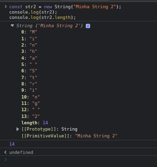
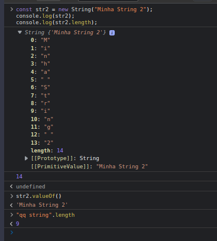
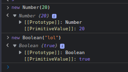
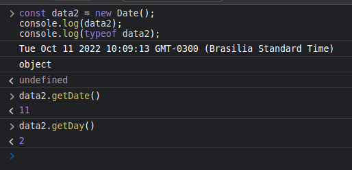
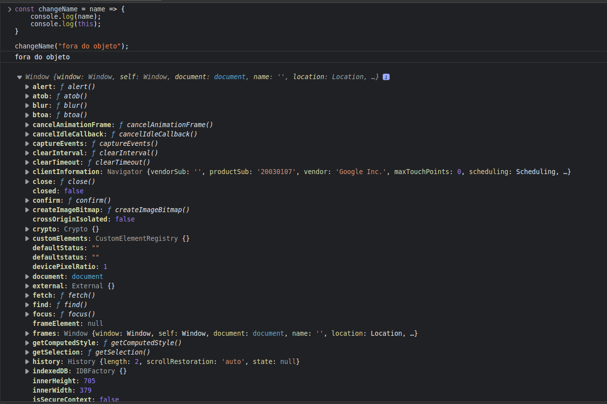

# SEÇÃO 11 - BASICO DE OBJETOS

 

## Introdução
 

Vamos começar a ver de forma mais aprofundada o que são objetos no `javascript`.

### O que são Objetos?

Tipo de dados que armazena coleção de dados (chave:valor). Uma array armazena dados ordenados, enquanto objetos armazenam dados não ordenados.

- Objetos são tipos de estruturas de dados onde conseguimos armazenar um `valor` referenciando pela sua `chave`. Quando falamos `chave` pode-se entender tbm como `propriedade`. Ou seja, armazenamos dentro de uma `propriedade` do objeto um `valor`. Esse valor pode ser do `tipo primitivo` ou um outro objeto como um `Array`, um outro `objeto` e até mesmo uma função.
- Um `array` por exemplo, armazena dados ordenados, ou seja, para acessarmos um dado dentro de um `array` precisamos saber o `indice` daquele elemento, onde ele foi armazenado no `array`. Enquanto que um `objeto` armazena dados de forma `não ordenada`, ou seja, para que a gente consiga ter acesso a informação, precisamos saber o nome da `chave`.

### O que veremos?

- Sintaxe Literal versus Sintaxe Formal.
- Dados Primitivos versus Objetos.
- Objetos Nativos e o Operador New.
- Funções Construtoras de Objetos.
- Propriedades e métodos. Entender o this.

 "

 

## Propriedade e métodos de valores primitivos? como é possivel?
 

Vamos criar um novo arquivo chamado `objetos.js` para exemplificarmos melhor.

- Sabemos que para criar um `objeto literal` utilizamos as chaves `{}`. 

~~~
const obj1 = { 
    nome: "Angelina",
};
~~~

- Sabemos que essa é a `sintaxe literal` e tbm temos a `Sintaxe formal`. Onde usamos o operador `new` juntamente com a `função construtora` para criar um objeto.

~~~
const obj1 = { 
    nome: "Angelina",
};

const obj2 = new Object();
~~~

- Para acessarmos `propriedades` e `metodos` usamos o `nome` do objeto juntamente com o `ponto(.)`.
- Como estamos definindo um propriedade de um objeto vazio, pois ao usar o `new Object()` estamos criando um objeto vazio, ou seja, sem propriedades, para criarmos essa propriedades fazemos o seguinte:

~~~
const obj1 = { 
    nome: "Angelina",
};

const obj2 = new Object();

obj2.nome = "Maria";
~~~

- Outra forma de colocar `propriedades` dentro de um objeto vazio seria utilizando a `sintaxe de colchetess {}`.
- Vamos ver no `console` os objetos que criamos.

~~~
const obj1 = { 
    nome: "Angelina",
};

const obj2 = new Object();

obj2.nome = "Maria";
obj2["idade"] = 28;

console.log(obj1);
console.log(obj2);

// SAIDA:
❯ node objetos.js
{ nome: 'Angelina' }
{ nome: 'Maria', idade: 28 }
~~~

- Outra coisa que podemos ver é o fato de conseguirmos ter acesso a `propriedades` de dados primitivos. 
- Se criarmos uma constante chamada `str` que possui como valor `minha string`. Como conseguiriamos acessar a `propriedade length` de um dado primitivo, de uma string?

~~~
const obj1 = { 
    nome: "Angelina",
};

const obj2 = new Object();

obj2.nome = "Maria";
obj2["idade"] = 28;

console.log(obj1);
console.log(obj2);

const str = "Minha string";
console.log(str.length);

// SAIDA:

❯ node objetos.js
{ nome: 'Angelina' }
{ nome: 'Maria', idade: 28 }
12
~~~

- Podemos ver no console que temos `12` caracteres na nossa string, como isso é possivel? Se criamos um dado primitivo como por exemplo, uma string, um numero ou um booleano, como temos acesso a uma propriedade deste dado primitivo?
- Isso acontence pq de baixo dos panos o interpretador do `javascript` converte a string em um `objeto` do tipo string. Ai o interpretador terá acesso a propriedade `.length` deste objeto, devolvendo o resultado da propriedade e em seguida descarta o objeto interpretado. Seria algo do tipo como o codigo abaixo.

~~~
const obj1 = { 
    nome: "Angelina",
};

const obj2 = new Object();

obj2.nome = "Maria";
obj2["idade"] = 28;

console.log(obj1);
console.log(obj2);

const str = "Minha string";
console.log(str.length);

const str2 = new String("Minha String 2");
console.log(str2);
console.log(str2.length);

// SAIDA:
❯ node objetos.js
{ nome: 'Angelina' }
{ nome: 'Maria', idade: 28 }
12
[String: 'Minha String 2']
14

~~~

- Como podemos ver no `str1` vemos somente o `text`, enquanto no `str2`, que criamos um `objeto` com a `função construtora string +  operador new`, foi criado um objeto de verdade do tipo `string`.
- Vamos ver o que aconteceria se fizermos o mesmo processo no console do `browser`.

~~~ 
[CONSOLE BROWSER]

const str2 = new String("Minha String 2");
console.log(str2);
console.log(str2.length);
~~~

- Vejam que o nosso `str2` na saida do `console` é um objeto do `tipo string`. Que possui um `primitiveValue` o que significa que a partir do nosso objeto do `tipo string` podemos ter acesso a uma função chamada `.valueOf()`, que é uma função nativa, que nos mostra o valor primitivo que esta dentro do objeto do tipo string.
- Logo, quando temos um `objeto do tipo string` conseguimos usar o `metodo valueOf()` para recuperar o valor primitivo de fato.É mais ou menos isso que o `interpretador do javascript` precisa fazer quando criamos uma `string` e chamamos o metodo `length`.

- Temos outros objetos nativos `numero, booleano...`

 

 

## Operador new
 

Para criarmos objetos `Nativos/construtores` temos que utilizar o `operador new`. Logo, para criarmos um `objeto do tipo objeto` ou ate mesmo um `objeto do tipo string` temos que utilizar o operador new (um operador unário). 

Esse operador `new` irá criar um objeto `limpo` com algumas `propriedades ` e `metodos` ja pre-existentes.

- Como exemplo, vamos criar um objeto do tipo `data`. 
- Primeiramente vamos observar o que teriamos como retorno se usarmos somente o `construtor` sem o `operador new`.

~~~ 
const data1 = Date();
console.log(data1);
console.log(typeof data1);

// SAIDA:

❯ node objetos.js
Tue Oct 11 2022 10:00:32 GMT-0300 (Brasilia Standard Time)
string

~~~

- Quando usamos o `connstrutor` sem o operador `new`, nos será retornado um `string` contendo a data.
- Porem o ideal ao trabalharmos com `datas` é termos um `objeto do tipo data`. Para termos acesso a esse objeto retornado pela funcção construtora `Data()` temso que criar uma `copia` desse objeto usando o `operador new`.

~~~
const data1 = Date();
console.log(data1);
console.log(typeof data1);

const data2 = new Date();
console.log(data2);
console.log(typeof data2);

// SAIDA:
❯ node objetos.js
Tue Oct 11 2022 10:06:36 GMT-0300 (Brasilia Standard Time)
string
2022-10-11T13:06:36.940Z
object
~~~

- Quando utilizarmos o `operador new` em `data2` de retorno dos consoles temos uma `string` ou pelo menos parece uma string, porem no `typeof`podemos ver um `objeto`.
- Se pegarmos o codigo abaixo e usarmos no console do browser e depois chamarmos a constante  `data2.` teremos acesso a uma lista de `metodo` pre-existentes do `objeto Date()`.
- Como exemplos temos o`.getDate()`, `.getDay()`...

~~~
const data2 = new Date();
console.log(data2);
console.log(typeof data2);
~~~

~~~
const data2 = new Date();
console.log(data2);
console.log(typeof data2);
console.log(data2.getDate());
console.log(typeof data2.getDate());
console.log(data2.getDay());
console.log(typeof data2.getDay());

// SAIDA:
Tue Oct 11 2022 10:24:39 GMT-0300 (Brasilia Standard Time)
string
2022-10-11T13:24:39.056Z
object
11
number
2
number
~~~ 

> Temos tbm o metodo `.getMonth()` que ao utiliza-lo temos que ter em mente que o mes de `janeir` começa com o indice `0`.

- O acesso a esses metodos de `objetos nativos/contrutores` so funciona quando ao criarmos uma variavel, a gente utilize o `operador new` juntamente com a `função construtora` do objeto em questão.

 

 

## Revisando: valores vs referencia
 

Vamos agora resaltar o conceito de `armazenamento de dados` por `referencia` e por `valor`. `Dados primitivos` são sempre armazenados por `valor` ao passo que tudo o que não for dado primitivo, por exemplo, `objetos`, `Array` (tipo de objeto no javascript), `função`, todos esses são armazenados por `referencia`.

Vamos criar um novo arquivo e chama-lo de `referencia_valor.js` para exemplificarmos melhor a diferença entre eles.

- Vamos criar com o `let` uma variavel que receberá um valor dee `10`. Lembrando que o `let` nos permite alterar ov alor da variavel em questão durante a execução do codigo.
- Vamos criar tbm uma `função` que irá receber um numero e somar `1` ao mesmo.

~~~
let x = 10;

function mudaX(x){
    x++;
    console.log("x interno: " + x);
}

mudaX(x);
console.log("x externo: " + x);

// SAIDA:

❯ node referencia_valor.js
x interno: 11
x externo: 10
~~~

- Percebam que o `x interno` possui o valor de `11` e o `x externo` o valor de `10`, ou seja, o `x externo` não foi alterado pela função.
- Isso significa que quando passamos essa variavel `x` para dentro da função não passamos a `variavel` em sim, mas o `valor` desta variavel, isto significa que a `variavel x` permanece intacta.
- Agora vamos ver o que acontence quando convertemos o numero `10` em um `array` que possui o numero `[10]`.

~~~
let x = [10];

function mudaX(x){
    x.push(11);
    console.log("x interno: " + x );
}

mudaX(x);
console.log("x externo: " + x);

// SAIDA:
❯ node referencia_valor.js
x interno: 10,11
x externo: 10,11

~~~

- Percebam que agora ambos os `x's` possuem o valor de `11`. Ou seja, quando passamos um `array` que é um tipo de `objeto` o que passamos na verdade foi uma `referencia` deste `array`.
- Logo o `x interno` é o mesmo que o `x externo`. Uma alteração no `x interno` é refletida pelo `x externo`. Pois ao chamarmos a função, o que foi passada a ela não foi o valor da variavel e sim `a referencia dela`.
- Ao passar a `referencia` estamos na verdade passando a localização da variavel `na memoria`.
- O Mesmo irá acontecer com um `objeto`. Vamos criar um objeto literal para exemplificar e fazer uma outra função.

~~~
let x = [10];
let y = {n:10};

function mudaX(x){
    x.push(11);
    console.log("x interno: " + x );
}

function mudaY(obj){
    obj.n++;
    // obj.n = obj.n + 1;
    console.log("y interno: " + obj.n);
}

mudaX(x);
console.log("x externo: " + x);

mudaY(y);
console.log("y externo: " + y.n);

// SAIDA:
❯ node referencia_valor.js
x interno: 10,11
x externo: 10,11
y interno: 11
y externo: 11
~~~

- Se no console fizermos o seguinte `{} === {} ` teremos um retorno de um valor booleano `false` pois a referencia, ou seja, o local de memoria dos dois objetos acima são diferentes. O mesmo acontece com os arrays `[1,2] === [1,2]` o que é comparado não é o valor e sim o local de memoria onde estão sendo armazenados esses arrays.

~~~
[CONSOLE BROWSER]

{} === {} 
> FALSE
[] === []
> FALSE
[1,2] === [1,2]
> FALSE
"2" === "2" 
> TRUE
new String("s") === new String("s")
> FALSE 
~~~

 

 

## Objetos customizados
 

Agora iremos ver o porque de utilizarmos em alguns momentos as `funções construtoras` de objetos. Para isso vamos primeiro ver um `problema` criando um novo arquivo chamado `objetos_customizados.js`.

A ideia é criar alguns objetos literais por enquanto para entendermos o conceito.

~~~ 
const task1 = {
    name: "task 1",
    createdAt: new Date(),
    completed: false,
}

const task2 = {
    name: "task 2",
    createdAt: new Date(),
    completed: false,
}

console.log(task1);
console.log(task2);

// SAIDA:

❯ node objetos_customizados.js
{
  name: 'task 1',
  createdAt: 2022-10-12T14:12:02.989Z,
  completed: false
}
{
  name: 'task 2',
  createdAt: 2022-10-12T14:12:02.989Z,
  completed: false
}
~~~ 

- Como podemos ver na saida do console temos 2 objetos criados.
- A principio não teria nenhum problema trabalharmos com objetos escritos dessa maneira, por exemplo, temos uma lista com 20 tarefas e poderiamos criar 20 objetos literais desse tipo. 
- Porem isso tem um problema, se caso a gente precise mudar a estrutura desse objeto, vamos precisar alterar em todos os objetos que ja existem, ou seja, precisariamos por exemplo, se colocarmos uma propriedade nova chamada `updatedAt: null`, teriamos que colocar em todos os objetos que criamos essa propriedade.

~~~ 
const task1 = {
    name: "task 1",
    createdAt: new Date(),
    updatedAt: null,

    completed: false,
}

const task2 = {
    name: "task 2",
    createdAt: new Date(),
    updatedAt: null,

    completed: false,
}

console.log(task1);
console.log(task2);

// SAIDA:

❯ node objetos_customizados.js
{
  name: 'task 1',
  createdAt: 2022-10-12T14:15:35.809Z,
  updatedAt: null,
  completed: false
}
{
  name: 'task 2',
  createdAt: 2022-10-12T14:15:35.809Z,
  updatedAt: null,
  completed: false
}

~~~

- Digamos que a gente queira antes de mostrar o console, mudar o nome do nosso objeto `task 1`. E criar uma nova data para a propriedade `updatedAt` que criamos acima.

~~~
const task1 = {
    name: "task 1",
    createdAt: new Date(),
    updatedAt: null,

    completed: false,
}

const task2 = {
    name: "task 2",
    createdAt: new Date(),
    updatedAt: null,

    completed: false,
}

console.log(task1);
console.log(task2);

task1.name = "task 1 updated";
task1.updatedAt = new Date();

console.log(task1);
console.log(task2);

// SAIDA:

❯ node objetos_customizados.js
{
  name: 'task 1',
  createdAt: 2022-10-12T14:17:44.110Z,
  updatedAt: null,
  completed: false
}
{
  name: 'task 2',
  createdAt: 2022-10-12T14:17:44.110Z,
  updatedAt: null,
  completed: false
}
{
  name: 'task 1 updated',
  createdAt: 2022-10-12T14:17:44.110Z,
  updatedAt: 2022-10-12T14:17:44.115Z,
  completed: false
}
{
  name: 'task 2',
  createdAt: 2022-10-12T14:17:44.110Z,
  updatedAt: null,
  completed: false
}

~~~

- A data esta igual pois o codigo do javascript foi executado tão rapido que não deu tempo de mudar os horarios na data.
- A ideia que queremos mostrar é que quando alteramos o `nome` a propriedade de `atualização` tambem precisa ser alterada.
- Ou seja, o ideia não seria fazer como o codigo acima e sim, termos uma função que irá receber um novo valor e esta função irá atualizar o `nome` e o `updatedAt`.
- Dentro do objeto `task1` vamos criar uma propriedade que `aponta para um função` e essa função irá se chamar `changeName()`. A função que iremos criar irá receber um nome/string como propriedade. 
- Vamos ver quem é, qual o escopo, do `this` dentro dessa função usando o console.log().

~~~
const task1 = {
    name: "task 1",
    createdAt: new Date(),
    updatedAt: null,
    completed: false,
    changeName: function(name){
        console.log(this);
    }
}

const task2 = {
    name: "task 2",
    createdAt: new Date(),
    updatedAt: null,

    completed: false,
}

task1.name = "task 1 updated";
task1.updatedAt = new Date();

task1.changeName("string qualquer");

// console.log(task1);
// console.log(task2);

// SAIDA:
❯ node objetos_customizados.js
{
  name: 'task 1 updated',
  createdAt: 2022-10-12T14:24:09.208Z,
  updatedAt: 2022-10-12T14:24:09.208Z,
  completed: false,
  changeName: [Function: changeName]
}

~~~

- Como podemos ver na saida do console.log() o `this` é o proprio objeto, tanto que se usarmos o console.log() `name` veremos a string passada ao chamarmos a função.

~~~
const task1 = {
    name: "task 1",
    createdAt: new Date(),
    updatedAt: null,
    completed: false,
    changeName: function(name){
        console.log(name);
        console.log(this);
    }
}

const task2 = {
    name: "task 2",
    createdAt: new Date(),
    updatedAt: null,

    completed: false,
}

task1.name = "task 1 updated";
task1.updatedAt = new Date();

task1.changeName("string qualquer");

// console.log(task1);
// console.log(task2);

// SAIDA:

❯ node objetos_customizados.js
string qualquer
{
  name: 'task 1 updated',
  createdAt: 2022-10-12T14:34:43.620Z,
  updatedAt: 2022-10-12T14:34:43.620Z,
  completed: false,
  changeName: [Function: changeName]
}
~~~

- Vemos na saida a string que foi passada e o `this` que seria o proprio objeto. Quando chamamos o `task1.changeName()` dentro desta função, o `this` é o proprio `task1`. 
- Ou seja, o `this` é dinamico, varia dependendo de quem o chamada.
- Vamos mudar a função `changeName()` criando uma função fora doe scopo do objeto.
- Desde o ES6 quando temos uma `propriedade` e um `valor` com o mesmo `nome`, podemos omitir o valor.

~~~
[PROPRIEDADE E VALOR COM O MESMO NOME]
const task1 = {
    name: "task 1",
    createdAt: new Date(),
    updatedAt: null,
    completed: false,
    //changeName: changeName,
    changeName,
} 
~~~

~~~
function changeName(name){
    console.log(name);
    console.log(this);
}

const task1 = {
    name: "task 1",
    createdAt: new Date(),
    updatedAt: null,
    completed: false,
    //changeName: changeName,
    changeName,
}

const task2 = {
    name: "task 2",
    createdAt: new Date(),
    updatedAt: null,

    completed: false,
}

task1.name = "task 1 updated";
task1.updatedAt = new Date();

task1.changeName("string qualquer");

// console.log(task1);
// console.log(task2);

// SAIDA:

❯ node objetos_customizados.js
string qualquer
{
  name: 'task 1 updated',
  createdAt: 2022-10-12T14:46:47.474Z,
  updatedAt: 2022-10-12T14:46:47.474Z,
  completed: false,
  changeName: [Function: changeName]
}
~~~

- Observem que apesar de termos colocado a `função no escopo global` e chamarmos ela a partir do nosso objeto `task1`, ou seja, em uma propriedade, o `this` ainda se refere ao `task 1`.
- Observem tbm que se chamarmos a `função changeName` fora do objeto o `this` é de um `objeto global`.

~~~
function changeName(name){
    console.log(name);
    console.log(this);
}

changeName("fora do objeto");

const task1 = {
    name: "task 1",
    createdAt: new Date(),
    updatedAt: null,
    completed: false,
    changeName: changeName,
}

const task2 = {
    name: "task 2",
    createdAt: new Date(),
    updatedAt: null,

    completed: false,
}

task1.name = "task 1 updated";
task1.updatedAt = new Date();

task1.changeName("string qualquer");

// console.log(task1);
// console.log(task2);

// SAIDA:

❯ node objetos_customizados.js
fora do objeto
<ref *1> Object [global] {
  global: [Circular *1],
  queueMicrotask: [Function: queueMicrotask],
  clearImmediate: [Function: clearImmediate],
  setImmediate: [Function: setImmediate] {
    [Symbol(nodejs.util.promisify.custom)]: [Getter]
  },
  structuredClone: [Function: structuredClone],
  clearInterval: [Function: clearInterval],
  clearTimeout: [Function: clearTimeout],
  setInterval: [Function: setInterval],
  setTimeout: [Function: setTimeout] {
    [Symbol(nodejs.util.promisify.custom)]: [Getter]
  },
  atob: [Function: atob],
  btoa: [Function: btoa],
  performance: Performance {
    nodeTiming: PerformanceNodeTiming {
      name: 'node',
      entryType: 'node',
      startTime: 0,
      duration: 45.6714739985764,
      nodeStart: 2.698472999036312,
      v8Start: 4.9063409976661205,
      bootstrapComplete: 36.68343799933791,
      environment: 22.48863599821925,
      loopStart: -1,
      loopExit: -1,
      idleTime: 0
    },
    timeOrigin: 1665586290940.185
  },
  fetch: [AsyncFunction: fetch]
}
string qualquer
{
  name: 'task 1 updated',
  createdAt: 2022-10-12T14:51:30.986Z,
  updatedAt: 2022-10-12T14:51:30.986Z,
  completed: false,
  changeName: [Function: changeName]
}

~~~

- Como podemos ver na saida ele possui varias `propriedades` e `metodos` deste `ambiente de hospedagem` e não do `objeto window` como seria se rodassemos esse codigo no nosso browser. Como usamos o `node` para rodar o codigo,temos um outro `ambiente de hospedagem`, é um outro `objeto global`.
- Tanto que no `objeto window` não temos uma propriedade chamada `process`, por exemplo.
- Logo, nesse caso, como estamos usando uma `function expression` o `this` é dinamico, e vai depender de que o chama. 
- Na primeira vez estamos invocando a função a partir do objeto global `node`, e no segundo a partir do objeto que criamos `task1`.
- O mesmo não iria acontecer caso estivessemos trabalhando com uma `arrow function`...

~~~

// function changeName(name){
//     console.log(name);
//     console.log(this);
// }

const changeName = name => {
    console.log(name);
    console.log(this);
}

changeName("fora do objeto");

const task1 = {
    name: "task 1",
    createdAt: new Date(),
    updatedAt: null,
    completed: false,
    changeName: changeName,
}

const task2 = {
    name: "task 2",
    createdAt: new Date(),
    updatedAt: null,

    completed: false,
}

task1.name = "task 1 updated";
task1.updatedAt = new Date();

task1.changeName("string qualquer");

// console.log(task1);
// console.log(task2);

// SAIDA:

❯ node objetos_customizados.js
fora do objeto
{}
string qualquer
{}
~~~

- No caso do `node` podemos ver que o `this` se refere a um objeto vazio. Porem se colocarmos o codigo no browser, poderemos ver que o `this` será referente ao objeto `window`.

~~~
const changeName = name => {
    console.log(name);
    console.log(this);
}

changeName("fora do objeto");
~~~

- No caso do `node` esse `this` esta relacionado com os modulos exportados pelo node. 
- Mas saiba que ao utilizar uma `arrow function` o `this` não irá mudar, usando fora ou dentro do objeto direto, como podemos ver abaixo.
- Ou seja, colocamos uma propriedade dentro do objeto chamada `changeName` que aponta para uma `arrow function` teremos o mesmo retorno.

~~~
// function changeName(name){
//     console.log(name);
//     console.log(this);
// }

const changeName = name => {
    console.log(name);
    console.log(this);
}

changeName("fora do objeto");

const task1 = {
    name: "task 1",
    createdAt: new Date(),
    updatedAt: null,
    completed: false,
    // changeName: changeName,
    changeName: name => {
        console.log(name);
        console.log(this);
    },
}

const task2 = {
    name: "task 2",
    createdAt: new Date(),
    updatedAt: null,

    completed: false,
}

task1.name = "task 1 updated";
task1.updatedAt = new Date();

task1.changeName("string qualquer");

// console.log(task1);
// console.log(task2);

// SAIDA:

❯ node objetos_customizados.js
fora do objeto
{}
string qualquer
{}
~~~ 

- Vamos voltar ao codigo ao normal pois precisamos ter obrigatoriamente nesse caso uma `function expression`.

~~~
function changeName(name){
    console.log(name);
    console.log(this);
}

const task1 = {
    name: "task 1",
    createdAt: new Date(),
    updatedAt: null,
    completed: false,
    changeName: changeName,
}

const task2 = {
    name: "task 2",
    createdAt: new Date(),
    updatedAt: null,

    completed: false,
}

task1.name = "task 1 updated";
task1.updatedAt = new Date();

task1.changeName("string qualquer");

// console.log(task1);
// console.log(task2);

// SAIDA:

❯ node objetos_customizados.js
string qualquer
{
  name: 'task 1 updated',
  createdAt: 2022-10-13T14:07:26.059Z,
  updatedAt: 2022-10-13T14:07:26.059Z,
  completed: false,
  changeName: [Function: changeName]
}
~~~

- Como falamos anteriormente se temos um `propriedade` com o mesmo nome do `valor` podemos `omitir` o valor.

~~~
function changeName(name){
    console.log(name);
    console.log(this);
}

const task1 = {
    name: "task 1",
    createdAt: new Date(),
    updatedAt: null,
    completed: false,
    changeName,
}

const task2 = {
    name: "task 2",
    createdAt: new Date(),
    updatedAt: null,

    completed: false,
}

task1.name = "task 1 updated";
task1.updatedAt = new Date();

task1.changeName("string qualquer");

// console.log(task1);
// console.log(task2);

// SAIDA:

❯ node objetos_customizados.js
string qualquer
{
  name: 'task 1 updated',
  createdAt: 2022-10-13T14:08:48.119Z,
  updatedAt: 2022-10-13T14:08:48.119Z,
  completed: false,
  changeName: [Function: changeName]
}
~~~

- Agora que temos uma função chamada `changeName`, e essa função possui acesso ao nosso `objeto` atraves da palavra `this`, podemos alterar o `nome` que foi passado por parametro da função e atualizar a propriedade  `updatedAt`.

~~~ 
function changeName(name){
    console.log(name);
    console.log(this);
    this.name = name;
    this.updatedAt = new Date();
}

const task1 = {
    name: "task 1",
    createdAt: new Date(),
    updatedAt: null,
    completed: false,
    changeName,
}

const task2 = {
    name: "task 2",
    createdAt: new Date(),
    updatedAt: null,

    completed: false,
}

task1.name = "task 1 updated";
task1.updatedAt = new Date();

task1.changeName("NOME ATUALIZADO");

console.log(task1);
// console.log(task2);

// SAIDA:

❯ node objetos_customizados.js
NOME ATUALIZADO
{
  name: 'task 1 updated',
  createdAt: 2022-10-13T14:11:20.151Z,
  updatedAt: 2022-10-13T14:11:20.151Z,
  completed: false,
  changeName: [Function: changeName]
}
{
  name: 'NOME ATUALIZADO',
  createdAt: 2022-10-13T14:11:20.151Z,
  updatedAt: 2022-10-13T14:11:20.156Z,
  completed: false,
  changeName: [Function: changeName]
}

~~~ 

- Agora como fazemos se quisermos ter tbm o `changeName` no objeto `task2`? Basta chamarmos a `propriedade/função`.

~~~
function changeName(name){
    console.log(name);
    console.log(this);
    this.name = name;
    this.updatedAt = new Date();
}

const task1 = {
    name: "task 1",
    createdAt: new Date(),
    updatedAt: null,
    completed: false,
    changeName,
}

const task2 = {
    name: "task 2",
    createdAt: new Date(),
    updatedAt: null,
    completed: false,
    changeName,
}

task1.name = "task 1 updated";
task1.updatedAt = new Date();

task1.changeName("NOME ATUALIZADO task1");
task2.changeName("Nome atualizado task2");

console.log(task1);
console.log(task2);

// SAIDA:

❯ node objetos_customizados.js
NOME ATUALIZADO task1
{
  name: 'task 1 updated',
  createdAt: 2022-10-13T14:41:41.646Z,
  updatedAt: 2022-10-13T14:41:41.646Z,
  completed: false,
  changeName: [Function: changeName]
}
Nome atualizado task2
{
  name: 'task 2',
  createdAt: 2022-10-13T14:41:41.646Z,
  updatedAt: null,
  completed: false,
  changeName: [Function: changeName]
}
{
  name: 'NOME ATUALIZADO task1',
  createdAt: 2022-10-13T14:41:41.646Z,
  updatedAt: 2022-10-13T14:41:41.651Z,
  completed: false,
  changeName: [Function: changeName]
}
{
  name: 'Nome atualizado task2',
  createdAt: 2022-10-13T14:41:41.646Z,
  updatedAt: 2022-10-13T14:41:41.651Z,
  completed: false,
  changeName: [Function: changeName]
}

~~~

- Melhoramos o codigo um pouco com essa função externa onde so bastou colocarmos a propriedade dentro do objeto.
- Porem se tivessemos 20 objetos, teriamos que colocar essa propriedade em todos os 20 para que seja atualizado.
- O ideal seria criar uma maneira de gerar esses objetos e retornarmos os mesmos. E é exatamente isso para que as `funções construtoras` servem, é como se tivessemos um `molde` e quando usarmos o `operador new`, por exemplo queremos uma nova tarefa, a `função construtora` irá gerar um molde e devolver o objeto para quem chamou a função construtora.
- Assim, se quisermos fazer uma alteração, adicionar um metodo, alterar uma propriedade, so iriamos alterar a `função construtora` e a alteração será refletida em todas as `instancias`.

 

 

## Funções Construtoras
 

Vamos criar um novo documento para podermos falar sobre as `funções construtoras`.

Vamos criar uma `função construtora` ela é uma função que vai ser usada para `gerar objetos`. Para utilizarmos as funções `construtoras` precisamos obrigatoriamente utilizar o `operador new`.

- Vamos criar uma `function` e chama-la de `Task`. Uma convenção muito utilizada no javascript é que ao criar uma `função construtora` temos que começa-la com a `primeira letra maiuscula`.
- Dentro da `função construtora` iremos colocar as `propriedades` utilizando a palavra `this`.
- Esse `this` irá fazer `referencia` ao `objeto` recem criado. 

~~~
function Task(){
    this.name = "task 1";
    this.createdAt = new Date();
} 
~~~

- Para criarmos uma nova tarefa vamos criar uma constante chamada `task1` usando o `operador new` e a `função construtora`.

~~~
function Task(){
    this.name = "task 1";
    this.createdAt = new Date();
}

const task1 = new Task(); 
~~~

- No codigo acima estamos criando um `novo objeto` ao utilizarmos o `operador new` e a `função construtora = Task()`, irá nos retornar um objeto com algumas propriedades `name e createdAt`, caso a gente não coloque nenhuma propriedade na `função construtora` iria nos ser retornado um `objeto vazio`.

~~~
function Task(){
    this.name = "task 1";
    this.createdAt = new Date();
}

const task1 = new Task();

console.log(task1);

// SAIDA:

❯ node constructors.js
Task { name: 'task 1', createdAt: 2022-10-13T15:46:45.188Z }
~~~

- Na saida do console podemos ver que `Task` é o objeto gerado a partir da `função construtora Task()` que possui uma propriedade chamada `name` e outra chamada `createdAt` com um `objeto do tipo Date` como valor.
- Nao queremos criar `tarefas` ja com o nome pre-definido, ou seja, estaticamente, queremos criar tarefas com nome dinamico, para não termos que alterar o nome da task manualmente.
- O que queremos fazer é a partir do momento que criarmos uma tarefa, passar o nome como parametro para a função construtora.

~~~
function Task(name){
    this.name = name;
    this.createdAt = new Date();
}

const task1 = new Task("minha tarefa");

console.log(task1);

// SAIDA:

❯ node constructors.js
Task { name: 'minha tarefa', createdAt: 2022-10-13T15:51:20.636Z }

~~~

- Podemos tbm criar um metodo para alterar esse nome.

~~~
function Task(name){
    this.name = name;
    this.createdAt = new Date();
    this.changeName = function(newName){
        this.name = newName;
    }
}

const task1 = new Task("minha tarefa");

console.log(task1);

task1.changeName("novo nome para tarefa");

console.log(task1);

// SAIDA:

❯ node constructors.js
Task {
  name: 'minha tarefa',
  createdAt: 2022-10-13T15:53:28.724Z,
  changeName: [Function (anonymous)]
}
Task {
  name: 'novo nome para tarefa',
  createdAt: 2022-10-13T15:53:28.724Z,
  changeName: [Function (anonymous)]
}
~~~

- Dessa maneira a criação de tarefas fica mais facil

~~~
function Task(name){
    this.name = name;
    this.createdAt = new Date();
    this.changeName = function(newName){
        this.name = newName;
    }
}

const task1 = new Task("minha tarefa");
const task2 = new Task("tarefa 2");

task1.changeName("novo nome para tarefa");

console.log(task1);
console.log(task2);

// SAIDA:

❯ node constructors.js
Task {
  name: 'novo nome para tarefa',
  createdAt: 2022-10-13T15:55:11.013Z,
  changeName: [Function (anonymous)]
}
Task {
  name: 'tarefa 2',
  createdAt: 2022-10-13T15:55:11.013Z,
  changeName: [Function (anonymous)]
}

~~~

- Digamos que a gente não queira que o usuario altere o nome da tarefa `diretamente` ou seja, com a linha de codigo `task1.name = "proibido"`...

~~~
function Task(name){
    this.name = name;
    this.createdAt = new Date();
    this.changeName = function(newName){
        this.name = newName;
    }
}

const task1 = new Task("minha tarefa");
const task2 = new Task("tarefa 2");

task1.changeName("novo nome para tarefa");
task1.name = "proibido";

console.log(task1);
console.log(task2);

// SAIDA:

❯ node constructors.js
Task {
  name: 'proibido',
  createdAt: 2022-10-13T15:57:39.871Z,
  changeName: [Function (anonymous)]
}
Task {
  name: 'tarefa 2',
  createdAt: 2022-10-13T15:57:39.871Z,
  changeName: [Function (anonymous)]
}

~~~

- Nao queremos que o usuario faça isso pois toda vez que o nome for alterado, queremos alterar tbm uma propriedade chamada `updatedAt`, ou seja, não queremos ter que escrever varias linhas de codigo para varias tarefas ao atualizarmos o nome das mesmas.
- Ou seja, a função que criamos como propriedade do objeto `changeName` irá atualizar o nome e tbm a propriedade `updatedAt`.

~~~
function Task(name){
    this.name = name;
    this.createdAt = new Date();
    this.updatedAt = null;
    this.changeName = function(newName){
        this.name = newName;
        this.updatedAt = new Date();
    }
}

const task1 = new Task("minha tarefa");
const task2 = new Task("tarefa 2");

task1.changeName("novo nome para tarefa");

console.log(task1);
console.log(task2);

// SAIDA:

❯ node constructors.js
Task {
  name: 'proibido',
  createdAt: 2022-10-13T16:00:56.542Z,
  updatedAt: 2022-10-13T16:00:56.542Z,
  changeName: [Function (anonymous)]
}
Task {
  name: 'tarefa 2',
  createdAt: 2022-10-13T16:00:56.542Z,
  updatedAt: null,
  changeName: [Function (anonymous)]
}

~~~

- Porem ainda temos um problema, que seria o do usuario ainda poder alterar a propriedade `name` diretamente usando `task1.name`.
- Para impedir isso, dentro da `função construtora` criamos uma variavel chamada `_name` que irá receber o `name` passado por parametro para a função.
- Depois excluimos a propriedade `this.name` e dentro da função `changeName` vamos alterar o valor da variavel que criamos acima.
- Porem como essa variavel `_name` so existe no escopo da função construtora, não temos mais acesso a ela.

~~~
function Task(name){
    let _name = name;
    this.createdAt = new Date();
    this.updatedAt = null;
    this.changeName = function(newName){
        _name = newName;
        this.updatedAt = new Date();
    }
}

const task1 = new Task("minha tarefa");
const task2 = new Task("tarefa 2");

task1.changeName("novo nome para tarefa");

console.log(task1);
console.log(task2);

// SAIDA:

❯ node constructors.js
Task {
  createdAt: 2022-10-13T16:06:17.564Z,
  updatedAt: 2022-10-13T16:06:17.564Z,
  changeName: [Function (anonymous)]
}
Task {
  createdAt: 2022-10-13T16:06:17.564Z,
  updatedAt: null,
  changeName: [Function (anonymous)]
}

~~~

- Pela saida do console podemos observar não temos mais acesso ao texto que esta dentro do objeto.
- Nem utilizando o `task1.name` nem o `task1._name`

~~~
function Task(name){
    let _name = name;
    this.createdAt = new Date();
    this.updatedAt = null;
    this.changeName = function(newName){
        _name = newName;
        this.updatedAt = new Date();
    }
}

const task1 = new Task("minha tarefa");
const task2 = new Task("tarefa 2");

task1.changeName("novo nome para tarefa");

console.log(task1);
console.log(task1.name);
console.log(task1._name);
console.log(task2);

// SAIDA:

❯ node constructors.js
Task {
  createdAt: 2022-10-13T16:07:43.617Z,
  updatedAt: 2022-10-13T16:07:43.617Z,
  changeName: [Function (anonymous)]
}
undefined
undefined
Task {
  createdAt: 2022-10-13T16:07:43.617Z,
  updatedAt: null,
  changeName: [Function (anonymous)]
}

~~~

- Recebemos em ambos os casos o `undefined`. Agora como fazemos para ter acesso a esse nome? Pois nada adianta o nome estar dentro do objeto porem estar `encapsulado/privado` e não conseguimos mais saber o nome que esta la.
- Para acessar podemos criar uma `metodo` que recupere esse nome. Esse metodo precisa obrigatoriamente fazer parte do objeto, ou seja, usamos o `this`, juntamente com o nome do metodo `getName` que não irá receber nenhum parametro porem irá nos retornar a variavel `_name` que queremos.

> Podemos tbm criar o metodo com `arrow function`

~~~
function Task(name){
    let _name = name;
    this.createdAt = new Date();
    this.updatedAt = null;
    this.changeName = function(newName){
        _name = newName;
        this.updatedAt = new Date();
    }
    // this.getName = function(){
    //     return _name;
    // }
    this.getName = () =>{
        return _name;
    }
}

const task1 = new Task("minha tarefa");
const task2 = new Task("tarefa 2");

task1.changeName("novo nome para tarefa");

console.log(task1.getName());
// console.log(task1.name);
// console.log(task1._name);
console.log(task2);

// SAIDA:

❯ node constructors.js
novo nome para tarefa
Task {
  createdAt: 2022-10-13T16:12:02.516Z,
  updatedAt: null,
  changeName: [Function (anonymous)],
  getName: [Function (anonymous)]
}

~~~

- Agora se quisermos mudar o nome da `task` novamente, basta chamarmos a função `changeName` e no console o metodo `getName()`.

~~~
function Task(name){
    let _name = name;
    this.createdAt = new Date();
    this.updatedAt = null;
    this.changeName = function(newName){
        _name = newName;
        this.updatedAt = new Date();
    }
    this.getName = function(){
        return _name;
    }
    // this.getName = () =>{
    //     return _name;
    // }
}

const task1 = new Task("minha tarefa");
const task2 = new Task("tarefa 2");

task1.changeName("novo nome para tarefa");

console.log(task1);
console.log(task1.getName());

task1.changeName("lalalal");
console.log(task1.getName());

// SAIDA:

❯ node constructors.js
Task {
  createdAt: 2022-10-13T16:15:57.210Z,
  updatedAt: 2022-10-13T16:15:57.210Z,
  changeName: [Function (anonymous)],
  getName: [Function (anonymous)]
}
novo nome para tarefa
lalalal
~~~

Desta maneira conseguimos proteger nosso codigo, criamos `variaveis` dentro das nossas `funções construtoras` que ficam `isoladas` e so temos acesso chamando `metodos` criados dentro das `funções construtoras`.

- Poderiamos por exemplo, fazer uma verificação dentro destes metodos para que as alterações sejam de acordo com as nossas `regras de negocios`.

~~~
function Task(name){
    let _name = name;
    this.createdAt = new Date();
    this.updatedAt = null;
    this.changeName = function(newName){
        if(newName){
            _name = newName;
            this.updatedAt = new Date();
        }else{
            console.log("digita um nome para a tarefa!");
        }
    }
    this.getName = function(){
        return _name;
    }
    // this.getName = () =>{
    //     return _name;
    // }
}

const task1 = new Task("minha tarefa");
const task2 = new Task("tarefa 2");

task1.changeName();

console.log(task1);
console.log(task1.getName());

task1.changeName("lalalal");
console.log(task1.getName());

// SAIDA:

❯ node constructors.js
digita um nome para a tarefa!
Task {
  createdAt: 2022-10-13T16:20:32.552Z,
  updatedAt: null,
  changeName: [Function (anonymous)],
  getName: [Function (anonymou s)]
}
minha tarefa
lalalal

~~~

- Como podemos ver no codigo acima, quando criamos um condição, ao chamarmo o `changeName` sem passar um valor, entra no `else` condicional.

 

 

## Obrigar o uso do operador new nos nossos Construtores
 

Criamos uma função `construtora` que irá criar um objeto vazio e tudo que colocarmos dentro deste objeto vazio utilizando a palavra `this`, será acrescentado como propriedade deste objeto vazio recem criado pelo `operador new`.

Porem temos um pequeno problema, temos uma `função construtora` que irá nos retornar um objeto vazio caso o desenvolvedor utilize o `operador new`.

Agora o que aconteceria se o desenvolveror esquecer de utilizar o `operador new` como podemos ver abaixo...

~~~
const task2 = Task("minha segunda tarefa");
~~~ 

- Se nçao utilizarmos o `operador new` o `this` que temos na função construtora irá se referir ao `escopo global`.

~~~
function Task(name){
    let _name = name;
    this.createdAt = new Date();
    this.updatedAt = null;
    this.changeName = function(newName){
        if(newName){
            _name = newName;
            this.updatedAt = new Date();
        }else{
            console.log("digita um nome para a tarefa!");
        }
    }
    this.getName = function(){
        return _name;
    }
    // this.getName = () =>{
    //     return _name;
    // }
}

const task1 = new Task("minha tarefa");
const task2 = Task("tarefa 2");

// task1.changeName();

// console.log(task1);
// console.log(task1.getName());

// task1.changeName("lalalal");
// console.log(task1.getName());

// console.log(task1._name);
console.log(task2);

// SAIDA:
❯ node constructors.js
undefined
~~~

- No codigo acima, o que esta sendo armazenado no `task2` é o retorno da `função construtora` porem como esta função não retorna nada, vemos no console o `undefined`. 
- Porem temos um grande problema tbm, como o `this` é referente ao `escopo global` significa que temos as `propriedade` criadas na função construtora `createdAt/updatedAt` tbm no `escopo global`.

~~~ 
function Task(name){
    let _name = name;
    this.createdAt = new Date();
    this.updatedAt = null;
    this.changeName = function(newName){
        if(newName){
            _name = newName;
            this.updatedAt = new Date();
        }else{
            console.log("digita um nome para a tarefa!");
        }
    }
    this.getName = function(){
        return _name;
    }
    // this.getName = () =>{
    //     return _name;
    // }
}

const task1 = new Task("minha tarefa");
const task2 = Task("tarefa 2");

console.log(task2);

console.log(createdAt);

// SAIDA:

❯ node constructors.js
undefined
2022-10-13T17:00:10.509Z
~~~

- Isso é teriamos um problema caso a gente fizesse uma nova tarefa. De maneira que teriamos duas variaveis que deveriam ser individuais de cada tarefa iguais para as mesmas...

~~~ 
function Task(name){
    let _name = name;
    this.createdAt = new Date();
    this.updatedAt = null;
    this.changeName = function(newName){
        if(newName){
            _name = newName;
            this.updatedAt = new Date();
        }else{
            console.log("digita um nome para a tarefa!");
        }
    }
    this.getName = function(){
        return _name;
    }
    // this.getName = () =>{
    //     return _name;
    // }
}

const task1 = new Task("minha tarefa");
const task2 = Task("tarefa 2");

console.log(task2);
console.log(createdAt);

const task3 = Task("tarefa 3");
console.log(createdAt);

// SAIDA:

❯ node constructors.js
undefined
2022-10-13T17:09:06.267Z
2022-10-13T17:09:06.272Z

~~~

- Ou seja, temos duas variaveis que deveriam estar apontando para objetos diferentes porem estão apontando para o `objeto global`, podendo dar um problema muito grave na aplicação.
- Logo não podemos permitir que o dev utilize a função `construtora` sem utilizar o `operador new`.
- Para isso podemos fazer com que dispare um `erro` por exemplo. Para isso basta utilizarmos o `use-strict`, na primeira linha da função construtora.
- Vamos usar o console para vermos que é o `this` agora na função. O codigo dará um erro porem da para vermos a saida do `this`.

~~~
function Task(name){
    "use strict";
    console.log(this);
    let _name = name;
    this.createdAt = new Date();
    this.updatedAt = null;
    this.changeName = function(newName){
        if(newName){
            _name = newName;
            this.updatedAt = new Date();
        }else{
            console.log("digita um nome para a tarefa!");
        }
    }
    this.getName = function(){
        return _name;
    }
    // this.getName = () =>{
    //     return _name;
    // }
}

const task1 = new Task("minha tarefa");
const task2 = Task("tarefa 2");

console.log(task2);
console.log(createdAt);

// SAIDA:

❯ node constructors.js
Task {}
undefined
/home/angelina/Documents/ESTUDOS/GitHub Repos/JavaScriptStudy/Udemy/Curso de JavaScript Completo do iniciante ao mestre (2022)/secao11/constructors.js:7
    this.createdAt = new Date();
                   ^

TypeError: Cannot set properties of undefined (setting 'createdAt')
    at Task (/home/angelina/Documents/ESTUDOS/GitHub Repos/JavaScriptStudy/Udemy/Curso de JavaScript Completo do iniciante ao mestre (2022)/secao11/constructors.js:7:20)
    at Object.<anonymous> (/home/angelina/Documents/ESTUDOS/GitHub Repos/JavaScriptStudy/Udemy/Curso de JavaScript Completo do iniciante ao mestre (2022)/secao11/constructors.js:26:15)
    at Module._compile (node:internal/modules/cjs/loader:1120:14)
    at Module._extensions..js (node:internal/modules/cjs/loader:1174:10)
    at Module.load (node:internal/modules/cjs/loader:998:32)
    at Module._load (node:internal/modules/cjs/loader:839:12)
    at Function.executeUserEntryPoint [as runMain] (node:internal/modules/run_main:81:12)
    at node:internal/main/run_main_module:17:47

Node.js v18.7.0

~~~ 

- Como podemos ver na saida do codigo acima, o `this` é `undefined` e não conseguimos definir uma propriedade qualquer em cima de um `undefined` por isso o erro é gerado.
- Iremos receber esse erro, porem não iremos poluir o nosso `escopo global`, ou seja, se usarmos o `console.log(createAt)` irá gerar um erro.
- Podemos tbm criar uma condicional para que se o `this` for `undefined` o resto do codigo da `função construtora` não seja executado...

~~~
function Task(name){
    "use strict";
    console.log(this);
    if(this === undefined) return

    let _name = name;
    this.createdAt = new Date();
    this.updatedAt = null;
    this.changeName = function(newName){
        if(newName){
            _name = newName;
            this.updatedAt = new Date();
        }else{
            console.log("digita um nome para a tarefa!");
        }
    }
    this.getName = function(){
        return _name;
    }
    // this.getName = () =>{
    //     return _name;
    // }
}

const task1 = new Task("minha tarefa");
const task2 = Task("tarefa 2");

// task1.changeName();

// console.log(task1);
// console.log(task1.getName());

// task1.changeName("lalalal");
// console.log(task1.getName());

// console.log(task1._name);
console.log(task2);
console.log(createdAt);

// SAIDA:

❯ node constructors.js
Task {}
undefined
undefined
/home/angelina/Documents/ESTUDOS/GitHub Repos/JavaScriptStudy/Udemy/Curso de JavaScript Completo do iniciante ao mestre (2022)/secao11/constructors.js:38
console.log(createdAt);
            ^

ReferenceError: createdAt is not defined
    at Object.<anonymous> (/home/angelina/Documents/ESTUDOS/GitHub Repos/JavaScriptStudy/Udemy/Curso de JavaScript Completo do iniciante ao mestre (2022)/secao11/constructors.js:38:13)
    at Module._compile (node:internal/modules/cjs/loader:1120:14)
    at Module._extensions..js (node:internal/modules/cjs/loader:1174:10)
    at Module.load (node:internal/modules/cjs/loader:998:32)
    at Module._load (node:internal/modules/cjs/loader:839:12)
    at Function.executeUserEntryPoint [as runMain] (node:internal/modules/run_main:81:12)
    at node:internal/main/run_main_module:17:47

Node.js v18.7.0

~~~

- Como podemos ver agora o `createdAt` esta como `undefined`, ou seja, o  `escopo global` não foi poluido. 
- Agora quando passamos o `operador new` antes do `construtor` do `task2`, irá funcionar normalmente porem agora com a obrigatoriedade de utilizar o operador `new`.

~~~
function Task(name){
    "use strict";
    console.log(this);
    if(this === undefined) return

    let _name = name;
    this.createdAt = new Date();
    this.updatedAt = null;
    this.changeName = function(newName){
        if(newName){
            _name = newName;
            this.updatedAt = new Date();
        }else{
            console.log("digita um nome para a tarefa!");
        }
    }
    this.getName = function(){
        return _name;
    }
    // this.getName = () =>{
    //     return _name;
    // }
}

const task1 = new Task("minha tarefa");
const task2 = new Task("tarefa 2");

console.log(task2);

// SAIDA:

❯ node constructors.js
Task {}
Task {}
Task {
  createdAt: 2022-10-13T17:32:17.609Z,
  updatedAt: null,
  changeName: [Function (anonymous)],
  getName: [Function (anonymous)]
}

~~~

 

 

## Desafio: Lista de tarefas com uso de funções construtoras
 

Agora que vimos como criar nossas `funções construtoras` que serão responsaveis por gerar `objetos` a partir de moldes pre-definidos, vamos fazer um pequeno desafio. 

Basicamente vamos fazer uma reconstrução do exercicio passado, `todo-list` com o unico detalhe é que foi tirado o `localStorage` para ficarmos com o codigo mais enxuto.

Vamos ter o diretorio do `todo-list`, copia e cola do exercicio passado e dentro do javascript temos o enunciado do desafio:

1) Crie uma função construtora chamada `Task(name, completed, createAt, updateAt)`.
2) Essa função recebe por parametro obrigatorio o nome da tarefa.
3) Tambem recebe tres parametros opcionais (completed, createdAt, updatedAt)
4) O objeto retornado por essa função deve ter quatro propriedades:
   1) `name` - string (obrigatorio).
   2) `completed` - boolean - (opcional), false é o default
   3) `createdAt` - timestamp (opcional), timestamp atual é o valor default: Date.now().
   4) `updatedAt` - timestamp (opcional), null é o valor default.
5) O objeto retornado por essa função deve ter um metodo chamado toggleDone, inverter o boolean completed.

Temos uma estrutura de dados, um array de objetos `arrTasks`. E a partir desta array de objetos literais, crie um array contendo instancias de Tasks, ou seja, instancias da `função construtora`. 

Essa array deve chamar `arrInstancesTasks`. `const arrInstancesTasks = `. Pedimos que use esse nome pois metodos como `renderTasks()` foram alterados para utilizar esse nome.

Na função `addTask()` temos que instanciar uma nova Task(). Da mesma forma precisamos atualizar as funções dos botões que envolvem essas `tasks`. O metodo `checkButton` deve utilizar o metodo `toggleDone` do objeto correto. 

 

 

## Resolução: desafio
 

- A primeira coisa que iremos resolver será o `name` que precisa sempre ser obrigatorio.
- Logo vamos fazer uma verificação que nos trará um erro caso o nome não seja passado.

~~~
// construtor do objeto task
function Task(name, completed, createAt, updateAt){
    "use strict"
    
    if(!name){
        throw new Error("Task need a required parameter!");
    }
    this.name = name;
}
~~~

- Outra coisa que iremos fazer será usar o `curto-circuito` ja que a proxima propriedade que iremos utilizar pode ser opcional.

~~~ 
function Task(name, completed, createAt, updateAt){
        "use strict"

        if(!name){
            throw new Error("Task need a required parameter!");
        }

        this.name = name;
        this.completed = completed || false;
    }
~~~

- Faremos a mesma coisa para o `createdAt` e o `updatedAt`.

~~~
// construtor do objeto task
    function Task(name, completed, createAt, updateAt){
        "use strict"

        if(!name){
            throw new Error("Task need a required parameter!");
        }

        this.name = name;
        this.completed = completed || false;
        this.createAt = createAt || Date.now();
        this.updateAt = updateAt || null;
    }
~~~

- Agora para a função `toggleDone` podemos escreve-la somente como `function expression`e nçao como `arrow function` pois nesse caso o `this`tem que se relacionar ao objeto.
- Essa função basicamente irá inverter o dado que esta no objeto.

~~~
// crie uma funcao construtora chamada Task. 
function Task(name, completed, createAt, updateAt){
    "use strict"
    
    // essa funcao recebe por parametro obrigatório o nome da tarefa
    if(!name){
        throw new Error("Task need a required parameter!");
    }
    this.name = name;
    // também recebe tres parametros opcionais (completed, createdAt, updatedAt)
    // o objeto retornado por essa funcao deve ter quatro propriedades:
    //  - name - string - obrigatório, 
    //  - completed - boolean - opcional, false é o default, 
    this.completed = completed || false;
    //  - createdAt - timestamp - opcional, timestamp atual é o valor default) 
    this.createAt = createAt || Date.now();
    //  - updatedAt - timestamp - opcional, null é o valor default
    this.updateAt = updateAt || null;
    // o objeto retornado por essa funcao deve ter um método chamado toggleDone, que deve inverter o boolean completed
    this.toggleDone = function(){
        this.completed = !this.completed;
    }
}
~~~

- Agora a partir do array `arrTasks` vamos criar uma array contendo `instancia de tasks`e devemos chama-la de `arrInstancesTasks` .
- Podemos utilizar para percorrer o array de tasks um loop, ou o `forEach` ou ate mesmo o `.map()` que é o que vamos utilizar.
- Dentro do `.map()` iremos retornar para cada um, uma nova `task` usando o `operador new` e a `função construtora`.

~~~
const arrInstancesTasks = arrTasks.map( task => {
        return new Task();
    });
~~~

- Dentro da função construtora, temos que passar os parametros, porem como poderiamos ter acesso a eles?
- Poderiamos usar a sintaxe longa, `task.name, task.createdAt`... ou poderiamos fazer uma forma chamada `desestruturação`, que iremos ver no console do browser abaixo.

~~~ 
> teste = [3,5,6,7,0]
(5) [3, 5, 6, 7, 0]
> let n1 = teste[0]
undefined
> n1
3
> let [n1,n2] = teste
undefined
> n1
3
> n2
5
~~~

- Essa seria a `desestruturação de arrays` com objetos fazemos algo semelhante.

~~~ 
obj = { name: "Angelina Pierre", idade: 27}
{name: 'Angelina Pierre', idade: 27}
let {name,idade} = obj
undefined
name
'Angelina Pierre'
idade
27
~~~

> OBS: precisamos criar a variavel com o memso nome do objeto usando a sintaxe acima se não o javascript não conseguira fazer a extração, se quisermos usar um nome diferente, a sintaxe que temos que utilizar é a seguinte:

- Não funcionou no meu console porem.

~~~ 
let {nome: name} = obj
~~~

- Voltando para nosso codigo, ao inves de usarmos o `task.name` poderiamos criar uma contante passando todas as nossas propriedades e extrair de `task` seus valores.

~~~
const arrInstancesTasks = arrTasks.map( task => {
        const {name, completed, createAt, updateAt} = task;
        return new Task(name, completed, createAt, updateAt);
    });
~~~

- Ou seja, estamos extraindo do array de tarefas em cada `task` as propriedades que precisamos passar para o construtor.
- Agora precisamos alterar a nossa função `addTask()`, que tem que criar uma nova instancia dentro da nossa array.
- Precisamos alterar todo o codigo que utilizar o `arrTasks` para começar a utilizar o `arrInstanceTask`.

~~~
//função para gerar li para Task
    function addTask(task){
        console.log(task);
        arrInstancesTasks.push(new Task(task));
        setNewData();
    }
~~~

- Agora so falta alterar a parte do codigo referente ao `checkButton` onde no momento do `click` precisamos ter acesso ao `objeto correto`.
- Sabemos que o nosso `objeto` esta dentro da array `arrInstancesTasks`, para acessar o `objeto relacionado ao click` basta usar a variavel que resgatamos o indice da li `currentLiIndex` dentro dos colchetes.

~~~
[CODIGO ANTIGO]
checkButton: function(){
    arrInstancesTasks[currentLiIndex].completed = !arrInstancesTasks[currentLiIndex].completed;
    if(arrInstancesTasks[currentLiIndex].completed){
        currentLi.querySelector(".fa-check").classList.remove("displayNone");
    }else{
        currentLi.querySelector(".fa-check").classList.add("displayNone");
    }
    setNewData();
},

[CODIGO NOVO]

checkButton: function(){
    arrInstancesTasks[currentLiIndex].toggleDone();
    if(arrInstancesTasks[currentLiIndex].completed){
        currentLi.querySelector(".fa-check").classList.remove("displayNone");
    }else{
        currentLi.querySelector(".fa-check").classList.add("displayNone");
    }
    setNewData();
},
~~~

Agora temos uma função construtora que irá gerar um objeto de `task` encapsulando assim o nosso codigo e caso tenhamos que alterar o objeto, basta editar a `função construtora` do mesmo.

~~~
[CODIGO FINAL]

(function(){
    "use strict";

    // ARMAZENAR O DOM EM VARIAVEIS
    const itemInput = document.getElementById("item-input");
    const todoAddForm = document.getElementById("todo-add");
    const ul = document.getElementById("todo-list");
    const lis = ul.getElementsByTagName("li");
    
    // crie uma funcao construtora chamada Task. 
    function Task(name, completed, createAt, updateAt){
        "use strict"
        
        // essa funcao recebe por parametro obrigatório o nome da tarefa
        if(!name){
            throw new Error("Task need a required parameter!");
        }
        this.name = name;
        // também recebe tres parametros opcionais (completed, createdAt, updatedAt)
        // o objeto retornado por essa funcao deve ter quatro propriedades:
        //  - name - string - obrigatório, 
        //  - completed - boolean - opcional, false é o default, 
        this.completed = completed || false;
        //  - createdAt - timestamp - opcional, timestamp atual é o valor default) 
        this.createAt = createAt || Date.now();
        //  - updatedAt - timestamp - opcional, null é o valor default
        this.updateAt = updateAt || null;
        // o objeto retornado por essa funcao deve ter um método chamado toggleDone, que deve inverter o boolean completed
        this.toggleDone = function(){
            console.log(this.completed);
            this.completed = !this.completed;
        }
    }

    let arrTasks = getSavedData();

    // a partir de um array de objetos literais, crie um array contendo instancias de Tasks. 
    // Essa array deve chamar arrInstancesTasks
	const arrInstancesTasks = arrTasks.map( task => {
        const {name, completed, createAt, updateAt} = task;
        return new Task(name, completed, createAt,updateAt);
    });

    // função para recuperar data do 'localStorage'.
    function getSavedData(){
        let tasksData = localStorage.getItem("tasks");
        tasksData = JSON.parse(tasksData);

        return (tasksData && tasksData.length) ? tasksData : [
            {
                name: "task 1",
                createAt: Date.now(),
                completed: false,
            },
            {
                name: "task 2",
                createAt: Date.now(),
                completed: false,
            },
        ];
    }

    // função para salvar no 'localStorage'.
    function setNewData(){
        
        localStorage.setItem("tasks", JSON.stringify(arrInstancesTasks));
    }
    setNewData();

    // função para gerar cada li da task dinamicamente
    function generateLiTask(obj){
        // criando elementos para o dom dinamicamente.
        const li  = document.createElement("li");
        const p = document.createElement("p");
        const checkButton = document.createElement("button");
        const editButton = document.createElement("i");
        const deleteButton = document.createElement("i");
        // container de edição que abre ao clicar no icone
        const editContainer = document.createElement("div");
        const editInputContainer = document.createElement("input");
        const editButtonContainer = document.createElement("button");
        const editCancelButtonContainer = document.createElement("button");

        // CONTAINER DE LIS

        // adicionando classe css 
        li.className = "todo-item";
        checkButton.className = "button-check";

        // criando o elemento com o icone personalizado do checkbutton
        checkButton.innerHTML = `
            <i class="fas fa-check ${obj.completed ? "" : "displayNone"}" data-action="checkButton"></i>
        `;
        // adicionando atributo ao checkbutton
        checkButton.setAttribute("data-action", "checkButton");

        // adicionando a li o checkbutton
        li.appendChild(checkButton);

        // adicionando classe ao paragrafo
        p.className = "task-name";
        // adicionado texto ao paragrado
        p.textContent = obj.name;
        // adicionando paragrafo a li
        li.appendChild(p);

        // adicionando classe ao botão de editar
        editButton.className = "fas fa-edit";
        // adicionando atributo
        editButton.setAttribute("data-action", "editButton");
        // adicionando botão de edit na li
        li.appendChild(editButton);

        // CONTAINER DE EDIÇÃO

        // adicionado classe ao container de edição
        editContainer.className = "editContainer";

        // adicionando classe ao input de edição dentro do container de edição
        editInputContainer.className = "editInput";
        // adicioando atributo ao input de edição dentro do container de edição
        editInputContainer.setAttribute("type", "text");
        // adicionando valor ao input de edição dentro do container de edição
        editInputContainer.value = obj.name;
        // adicionado input ao container de edição
        editContainer.appendChild(editInputContainer);

        // adicionando classe ao botão de edição dentro do container de edição
        editButtonContainer.className = "editButton";
        // adicionando texto ao botão de edição dentro do container de edição
        editButtonContainer.textContent = "Edit";
        // adicionando atributo ao botão de edição dentro do container de edição
        editButtonContainer.setAttribute("data-action","editButtonContainer");
        // adicionando botão de edição ao container de edição
        editContainer.appendChild(editButtonContainer);

        // adicionado classe ao botão de cancelar do container de edição
        editCancelButtonContainer.className = "cancelButton";
        // adicionado texto ao botão de cancelar do container de edição
        editCancelButtonContainer.textContent = "Cancel";
        // adicionando atributo ao botão de cancelar do container de edição
        editCancelButtonContainer.setAttribute("data-action","editCancelButtonContainer");
        // adicionando botão de cancelar dentro do container de edição
        editContainer.appendChild(editCancelButtonContainer);

        // adicionando o container de edição A LI
        li.appendChild(editContainer);

        //adicioando classe ao botão de deletar na li
        deleteButton.className = "fas fa-trash-alt";
        // adicionando atributo ao botão de deletar na li
        deleteButton.setAttribute("data-action","deleteButton");
        // adicionando botçao de deletar na li
        li.appendChild(deleteButton);

        return li;

    }
    
    
    // função para renderizar a tela sempre que houver uma atualização
    function renderTasks(){
        ul.innerHTML = "";
        arrInstancesTasks.forEach(taskobj => {
            ul.appendChild(generateLiTask(taskobj));
        });
    }
    
    
    //função para gerar li para Task
    function addTask(task){
        console.log(task);
        arrInstancesTasks.push(new Task(task));
        setNewData();
    }
    
    // eventListener do formulario
    todoAddForm.addEventListener("submit", function(evt){
        evt.preventDefault();
        addTask(itemInput.value);
        renderTasks();
        itemInput.value = "";
        itemInput.focus();
    });

    // função com a logica para o click dentro da ul
    function clickedUl(evt){
        // selecionando elementos que possuem o atributo 'data-action'
        const dataAction = evt.target.getAttribute("data-action");
        if(!dataAction){
            return;
        }
        // recuperando a li clicada dentro da ul
        let currentLi = evt.target;
        // loop para percorer cada elemento da ul até acharmos o `li` que clicamos
        while(currentLi.nodeName !== "LI"){
            currentLi = currentLi.parentElement;
        }

        // peganod o indice da li clicada fazendo uma varredura nas lis existentes
        const currentLiIndex = [...lis].indexOf(currentLi);

        // criando um `objeto` de ações para os botões dentro da ul
        const actions = {
            // botão de checagem de tarefa
            checkButton: function(){
                arrInstancesTasks[currentLiIndex].toggleDone();
                if(arrInstancesTasks[currentLiIndex].completed){
                    currentLi.querySelector(".fa-check").classList.remove("displayNone");
                }else{
                    currentLi.querySelector(".fa-check").classList.add("displayNone");
                }
                setNewData();
            },
            editButton: function(){
                // armazenando elemento do dom na variaveis
                const editContainer = currentLi.querySelector(".editContainer");
                console.log(editContainer);
                // varredura nos elementos da ul
                [...ul.querySelectorAll(".editContainer")].forEach( container => {
                    container.removeAttribute("style");
                });
                editContainer.style.display = "flex";
                editContainer.querySelector(".editInput").focus();
            },
            editButtonContainer: function(){
                // recuperando novo valor do input de edição.
                const value = currentLi.querySelector(".editInput").value;
                // adicionando novo valor de input a task dentro do array de tasks
                arrInstancesTasks[currentLiIndex].name = value;
                // renderizando alteração
                renderTasks();
                // salvando no 'localStorage'
                setNewData();
            },
            editCancelButtonContainer: function(){
                // criando variavel para guardar o container de edição do elemento
                const editContainer = currentLi.querySelector(".editContainer");
                // colocando o display:none para esconder o container de edição
                editContainer.style.display = "none";
                // deixando o valor do input igual ao da fonte de dados depois de cancelar
                currentLi.querySelector(".editInput").value = arrInstancesTasks[currentLiIndex].name;
            },
            deleteButton: function(){
                // separando do array usando o indice
                arrInstancesTasks.splice(currentLiIndex, 1); // somente 1 item
                // renderizando alterações
                renderTasks();
                // setando no 'localStorage'
                setNewData();
            }
        }

        if(actions[dataAction]){
            actions[dataAction]();
        }
        
    }

    // eventListener para os botões dentro da ul
    ul.addEventListener("click", clickedUl);

    renderTasks();
    
})()

~~~

 

 

## Desafio: nome privado
 

Outro desafio será criar um metodo chamado `getName` e não deixar a `propriedade = name` como publica, ou seja, ela não pode ser alterada fora do metedo de alterar o nome.

 

 

## Resolução: Desafio
 

O desafio agora é que a gente torne o `atributo = name`, como se fosse uma propriedade privada. No javascript não temos ainda, igual ao java, uma propriedade privada. Logo temos que criar mecanismos para "reverter" essa situação.

- Vamos criar uma variavel com `let` que so será acessivel dentro da função `Task()`.

~~~
// this.name = name;
let _name = name;
this.getName = () => {
    return _name;
}
~~~

> o undeline `_` antes do nome da variavel é uma convenção usado para indicar que essa variavel é `privada`.

- Como so temos um valor de retorno, podemos simplificar ainda mais a função, a deixando em uma unica linha

~~~
// this.name = name;
let _name = name;
this.getName = () => _name;
~~~

- Agora no nosso codigo, onde usavamos a propriedade `name` temos que alterar para utilizar o metedo `getName()`.
- Para ser mais rapido, fazemos uma busca usando o `ctrl+f` e digitando no input o `.name`.
- Temos um problema de cara onde no botão de edit dentro do container de edição, temos a propriedade `.name` sendo chamada para setar um valor.
- Logo teremos que ter um metodo chamado `setName` por exemplo. A vantagem de se criar um metodo para `setar uma propriedade` é que dentro deste podemos fazer verificações que nos permite deixar nosso codigo mais seguro.

 

 