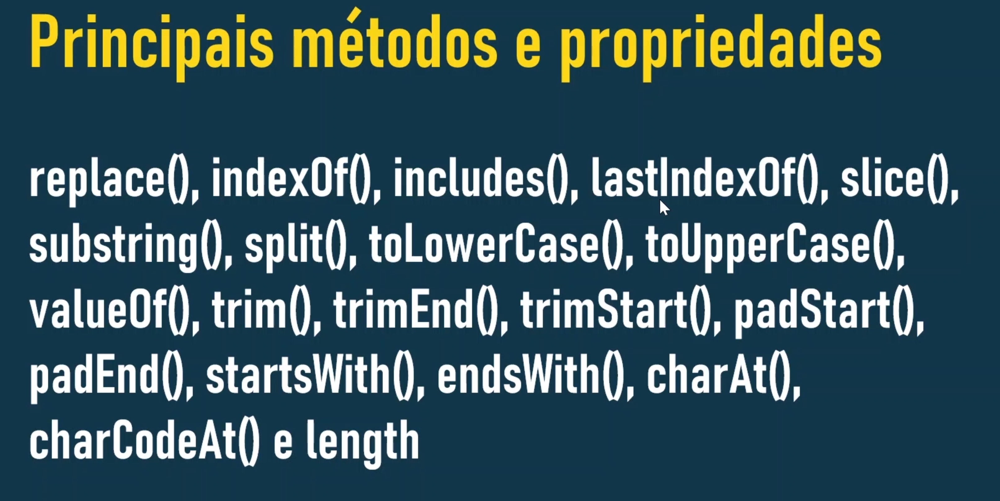
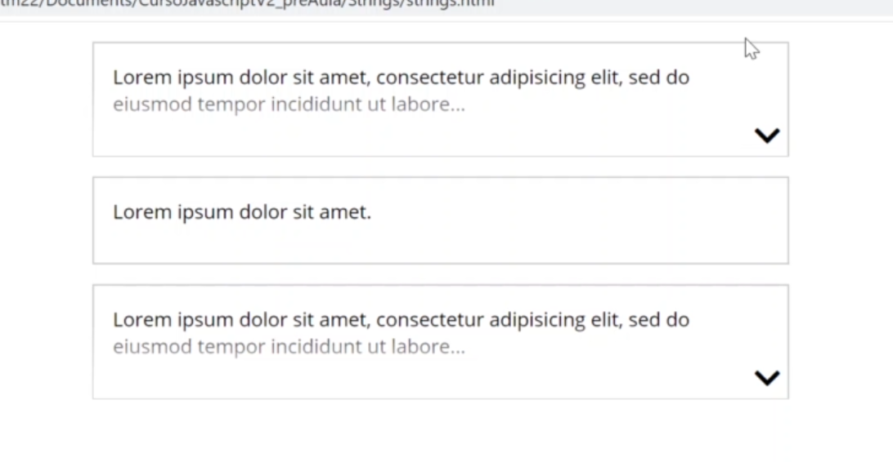
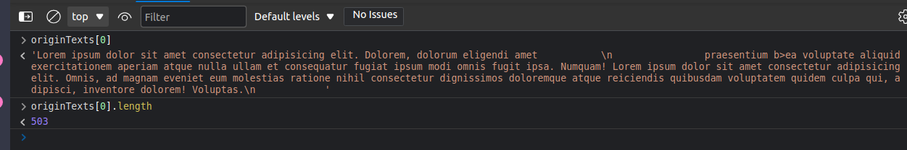
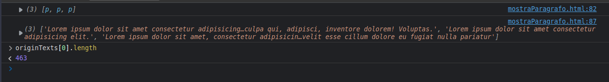

# SEÇÃO 12 - STRINGS

 

## replace(), replaceAll(), indexOf(), lastIndex(), includes()
 

Agora que vimos como criar uma `função construtora` contendo propriedades e metodos vamos ver algumas funções construtoras `nativas` do javascript. Para começar vamos falar sobre `strings`.

Vamos criar um novo arquivo chamado `introdução.js` para podermos ver os metodos e propriedades das `string`. Copiamos e colamos os metodos que iremos ver do slide para o nosso arquivo de introdução para facilitar a visualização dos mesmos.

Alguns metodos não irão funcionar em todos os browser e tbm existem alguns outros metodos que iremos falar quando formos estudar `expressões regulares`. O metodo `replaceAll()` por exemplo, não irá funcionar em todos os browsers, porem é muito simples fazer esse metodo funcionar em todos os browsers. Ele serve para quando precisarmos fazer uma substituição de uma determinada `string` para outra determinada `string`, é muito simples programar esse resultado usando o metodo `replace()` em conjunto com `expressões regulares`.

- Vamos colocar um asterisco `*` nos metodos que não vao funcionar em todos os browsers.

~~~
/**

replace(),  replaceAll()**
indexOf(),  lastIndexOf(),  includes()*,
slice(),    substring(),    split(),
toLowerCase(),  toUpperCase(),
valueOf(),
trim()*,     trimEnd()*,      trimStart()*,
padStart()*,     padEnd()*,   
startWith()*,    endsWith()*,
charAt(), charCodeAt()      e length().

*/ 
~~~

- Vamos ver os metodos `replace()` e `replaceAll()`, criando uma variavel chamada `str1` que irá receber uma string.
- O metodo `replace()` irá substituis uma `string` por outra `string`.

~~~
let str1 = "minha string bacanuda";
console.log(str1);
console.log(str1.replace("i","o"));

// SAIDA:

❯ node introducao.js
minha string bacanuda
monha string bacanuda

~~~

- Podemos ver que onde tinhamos a letra `i` na primeira ocorrencia e ela foi trocada pela letra `o`, esse metodo so substitui a primeira ocorrencia da letra que queremos substituir, o resto permanece intacto. É por isso que existe o metodo `replaceALl()`, porem é muito facil conseguir o mesmo resultado do metodo `replaceAll()`, ou seja, substituir todas as ocorrencias, usando o `replace()` juntamente com as `expressões regulares`.
- Observe tbm que o metodo `replace()` não é um metodo `destrutivo` ou seja, nossa `string original` permanece intacta mesmo depois da utilização desse metodo.
- Esse metodo será destrutivo, caso escrevessemos o codigo da seguinte maneira:

~~~
let str1 = "minha string bacanuda";
console.log(str1);
str1 = str1.replace("i","o");
console.log(str1);

// SAIDA:

❯ node introducao.js
minha string bacanuda
monha string bacanuda
~~~

- Agora vamos ver rapidamente como obter o mesmo resultado do `replaceAll()`, ou seja, substituir todas as ocorrencias da letra `i`  pela letra `o` utilizando `expressões regulares`.

~~~
let str1 = "minha string bacanuda";
console.log(str1.replace(/i/g, "o"));
console.log(str1);

// SAIDA:

❯ node introducao.js
monha strong bacanuda
minha string bacanuda
~~~

- Vejam que agora todas as ocorrencias de `i` foram alteradas para `o`. Por isso que falamos que o metodo `replaceAll()` não é tão util a partir do momento que temos um conhecimento sobre `expressões regulares`.
- Se formos no site do `can i use` observamos que o metodo `replaceAll()` quase não possui suporte para nenhum browser.
- Agora vamos ver o metodo `indexOf()` que irá nos retornar a `posição de uma determinada string` que passarmos por parametro para ele, dentro de uma outra `string`.

~~~
let str1 = "minha string bacanuda";

// metodo replace() + expressão regular = replaceAll()
console.log(str1.replace(/i/g, "o"));
console.log(str1);

// metodo indexOf()
console.log(str1.indexOf("string"));

// SAIDA:

❯ node introducao.js
monha strong bacanuda
minha string bacanuda
6
~~~

- Como podemos ver na saida do console, foi retornado a posição `6`, ou seja, na string `minha string bacanuda` o `s` que é o começo da string que buscamos esta na posição/indice `6`.
- Se buscarmos pelo caractere `i` teremos como saida o `indice=1`.

~~~
let str1 = "minha string bacanuda";

// metodo replace() + expressão regular = replaceAll()
console.log(str1.replace(/i/g, "o"));
console.log(str1);

// metodo indexOf()
console.log(str1.indexOf("string"));
console.log(str1.indexOf("i"));

// SAIDA:

❯ node introducao.js
monha strong bacanuda
minha string bacanuda
6
1
~~~

- Agora vamos ver o que acontece quando usamos o metodo `lastIndexOf()` procurando a letra `i`.

~~~
let str1 = "minha string bacanuda";

// metodo replace() + expressão regular = replaceAll()
console.log(str1.replace(/i/g, "o"));
console.log(str1);

// metodo indexOf()
console.log(str1.indexOf("string"));
console.log(str1.indexOf("i"));

// metodo lastIndexOf()

console.log(str1.lastIndexOf("i"));

// SAIDA:
❯ node introducao.js
monha strong bacanuda
minha string bacanuda
6
1
9
~~~

- Vemos que a ultima ocorrencia da letra `i` esta no indice `9`. 
- Agora se procurarmos uma string ou caractere que não existe, teremos como retorno o numero `-1`, tanto para o metodo `indexOf()` quanto para o metodo `lastIndexOf()`.

~~~
let str1 = "minha string bacanuda";

// metodo replace() + expressão regular = replaceAll()
console.log(str1.replace(/i/g, "o"));
console.log(str1);

// metodo indexOf()
console.log(str1.indexOf("string"));
console.log(str1.indexOf("i"));

// metodo lastIndexOf()

console.log(str1.lastIndexOf("i"));
console.log(str1.lastIndexOf("x"));

// SAIDA:

❯ node introducao.js
monha strong bacanuda
minha string bacanuda
6
1
9
-1

~~~ 

- Ja o metodo `includes()`, é um metodo que veio nas versões mais novas dos browser, onde ele determina se uma `string` pode ser encotrada em outra `string`, devolvendo um booleano dependendo do resultado.
- Nesse metodo tbm podemos passar uma posição onde queremos que a busca comece.

~~~
[SINTAXE]

str.includes(searchString[,position]);
~~~

- A grande questão é que se temos o metodos `indexOf()` e se ao procurar uma string que não existe temos o retorno de `-1` quando não encotrarmos a `string procurada` conseguimos, digamos assim, criar o nosso proprio `includes()`.
- Vamos ver como funciona o `includes()`.

~~~ 
let str1 = "minha string bacanuda";

// metodo replace() + expressão regular = replaceAll()
console.log(str1.replace(/i/g, "o"));
console.log(str1);

// metodo indexOf()
console.log(str1.indexOf("string"));
console.log(str1.indexOf("i"));

// metodo lastIndexOf()

console.log(str1.lastIndexOf("i"));

// procurando uma string/caractere que não existe
console.log(str1.lastIndexOf("xasda"));

// metodo includes()

console.log(str1.includes("minha"))
console.log(str1.indexOf("minha"))
console.log(str1.includes("minha") >= 0);

// SAIDA:

❯ node introducao.js
monha strong bacanuda
minha string bacanuda
6
1
9
-1
true
0
true
~~~

- Como podemos ver na saida o nosso `includes()` e o nosso `indexOf() >=0` irão nos retornar o mesmo `booleano`, logo se trocarmos o console colocando a string que não existe, como resultado teremos...

~~~
let str1 = "minha string bacanuda";

// metodo replace() + expressão regular = replaceAll()
console.log(str1.replace(/i/g, "o"));
console.log(str1);

// metodo indexOf()
console.log(str1.indexOf("string"));
console.log(str1.indexOf("i"));

// metodo lastIndexOf()

console.log(str1.lastIndexOf("i"));

// procurando uma string/caractere que não existe
console.log(str1.lastIndexOf("xasda"));

// metodo includes()

console.log(str1.indexOf("asdas"))
console.log(str1.includes("asdas"))
console.log(str1.indexOf("asdas"))
console.log(str1.indexOf("asdas") >= 0);

// SAIDA:

❯ node introducao.js
monha strong bacanuda
minha string bacanuda
6
1
9
-1
-1
false
-1
false
~~~

- Como resultado temos o mesmo para ambos os `metodos.`

 

 

## slice(), substring()
 

Vamos agora focar nos metodos `splice()` e `substring()`, que são metodos usados para criar `pequenas strings` baseadas em `string maiores`.

- Vamos usar nossa `str1` para exemplificarmos o `slice()` que precisa como parametros o `inicio` e o `final`, ambos os parametros sendo numeros.
  - O `inicio` seria onde começamos a cortar.
  - o `final` seria onde paramos e não inclui o mesmo, ou seja, se colocarmos como parametro `(2,5)` irá começar no `2` e terminar no `4`.

~~~
let str1 = "minha string bacanuda";

// metodo slice() e substring()
console.log(str1);
console.log(str1.slice(2,5));
console.log(str1.substring(2,5));

// SAIDA:

❯ node introducao.js
minha string bacanuda
nha
nha

~~~

- Pela saida podemos ver que os dois metodos tiveram o mesmo retorno. Logo a partir da posição `2` até a `5-1 = 4` a string foi "cortada" por ambos os metodos.
- Um detalher importante tbm é que para ambos os metodos, o `parametro final` é `opcional`.

~~~
// metodo slice() e substring()
console.log(str1);
console.log(str1.slice(2,5));
console.log(str1.substring(2,5));
console.log(str1.slice(2));
console.log(str1.substring(2));

// SAIDA:

❯ node introducao.js
minha string bacanuda
nha
nha
nha string bacanuda
nha string bacanuda
~~~

- A diferença entre os dois metodos é bastante sutil. O metodo `slice()` permite que a gente passe `valores negativos`. Porem irá dar uma diferença, onde o `slice()` aceita parametros negativos, ja o `substring()`, qualquer valor negativo que passarmos irá ser entendido como `0`.

~~~
// metodo slice() e substring()
console.log(str1);
console.log(str1.slice(2,5));
console.log(str1.substring(2,5));
console.log(str1.slice(2));
console.log(str1.substring(2));
console.log(str1.slice(-2));
console.log(str1.substring(-2));

// SAIDA:

❯ node introducao.js
minha string bacanuda
nha
nha
nha string bacanuda
nha string bacanuda
da
minha string bacanuda
~~~

- Como podemos ver na saida do `substring()` não ha alteração nenhuma. No `slice()` o valor `negativo` significa para começar do `fim`.

~~~ 
// metodo slice() e substring()
console.log(str1);
console.log(str1.slice(2,5));
console.log(str1.substring(2,5));
console.log(str1.slice(2));
console.log(str1.substring(2));
console.log(str1.slice(-5));
console.log(str1.substring(-2));

// SAIDA:

❯ node introducao.js
minha string bacanuda
nha
nha
nha string bacanuda
nha string bacanuda
anuda
minha string bacanuda
~~~

- Tambem conseguimos passar para o `slice()` um segundo parametro negativo, por exemplo:

~~~
// metodo slice() e substring()
console.log(str1);
console.log(str1.slice(2,5));
console.log(str1.substring(2,5));
console.log(str1.slice(2));
console.log(str1.substring(2));
console.log(str1.slice(-5,-1));
console.log(str1.substring(-2,-1));

// SAIDA:

❯ node introducao.js
minha string bacanuda
nha
nha
nha string bacanuda
nha string bacanuda
anud
~~~

- Outro detalhe do `substring()` é que ao passarmos 2 parametros negativos nos é retornado uma `string vazia`que não é mostrado no console.
- Uma outra diferença entre os metodos é quando passamos o `valor inicial` maior que o `valor final`. Nesse caso quem irá "ganhar" é o metodo `substring()` que irá fazer a inversão.
  
~~~
// metodo slice() e substring()
console.log(str1);
console.log(str1.slice(2,5));
console.log(str1.substring(2,5));
console.log(str1.slice(2));
console.log(str1.substring(2));
console.log(str1.slice(-5,-1));
console.log(str1.substring(-2,-1));
console.log(str1.slice(8,1));
console.log(str1.substring(8,1));

// SAIDA:

❯ node introducao.js
minha string bacanuda
nha
nha
nha string bacanuda
nha string bacanuda
anud

inha st
~~~

- Pela saida, se passarmos para o `slice()` um numero `inicial` maior que o `final` irá nos retornar uma `string vazia`.

 

 

## toLowerCase() e toUpperCase()
 

Esses dois metodos servem apenas para transformar a nossa `string` em `maiuscula` ou `minuscula`.

~~~ 
// metodo toUpserCase() e toLowerCase()

console.log(str1.toUpperCase());
console.log(str1.toLowerCase());
console.log(str1);

// SAIDA:

❯ node introducao.js
MINHA STRING BACANUDA
minha string bacanuda
Minha String Bacanuda
~~~

- Observe que esse metodo não é um metodo destrutivo, ou seja, a nossa string original não é alterada ao usarmos qualquer um dos 2.

 

 

## valueOf()
 

O metodo `valueOf()` serve para retornar o `valor primitivo` de um objeto do `tipo string`.

- Vamos criar uma variavel chamada `strAsObj` que irá receber um objeto do tipo `string`.

~~~ 
let strAsObj = new String("minha string como objeto");
console.log(strAsObj);
console.log(strAsObj.valueOf());
console.log(strAsObj.toString());

// SAIDA:

❯ node introducao.js
[String: 'minha string como objeto']
minha string como objeto
minha string como objeto

~~~

- Essa função é utilizada mais internamente por outras funções.

 

 

## trim()
 

O `trim()` é um metodo que não exisita antes, ele serve para remover os `estaços em branco` no final e no inicio da string.

- Por exemplo vamos alterar nossa `str1`para exemplificarmos como o `trim()` funciona.

~~~
// metodo trim()

str1 = "    " + str1 + "    ";
console.log(str1);
console.log(str1.trim());
console.log(str1.trimEnd());
console.log(str1.trimStart);
console.log(str1);

// SAIDA:

❯ node introducao.js
    Minha String Bacanuda    
Minha String Bacanuda
    Minha String Bacanuda
[Function: trimStart]
    Minha String Bacanuda  
~~~

- O `trim()` não somente tira os espaços vazios, podemos objservar isso da seguinte maneira:

~~~ 
// metodo trim()

str1 = "    " + str1 + "    ";
console.log(str1);
console.log("----------------------");
console.log(str1.trim());
console.log("----------------------");
console.log(str1.trimEnd());
console.log("----------------------");
console.log(str1.trimStart);
console.log("----------------------");
console.log(str1);
console.log("----------------------");

str1 = `
    teste
    pula linha

    fim da linha

            
`

console.log(str1);
console.log("----------------------");
console.log(str1.trim());
console.log("----------------------");
console.log(str1.trimEnd());
console.log("----------------------");
console.log(str1.trimStart);
console.log("----------------------");
console.log(str1);

// SAIDA:

❯ node introducao.js
    Minha String Bacanuda    
----------------------
Minha String Bacanuda
----------------------
    Minha String Bacanuda
----------------------
[Function: trimStart]
----------------------
    Minha String Bacanuda    
----------------------

    teste
    pula linha

    fim da linha

            

----------------------
teste
    pula linha

    fim da linha
----------------------

    teste
    pula linha

    fim da linha
----------------------
[Function: trimStart]
----------------------

    teste
    pula linha

    fim da linha

            

~~~

- Vejam que a diferença entre um e outro na saida acima.

 

 

## padStart(), padEnd() e desafio ultima hora 
 

Esses metodos dizem respetio ao preenchimento da nossa string. Não irão funcionar no `IE`.

- A primeira coisa que iremos fazer para exemplificar será alterar o valor da nossa `str1` colocando uma string contendo somente numeros.
- Depois iremos ver no console o `str1.padStart()`, onde passaremos como parametro o numero `20`.

~~~ 
// metedo padStart() e padEnd()

str1 = "0123456789";
console.log(str1);
console.log(str1.padStart(20));
console.log(str1);

// SAIDA:

❯ node introducao.js
0123456789
          0123456789
0123456789
~~~ 

- Como podemos ver na saida, quando usamos o numero `20` como parametro do metodo `padStart()` foram colocados 10 caracteres no começo da nossa string, para completar os 20 caracteres que solicitamos ao utilizarmos o metodo. Ou seja, termos um `length` de 20.
- Observem tbm que o `padStart()` não é um metodo destrutivo.
- Vejam agora o que acontece se colocarmos um segundo parametro, por exemplo, um `*` asterisco. O preenchimentoa gora não será com espaços mas sim com `*  asteriscos`.

~~~ 
// metedo padStart() e padEnd()

str1 = "0123456789";
console.log(str1);
console.log(str1.padStart(20));
console.log(str1.padStart(20, "*"));
console.log(str1);
// SAIDA:

❯ node introducao.js
0123456789
          0123456789
**********0123456789
0123456789
~~~

- O metodo `padEnd()` faz a mesma coisa porem no final da string.

~~~
// metedo padStart() e padEnd()

str1 = "0123456789";
console.log(str1);
console.log(str1.padStart(20));
console.log(str1.padStart(20, "*"));
console.log(str1.padStart(20, "*").length);
console.log(str1); 

// SAIDA:

❯ node introducao.js
0123456789
          0123456789
**********0123456789
20
0123456789
~~~

- Esses metodos são bastante uteis para quando queremos "esconder" determinado numero, por exemplo um site que possui um telefone...
- Vamos criar uma função para mascarar o telefone, basicamente o que queremos é que a função receba um numero de telefone qualquer e o retorn da seguinte maneira: `9****-**45`.
- O desafio é fazermos essa funçção.

~~~ 

let telefone = "99145356";
function mascararTelefone(numero){
    return "9****-**56";
}
~~~

 

 

## resolução: Desafio
 

Vamos resolver o exercicio da aula passada, fazendo algumas alterações, vamos criar uma outra variavel e alterar a que criamos para `telefone1` e `telefone2`. Vamos tbm fazer uma simulação de um telefone com 8 digitos.

~~~
// desafio

let telefone1 = "99144-5356"; // 9****-**56
let telefone2 = "1234-2345"; // "1***-**45
function mascararTelefone(numero){
    return "9****-**56";
}
~~~

- A primeira coisa que temos que fazer é obter a posição do `hifem (-) `. Para isso vamos criar dentro da função uma variavel chamada `hifemPosição`, que irá receber o `indice` onde o `hifem` se encontra.

~~~ 
// desafio

let telefone1 = "99144-5356"; // 9****-**56
let telefone2 = "1234-2345"; // "1***-**45
function mascararTelefone(numero){
    let hifemPosição = numero.indexOf("-");
    console.log(hifemPosição);

}

mascararTelefone(telefone1);
mascararTelefone(telefone2);

// SAIDA:

❯ node introducao.js
5
4
~~~ 

- Poderiamos pegar esse `indice` de outra forma, porem ainda não vimos em aulas anteriores.
- Agora iremos separar o numero de telefone em 2 numeros `numero inicial` e o `numero final`.
- Como vamos usar o `slice()` precisamos ter em mente que o `ultimo parametro` não é incluido, ou seja, o `hifem` não será incluido nessa nova string. Para pegarmos o `numero final` usaremos a posição do `hifem + 1` pois não queremos que o mesmo vah para a string.

~~~ 
// desafio

let telefone1 = "99144-5356"; // 9****-**56
let telefone2 = "1234-2345"; // "1***-**45
function mascararTelefone(numero){
    let hifemPosição = numero.indexOf("-");
    let numeroInicio = numero.slice(0, hifemPosição);
    let numeroFinal = numero.slice(hifemPosição + 1);
    console.log(hifemPosição);
    console.log(numeroInicio);
    console.log(numeroFinal);

}

console.log("----------- telefone 1 -----------");
mascararTelefone(telefone1);
console.log("----------- telefone 2 -----------");
mascararTelefone(telefone2);

// SAIDA:

❯ node introducao.js
----------- telefone 1 -----------
5
99144
5356
----------- telefone 2 -----------
4
1234
2345
~~~

- Como podemos ver agora no console, separamos os numeros dos telefones entre `numero inicial` e `numero final`.
- Agora que temos o `numero inicio` e o `numero fim`e sabemos o `.length` deles, podemos acessar a `string` como se fosse um `array`, logo no retorno da função, iremos pegar o primeiro caractere do numero inicial `numeroInicio[0]`.
- Podemos fazer uma concatenação ou a utilização das `templates strings`. Como ja colocamos o primeiro numero do telefone, queremos que seja depois preenchido com `*` ate o `hifem`. para isso vamos usar o `.padEnd()` passanod a quantidade de caracteres que queremos ou seja, `numeroInicio.length`, e o `*` que será o caractere que queremos colocar no numero.
- Depois colocamos o `hifem -` para separar os `asteriscos`, vamos criar uma variavel para salvar os 2 numeros finais e facilitar nosso codigo, usando o `slice()` e passando o vallor negativo de `-2` conseguimos peggar os dois ultimos elementos de uma string. Para preencher o resto com os `*` vamos usar o metodo `padStart()`, passando como parametro de quantidade o `numeroFinal.length` e o `*` como caractere que queremos.

~~~ 
// desafio

let telefone1 = "99144-5356"; // 9****-**56
let telefone2 = "1234-2345"; // "1***-**45
function mascararTelefone(numero){
    let hifemPosição = numero.indexOf("-");
    let numeroInicio = numero.slice(0, hifemPosição);
    let numeroFinal = numero.slice(hifemPosição + 1);
    let doisNumerosFinais = numeroFinal.slice(-2);
    console.log(numero);
    return `${numeroInicio[0].padEnd(numeroInicio.length, "*")} - ${doisNumerosFinais.padStart(numeroFinal.length,"*")}`

}

console.log("----------- telefone 1 -----------");
console.log(mascararTelefone(telefone1));
console.log("----------- telefone 2 -----------");
console.log(mascararTelefone(telefone2));

// SAIDA:

❯ node introducao.js
----------- telefone 1 -----------
99144-5356
9**** - **56
----------- telefone 2 -----------
1234-2345
1*** - **45
~~~

 

 

## startsWith() endsWith()
 

Essas funções, `startWith()` e `endsWith()` são funções que irão retornar um booleano e servem para verificar se uma `string` começa ou termina com um `caractere especifico`.

- Vamos criar uma nova variavel chamda `str2` e vamos passar uma string para ela. 
- Depois iremos verificar no `console` se essa string começa com a palavra `hoje`.

~~~
// metodo startsWith() e endsWith()

str2 = "Hoje é Sábado";
console.log(str2.startsWith("hoje"));
console.log(str2.endsWith("hoje"));

// SAIDA:

❯ node introducao.js
false
false
~~~

- Como podemos ver temos na saida o `false` na primeira chamada pois o metodo `startsWith() e endsWith()` é `case sensitive` ou seja, precisa estar exatamente igual, e na nossa `str2` temos a palavra hoje com `letra maiuscula` e no metodo buscando com minuscula, vamos mudar isso para ver a saida diferente.

~~~
// metodo startsWith() e endsWith()

str2 = "Hoje é Sábado";
console.log(str2.startsWith("Hoje"));
console.log(str2.endsWith("Hoje"));

// SAIDA:

❯ node introducao.js
true
false
~~~

- Os metodos `startsWith() e endsWith()` pode receber um `segundo parametro` opcional que seria o indice de onde começar a procurar a palavra desejada.

~~~
// metodo startsWith() e endsWith()

str2 = "Hoje é Sábado";
console.log(str2.startsWith("Hoje",1));
console.log(str2.endsWith("Sábado"));

// SAIDA:

❯ node introducao.js
false
true

~~~

- Vejam que na saida do primeiro console recebemos o `false` pois começamos do `indice = 1`, se colocarmos a posição `0`, teremos como saida do console o `true`, pois o `indice = 1` refere-se ao `o` da string.

~~~
// metodo startsWith() e endsWith()

str2 = "Hoje é Sábado";
console.log(str2[1]);
console.log(str2.startsWith("Hoje",0));
console.log(str2.endsWith("Sábado"));

// SAIDA:
❯ node introducao.js
o
true
true

~~~

- Vamos ver o que acontece se colocarmos como parametro do `endsWith()` o numero `2`. Nesse metodo, o `segundo parametro` não é a posição onde se deve começar a procurar e sim o `tamanho da string`.
- Vamos procurar a letra `é` na substring que vai até o tamanho de `6`.

~~~ 
// metodo startsWith() e endsWith()

str2 = "Hoje é Sábado";
console.log(str2[1]);
console.log(str2.startsWith("Hoje",0));
console.log(str2.endsWith("Sábado",2));
console.log(str2.endsWith("é",6));

// SAIDA:

❯ node introducao.js
o
true
false
true
~~~

 

 

## charAt(), charCodeAt()
 

Vamos agora ver os ultimos metodos que precisamos ver. Vamos criar uma nova variavel chamada `str3` que irá receber uma string.

- Vamos ver primeiramente o metodo `charAt()` que recebe como parametro um numero que é a `posição` cujo valor queremos recuperar. Por exemplo, vamos passar o numero `1`.

~~~
// metodo charAt()

str3 = "abcdefgh";
console.log(str3.charAt(1));

// SAIDA:
❯ node introducao.js
b
~~~

- Ja o metodo `charCodeAt()` irá nos retornar o `codigo` da tabela `unicode` do caractere cuja a `posição` passarmos.

~~~
// metodo charAt() e charCodeAt()

str3 = "abcdefgh";
console.log(str3.charAt(1));
console.log(str3.charCodeAt(1));

// SAIDA:

❯ node introducao.js
b
98
~~~

 

 
s
## exercicio proposto: paragrafos com reticencias
 

Vamos fazer um exercicio um pouco mais elaborado antes de seguirmos para o desafio da seção.

Temos alguns paragrafos que estão dentro de um card e quando o paragrafo tiver um `.length` maior que qualquer numero, por exemplo `100` queremos colocar uma classe no `card` e concatenar com as `reticencias ...` e tbm coloca um `icone` de seta para `expandir o paragrafo`.

~~~
<!DOCTYPE html>
<html lang="en">
<head>
    <meta charset="UTF-8">
    <meta http-equiv="X-UA-Compatible" content="IE=edge">
    <meta name="viewport" content="width=device-width, initial-scale=1.0">
    <title></title>
	<link href="https://fonts.googleapis.com/css2?family=Open+Sans&display=swap" rel="stylesheet">
	<link rel="stylesheet" href="https://use.fontawesome.com/releases/v5.8.1/css/all.css"
		integrity="sha384-50oBUHEmvpQ+1lW4y57PTFmhCaXp0ML5d60M1M7uH2+nqUivzIebhndOJK28anvf" crossorigin="anonymous">
    <title>Exercicio: Mostra Paragrafo</title>
    
</head>
<body>
    

        

            
Lorem ipsum dolor sit amet consectetur adipisicing elit.<b> Dolorem, dolorum eligendi amet praesentium </b>b>ea voluptate aliquid exercitationem aperiam atque nulla ullam et consequatur fugiat ipsum modi omnis fugit ipsa. Numquam! Lorem ipsum dolor sit amet consectetur adipisicing elit. Omnis, ad magnam eveniet eum molestias ratione nihil consectetur dignissimos doloremque atque reiciendis quibusdam voluptatem quidem culpa qui, adipisci, inventore dolorem! Voluptas.

        

        

            
Lorem ipsum dolor sit amet consectetur adipisicing elit.

        

        

            
Lorem ipsum dolor sit amet, consectetur adipisicing elit, sed do eiusmod tempor incididunt ut labore et dolore magna aliqua. Ut enim ad minim veniam, quis nostrud exercitation ullamco laboris nisi ut aliquip ex ea commodo consequat. Duis aute irure dolor in reprehenderit in voluptate velit esse cillum dolore eu fugiat nulla pariatur

        

    

    
</body>
</html>
~~~

- Colocamos a tag `b` dentro do paragrafo para mostrar que no exercicio que vamos fazer, não podemos ter essa `elementos aninhados`  pois iremos fazer uma verificação na string de quantidade de caracteres e quando chegar a `100`. 
- O problema de termos tag aninhadas seria no caso de chegar a contagem de `100` caracteres e estar no meio dessa tag, podendo gerar problema no html.

- A primeira coisa que iremos fazer no javascript será criar uma função auto-invocavel. Onde iremos criar uma constante para recebber a referencia para os nossos paragafos.

~~~
;(function(){
    // nodelist de elementos contendo os paragrafos
    const paragrafo = document.querySelectorAll(".card p"); // nodeList
    console.log(paragrafo);
})()
~~~

- Precisamos guardar o paragrafo original, pois iremos perde-lo quando a pessoa clicar para abrir e fechar na seta.
- Para resgatar o valor dos paragrafos, vamos transformar nossa `nodelist` em um `array` para poder utilizar o metodo `map()` e buscar dentro de cada paragrafo dentro do `array` seu valor. 
- Vamos ver a diferença entre lembrando que se usarmos `.textContent` espaços em branco e quebras de linhas serão contabilizados, deixando o `.length` desse paragrafo muito grande, ja o `.innerText` (que iremos utilizar) não contabiliza esses caracteres.

~~~
;(function(){
    // nodelist de elementos contendo os paragrafos
    const paragrafo = document.querySelectorAll(".card p"); // nodeList
    console.log(paragrafo);
    // criando array a partir da nodelist
    console.log(Array.from(paragrafo));
    // fazemos o mapeamento em cada paragrafo para armazenar somente o texto do mesmo.
    const originTexts = Array.from(paragrafo)
        .map( p => {
             return p.textContent;
        });
    console.log(originTexts);  
    
})()

[ ALTERNATIVAS DE COMO ESCREVER O MAP()]
const originTexts = Array.from(paragrafo).map( p => {
    return p.textContent;
});
console.log(originTexts);

const originTexts = Array.from(paragrafo)
    .map( p => {
        return p.textContent;
    });
console.log(originTexts);

const originTexts = Array.from(paragrafo).map( p => p.textContent);
console.log(originTexts);
~~~ 

- Vamos tirar a função autoinvocavel para poder deixar as variaveis no escopo global e assim podermos invoca-las no consle do browser. Lembrando que isso não é uma boa pratica.

~~~ 
[INNERHTML]

[TEXTCONTENT]

~~~ 

- Nas imagens acima podemos ver o pq de utilizar o `innerText` em vez do `textContent`, tendo uma redução significativa no `.length`. Logo nesse exemplo, utilizar o `innerText`  é melhor.
- Para não termos que excrever muito codigo, vamos na nossa variavel `paragrafo` que atualmente é uma `nodeList`, altera-la para virar um `array` diretamente.

~~~

~~~

- Fazemos essa lateração para usarmos o `.forEach()`, que poderiamos ter utilizado dentro da `nodeList` porem as vezes da um bug em outros browser, por isso criamos a `array` de verdade.
- Vamos tbm criar uma varivel que irá guardar a quantidade maxima de caracteres no texto para que seja escondido caso a exceda.
- Caso a quantidade de caracteres no paragrafo seja maior que a nossa variavel `maxLength=100`, o paragrafo irá receber uma `substring ou slice`, que irá de `0` até o nosso `maxLength`, concatenando com a reticencias para mostrar que possui mais texto.
  
~~~

~~~

- Como podemos ver no nosso browser ja foi colocado as reticencias caso o paragrafo seja maior que o `maxLength` que definimos.
- Agora precisamos fazer algumas coisas nos paragrafos cuja as `reticencias` foram colocadas.
- Vamos criar um botão dinamicamente `btn`, e colocaremos um texto dentro deste botão usando o `.innerHtml` pois iremos utilizar o `fontAwesome` novamente para mostrar o icone.

~~~

~~~ 

- No nosso `style` temos uma classe chamada `textHidden` que irá colocar um `degrade` nas palavras a dos paragrafos que possuem mais de `100` caracteres.
- Tbm iremos antes de criar o botão a classe `text-hidden`, para que o `degrade` funcione.
- Vamos colocar esse botão dentro do nosso `card` usando o `p.parentElement`.

~~~

~~~

- Agora que temos o botão iremos colocar um evento nele que irá chamar a função que iremos criar tbm chamada `toggleText`.
- Vamos utilizar o `evt.currentTarget` que irá nos trazer o elemento ao qual foi atrelado o nosso `evento` ou seja, o `botão`. Poderiamos tbm utilizar o `this`para isso como vimos anteriormente. Nesse caso tbm, não poderiamos utilizar o `evt.target` pois ele poderia se referir tanto ao `botão`quanto a `tag i` que colocamos.
- Para acessarmos o `card` precisamos ter acesso ao `parentElement` que seria o `card` para isso vamos criar uma cosntante chamada `card`.
- Depois iremos fazer uma verificação, se o `card` possuem a classe `text-hidden` vamos remove-la, caso não, iremos adiciona-la. Para isso iremos utilizar um novo metodo da `classList` chamado `toggle`, que adiciona ou remove uma classe.

~~~
function toggleText(evt){
    console.log(evt.currentTarget);
    console.log(this);
    const card = this.parentElement;
    card.classList.toggle("text-hidden");
    this.querySelector("i").classList.toggle("fa-chevron-down");
    this.querySelector("i").classList.toggle("fa-chevron-up");
}
~~~ 

- Agora precisamos ter acesso ao nosso parafrago original para podermos substituir pelo resto do texto que foi "cortado".
- Para isso, podemos utilizar a função `;forEach()` fazendo com que ela receba o indice, e alterarmos o evento do botão para que receba uma função de calllback que chama a função `toggletext()` que irá receber como parametros o `evt, parafrago, indice`.

> falta texto

~~~

~~~

 

 

## Desafio: Formatar nome
 

Vamos criar um novo documento chamado `desafio_formatarNome.js`, onde temos uma função chamada `formatarNome()` que irá receber como parametro `nomeCompleto` e ela terá que retornar um nome formatado.

~~~
function formatarNome(nomeCompleto0{
    retrn "";
})

console.log(formatarNome("Daniel")); // Daniel
console.log(formatarNome("Daniel Morales")); // Morales,Daniel
console.log(formatarNome("Daniel Tapias Morales")); // Tapias Morales,Daniel

~~~

 

 

## Resolução: desafio
 

~~~
function formatarNome(nomeCompleto){
    // removendo espaços iniciais e finais de um nome
    nomeCompleto = nomeCompleto.trim();
    // achando indice do primeiro espaço
    const space = nomeCompleto.indexOf(" ");
    // const space = nomeCompleto.lastIndexOf(" ");
    console.log(space);
    if(space < 0){
        return nomeCompleto;
    }
    // criando substrings
    const primeiroNome = nomeCompleto.slice(0,space);
    const sobrenome = nomeCompleto.slice(space + 1);
    console.log(primeiroNome);
    console.log(sobrenome);

    return sobrenome + ", " + primeiroNome;

}

console.log(formatarNome("Angelina pierre Tripodi")); 
~~~

 

 

## split()
 

~~~
[USANDO O METODO SPLIT()]

function formatarNome(nomeCompleto){
    // vamos quebrar o nomeCompleta usando o split()
    let nomeAsArray = nomeCompleto.split(" ");
    if(nomeAsArray.length === 1){
        return nomeCompleto;
    }
    // removendo o primeiro elemento do array original.
    let primeiroNome = nomeAsArray.shift();

    return nomeAsArray.join(" ") + ", " + primeiroNome;
}

console.log(formatarNome("Angelina"));
console.log(formatarNome("Angelina Pierre"));
console.log(formatarNome("Angelina Pierre Tripodi"));

~~~

 

 