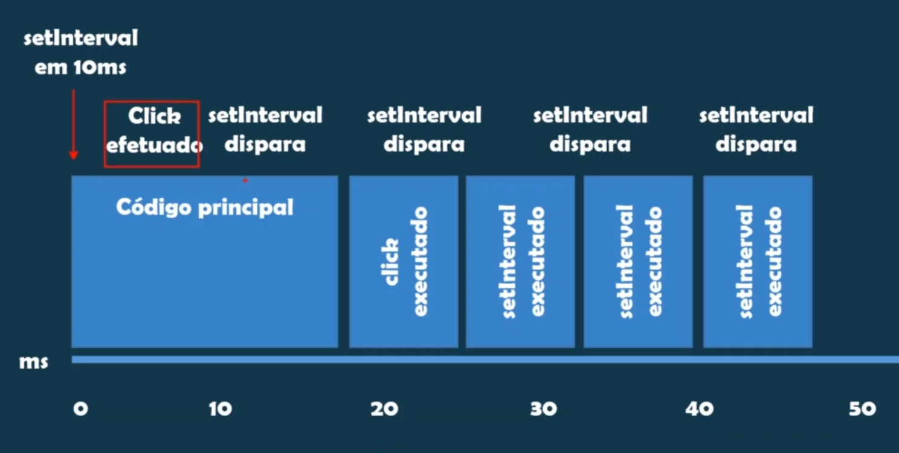

# SEÇÃO 16 - INTERVALOS

 

## Introdução
 

`setTimeout(fn,ms)` agenda uma função para ser executada uma unica vez

`setInterval(fn,ms)` agenda uma função para ser executada em um certo intervalod e tempo.

 

 

## Desafio: save the date
 

 

 

## resolução: desafio
 

 

 