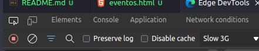
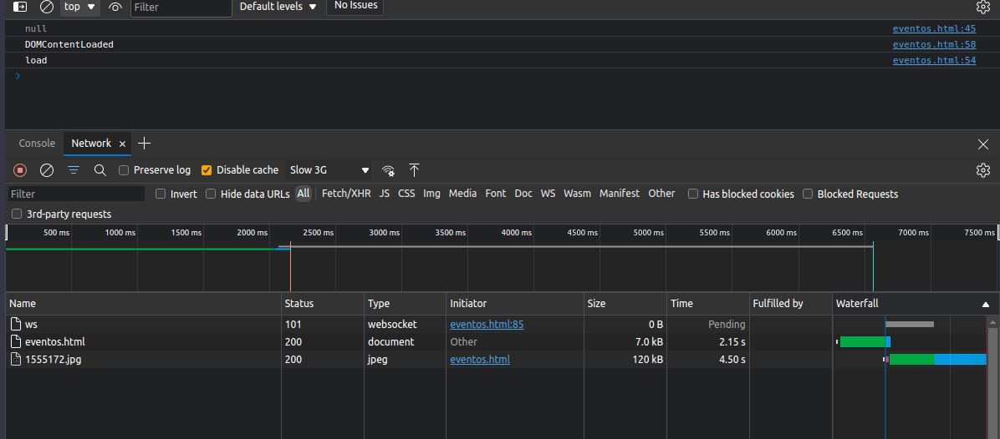
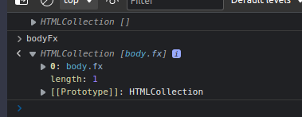

# SEÇÃO 17 - BOM (Browser Object Model)

 

## Introdução
 

 

 

## History
 

 

 

## Location
 

 

 

## Navigator
 

 

 

## Screen
 

 

 

## Métodos de Window
 

 

 

## scrollTo() e scrollBy()
 

Metodos que dizem respeito quando precisamos fazer algum scroll na pagina ou obter alguma informação de scroll.

### Propriedades uteis

- `pageXOffset`
- `pageYOffset`

Para exemplificar temos que colocar alguns conteudos na nossa pagina html

 

 

## Eventos
 

Principais eventos referentes ao DOM

~~~
load
DOMContentLoaded
resize
scroll
unload e beforeunload
~~~

- Vamos primeiramente na parte do javascript colocar alguns `listeners` para exemplificarmos melhor.
- O primeiro evento que iremos colocar será o de `load` no objeto window, ou seja, assim que a pagina estiver totalmente carregada esse evento irá disparar mostrando o console que colocamos dentro da função anonima do evento.
- Vamos tbm criar um outro evento do window para vermos o evento `DOMContentLoaded`.

~~~ 

// SAIDA:

> DOMContentLoaded
> load
~~~

- Observe que os dois são executados quase que imediatamente apos a pagina ser carregada.
- A diferença na pratica pode ser demonstrada da seguinte maneira, adicionaremos uma imagem grande a nossa pagina.
  

- Iremos copiar o endereço da imagem no nosso html.
- Podemos ver que o evento de `load` é disparado quando toda nossa pagina é carregada inclusive os `assets`.
- Ja o evento `DOMContentLoaded` é disparado quando o conteudo da pagina, sem os `assets` é carregado.

Se formos na aba de `network` no console do browser, e desabilitarmos o `cash` e colocarmos para simular uma internet mais devagar, por exemplo `slow 3g` iremos ver esse efeito dos dois eventos.

- Observem o tempo de de atualização da imagem sendo mais lento que o carregamento da pagina inteira, no console podemos ver que o `DOMContentLoaded` é disparado antes do `load` que esta esperando o carregamento dos `assets` .

Vamos ver mais alguns eventos, como por exemplo o `resize` e o `scroll`.

~~~ 

// SAIDA:

DOMContentLoaded
eventos.html:54 load
eventos.html:69 scrolling 3
eventos.html:69 scrolling 18
eventos.html:69 scrolling 31
eventos.html:69 scrolling 38
eventos.html:69 scrolling 43
eventos.html:69 scrolling 47
eventos.html:69 scrolling 49
eventos.html:69 scrolling 51
eventos.html:69 scrolling 52
eventos.html:69 scrolling 53
eventos.html:64 resize event 755 870
eventos.html:64 resize event 752 870
eventos.html:64 resize event 736 870
eventos.html:64 resize event 714 870
eventos.html:64 resize event 682 870

~~~

- Vejam que ao aumentarmos o tamanho da tela ou diminurmos e ao fazermos um `scroll` temos os eventos disparados.

Temos outros dois eventos que seria o `unload` e o `beforeUnload`, esses eventos são um tanto quanto problematicos e temos que utiliza-los com cuidado.

~~~

~~~ 

- Esses eventos serão disparados antes do browser fechar a pagina.
- Mesmo colocando um `alert()` na função anonima desses eventos, não poderemos ver pois o browser ja foi atualizado para esse tipo de "pog", porem se usarmos o debugger, poderemos ver o evento em ação.

~~~
DOMContentLoaded
eventos.html:54 load
eventos.html:81 beforeUnload
eventos.html:1 
Blocked alert('beforeUnload') during beforeunload.
~~~ 

 

 

## Desafio: Scroll
 

 

 

## Resolução: Desafio
 

- A primeira coisa que precisamos ver é quais as variaveis que precisamos manipular no javascript.
- No caso do desafio, a unica coisa que iremos precisar fazer será acessar o `body` para remover ou adicionar a classe `fx`.

- Vamos precisar de um evento de scroll no nosso objeto window, colocando uma verificação para quando scrollarmos ate um determinado numero, ser adicionado a classe `fx` ao body, e ao retornar remover essa classe.

~~~ 
(function(){

    const bodyFx = document.getElementsByClassName("fx");
    console.log(bodyFx);

    window.addEventListener("scroll", function(){
        console.log(pageYOffset);
        if(pageYOffset > 40){
            console.log("adiciona classe fx");
            document.body.classList.add("fx");
        }else{
            console.log("remove classe fx");
            document.body.classList.remove("fx");
        }
    });

})()
~~~

- Temos um problema, toda vez que chamarmos a função de remover, estamos fazendo uma manipulação do DOM de uma maneira que não precisamos, logo iremos implementar a nossa verificação.

~~~ 
(function(){

    const bodyFx = document.getElementsByClassName("fx");
    console.log(bodyFx);

    window.addEventListener("scroll", function(){
        // console.log(pageYOffset);
        if(pageYOffset > 40 && !bodyFx[0]){
            console.log("adiciona classe fx");
            document.body.classList.add("fx");
        }else if(pageYOffset <= 40 && bodyFx[0]){
            console.log("remove classe fx");
            document.body.classList.remove("fx");
        }
    });

})()
~~~ 

- Como o `getElementsByClassName` é `dinamico` podemos utilizar a variavel `bodyFx` para perguntar se ele ja existe ou nao, deixando o codigo mais performatico.

 

 