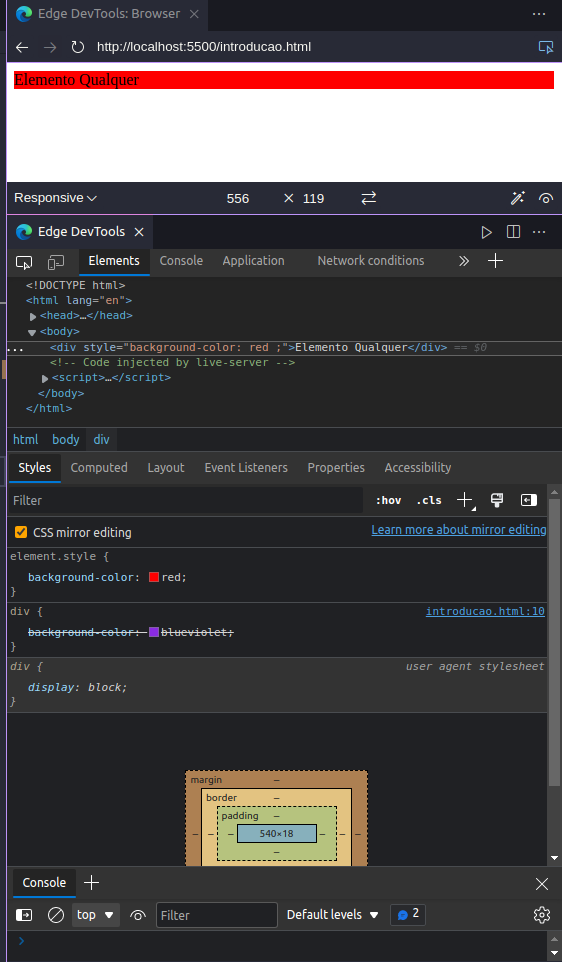
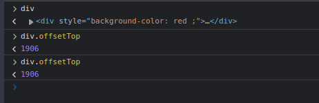

# SEÇÃO 18 - ESTILIZAÇÃO VISUAL

 

## Introdução
 

### Propriedade Style

Serve para obter o determinado valor de uma propriedade ou setar esse valor.

~~~
let prop = elemento.style.propriedade

elemento.style.propriedade = "valor";
~~~ 

- vamos criar um documento para vermos como utilizar essa propriedade

~~~ 
<!DOCTYPE html>
<html lang="en">
<head>
    <meta charset="UTF-8">
    <meta http-equiv="X-UA-Compatible" content="IE=edge">
    <meta name="viewport" content="width=device-width, initial-scale=1.0">
    <title>Propriedade Style</title>
</head>
<body>
    
Elemento Qualquer

</body>
</html>
~~~ 

- No console do browser, vamos criar uma variavel chamada `div` e usando o `querySelector` vamos guardar a referencia desse elemento `div` que temos no `html` dentro desta variavel.

- Para recuperar esse valor colocamos o seguinte codigo no console.

- Para setar um novo valor fazemos da seguinte maneira:

- Observem que ao chamarmos o `div.style.backgroundColor` apos alterarmos a cor, o browser nos mostrar um retorno diferente. Isso muda de outras manieras em outros browsers. 

Vamos agora ver o que acontece se colocar um `estilo` dentro do nosso documento.

~~~ 
<!DOCTYPE html>
<html lang="en">
<head>
    <meta charset="UTF-8">
    <meta http-equiv="X-UA-Compatible" content="IE=edge">
    <meta name="viewport" content="width=device-width, initial-scale=1.0">
    <title>Propriedade Style</title>

    

</head>
<body>
    
Elemento Qualquer

</body>
</html>
~~~

- Mesmo com o `estilo` colocado dentro do `html` sabemos que a `div` ainda será mostrada em vermelho pois sabemos que nosso `estilo in-line` possui preferencia ao `estilo global` que colocamos dentro do nosso `head`.
- Para observar isso, basta irmos na nossa aba `elements` do `dev-tools` e vermos que a cor violeta foi sobrescrita pela cor vermelha.

> Uma observação, se colocarmos a propriedade `!important` no nosso `estilo global` (não é uma boa pratica), veremos o `estilo global` sobrescrevendo o `estilo in-line`.

~~~ 
<!DOCTYPE html>
<html lang="en">
<head>
    <meta charset="UTF-8">
    <meta http-equiv="X-UA-Compatible" content="IE=edge">
    <meta name="viewport" content="width=device-width, initial-scale=1.0">
    <title>Propriedade Style</title>

    

</head>
<body>
    
Elemento Qualquer

</body>
</html>
~~~ 

- Porem mesmo usando o `!important` se recuperarmos o valor de `div.style.backgroundColor` iremos ver que a nossa propriedade ainda irá mostrar o valor `red`. Pois no nosso elemento do DOM, a sua propriedade `background-color` ainda esta escrita com o valor `red`.
- Ou seja, o `!important` não irá mudar o `valor ` da propriedade. Logo em alguns momentos o `estilo in-line` não é o suficiente.

 

### Objeto classList | className

Propriedade que nos auxilia a `acrescentar`, `remover` ou fazer o `toggle` em uma classe.

~~~
elemento.classlist.add()
elemento.classlist.remove()
elemento.classlist.toggle() 
~~~

- Vamos ver a diferença entre `classList` e `className`.
- No console, pegaremos nossa `div` e iremos acrescentar duas classes a ela `teste1,teste2` usando o `classList`.

- Podemos ver que foram adicionadas as classes que colocamos usando o `classList`.
- Vamos ver agora o que acontece se usarmos o `className`, primeiramente vamos simplesmente chamar o metodo, e depois iremos adicionar uma nova classe usando ele.

- Observe que ao usarmos o `className` para adicionar uma nova `classe`, acabamos excluindo as outras classes ja existentes. Essa é a diferença entre a utilização do `className` para o `classList`, onde o `classList` irá guardar as outras classes pre-existentes quando vamos adicionar uma nova classe ao elemento.

 

### Estilos Computados

Usamos esse metodo para obter o `estilo computado` de um determinado elemento, e não seu `estilo in-line`.

~~~
elemento.style.getComputedStyle()
~~~

- Ser abrirmos a aba `elements` do dev-tools, podemos observar duas outras abas chamadas `style` e `computed`.
- Essa aba `computed` irá nos msotrar os estilos, propriedades/valores de `css` nesse elemento, que foram `computados`.
  - Por exemplo, temos o `background-color` da cor roxa que colocamos, mas tbm temos o `display`, `height/width`.
- Ou seja, o `computed` nos mostra as propriedades que estão sendo aplicadas nesse elemento visual, porem, não significa que o desenvolvedor tenha colocado esses estilos. Por exemplo, nos é mostrado o `display:block` onde não foi a gente que estilizou dessa maneira, esse `display:block` aparece pois por `default` uma `div` possui o `display:block`.

- Ao abrirmos a seta dessa propriedade `display:block`, podemos ver no canto direito o `user agent stylesheet`, que indica que é uma propriedade aplicada pelo `browser` e não pelo nosso documento.

Voltando para o metodo `getComputedStyle()`, ele é um metodo do `objeto window`.

- Esse metodo irá nos mostrar todas as propriedades que estão sendo aplicadas no elemento que passamos em formato de uma `grande objeto`.
- Para acessar o `valor computado` por exemplo, do nosso `backgroundColor` basta fazermos o seguinte:
  

### Tamanho e posição no Documento

Esses metodos nos mostram a posição do `elemento` em relação ao nosso `documento`.

~~~
elemento.offsetHeight
elemento.offsetWidth
elemento.offsetLeft
elemento.offsetTop
~~~

- Vamos colocar o elemento `script` no nosso documento `html` para podermos exemplificar melhor esses metodos.
- Vamos tbm criar uma variavel chamada `div` que será uma variavel global, logo nao iremos usar a função auto-invocavel/anonima.

~~~
<!DOCTYPE html>
<html lang="en">
<head>
    <meta charset="UTF-8">
    <meta http-equiv="X-UA-Compatible" content="IE=edge">
    <meta name="viewport" content="width=device-width, initial-scale=1.0">
    <title>Propriedade Style</title>

    

</head>
<body>
    
Elemento Qualquer

    

</body>
</html>
~~~

- No console do browser, como não usamos uma função anonima, teremos acesso a variavel `div` que criamos no nosso documento `html`.

- `offsetHeight` e o `offsetWidth` dizem respeito ao tamanho do elemento.
- O `offsetLeft` e o `offsetTop` é a relação da posição do elemento no documento inteiro.
- Vamos fazer alguma alterações no nosso `html` para vermos melhor as diferenças.

~~~
<!DOCTYPE html>
<html lang="en">
<head>
    <meta charset="UTF-8">
    <meta http-equiv="X-UA-Compatible" content="IE=edge">
    <meta name="viewport" content="width=device-width, initial-scale=1.0">
    <title>Propriedade Style</title>

    

</head>
<body>
    
Lorem ipsum dolor sit amet consectetur adipisicing elit. At natus necessitatibus officiis deleniti possimus et? Molestiae veniam vero enim in tempora et culpa? Beatae repellat, nostrum pariatur cupiditate nemo sapiente.
    

    
Lorem ipsum dolor sit amet, consectetur adipisicing elit. Molestiae a iure id dolore esse quisquam tenetur. Iure, minima provident fuga quae culpa voluptate molestiae? At eius excepturi enim ipsum fugiat.

    

</body>
</html>
~~~

- Observem que os valores mudam caso a gente mude o tamanho do nosso browser. logo podemos ver que esses `metodos` não possuem relação com o `css` em si, mas sim uma relação de como esse elemento esta sendo visualizado na tela.
- Ou seja, esses valores são relacionados ao `documento`, vamos criar mais alguns paragrafos para observamos merlhor isso. Depois iremos chamar o `div.offsetTop` antes de scrollarmos a tela e depois, para vermos que ele mantem os mesmos valores, mostrando assim que esse metodo referencia o `documento` e não a nossa `viewport`.

### Posição em relação à VIEWPORT

~~~
elemento.getBoundingClientRect()
bottom
left
right
top
width
height
~~~

- O `getBoundingClientRect()` irá nos mostrar uma `objeto`, uma instancia do `DOMRect`, que terá algumas propriedades que sempre irão ter como referencia o `ponto (0,0)` do browser (logo abaixo e a esquerda de onde digitamos a URL).

- Observe abaixo que ao scrollarmos os valores de posição `top` irão ser alterados, pois esse metodo não esta relacionado ao `documento` e sim a nossa `viewport`, `area visivel na pagina do browser`.

> OBS: As propriedades `x` e `y` não irão funcionar em todos os browser, e seus valores podem ser recuperados no `left = x` e no `top = y`. Logo, é uma boa pratica sempre dar preferencia as seguintes propriedades:
> 
> 

- A diferença entre `bottom` e `top` seria a seguinte...

 

 

## Exercicio Proposto: Marcar Link ativo no scroll
 

 

 

## Resolução: Link ativo no scroll
 

 

 

## Exercicio Proposto: Background paralax
 

 

 

## Resolução: Background paralax
 

 

 

## Desafio: Mostrar Imagem no Scroll
 

 

 

## Resolução: Desafio
 

 

 