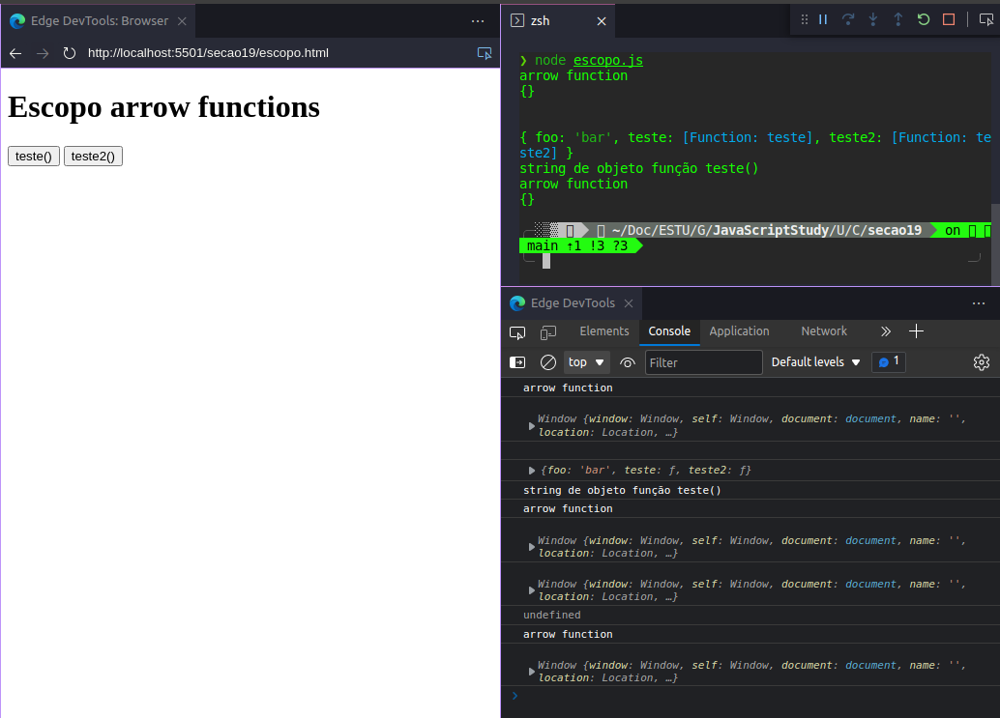

# SEÇÃO 19 - FUNÇÕES (PART 2)

 

## Introdução
 

 

 

## Arrow Functions
 

Vamos criar um novo arquivo chamado `arrow.js` para poder exemplificarmos a utilização de arrows functions.

- Geralmente escrevemos funções da seguinte maneira:

~~~
function teste(){
    console.log("function expression teste");
    return "fn expression";
}

const t1 = teste();
console.log(t1);

// SAIDA:

❯ node arrow.js
function expression teste
fn expression
~~~

- Poderiamos escrever a mesma função acima usando `arrow functions`.
- Para criarmos uma `arrow function` primeiramente precisarios criar uma variavel normalmente criamos usando o `const`.

~~~ 
function teste(){
    console.log("function expression teste");
    return "fn expression";
}

const t1 = teste();
console.log(t1);

const testeArrow = () => {
    console.log("arrow function testeArrow");
    return "arrow function expression";
}

const t2 = testeArrow();
console.log(t2);

// SAIDA:

❯ node arrow.js
function expression teste
fn expression
arrow function testeArrow
arrow function expression
~~~

- Passando parametros para as funções.

~~~ 
function teste(str){
    console.log("function expression teste ", str);
    return "fn expression";
}

const t1 = teste("parametro para function expression");
console.log(t1);

const testeArrow = (str) => {
    console.log("arrow function testeArrow ",str);
    return "arrow function expression";
}

const t2 = testeArrow("parametro para arrow function");
console.log(t2);

// SAIDA:

❯ node arrow.js
function expression teste  parametro para function expression
fn expression
arrow function testeArrow  parametro para arrow function
arrow function expression
~~~ 

- A grande novidade é que, se tivermos somente um `parametro` para ser passado para a `arrow function` não precisamos utilizar os parenteses.

~~~ 
function teste(str){
    console.log("function expression teste ", str);
    return "fn expression " + str;
}

const t1 = teste("parametro para function expression");
console.log(t1);

const testeArrow = str => {
    console.log("arrow function testeArrow ",str);
    return "arrow function expression - " + str;
}

const t2 = testeArrow("parametro para arrow function");
console.log(t2);

// SAIDA:

❯ node arrow.js
function expression teste  parametro para function expression
fn expression parametro para function expression
arrow function testeArrow  parametro para arrow function
arrow function expression - parametro para arrow function
~~~ 

- Outra questão é que se temos uma `arrow function` que so possui uma linha de codigo, ou seja, somente um `retorno`, podemos excluir as `chaves{}` e omitir a palavra `return`.

~~~ 
// funções com somente um retorno - não precisa das chaves

function teste(str){
    console.log("function expression teste " + str);
    return "fn expression " + str; 
}

const t1 = teste("parametro function expression");
console.log(t1);

const testeArrow = str => "arrow function - " + str;
const t2 = testeArrow("arrow function parametro");
console.log(t2);

// SAIDA:

❯ node arrow.js
function expression teste parametro function expression
fn expression parametro function expression
arrow function - arrow function parametro
~~~ 

- Agora se tivermos mais de um parametro na `arrow function`, temos que utilizar os parenteses.

~~~ 
// funções com 2+ parametros

function teste(str,n){
    console.log("function expression teste || " + str + " - " + n);
    return "fn expression " + str + n; 
}

const t1 = teste("parametro function expression", "10");
console.log(t1);

const testeArrow = (str, n) => "arrow function - " + str + n;
const t2 = testeArrow("arrow function parametro ", " 10");
console.log(t2);

// SAIDA:

❯ node arrow.js
function expression teste || parametro function expression - 10
fn expression parametro function expression10
arrow function - arrow function parametro  10

~~~ 

- Agora vamos fazer uma teste, no retorno da `arrow function` em vez de retornarmos uma `string` vamos retornar um objeto.

~~~ 
// retornando um objeto em vez de uma string

const testeArrow1 = () => {
    console.log("testeArrow1 chamado");
    return {
        foo: "bar"
    }
}

const t3 = testeArrow1();
console.log(typeof t3, t3);

// SAIDA:

❯ node arrow.js
function expression teste || parametro function expression - 10
string fn expression parametro function expression10
string arrow function - arrow function parametro  10
testeArrow1 chamado
object { foo: 'bar' }
~~~

- Temos tbm como acessar a propriedade do objeto que foi retornado da seguinte maneira:

~~~
// retornando um objeto em vez de uma string

const testeArrow1 = () => {
    console.log("testeArrow1 chamado");
    return {
        foo: "bar"
    }
}

const t3 = testeArrow1();
console.log(typeof t3, t3);
console.log(typeof t3, t3.foo); // sintaxe de ponto
console.log(typeof t3, t3["foo"]); // sintaxe de colchetes

// SAIDA:

❯ node arrow.js
function expression teste || parametro function expression - 10
string fn expression parametro function expression10
string arrow function - arrow function parametro  10
testeArrow1 chamado
object { foo: 'bar' }
object bar
object bar
~~~

- Vamos ver agora o que acontece se retirarmos o `console.log()` da `arrow function` que nos retorna um objeto...

~~~ 
// retornando um objeto em vez de uma string

const testeArrow1 = () => {
    return {
        foo: "bar"
    }
}

const t3 = testeArrow1();
console.log(typeof t3, t3);
console.log(typeof t3, t3.foo);
console.log(typeof t3, t3["foo"]);

// SAIDA:

❯ node arrow.js
object { foo: 'bar' }
object bar
object bar
~~~

- Na função que so temos um `retorno` tiramos as `chaves` e o `return`, vamos fazer a mesma coisa para a  `arrow function` que retorna um objeto para vermos o que acontece.

~~~
// retornando um objeto em vez de uma string

// const testeArrow1 = () => {
//     return {
//         foo: "bar"
//     }
// }

const testeArrow1 = () => {
    foo: "bar",
}

const t3 = testeArrow1();
console.log(typeof t3, t3);
console.log(typeof t3, t3.foo);
console.log(typeof t3, t3["foo"]);
~~~

- O codigo acima não irá funcionar pois queremos retornar um `objeto` porem as `chaves` estão sendo traduzidas pelo javascript como se fossem o `corpo da função` e não um `objeto`.
- Para que isso funcione, basta colocar as `chaves` e seu conteudo dentro de `parenteses` da seguinte maneira:

~~~
// retornando um objeto em vez de uma string

// const testeArrow1 = () => {
//     return {
//         foo: "bar"
//     }
// }

const testeArrow1 = () => ({
    foo: "bar",
})

const t3 = testeArrow1();
console.log(typeof t3, t3);
console.log(typeof t3, t3.foo);
console.log(typeof t3, t3["foo"]);

// SAIDA:

❯ node arrow.js
object { foo: 'bar' }
object bar
object bar
~~~

- Agora podemos ver que a `arrow function` voltou a funcionar e esta nos retornando um `objeto`.

Outro observação sobre as `arrows functions` é que elas não são `hosteadas`, por exemplo, no começo criamos uma `function expression` chamada `teste()`, se chamarmos essa função antes de sua criação, o codigo irá funcionar, porem o mesmo não acontece com as `arrows functions`.

- Ao chamar uma `arrow function` antes de sua criação temos um `erro`
  

~~~
// hosteando funções - chamando funções antes da declaração

console.log(teste());

function teste(){
    console.log("function expression teste");
    return "fn expression";
}

console.log(testeArrow);
const testeArrow = (str,n) => "fn arrow - " + str + " - " + n;

// SAIDA:
❯ node arrow.js
function expression teste
fn expression
/home/angelina/Documents/ESTUDOS/GitHub Repos/JavaScriptStudy/Udemy/Curso de JavaScript Completo do iniciante ao mestre (2022)/secao19/arrow.js:106
console.log(testeArrow);
~~~

 

 

## Escopo léxico vs dinamico
 

Agora iremos ver a diferença das `arrows functions` no quesito `escopo`.

O `escopo` é basicamente o lugar onde a `função tem acesso` para mostrar/acessar as varaiveis. Vamos criar um novo documento chamado `escopo.js`

- Sabemos que se criarmos uma função que imprime uma variavel criada no `escopo global` a função terá acesso a essa variavel.

~~~
const str = "global string";

function teste(){
    console.log(str);
}

teste();

// SAIDA:

❯ node escopo.js
global string

~~~

- Porem se tivermos uma variavel dentro do `escopo da função`, somente dentro da função teremos acesso a ela, podendo até mesmo ser criada com o mesmo nome da `variavel global` criada acima.

~~~
const str = "global string";

function teste(){
    const str = "local string";
    console.log(str);
}

console.log(str);
teste();

// SAIDA:

❯ node escopo.js
global string
local string

~~~

- No caso de passarmos um parametro, a variavel global será sobrescrita na função.

~~~
const str = "global string";

function teste2(str){
    console.log(str);
}
teste2("parametro"); 

// SAIDA:

❯ node escopo.js
parametro
~~~

- Com relação as `arrows functions` essa historia do `escopo` basicamente é importante quando estivermos falando da palavra `this`.
- Se fizermos um `console.log(this)`, dentro da função, teremos um `objeto global` no `node` e no `browser` seria uma referencia ao `objeto window`.

~~~

const str = "global string";

function teste2(str){
    console.log(this);
    console.log(str);
}
teste2("parametro");

// SAIDA:

❯ node escopo.js
<ref *1> Object [global] {
  global: [Circular *1],
  queueMicrotask: [Function: queueMicrotask],
  clearImmediate: [Function: clearImmediate],
  setImmediate: [Function: setImmediate] {
    [Symbol(nodejs.util.promisify.custom)]: [Getter]
  },
  structuredClone: [Function: structuredClone],
  clearInterval: [Function: clearInterval],
  clearTimeout: [Function: clearTimeout],
  setInterval: [Function: setInterval],
  setTimeout: [Function: setTimeout] {
    [Symbol(nodejs.util.promisify.custom)]: [Getter]
  },
  atob: [Function: atob],
  btoa: [Function: btoa],
  performance: Performance {
    nodeTiming: PerformanceNodeTiming {
      name: 'node',
      entryType: 'node',
      startTime: 0,
      duration: 46.88050799816847,
      nodeStart: 2.077254995703697,
      v8Start: 4.084166996181011,
      bootstrapComplete: 38.166314996778965,
      environment: 23.18207799643278,
      loopStart: -1,
      loopExit: -1,
      idleTime: 0
    },
    timeOrigin: 1666976600496.085
  },
  fetch: [AsyncFunction: fetch]
}
parametro 
~~~

- No momento que declaramos a função, o `this` era o proprio objeto global, no caso do node.
- Vamos criar um objeto para vermos a referencia do `this` mudando.

~~~

const str = "global string";

function teste2(str){
    console.log(this);
    console.log(str);
}
// teste2("parametro");

const obj = {
    foo: "bar",
    teste2: teste2,
}
obj.teste2("string de objeto");

// SAIDA:

❯ node escopo.js
{ foo: 'bar', teste2: [Function: teste2] }
string de objeto
~~~

- Agora que não estamos mais chamando dentro do `escopo global` o `this` da função referen  cia ao `objeto` que o chama, se tornando dinamico, olhando quem esta executando a função, que no caso, esta sendo executada a partir do objeto `obj`.

> OBS: Em objetos, se temos o nome da propriedade igual ao nome do valor da propriedade, o `valor` pode ser omitido.
> ~~~
> const obj = {
>   foo: "bar",
>   teste,
> }
> ~~~ 

- Vamos criar uma outra função utilizando agora as `arrows functions` para vermos o `escopo` do  `this` usando 'arrow functions`.

~~~
const str = "global string";

//[1]

function teste(str){
    console.log(this); 
    console.log(str);
}
// teste2("parametro"); // this = object global

const obj = {
    foo: "bar",
    teste // [2]
}
obj.teste("string de objeto"); // this  = object obj

const teste2 = () => {
    console.log("arrow function");
    console.log(this);
}
teste2();

❯ node escopo.js
{ foo: 'bar', teste: [Function: teste] }
string de objeto
arrow function
{}

~~~ 

- Como estamos trabalhando com o `node` o `this` da `arrow function` é um `objeto vazio` que tem haver com `exportação de modulo`. E no caso do `browser` ele iria referenciar o `objeto window` igual a nossa `function expression`.

~~~ 
<!DOCTYPE html>
<html lang="en">
<head>
    <meta charset="UTF-8">
    <meta http-equiv="X-UA-Compatible" content="IE=edge">
    <meta name="viewport" content="width=device-width, initial-scale=1.0">
    <title>Document</title>
</head>
<body>
    <h1>Escopo arrow functions</h1>
    <button type="button" onclick="teste()">teste()</button>

    <button type="button" onclick="teste2()">teste2()</button>
    
</body>
</html>
~~~ 

- Porem o que queremos ver é a utilização da `arrow function` juntamente com o `obj`.

~~~
const str = "global string";

//[1]

function teste(str){
    console.log(this); 
    console.log(str);
}
//[3]
const teste2 = () => {
    console.log("arrow function");
    console.log(this);
}
teste2();

const obj = {
    foo: "bar",
    teste, // [2]
    teste2,
}
console.log("\n");
obj.teste("string de objeto função teste()"); // this  = object obj
obj.teste2();

// SAIDA:

❯ node escopo.js
arrow function
{}

{ foo: 'bar', teste: [Function: teste], teste2: [Function: teste2] }
string de objeto função teste()
arrow function
{}
~~~

- Como podemos ver na saida do console, independente de chamar uma `arrow function` a partir do `objeto global` ou a partir do `objeto local (obj)` o escopo do `this` será o mesmo. Diferente da `function expression` onde caso seja chamada por um `objeto local` o `this` irá referenciar ao objeto chamado.

- Vamos fazer mais um teste, vamos utilizar o `setTimeOut()` para executar uma função a partir de um determinado tempo, dentro da nossa função de  `teste()`.

~~~ 

function teste(str){
    console.log("-------------- this teste");
    console.log(this); 
    console.log(str);

    setTimeout(function(){
        console.log("--------------");
        console.log(this);
    },2000);
}
~~~ 

- O `this` dentro da nossa função teste, refere-se ao nosso objeto, tanto executando no `node` quanto executando no `browser`, porem o `this` dentro da nossa função de `setTimeOut()` irá diferenciar tanto para o `node` quanto para o `browser`, onde no `browser` temos o `this` referenciando ao `objeto window`.
- Ja no `node` o `this` referencia a um outro objeto chamado `timeOut`. Ou seja, na pratica o nosso `this` sofreu alteração, logo, como fazemos para que o nosso `this` não sofra alteração nem no `node` nem no browser?
- Podemos em vez de executar uma `declaração de função`, executar uma `arrow function` da seguinte maneira:

~~~ 
function teste(str){
    console.log("-------------- this teste");
    console.log(this); 
    console.log(str);

    setTimeout(() => {
        console.log("--------------");
        console.log(this);
    },2000);
}
~~~ 

- Como podemos ver acima, o `this` agora referencia, tanto no `browser` quanto no node, ao nosso `objeto local`.

Lembre-se disso, sempre que estivermos trabalhando com a palavra reservada `this` e não quisermos que ela sofra alteração, usamos a `arrow function`.

A mesma coisa é valilda quando estivermos falando de `eventos`, por exemplo, vamos criar um `button` e atrelar a ele um evento.

~~~ 
<!DOCTYPE html>
<html lang="en">
<head>
    <meta charset="UTF-8">
    <meta http-equiv="X-UA-Compatible" content="IE=edge">
    <meta name="viewport" content="width=device-width, initial-scale=1.0">
    <title>Fuctions scope in node and browser</title>
</head>
<body>
    <h1>Escopo arrow functions</h1>
    <button type="button" onclick="teste()">teste()</button>

    <button type="button" onclick="teste2()">teste2()</button>

    <button id="btn">Click</button>

    

    

</body>
</html>
~~~ 

- Como podemos ver na imagem acima, ao clicarmos no botão, o `this` no nossa `function expression` referencia ao nosso `botão`, e na `arrow function` o `this` referencia ao ao `objeto global` pois ele não sofreu alteração, seria o mesmo `this` caso a gente coloque um `console.log()` do lado de fora da função de evento.

~~~
<!DOCTYPE html>
<html lang="en">
<head>
    <meta charset="UTF-8">
    <meta http-equiv="X-UA-Compatible" content="IE=edge">
    <meta name="viewport" content="width=device-width, initial-scale=1.0">
    <title>Fuctions scope in node and browser</title>
</head>
<body>
    <h1>Escopo arrow functions</h1>
    <button type="button" onclick="teste()">teste()</button>

    <button type="button" onclick="teste2()">teste2()</button>

    <button id="btn">Click</button>

    

    

</body>
</html>
~~~

 

 

## Metodos de objetos
 

Agora iremos ver como colocar uma `funcção` dentro de uma `propriedade de objeto` para que ela se transforme em um `metodo de objeto`.

Ja fizemos isso antes ao decorrer do curso, porem vamos ver um pequeno detalhe não visto ainda. Vamos criar um novo documento chamado `metodo.js` para exemplificarmos melhor.

- No documento, vamos criar um objeto chamado `dog`, com uma propriedade `name` e um metodo chamado `falar`.

~~~
const dog = {
    name: "rex",
    falar: function(){
        console.log(this.name, "fala: au au");
    }
}

dog.falar()

// SAIDA:

❯ node metodo.js
rex fala: au au

~~~ 

- Poderiamos tbm fazer da seguinte forma:

~~~ 
function latir(){
    console.log(this.name, "fala: au au");
}

function miar(){
    console.log(this.name, "fala: miau");
}

const dog = {
    name: "rex",
    falar: latir,
}

const cat = {
    name: "mingal",
    falar: miar,
}

dog.falar();
cat.falar();

// SAIDA:

❯ node metodo.js
rex fala: au au
mingal fala: miau
~~~ 

- Vamos mudar um pouco a maneira de escrever a função para vermos que temos mais de uma maneira:

~~~ 
function latir(){
    console.log(this.name, "fala: au au");
}

function miar(){
    console.log(this.name, "fala: miau");
}

const dog = {
    name: "rex",
    falar(){
        console.log(this.name, "fala: au au");
    },
    falar2(){
        console.log("falar2");
    }
}

const cat = {
    name: "mingal",
    falar: miar,
}

dog.falar();
dog.falar2();
cat.falar();

// SAIDA:

❯ node metodo.js
rex fala: au au
falar2
mingal fala: miau
~~~

- Uma outra observação, eh que não podemos escrever a função da seguinte maneira, vamos mudar o objeto `cat` para vermos...

~~~
function latir(){
    console.log(this.name, "fala: au au");
}

function miar(){
    console.log(this.name, "fala: miau");
}

const dog = {
    name: "rex",
    falar(){
        console.log(this.name, "fala: au au");
    },
    falar2(){
        console.log("falar2");
    }
}

const cat = {
    name: "mingal",
    falar(){
        miar();
    }
}

dog.falar();
dog.falar2();
cat.falar();

// SAIDA:

❯ node metodo.js
rex fala: au au
falar2
undefined fala: miau
~~~

- Temos o `undefined` pois ao chamarmos a função `miar()` o `this` não é mais o objeto `cat`, teriamos que falar para a função `miar()` que o `this` é o `objeto ` que queremos.
- Quando chamamos o `metodo` da maneira acima, perdermos o escopo do objeto, para recuperarmos o escopo do objeto, teriamos que utilizar os metodos `call()` ou `apply()` que são assuntos que iremos ver mais a frente.

~~~ 

const cat = {
    name: "mingal",
    falar(){
        console.log(this);
        miar();
    }
}

// SAIDA:

❯ node metodo.js
rex fala: au au
falar2
{ name: 'mingal', falar: [Function: falar] }
undefined fala: miau
~~~

 

 

## Apply vs call vs bind
 

Sabemos que a função `miar()` não esta mantendo o mesmo `this`, ou seja, quando executarmos a função `miar()` precisamos passar o contexto do `this`. Para isso, podemos utilizar a função `call()` da seguinte maneira:

~~~ 
const cat = {
    name: "mingal",
    falar(){
        console.log(this);
        miar.call(this);
    }
}
cat.falar();

// SAIDA:

❯ node metodo.js
{ name: 'mingal', falar: [Function: falar] }
mingal fala: miau
~~~ 

- Ou seja, quando chamamos a função `miar()` junto com o metodo `call()` passando o `this` como parametro, estamos `alterando o contexto do this` dentro da função `miar()`.

Vamos criar um arquivo novo chamado `call_apply.js` para exemplificarmos melhor os metodos `call()`, `apply()` e `bind()`.

- Vamos criar uma função chamada `teste()` que irá receber dois parametros, uma `string` e um `numero`. Dentro da função iremos ver no console o `this` e a `string e numero`.

~~~

function teste(str, num){
    console.log(this)
    console.log(str, num);
}

teste("string", 10);

// SAIDA:

❯ node call_apply.js
<ref *1> Object [global] {
  global: [Circular *1],
  queueMicrotask: [Function: queueMicrotask],
  clearImmediate: [Function: clearImmediate],
  setImmediate: [Function: setImmediate] {
    [Symbol(nodejs.util.promisify.custom)]: [Getter]
  },
  structuredClone: [Function: structuredClone],
  clearInterval: [Function: clearInterval],
  clearTimeout: [Function: clearTimeout],
  setInterval: [Function: setInterval],
  setTimeout: [Function: setTimeout] {
    [Symbol(nodejs.util.promisify.custom)]: [Getter]
  },
  atob: [Function: atob],
  btoa: [Function: btoa],
  performance: Performance {
    nodeTiming: PerformanceNodeTiming {
      name: 'node',
      entryType: 'node',
      startTime: 0,
      duration: 54.63088800013065,
      nodeStart: 2.6119160056114197,
      v8Start: 4.702583000063896,
      bootstrapComplete: 40.60464400053024,
      environment: 23.871194005012512,
      loopStart: -1,
      loopExit: -1,
      idleTime: 0
    },
    timeOrigin: 1667223276364.421
  },
  fetch: [AsyncFunction: fetch]
}
string 10
~~~

- Vemos que o nosso `this` dentro da função referencia no `node` ao `objeto global`. Vamos ver o que acontece se colocarmos o `this.name`.

~~~
function teste(str, num){
    console.log(this.name);
    console.log(str, num);
}

teste("string", 10);

// SAIDA:

❯ node call_apply.js
undefined
string 10
~~~

- Recebemos na saida do console o `undefined` pois o `this` é referencia ao `objeto global` e nesse objeto não temos uma propriedade chamada `name`.
- Se criarmos uma variavel chamada `name` no escopo local tbm não irá funcionar retornando o `undefined`.

~~~
let name = "angelina";

function teste(str, num){
    console.log(this.name);
    console.log(str, num);
}

teste("string", 10);

// SAIDA:

❯ node call_apply.js
undefined
string 10
~~~

- O mesmo iria acontecer se colocasse-mos o `var` em vez do `let`, isso no `node`, porem vamos testar no `browser` para vermos o que acontece, criando um arquivo chamado `call_apply.html`.

~~~
<!DOCTYPE html>
<html lang="en">
<head>
    <meta charset="UTF-8">
    <meta http-equiv="X-UA-Compatible" content="IE=edge">
    <meta name="viewport" content="width=device-width, initial-scale=1.0">
    <title>Call | apply | bind</title>
</head>
<body>
    <h1>Call | Apply | Bind</h1>

    
</body>
</html>
~~~

- Na imagem acima, o nosso nome não é mostrado pq utilizarmos a palavra `let`, se trocarmos para a `var` irá nos mostrar o nome ttbm...

~~~
// let name = "angelina";
var name = "angelina";

function teste(str, num){
    console.log(this.name);
    console.log(str, num);
}

teste("string", 10);
~~~ 

- Esta ocorrendo um bug onde, apos criarmos com o `var`e depois alterar novamente para `let` ainda esta sendo mostrado o nome, vamos criar uma outra variavel para vermos o exemplo melhor e retirar esse bug...

~~~
var name = "pierre";
let name2 = "angelina";

function teste(str, num){
    console.log(this.name);
    console.log(this.name2);
    console.log(str, num);
}

teste("string", 10);
~~~

- Essa diferença ocorre pois o `let` e o `const` não criam propriedades no `objeto global` apesar de que eles continuam sendo globais, ou seja, podemos ter acesso de qualquer lugar do programa, porem não temos uma forma de acessar atraves do objeto global, no caso do browser o `window`.
- Como podemos ver na saida do `node` recebemos 2 `undefined` pois essas propriedades não foram colocadas no `objeto global do node`.

~~~
var name = "pierre";
let name2 = "angelina";

function teste(str, num){
    console.log(this);
    console.log(this.name);
    console.log(this.name2);
    console.log(str, num);
}

teste("string", 10);
~~~

- Se abrirmos o objeto global do `browser` e procurarmos as propriedades, so teremos a referencia para o objeto `name`.

- Logo no `browser` as palavras `let` e `const` não poluem o nosso `objeto global`.

Agora iremos falar para nossa função `teste()` que queremos mudar o `escopo do this`, não querendo que ele referencie ao `escopo global`, e sim ao `objeto local`. 

- Vamos chamar nossa função `teste()` passando o metodo `.call()` e dentro deste metodo vamos passar como parametro um objeto com uma propriedade chamada  `name`.

~~~ 
// var name = "pierre";
// let name2 = "angelina";

function teste(str, num){
    console.log(this);
    console.log(this.name);
    console.log(this.name2);
    console.log(str, num);
}

// teste("string", 10);
teste.call({
    name: "Maria",
})
~~~ 

- Como podemos ver na imagem acima, o `this` agora do primeiro console, se refere ao objeto que passamos como propriedade para a função `call()` e o `this.name` refere-se a propriedade `name` do objeto.
- Como não passamos uma propriedade chamada `name2`, recebemos o `undefined`. O mesmo vale para o `str,n`.
- Para passarmos parametros para a função utilizando o metodo `call()` escrevemos o codigo da seguinte maneira:

~~~
// var name = "pierre";
// let name2 = "angelina";

function teste(str, num){
    console.log(this);
    console.log(this.name);
    console.log(this.name2);
    console.log(str, num);
}

// teste("string", 10);
teste.call({
    name: "Maria",
}, "string", 20); 
~~~

- Usando o metodo `call()` podemos executar uma função mudando a referencia do `this`. Da mesma forma teriamos como executar uma função utilizando o metodo `apply()`, porem passando os argumentos/propriedades dentro de um `array` como segundo parametro para a função `apply()` o primeiro sendo o objeto cujo o escopo do `this` queremos referenciar.

~~~ 
// var name = "pierre";
// let name2 = "angelina";

function teste(str, num){
    console.log(this);
    console.log(this.name);
    console.log(this.name2);
    console.log(str, num);
}

// teste("string", 10);
teste.call({
    name: "Maria",
}, "string", 20);

teste.apply({
    name: "joao",
},["string apply",28]);
~~~

Observem que a partir do ES15, não temos tanta necessidade de ter dois metodos, pois agora podemos utilizar o `spread operator` caso nossos arguementos, no caso, a `string` e o `numero` estejam dentro de um `array` separando assim esses valores da seguinte maneira:

~~~ 
teste.call({
    name: "Angelina Pierre",
}, ...["string apply",28]);
~~~

- Estamos quebrando o `array` em elementos separados usando o `spread operator` no `metodo call()`, tendo o mesmo resultado do metodo `apply()`.

Basicamente, os metodos `call()` e `apply()` são formas de executar uma função, podendo alterar o `escopo do this` dentro da função no momento da execução da mesma.

Outra maneira de mudar o `escopo do this` seria utilizando o metodo `bind()`. 

- Vamos criar uma constante chamada `teste2` que irá receber o `teste.bind()`, passando como parametro para a função `bind` um objeto.
- Vamos depois chamar a função passando uma `string` e um `numero`  para vermos o que irá acontecer.

~~~
// var name = "pierre";
// let name2 = "angelina";

function teste(str, num){
    console.log(this);
    console.log(this.name);
    console.log(this.name2);
    console.log(str, num);
}

// teste("string", 10);
teste.call({
    name: "Maria",
}, "string", 20);

teste.apply({
    name: "joao",
},["string apply",28]);

teste.call({
    name: "Angelina Pierre",
}, ...["string apply",28]);

const teste2 = teste.bind({
    name: "Joana",
});

teste2("Joaquina", 30);
~~~

- Como podemos ver temos o mesmo resultado, porem a diferença é que , no `call()` e no `apply()` no momento que estamos `executando` a função, estamos alterando o `this`, logo a responsabilidade de trocar o `this` é do programador na hora de executar a função/chama-la.
- Ja com o metodo `bind`, executamos a função normalmente, sem passar o `objeto`, ou seja, não precisamos mais nos preocupar em quem será o `this`, chamando ela `teste2()`.
- O `this` é alterado automaticamente pq o metodo `bind()` retorna um função, ou seja, agora temos duas funções, `teste()` e o `teste2()`.

~~~
function teste(str, num){
    // console.log(this);
    console.log(this.name);
    // console.log(this.name2);
    console.log(str, num);
}

const teste2 = teste.bind({
    name: "Joana",
});

teste2();
teste2("Joaquina", 30); 
~~~

- Ou seja, o `bind()` retorna uma função e a armazena dentro da variavel criada que o chama.
- O `bind()` é muito util quando estivermos falando por exemplo, sobre `botões` e/ou `interface grafica`.
- Vamos criar um `event Listener` para exemplificarmos melhor:

~~~
// var name = "pierre";
// let name2 = "angelina";

function teste(str, num){
    // console.log(this);
    console.log(this.name);
    // console.log(this.name2);
    console.log(str, num);
}

const teste2 = teste.bind({
    name: "Joana",
});

teste2();
teste2("Joaquina", 30);

document.addEventListener("click", teste2);
~~~

- Vejam que nem sabemos quem será o `this` dentro de `teste2()`, mas ao clicarmos no documento, recebemos no console o `joana`, que é a propriedade `name` dentro do objeto, que passamos no `teste.bind()`, e depois foi mostrado o `objeto window` que veio do parametro `str` que não passamos logo virou o `objeto evento` que ja tinhamos visto.

 

 

## Closures
 

Vamos agora falar sobre o `closure` que é a capacidade dee uma função de poder enxergar as variaveis que estavam ao redor dela no momento que ela foi declarada.

Vamos criar um novo documento chamado `closure.js` para exemplificarmos melhor.

- Dentro do nosso documento vamos criar uma constante chamada `teste` que irá receber o retorno de uma `função autoinvocavel`. Dentro desta função iremos simplesmente retornar uma `string`

~~~ 
const teste = (function(){
    return "meu retorno";
})();

console.log(teste);

// SAIDA:

❯ node closure.js
meu retorno
~~~

- Como podemos ver, dentro de `teste` esta sendo armazenado o retorno da nossa `função de callback`. Pois no momento que criamos a função ja executamos ela ( `parenteses no final () `), e como ja estamos a executando recebemos o `retorno` e esse `retorno` é armazenado dentro de `teste`.
- Agora, não queremos retornar uma `string` e sim uma outra `função` que iremos chamar de `testeInterno()`, (poderia ser uma função anonima). Dentro desta função, so vamos usar o `console.log()` por enquanto para vermos o que acontece.

~~~ 
const teste = (function(){
    return function testeInterno(){
        console.log("testeInterno chamado");
    }
})();

console.log(teste);

// SAIDA:

❯ node closure.js
[Function: testeInterno]
~~~ 

- Quando executamos o codigo acima, o que será armazenado dentro de `teste`?
- Se antes era uma `string` agora o que será armazenado dentro de `teste` será a função `testeInterno` que criamos.
- Vamos colocar um `return` junto com o `console.log()` para vermos o que acontece...

~~~
const teste = (function(){
    return function testeInterno(){
        console.log("testeInterno chamado");
        return "retorno de testeInterno";
    }
})();

console.log(teste);

// SAIDA:

❯ node closure.js
[Function: testeInterno]
~~~

- Agora nossa variavel `teste` armazena uma `função`, logo, se temos dentro da variavel uma `função` podemos executa-la da seguinte maneira:

~~~
const teste = (function(){
    return function testeInterno(){
        console.log("testeInterno chamado");
        return "retorno de testeInterno";
    }
})();

console.log(teste);
console.log(teste());

//  SAIDA:

❯ node closure.js
[Function: testeInterno]
testeInterno chamado
retorno de testeInterno
~~~

- Como vemos acima, o retorno da chamada da função `teste()` esta sendo passado para o `console.log()`.
- Poderiamos ate colocar o retorno dentro de outra variavel da seguinte maneira:

~~~ 
const teste = (function(){
    return function testeInterno(){
        console.log("testeInterno chamado");
        return "retorno de testeInterno";
    }
})();

console.log(teste);
console.log(teste());

let str = teste();
console.log(str);

// SAIDA:
❯ node closure.js
[Function: testeInterno]
testeInterno chamado
retorno de testeInterno
testeInterno chamado
retorno de testeInterno

~~~ 

- Vamos ver o que irá acontecer se criarmos uma variavel chamada `num` dentro da nossa função e concatena-la com a string de retorno.
- O que esta acontecendo é, dentro da função `testeInterno()` temos acesso as varaiveis que foram declaradas no `closure`. Ou seja, as variaveis que foram declaradas no momento que declaramos a função.
- Logo, utilizando o conceito de `closure` a função  `testeInterno()` ainda tem acesso ao `num` pois ela lembra do contexto a qual ela foi criada, deefinindo assim o `closure`.

~~~ 
const teste = (function(){
    let num = 0;
    return function testeInterno(){
        console.log("testeInterno chamado ", num);
        return "retorno de testeInterno " + num;
    }
})();

console.log(teste);
console.log(teste());

let str = teste();
console.log(str);

// SAIDA:

❯ node closure.js
[Function: testeInterno]
testeInterno chamado 
retorno de testeInterno 0
testeInterno chamado 
retorno de testeInterno 0
~~~ 

- Vamos alterar um pouco o codigo para vermos melhor isso

~~~
const teste = (function(){
    let num = 0;
    return function testeInterno(){
        console.log("testeInterno chamado ", ++num);
        return "retorno de testeInterno " + num;
    }
})();

console.log(teste);
console.log(teste());
teste();
teste();
let str = teste();
console.log(str);
let str2 = teste();
console.log(str2);

// SAIDA:

❯ node closure.js
[Function: testeInterno]
testeInterno chamado  1
retorno de testeInterno 1
testeInterno chamado  2
testeInterno chamado  3
testeInterno chamado  4
retorno de testeInterno 4
testeInterno chamado  5
retorno de testeInterno 5

~~~

- Observem tbm que se tivessemos escrevido a variavel `num` dentro  da função `testeInterno()` ela seria sobrescrita.

~~~ 
const teste = (function(){
    return function testeInterno(){
        let num = 0;
        console.log("testeInterno chamado ", ++num);
        return "retorno de testeInterno " + num;
    }
})();

console.log(teste);
console.log(teste());
teste();
teste();
let str = teste();
console.log(str);
let str2 = teste();
console.log(str2);

// SAIDA:

❯ node closure.js
[Function: testeInterno]
testeInterno chamado  1
retorno de testeInterno 1
testeInterno chamado  1
testeInterno chamado  1
testeInterno chamado  1
retorno de testeInterno 1
testeInterno chamado  1
retorno de testeInterno 1
~~~ 

- Usando o conceito de `closure` a função irá lembrar da variavel `num` criada no `escopo de fora` da função anonima.

Outra forma de termos o conceito de `closure` é, ao invez de termos criado uma varivel, no caso  `num = 0`, podemos passa-lo por parametro na função anonima e podemos definir tbm um numero inical para esse paramtro.

~~~ 
// outra maneira de usar o conceito de closure
const teste = (function(num){
    // num = 10;
    return function testeInterno(){
        console.log("testeInterno chamado ", ++num);
        return "retorno de testeInterno " + num;
    }
})(10);

console.log(teste);
console.log(teste());
teste();
teste();
let str = teste();
console.log(str);
let str2 = teste();
console.log(str2)

// SAIDA:

❯ node closure.js
[Function: testeInterno]
testeInterno chamado  11
retorno de testeInterno 11
testeInterno chamado  12
testeInterno chamado  13
testeInterno chamado  14
retorno de testeInterno 14
testeInterno chamado  15
retorno de testeInterno 15
~~~ 

 

 

## Encadeamento de Metodos
 

Vamos criar uma arquivo chamado `chain.js` para exemplificarmos melhor o que seria o encadeamento de metodos.

Ja vimos sobre isso usando os metodos dos javascript como por exemplo:

- Vamos ver o que seria retornado pela função `document.addEventListener("click", () => {});`. Para isso temos que criar um novo documento chamado `chain.html` e adicionar nosso javascript ao `script` desse documento

~~~ 

[JAVASCRIPT]
let doc = document.addEventListener("click", () => {});
console.log(doc);

[HTML]
<!DOCTYPE html>
<html lang="en">
<head>
    <meta charset="UTF-8">
    <meta http-equiv="X-UA-Compatible" content="IE=edge">
    <meta name="viewport" content="width=device-width, initial-scale=1.0">
    <title>Encadeamento de Metodos</title>
</head>
<body>
    <h1>Encadeamento de Metodos</h1>

    
</body>
</html>
~~~ 

- No caso do `document.addEventListener()` recebemos de retorno o `undefined`.
- Porem se mudarmos para `document.querySelector("a")` pegando assim todas as tags `a` do nosso `html`

~~~ 
// let doc = document.addEventListener("click", () => {}); // undefined
let doc = document.querySelector("a");
console.log(doc);
~~~ 

- Como podemos ver na saida, do `querySelector()` o retorno é o objeto/elemento que criamos no `html` no caso a `tag a`.
- Logo, podemos fazer algo do tipo, `document.querySelector("a").style`.

Logo, sempre que tivermos um `metodo/função` cujo o retorno é um `objeto` podemos continuar `concatenando/encadeando` com outros `metodos/funções`.

No caso acima concatemos o `objeto a` com o metodo `style`. Uma biblioteca bastante camosa que começou com esse conceito de `encadeamento` foi o `JQuery` onde podiamos fazer varias coisas em uma unica linha pois sempre era retornado o `objeto JQuery`, onde poderiamos escrever varias funções em uma unica linha concatenando/encadeando com varios metodos.

Depois dessa explicação inical, vamos criar um objeto para exemplificarmos melhor.

- Vamos criar um objeto chamado `calc` com uma propriedade chamada `value` e teremos tbm dentro desse objeto alguns metodos.
- Teremos um metodo `soma e subtrai` que recebem um numero como parametro, e outro metodo chamado `log` que irá nos mostrar o resultado.

~~~ 
const calc = {
    value: 0,
    soma(num){},
    subtrai(num){},
    log(){},
}
~~~

- Tanto na `soma()` quanto na `subtração` iremos pegar o `this.value` e somar ao `num`.

~~~
const calc = {
    value: 0,
    soma(num){
        this.value += num;
    },
    subtrai(num){
        this.value -= num;
    },
    log(){},
}

calc.soma(5);
console.log(calc);
~~~ 

- Como podemos ver na saida o nosso objeto ja possui o valor `5` que foi passado.
- Porem, gostariamos de fazer o seguinte: Primeiro somar 5 e depois somar 2

~~~

const calc = {
    value: 0,
    soma(num){
        // console.log(value); // error
        console.log(this.value);
        this.value += num;
    },
    subtrai(num){
        this.value -= num;
    },
    log(){},
}

calc.soma(5).soma(2);
console.log(calc);
~~~ 

- Como podemos ver temos um erro, pois não temos nenhum `retorno`  na nossa função `soma()`. Ou seja, como não temos um `return` quando chamamos a função `soma()` o retorno dela é `undefined`, e `undefined` não possue nenhum metodo ou propriedade do tipo `soma()` para ser executado sobre.

~~~ 
const calc = {
    value: 0,
    soma(num){
        // console.log(value); // error
        console.log(this.value);
        this.value += num;
    },
    subtrai(num){
        this.value -= num;
    },
    log(){},
}

console.log(calc.soma(5));
console.log(calc);
~~~ 

- Porem , podemos fazer com que o metodo `soma()` retorne o proprio `objeto`, permitindo agora o encadeamento de metodos.

~~~ 

const calc = {
    value: 0,
    soma(num){
        // console.log(value); // error
        console.log(this.value);
        this.value += num;
        // console.log(this);
        return this;
    },
    subtrai(num){
        this.value -= num;
    },
    log(){},
}

// console.log(calc.soma(5).soma(2)); // objeto
calc.soma(5).soma(2); // valor
console.log(calc); // objeto
~~~

- Vamos usar tbm com o metodo `subtrai`

~~~ 
const calc = {
    value: 0,
    soma(num){
        // console.log(value); // error
        console.log(this.value);
        this.value += num;
        // console.log(this);
        return this;
    },
    subtrai(num){
        this.value -= num;
        return this;
    },
    log(){},
}
console.log(calc); // objeto
console.log(calc.soma(5).soma(2)); // objeto
calc.soma(5).soma(2); // valor
calc.soma(5).soma(2).subtrai(3);
console.log(calc.value);
~~~ 

Vamos agora escrever o metodo `log()` para retonar o valor

~~~
const calc = {
    value: 0,
    soma(num){
        // console.log(value); // error
        console.log(this.value);
        this.value += num;
        // console.log(this);
        return this;
    },
    subtrai(num){
        this.value -= num;
        return this;
    },
    log(){
        console.log(this.value);
    },
}
// console.log(calc.soma(5).soma(2)); // objeto
calc.soma(5).soma(2); // valor
calc.soma(5).soma(2).subtrai(3);
calc.soma(5).soma(2).subtrai(3).soma(2).log();
// console.log(calc.value);
console.log(calc); // objeto
~~~

- Como acima o metodo `log()` não foi escrito para retonar o objeto, se chamarmos qualquer um dos outros metodos (`soma;subtrai`), não irá funcionar, ja que o retorno do `log()` esta como `undefined`, para mudarmos isso bbasta add o `return this` ao metodo `log()`.

~~~
const calc = {
    value: 0,
    soma(num){
        // console.log(value); // error
        console.log(this.value);
        this.value += num;
        // console.log(this);
        return this;
    },
    subtrai(num){
        this.value -= num;
        return this;
    },
    log(){
        console.log(this.value);
        return this;
    },
}
// console.log(calc.soma(5).soma(2)); // objeto
calc.soma(5).soma(2); // valor
calc.soma(5).soma(2).subtrai(3);
calc.soma(5).soma(2).subtrai(3).soma(2).log();
calc.soma(5).soma(2).subtrai(3).soma(2).log().soma(5);
// console.log(calc.value);
console.log(calc); // objeto

~~~

 

 

## Reveal Patern
 

Usado quando precisavamos criar grande aplicações sem correr o risco de poluirmos o `escopo global` demasiadamente para que não houvesse `colisão de nomes`.

Utilizava-se conceitos como `função de callback`, `encapsulamento`, etc, para poder criar nossa aplicações de uma maneira mais segura, logo, basicamente se criava modulos dessa forma.

Atualmente, podemos utilizar tanto o `sistemas de modulos nativos` do ES6, porem não irá funcionar em todos os browsers, mas isso não nos tras problema pois quando vamos desenvolver uma aplicação robusta  se não tivermos como utilizar o `sistema de modulos nativos do ES6`, geralmente iremos utilizar uma ferramenta de `bunddle` como o `webPack` por exemplo. Criando assim nossos modulos de forma separada e os utilizando de uma maneira segura.

Isso aconteceu devido a forma como evoluimos de criar paginas web, para aplicações web inteiras, onde precisamos de maneiras de tornar nossa aplicação mais escalavel e segura. Por isso o ES6 implemento ou conceito de `ES model` que na verdade veio como uma `copia` do que faziamos antes com o sistema de `bundle/webpack` e como o `node` faz utilizando um padrão chamado `commonJS`.

Vamos criar um novo documento chamado `reveal.js` para exemplificarmos melhor isso.

- Quando tinhamos uma aplicação muito grande, não podiamos criar dentro do arquivo, por exemplo, `var n = 0`, pois `n` é um nome comum e em outro lugar da aplicação poderia ja existir. Logo tinhamos que criar uma maneira de `isolar` essa variavel dentro deste unico arquivo chamado por exemplo `reveal.js`.
- Vamos supor que temos um `html` que chama dois javascripts, o `reveal.js` e o `chain.js`, imagine agora que os dois arquivos possuem a variavel `n`, poderia ocorrer um problema no codigo.
- Antigamente, para isolar as variaveis usavamos `funções de callback/autoinvocaveis/anonimas`.

~~~ 
<!DOCTYPE html>
<html lang="en">
<head>
    <meta charset="UTF-8">
    <meta http-equiv="X-UA-Compatible" content="IE=edge">
    <meta name="viewport" content="width=device-width, initial-scale=1.0">
    <title>Encadeamento de Metodos</title>
</head>
<body>
    <h1>Encadeamento de Metodos</h1>

    <a href="#">Link 1</a>
    

    
    
</body>
</html>
~~~ 

- Na epoca, faziamos o isolamento da seguinte maneira, criamo uma variavel chamada `app` e colocavamos o codigo dentro desta variavel.

~~~ 
var n = 10; // escopo global

// escopo local app
var app = {
    n: 10
}

app.n
~~~

- Vamos criar um modulo na nossa aplicação, para criarmos podemos usar o `let ou const`.
- Vamos criar uma constante chamda `calcRevealPattern` e colocar um objeto dentro.

~~~
const calcRevealPattern = {
    
}
~~~

- Porem com o padrão de criação de modulos chamado `reveal Pattern` ao invez de criar um objeto direto, criamos uma função `autoinvocavel` e esta função pode retornar um `objeto`.
- Ou seja, estamo criando uma variavel chamada `constRevealPattern` e ela irá armazenar um `objeto` que é o retorno da `função autoinvocavel`.

~~~
const calcRevealPattern = (function(){

    return {
        
    }
})()
~~~

- Dentro da função colocaremos a variavel `n` e podemos tbm colocar umas funções. Por exemplo, `soma()`.

~~~
const calcRevealPattern = (function(){

    let n = 0;

    function somar(_n){
        n += _n;
    }
    function subtrair(_n){
        n -= _n;
    }

    return {

    }
})()
~~~

- Agora temos duas funções dentro da nossa função autoinvocavel, e o que queremos `extenalizar/exportar` para ficar disponivel dentro da constante `calcRevealPattern` colocamos dentro do `return`.
- Ja sabemos que se temos uma `propriedade` e um `valor` de mesmo nome, podemos ao chamar a função omitir o valor.

~~~ 
const calcRevealPattern = (function(){

    let n = 0;

    function somar(_n){
        n += _n;
    }
    function subtrair(_n){
        n -= _n;
    }

    return {
        somar,
        subtrair,
    }
})()
~~~

- Com isso agora, o que podemos fazer é chamar no console o nosso `objeto`. Lembrando que o `encadeamento` não irá funcionar pois os metodos que criamos não retornam nada, ou seja, o retorno eh `undefined`.

~~~ 
const calcRevealPattern = (function(){

    let n = 0;

    function somar(_n){
        n += _n;
    }
    function subtrair(_n){
        n -= _n;
    }

    return {
        somar,
        subtrair,
    }
})()

calcRevealPattern.somar(5);
console.log(calcRevealPattern);

// SAIDA:
❯ node reveal.js
{ somar: [Function: somar], subtrair: [Function: subtrair] }

~~~ 

- Como podemos ver na saida acima, temos um `objeto` com as funções que escrevemos dentro da variavel `calcRevealPattern`, o nosso `valor` não esta sendo mostrado pois ele esta sendo armazenado numa `variavel local` logo não temos acesso a ela.
- Porem usando o conceito de `closure` conseguimos criar uma outra `função` chamada `log()` que irá mostrar no `console` o valor dee `n`.
- Lembrando que temos que `exportar` a função, ou seja, colocar no `return` sua chamada.

~~~ 
const calcRevealPattern = (function(){

    let n = 0;

    function somar(_n){
        n += _n;
    }
    function subtrair(_n){
        n -= _n;
    }

    function log(){
        console.log(n);
    }

    return {
        somar,
        subtrair,
        log,
    }
})()

calcRevealPattern.somar(5);
calcRevealPattern.log();
console.log(calcRevealPattern);

// SAIDA:
❯ node reveal.js
5
{
  somar: [Function: somar],
  subtrair: [Function: subtrair],
  log: [Function: log]
}

~~~ 

- Podemos tbm usar o mesmo conceito do `encadeamento` da seguinte maneira:

~~~
const calcRevealPattern = (function(){

    let n = 0;

    function somar(_n){
        n += _n;
        return this;
    }
    function subtrair(_n){
        n -= _n;
        return this;
    }

    function log(){
        console.log(n);
        return this;
    }

    return {
        somar,
        subtrair,
        log,
    }
})()

calcRevealPattern.log();
calcRevealPattern.somar(5).somar(7).subtrair(2);
console.log(calcRevealPattern);

// SAIDA:

❯ node reveal.js
0
10
{
  somar: [Function: somar],
  subtrair: [Function: subtrair],
  log: [Function: log]
}

~~~

- Outro detalha, poderiamos fazer um teste, por exemplo, queremos criar uma função que não seja visivel, ou seja, não seja externalizada para esse modulo.
- Vamos cria ruma função chamada `_checkNmber` que recebe um numero como `parametro`. Dentro dela iremos fazer um teste para ver se o valor passado eh um numero ou nao, caso nao seja, lançamos um erro ao usuario.
- depois de criada, basta chamar a função dentro das outras para que a verificação seja feita.

~~~
const calcRevealPattern = (function(){

    let n = 0;

    function _checkNumber(n){
        if(typeof n!== "number"){
            throw TypeError("Precisa passar um numero!");
        }
    }

    function somar(_n){
        _checkNumber(_n);
        n += _n;
        return this;
    }
    function subtrair(_n){
        _checkNumber(_n);
        n -= _n;
        return this;
    }

    function log(){
        console.log(n);
        return this;
    }

    return {
        somar,
        subtrair,
        log,
    }
})()

calcRevealPattern.log();
calcRevealPattern.somar(5).somar(7).subtrair(2).log();
calcRevealPattern.somar("3");
console.log(calcRevealPattern);
~~~

- 

 

 

## Factories Functions
 

Agora iremos ver um conceito chamado `function factorie` que são funções que irão retornar`objetos`. Temos os `construtores` que são parecidos e vamos exemplificar criando um novo documento chamado `factory.js`.

Imagine que tenhamos 3 objetos com propriedades e metodos que referenciam a cachorros.

~~~
const rex = {
    nome: "Rex",
    latir(){},
    andar(){},
}

const laica = {
    nome: "Laica",
    latir(){},
    andar(){},
}

const toto = {
    nome: "Toto",
    latir(){},
    andar(){},
}
~~~ 

- Poderiamos tbm criar um metodo chamado `comer(){}`. Tendo que colocar o metodo em todos os objetos um por um.

~~~
const rex = {
    nome: "Rex",
    latir(){},
    andar(){},
    comer(){
        // --
    }
}

const laica = {
    nome: "Laica",
    latir(){},
    andar(){},
    comer(){
        // --
    }
}

const toto = {
    nome: "Toto",
    latir(){},
    andar(){},
    comer(){
        // --
    }
}
~~~

- Agora vamos alterar o metodo andar e temos que fazer essa alteração em todos os objetos criados tbm.
- Vejam que não é uma boa pratica ter que alterar os objetos um por um. Podemos fazer codigo criando objetos de maneira `literal` porem com codigos mais robustos isso se torna inviavel.
- Tendo isso em mente, vamos criar uma `função` que irá criar esses objetos de cachorros.
- Essa função irá receber por parametro um `nome`, e irá retornar o objeto de cachorro que criamos inicialmente da seguinte maneira:
  - Como sabemos que quando uma `propriedade` e um `valor` possuem o mesmo nome, podemos omitir o valor e os dois pontos.

~~~
function criarCachorro(name){
    return {
        nome,
        latir(){},
        andar(){},
        comer(){
            // --
        }
    }
}
~~~

- Temos uma função chamada `latir()` que irá simplesmente mostrar no console.log o cachorro latindo.
- Na função `andar()` iremos colocar uma propriedade chamada `distancia` e dentro dela faremos um console indicando qual cachorro andou e quanto ele andou.

~~~ 
function criarCachorro(name){
    return {
        name,
        latir(){
            console.log(this.name, " esta latindo!");
        },
        andar(distancia){
            console.log(this.name, " andou ", distancia, " m");
        },
        comer(){
            // --
        }
    }
}

const rex = criarCachorro("Rex");
console.log(rex);

// SAIDA:

❯ node factory.js
{
  name: 'Rex',
  latir: [Function: latir],
  andar: [Function: andar],
  comer: [Function: comer]
}
~~~ 

- Agora temos um objeto com duas funções. Vamos criar tbm uma variavel chamada `posição` que irá começar em `0`.
- Toda vez que chamarmos a função `andar()` iremos somar a essa variavel `posicao`.

~~~
function criarCachorro(name){
    let posicao = 0;
    return {
        name,
        latir(){
            console.log(this.name, " esta latindo!");
        },
        andar(distancia){
            posicao += distancia;
            console.log(this.name, " andou ", distancia, " m");
        },
        comer(){
            // --
        }
    }
}

const rex = criarCachorro("Rex");
rex.andar(10);
rex.andar(5);
console.log(rex);

// SAIDA:
❯ node factory.js
Rex  andou  10  m
Rex  andou  5  m
{
  name: 'Rex',
  latir: [Function: latir],
  andar: [Function: andar],
  comer: [Function: comer]
}
~~~ 

- Ao testar o codigo, nao temos como saber em qual posição o `Rex` esta, so nos eh mostrar o quanto foi andando.
- Para podermos saber a posição, podemos criar um metodo para pegar essa posição e nos retornar a posição onde o cachorro esta.

~~~
function criarCachorro(name){
    let posicao = 0;
    return {
        name,
        latir(){
            console.log(this.name, " esta latindo!");
        },
        andar(distancia){
            posicao += distancia;
            console.log(this.name, " andou ", distancia, " m");
        },
        pegaPosicao(){
            return posicao;
        }
    }
}

const rex = criarCachorro("Rex");
rex.andar(10);
rex.andar(5);
console.log(rex.pegaPosicao());
console.log(rex);

// SAIDA:
❯ node factory.js
Rex  andou  10  m
Rex  andou  5  m
15
{
  name: 'Rex',
  latir: [Function: latir],
  andar: [Function: andar],
  pegaPosicao: [Function: pegaPosicao]
}
~~~ 

- Vamos criar um outro objeto desse cachorro chamado `toto`.

~~~ 
function criarCachorro(name){
    let posicao = 0;
    return {
        name,
        latir(){
            console.log(this.name, " esta latindo!");
        },
        andar(distancia){
            posicao += distancia;
            console.log(this.name, " andou ", distancia, " m");
        },
        pegaPosicao(){
            return posicao;
        }
    }
}

const rex = criarCachorro("Rex");
rex.andar(10);
rex.andar(5);
console.log(rex.pegaPosicao());
console.log(rex);

const toto = criarCachorro("Toto");
toto.andar(20);
toto.andar(-3);
console.log(toto.pegaPosicao());
console.log(toto);

// SAIDA:

❯ node factory.js
Rex  andou  10  m
Rex  andou  5  m
15
{
  name: 'Rex',
  latir: [Function: latir],
  andar: [Function: andar],
  pegaPosicao: [Function: pegaPosicao]
}
Toto  andou  20  m
Toto  andou  -3  m
17
{
  name: 'Toto',
  latir: [Function: latir],
  andar: [Function: andar],
  pegaPosicao: [Function: pegaPosicao]
}
~~~ 

- Observem que é mais facil criarmos uma `factory function` para criar um `objeto` do que criarmos individualmente um objeto de cada vez.
- Ela seria mais ou menos igual a uma função construtora. Vejam tbm que agora se precisarmos fazer alguma alteração nas `propriedade` ou `metodos` do objeto, basta alterar a `factory function` que as alterações serão refletidas nos objetos que foram criados chamando essa função.
- Vamos fazer uma alteração no nosso metodo `pegaPosicao()`. Vamos mostrar no console o nome, ou seja,a propriedade `name` que o objeto possui, logo temos que utilizar o `this.name` e a posição atual que o cachorro se encontra, como a `posicao` é uma variavel local da função, não usamos o `this`.

~~~
function criarCachorro(name){
    let posicao = 0;
    return {
        name,
        latir(){
            console.log(this.name, " esta latindo!");
        },
        andar(distancia){
            posicao += distancia;
            console.log(this.name, " andou ", distancia, " m");
        },
        pegaPosicao(){
            console.log(`A posicao atual de ${this.name} é: ${posicao}`); // this.posicao = undefined

            return posicao;
        }
    }
}

const rex = criarCachorro("Rex");
rex.andar(10);
rex.andar(5);
rex.pegaPosicao();

const toto = criarCachorro("Toto");
toto.andar(20);
toto.andar(-3);
toto.pegaPosicao();

// SAIDA:
❯ node factory.js
Rex  andou  10  m
Rex  andou  5  m
A posicao atual de Rex é: 15
Toto  andou  20  m
Toto  andou  -3  m
A posicao atual de Toto é: 17
~~~ 

Esse é o conceito de `factory function`.

 

 

## Iniciando com Getters
 

Observem que na aula passada, toda vez que precisavamos recuperar a `posicao` do cachorro, tinhamos que executar um metodo chamado `pegaPosicao()`. O que gostariamos de fazer é ver esse metodo como um `propriedade` entrando assim em um conceito chamado `getters and setters`.

Ao invez de fazermos algo tipo `rex.pegaPosicao()` queremos fazer algo do tipo, `rex.posicao`, porem essa `posicao` não é uma propriedade do objeto `rex` e sim uma `variavel` que esta dentro da `factory function`. Caso a gente rode o codigo abaixo, teremos um `undefined`.

~~~ 
function criarCachorro(name){
    let posicao = 0;
    return {
        name,
        latir(){
            console.log(this.name, " esta latindo!");
        },
        andar(distancia){
            posicao += distancia;
            console.log(this.name, " andou ", distancia, " m");
        },
        pegaPosicao(){
            console.log(`A posicao atual de ${this.name} é: ${posicao}`); // this.posicao = undefined

            return posicao;
        }
    }
}

const rex = criarCachorro("Rex");
rex.andar(10);
rex.andar(5);
rex.pegaPosicao();
console.log(rex.posicao);

const toto = criarCachorro("Toto");
toto.andar(20);
toto.andar(-3);
toto.pegaPosicao();

// SAIDA:

❯ node factory.js
Rex  andou  10  m
Rex  andou  5  m
A posicao atual de Rex é: 15
undefined
Toto  andou  20  m
Toto  andou  -3  m
A posicao atual de Toto é: 17
~~~ 

- Recebemos o `undefined` pois não temos uma `propriedade` posicao dentro do `objeto` rex, o que temos é uma variavel dentro da `factory function`.
- Queremos criar uma `função/metodo` chamada `posicao()`

~~~ 
function criarCachorro(name){
    let posicao = 0;
    return {
        name,
        latir(){
            console.log(this.name, " esta latindo!");
        },
        andar(distancia){
            posicao += distancia;
            console.log(this.name, " andou ", distancia, " m");
        },
        posicao(){
            console.log(`A posicao atual de ${this.name} é: ${posicao}`); // this.posicao = undefined

            return posicao;
        }
    }
}

const rex = criarCachorro("Rex");
rex.andar(10);
rex.andar(5);
rex.posicao();
console.log(rex.posicao());

const toto = criarCachorro("Toto");
toto.andar(20);
toto.andar(-3);
toto.posicao();

// SAIDA:

❯ node factory.js
Rex  andou  10  m
Rex  andou  5  m
A posicao atual de Rex é: 15
A posicao atual de Rex é: 15
15
Toto  andou  20  m
Toto  andou  -3  m
A posicao atual de Toto é: 17
~~~

- Porem, no codigo acima, estamos chamando como um `metodo` quando na verdade queremos chamar como uma `propriedade do objeto`. Para isso, basta colocarmos na frente do metodo `posicao()` uma palavra reservada chamada `get`.
- Quando usamos essa palavra o `posicao()` continuar sendo um metodo porem fazemos a chamada dele como se fosse uma propriedade.

~~~ 
function criarCachorro(name){
    let posicao = 0;
    return {
        name,
        latir(){
            console.log(this.name, " esta latindo!");
        },
        andar(distancia){
            posicao += distancia;
            console.log(this.name, " andou ", distancia, " m");
        },
        get posicao(){
            console.log(`A posicao atual de ${this.name} é: ${posicao}`); // this.posicao = undefined

            return posicao;
        }
    }
}

const rex = criarCachorro("Rex");
rex.andar(10);
rex.andar(5);
rex.posicao;
console.log(rex.posicao);

const toto = criarCachorro("Toto");
toto.andar(20);
toto.andar(-3);
toto.posicao;

// SAIDA:

❯ node factory.js
Rex  andou  10  m
Rex  andou  5  m
A posicao atual de Rex é: 15
A posicao atual de Rex é: 15
15
Toto  andou  20  m
Toto  andou  -3  m
A posicao atual de Toto é: 17
~~~ 

- Para vermos melhor o uso do `get` basta chamar o objeto e veremos agora que em vez de `function` temos o `getter` indicando no objeto.

~~~
function criarCachorro(name){
    let posicao = 0;
    return {
        name,
        latir(){
            console.log(this.name, " esta latindo!");
        },
        andar(distancia){
            posicao += distancia;
            console.log(this.name, " andou ", distancia, " m");
        },
        get posicao(){
            console.log(`A posicao atual de ${this.name} é: ${posicao}`); // this.posicao = undefined

            return posicao;
        }
    }
}

const rex = criarCachorro("Rex");
console.log(rex);

const toto = criarCachorro("Toto");
console.log(toto);

// SAIDA:

❯ node factory.js
{
  name: 'Rex',
  latir: [Function: latir],
  andar: [Function: andar],
  posicao: [Getter]
}
{
  name: 'Toto',
  latir: [Function: latir],
  andar: [Function: andar],
  posicao: [Getter]
}
~~~ 

 

 

## Constructor
 

Vamos agora ver um outro conceito que é similar ao `factory function` que seria a idea de `função construtora`. Na realidade o `objetivo` é o mesmo das `factory functions`, termos uma função que nos retorna um objeto, tendo assim um `molde` do objeto se tornando mais facil fazer alterações.

A grande diferença entre a `factory function` e as `funções construtoras` é a necessidade de quando formos usar a `função construtora` temos que utilizar `obrigatoriamente` o `operador new`.

Vamos criar um novo documento chamado `constructor.js` para exemplificarmos melhor isso.

- Vamos fazer a criação do mesmo objeto da aula passada, porem agora a `escrita` quando criamos uma função construtora tem uma peculiaridade que é `começar com letra maiuscula`.
- Quando precisarmos criar um novo cachorro, temos que usar `obrigatoriamente` o `operador new`

~~~ 
function Cachorro(name){

}

const rex = new Cachorro("Rex");
const toto = new Cachorro("Toto");
~~~ 

- Dentro da função construtora, nao vamos colocar nenhum retorno. O que colocamos na função é tudo dentro do `this`. 
- Ou seja, quando utilizamos o `operador new` o que acontece por baixo dos panos no `operador new` é a criação de um `objeto limpo/vazio`.
- Dentro da função, tudo que tiver com `this` faz referencia ao `objeto criado`.

~~~
function Cachorro(name){
    this.name = name;
    console.log(this);
}

const rex = new Cachorro("Rex");
console.log(rex);
const toto = new Cachorro("Toto");

// SAIDA:

❯ node constructors.js
Cachorro { name: 'Rex' }
Cachorro { name: 'Rex' }
Cachorro { name: 'Toto' }
~~~

- Vejam pela saida do console que o `this` interno é igual ao console do `rex` externo.
- Agora iremos colocar dentro da função os metodos que criamos anteriormente.

~~~ 
function Cachorro(name){
    this.name = name;
    let posicao = 0;
    console.log(this);

    this.latir = function(){
        console.log(this.name, " esta latindo!");
    };

    this.andar = function(distancia){
        posicao += distancia;
        console.log(this.name, "andou", distancia, "m");
        console.log("A posicação atual é:", posicao, "m");
    }
}

const rex = new Cachorro("Rex");
const toto = new Cachorro("Toto");

console.log(rex);
rex.latir();
rex.andar(5);
rex.andar(10);

console.log(toto);
toto.andar(3);

const laica = new Cachorro("Laica");
laica.andar(2);
laica.andar(-16);

// SAIDA:
❯ node constructors.js
Cachorro { name: 'Rex' }
Cachorro { name: 'Toto' }
Cachorro {
  name: 'Rex',
  latir: [Function (anonymous)],
  andar: [Function (anonymous)]
}
Rex  esta latindo!
Rex andou 5 m
A posicação atual é: 5 m
Rex andou 10 m
A posicação atual é: 15 m
Cachorro {
  name: 'Toto',
  latir: [Function (anonymous)],
  andar: [Function (anonymous)]
}
Toto andou 3 m
A posicação atual é: 3 m
Cachorro { name: 'Laica' }
Laica andou 2 m
A posicação atual é: 2 m
Laica andou -16 m
A posicação atual é: -14 m

~~~ 

 

 

## rest operator
 

 

 

