# SEÇÃO 20 - INTRODUÇÃO A ORIENTAÇÃO A OBJETOS

 

## Introdução
 

### Orientação a Objetos (POO)

Paradigma de programação baseada na interação entre objetos.

Um objeto é uma unidade que une dados (propriedades) e suas funções (métodos). Ou seja, é um conjutno de dados formado po `chave:valor`. Vimos tbm que um `array` é uma estrutura de dados que armazena os dados baseados em um `indice`. Quando falamos de objetos, armazenamos cada valor em uma `chave`.

 

### Vantagem:

Coesão de dados e comportamentos agrupados.

- No lado esquerdo temos a lista e o telefone onde o telefone é a função e a lista os dados.
- Na esquerda temos o celular que seria a `coesão` de `dados e comportamentos` agrupados.

 

### Orientação a objetos em JS e a clássica

Em Javascript, a POO se dá através de protótipos (prototypes). 

> Na POO, um objeto pe criado a partir de um `classe`.

> Na POO, uma `classe` é uma `especificação` (um molde) para criar objetos.

- Na imagem acima temos um `projeto` de um `objeto do tipo cadeira`. Logo é a partir de um `projeto/classe` de uma cadeira que iremos `gerar objetos do tipo cadeira`.

- Observem que é este `projeto/classe` cadeira, existe algumas `propriedades e metodos` como mostrado na imagem acima.

- A partir deste `projeto/classe` geramos os nossos `objetos do tipo cadeira` como mostrado na imagem acima.
- Logo, uma `especificação/projeto/classe` de uma cadeira nos permite ter `varios objetos do tipo cadeira`. Não sendo necessario termos apenas `um objeto por classe`.
- Observe tbm que `cada objeto criado` é `unico`. Se modificarmos `um objeto` não vamos `alterar a especificação/projeto/molde/classe` daquela cadeira, estamos alterando apenas `aquele objeto`.
- Porem o oposto é diferente. Se alterarmos a `especificação` da cadeira, iremos `alterar todos os objetos` gerados a partir daquela `especificação/projeto/molde/classe`.

> Sempre que falamos `criar um objeto do tipo cadeira` a partir de uma especificação/projeto/molde/classe de cadeira, estamos falando de `INSTANCIAS DA CLASSE CADEIRA`.

Logo quando criamos um `objeto do tipo cadeira` estamo na verdade criando uma `instancia da classe cadeira`.

Na POO nunca usamos diretamente a `classe` e sim trabalhamos sempre em cima dos `objetos gerados a partir daquela classe`. Ninguem senta num prototipo/projeto de uma cadeira.

Vamos observar uma outra situação onde digamos que a partir de uma `cadeira qualquer`, queremos `modifica-la`, como mostrado na imagem abaixo.

- Teriamos que criar um novo projeto? Sim, vamos precisar ter um outro projeto, porem ja aprendemos muita coisa construindo o `projeto original`. Por exemplo, ja sabemos o `material utilzado` o `numero de parafusos`...
- Logo, quando precisarmos de um outro tipo de cadeira, podemos `reaproveitar` tudo que ja fizemos no `projeto de cadeira original`. Isso é o que chamamos de `reutilizar propriedades e metodos comuns` ou comumente conhecido como `HERANÇA`.
- Onde criamos uma outra classe que irá `herdar` propriedades de metodos da `classe original` com a habilidade de se criar novas propriedades e metodos pertencentes a `nova classe` sem alterar a `classe original`.

> No javascript `Herança` ocorre por meio de seu `protótipo`.

> A POO `não é` reutilização de código.

- Imagine que voce tem a `classe contaCorrente` com propriedades e metodos como mostrado na imagem acima.
- Essa classe irá gerar `objetos/instancias do tipo contaCorrente`.  

> Uma conta corrente é parecida com uma conta poupança.

- Como não temos um tipo de conta, podemos fazer uma copia da `contaCorrente` e mudar o nome para `contaPoupanca`, tendo assim duas classes.
- Porem, se quisermos alterar o codigo, teremos que lembrar de fazer a alteração tanto na `contaCorrente` quando na `contaPoupanca`.
- Esse é o perigo em pensar em POO como `reutilização de codigo`. Quando na verdade temos que pensar em `manutenção do codigo`, onde caso tenhamos uma classe chamada `conta` e usando o conceito de `herança` criarmos duas classes `contaCorrente` e `contaPoupanca` poderemos fazer uma alteração que irá refletir nas demais classes.

> Precisamos fazer as duas contas herdarem de uma classe menos especifica.

- Temos uma `classe Abstrata` chamada de `Contabancaria` onde essa `contaBancaria` precisa ser ou `contaCorrente ou contaPoupanca`.

-  Na classe `contaBancaria` colocamos tudo o que será comum nas `classes concretas`.
-  O que é `especifico` para cada tipo de conta, colocamos em suas respectivas `classes Concretas`.

> `Classe Genérica` é `abstrata`.
> `Classe Específica` é `Concreta`.

### Herança

- Uma conta poupança É uma conta bancaria
- Uma conta corrente É uma conta bancaria

### Associação

- Uma conta bancária TEM um cliente.
- Uma conta bancária NÃO É um cliente.

- Temos um objeto `cliente` que esta `compondo` uma `conta bancaria`.

> Não podemos criar `objetos/instancias` de `CLASSES ABSTRATAS`.

 

 

## ES5 vs ES6
 

### Classes (ES6) vs Funções Construtoras(ES5)

### Prototype

É a base para `herança` no javascript. Em outtas outras linguagens teriamos o `extends` por exemplo.

 

 

 

## prototype
 

Vamos criar dois arquivos chamado `introducao.js | .html` para exemplificarmos melhor.

- Primeiro iremos criar uma função construtora chamada `Animal`.

~~~
function Animal(tipo){
    this.tipo = tipo
}

let dog = new Animal("mamifero");
~~~

- Conseguimos ver na imagem acima o nosso objeto `dog` do tipo `Animal`.
- A nossa função construtora `Animal` possui uma propriedade chamada `prototype`.

- Na imagem acima, podemos ver que a propriedade `.prototype` armazena um `objeto`, e este objeto possui uma propriedade `constructor` que armazena, faz uma `referencia` a nossa `função construtora` e temos outra propriedade chamada `__proto__` que tbm faz `referencia` a um outro `objeto`.
- Agora nos temos o nosso `objeto dog` que tbm possui uma `propriedade chamada __proto__`.

- Esta `propriedade do objeto` é uma forma de a partir do `objeto` acessar o `objeto` que esta guardado na `propriedade .prototype` da `função construtora Animal.prototype`.
- Ou seja, a nossa propriedade `.prototype` da `função construtora = Animal()` é um objeto.

> OBS: A propriedade `.prototype` de uma função construtora `armazena um objeto`.

> OBS: A partir de um `objeto/instancia` gerado pela `função construtora`, temos uma `propriedade = __proto__` que nos da `acesso ao objeto armazenado dentro de .prototype`.

> Lembre-se que como `__proto__` é um objeto, ao fazermos a verificação de igualdade acima, estamos verificando se a `referencia`, ou seja, `posição na memoria` é igual.

- Voltando para o codigo, vamos colocar dentro da `propriedade = .prototype` da nossa função construtora `Animal`.

> Lembre-se que como `Animal.prototype = objeto` poderiamos escrever o codigo da seguinte maneira:
> ~~~
> Anima.prototype = {}
> ~~~
> Porem o ideal é colocarmos dentro do nosso `objeto Animal.prototype` `metodos`.

~~~
function Animal(tipo){
    this.tipo = tipo;
}

Animal.prototype.obterTipo = function(){
    return this.tipo;
}

let cachorro = new Animal("mamifero");
let gato = new Animal("mamifero");
let cobra = new Animal("reptil");
~~~

- Dentro do objeto `cachorro` temos uma propriedade chamada `tipo`. Onde esta nosso `metodo obterTipo`?
- Na imagem abaixo, chamamos a função `obterTipo()` e ela nos retorna o mamifero. Porem onde essa função esta sendo armazenada, poi so nosso `objeto = cachorro` não possui essa função `obterTipos()`

- Como utilizamos o metodo `obterTipo` a partir do objetto `cachorro` e esse metodo não existe no objeto `cachorro`, o javascript começa a procurar o metodo na `Cadeia de prototipos`.
- Dentro do objeto `Animal.prototype` temos uma `propriedade = __proto__` que dentro dela temos a função `obterTipo()`.  
- Se a função não estiver dentro de `__proto__`, ou seja, se fizermos como a imagem abaixo...

- Temos o metodo `toString()` que não existe no `objeto cachorro` e tbm não existe no `prototipo da função construtora` logo o javascript irá olhar para o `prototipo de cima` no caso, o  objeto `Object`.
- Caso não existe dentro da cadeia de prototipos, recebemos um erro.

- No exemplo, colocamos uma função que é um metodo, porem tbm podemos colocar `propriedades`.

~~~
function Animal(tipo){
    this.tipo = tipo;
}

Animal.prototype.obterTipo = function(){
    return this.tipo;
}

Animal.prototype.tipo = "desconhecido";

let cachorro = new Animal("mamifero");
let gato = new Animal("mamifero");
let cobra = new Animal("reptil");

let peixe = new Animal();

// SAIDA:

peixe.tipo
undefined
peixe.obterTipo()
undefined
~~~

- Estamos recebendo o `undefined` pois no codigo acima não passamos nenhum tipo para o construtor `Animal()`.

~~~
function Animal(tipo){
    if(tipo){
        this.tipo = tipo;
    }
}

Animal.prototype.obterTipo = function(){
    return this.tipo;
}

Animal.prototype.tipo = "desconhecido";

let cachorro = new Animal("mamifero");
let gato = new Animal("mamifero");
let cobra = new Animal("reptil");

let peixe = new Animal();

// SAIDA:

peixe
Animal {}
peixe.obterTipo()
'desconhecido'
~~~ 

- Vamos criar um array para vermos a `cadeia de prototipos` desse objeto.

~~~
function Animal(tipo){
    if(tipo){
        this.tipo = tipo;
    }
}

Animal.prototype.obterTipo = function(){
    return this.tipo;
}

Animal.prototype.tipo = "desconhecido";

let cachorro = new Animal("mamifero");
let gato = new Animal("mamifero");
let cobra = new Animal("reptil");

let peixe = new Animal();

let arr = new Array(1,2,3,4,5); 
~~~

- Outra coisa que conseguimos fazer utilizando a propriedade `prototype` é a criação de `polyfilss`. Por exemplo temos um browser antigo e não temos o metodo `.map()`.
- Nesse caso, iriamos fazer `Array.prototype.map2 = function()`, criando assim o metodo `map()` para um browser que não o possui.

> OBS: É importante percebermos que o `prototype` é `dinamico`.

- Para vermos isso, no codigo acima, primeiro criamos os `prototipos` e depois `instanciamos os objetos`.
- Será que se `instanciarmos` primeiro, e depois colocar no `prototipo` irá funcionar?

~~~
function Animal(tipo){
    if(tipo){
        this.tipo = tipo;
    }
}

let cachorro = new Animal("mamifero");
let gato = new Animal("mamifero");
let cobra = new Animal("reptil");

let peixe = new Animal();

let arr = new Array(1,2,3,4,5);

Animal.prototype.obterTipo = function(){
    return this.tipo;
}

Animal.prototype.tipo = "desconhecido";

console.log(peixe);
console.log(peixe.tipo);
~~~

- Logo podemos colocar `objetos no prototipo` mesmo depois de termos `instanciado` os mesmos.
- Com base nessa teoria de `Animal.prototype` podemos entender melhor como funciona o `polyfill`.

### `Polyfill` Exemplo metodo Some()

~~~
if(!Array.prototype.some){
    Array.prototype.some = function(fun/*, thisArg*/){
        'use strict';

        if(this == null){
            throw new TypeError('Array.prototype.some called on null or undefined');
        }

        if(typeof fun !== 'function'){
            throw new TypeError();
        }

        var t = Object(this);
        var len = t.length >>> 0;

        var thisArg = arguments.length >= 2 ? arguments[1] : void 0;
        for(var i = 0; i < len; i++){
            if( i in t && fun.call(thisArg, t[i], i, t)){
                return true;
            }
        }
        return false;
    }
} 
~~~

 

 

## Momento de reflexão
 

Reflita o que acontece quando o seguinte codigo é executado:

~~~
function Animal(tipo){
    if(tipo) this.tipo = tipo;
}

Animal.prototype.obterTipo = function(){
    return this.tipo;
}

let sapo = {tipo: "anfibio"}
Animal.prototype.obterTipo.call(sapo);
~~~ 

Reflita sobre o código. Se não houver dúvidas sobre o seu funcionamento, avance no curso.

Caso algo ainda seja obscuro pra você, reveja a aula anterior e se ainda houver dúvidas, me pergunte ;)

 

 

## Herança com prototype
 

Vamos agora falar sobre `herança`, onde na aula anterior, criamos uma função construtora chamada `Animal` onde criamos os objetos `cachorro,gato,cobra` a partir desta função.

Vamos ver um adendo antes de falarmos sobre `herança`.Observem no console que temos o objeto `cachorro` e esse objeto possui uma propropriedade chamada `__proto__` e tbm outra propriedade chamada `constructor`.

- Essa propriedade `constructor` irá nos mostrar a `função construtoa` do nosso `objeto cachorro`.

Com essa pequena introdução iremos criar um novo arquivo chamado `introducao_herança.js` para exemplificarmos melhor o conceito sobre `herança`.

~~~
function Animal(tipo){
    if(tipo){
        this.tipo = tipo;
    }
}

Animal.prototype.obterTipo = function(){
    return this.tipo;
}

Animal.prototype.tipo = "desconhecido";
~~~ 

- Vamos criar uma outra função construtora chamada `Cachorro` que irá receber um `nome` e um `tipo`.
  
~~~
function Animal(tipo){
    if(tipo){
        this.tipo = tipo;
    }
}

Animal.prototype.obterTipo = function(){
    return this.tipo;
}

Animal.prototype.tipo = "desconhecido";

function Cachorro(nome, tipo){
    this.nome = nome;
}

let rex = new Cachorro("Rex","mamifero");

~~~

- Porem apesar da nossa função construtora `cachorro` receber o `nome e o tipo`, ela simplesmente esta colocando o `nome`no objeto cachorro, e não temos as `propriedades e metodos` que foram definidos na função construtora de `Animal`.
- Ou seja, queremos usar o principio de `herança`, onde queremos que a nossa `classe cachorro` herde propriedades e metodos da nossa `classe Animal`.
- Para isso,basta que a gente chame a função `Animal` passando o `proprio objeto como argumento do this`.

~~~
function Animal(tipo){
    if(tipo){
        this.tipo = tipo;
    }
}

Animal.prototype.obterTipo = function(){
    return this.tipo;
}

Animal.prototype.tipo = "desconhecido";

function Cachorro(nome, tipo){
    this.nome = nome;
    Animal.call(this,tipo);
}

let rex = new Cachorro("Rex","mamifero");
console.log(rex);
~~~ 

- No console vemos o `objeto do tipo cachorro` que possui agora um `nome` e um `tipo`.
- Ou seja, herdamos as propriedades que foram definidas na função construtora `Animal`.
- Ao chamarmos a propriedade `constructor` no nosso objeto `rex`, podemos ver quem é o construtor do objeto.

- Agora se fizermos `rex.__proto__` teremos uma propriedade que é a nossa função construtora que é o `Cachorro` e tbm teremos uma outra propriedade que seria o `__proto__` que aponto para o objeto principal do tipo `object`.
- Ou seja, não estamos criando ainda uma `cadeia de prototipos`. Vamos fazer isso agora.
- Vamos vincular o `prototipo` do nosso `Cachorro` com o `objeto do tipo Animal`.

~~~
function Animal(tipo){
    if(tipo){
        this.tipo = tipo;
    }
}

Animal.prototype.obterTipo = function(){
    return this.tipo;
}

Animal.prototype.tipo = "desconhecido";

function Cachorro(nome, tipo){
    this.nome = nome;
    Animal.call(this,tipo);
}

Cachorro.prototype = new Animal();

let rex = new Cachorro("Rex","mamifero");
console.log(rex);
~~~

- Observem agora que o `rex.__proto__` não é mais um `Object` e sim um `Animal`.
- Observe tbm que o `rex.constructor` não é mais `Cachorro` e sim `Animal`.
- Para que a propriedade `constructor` volte a ser o construtor do `Cachorro`, temos que fazer o seguinte:

~~~
function Animal(tipo){
    if(tipo){
        this.tipo = tipo;
    }
}

Animal.prototype.obterTipo = function(){
    return this.tipo;
}

Animal.prototype.tipo = "desconhecido";

function Cachorro(nome, tipo){
    this.nome = nome;
    Animal.call(this,tipo);
    this.constructor = Cachorro; // voltando função construtora para Cachorro;
}

Cachorro.prototype = new Animal();

let rex = new Cachorro("Rex","mamifero");
console.log(rex);
~~~

Essa era a maneira que criavamos `herança` no javascript. Porem temos uma maneira menos `verbosa` que iremos ver nas proximas aulas.

 

 

## hasOwnoperty, intanceOf, isPrototypeOf, getPrototypeOf
 

Vamos ver antes de avançarmos para o ES6, pequenos detalhes que escaparam nas aulas anteriores.

- Ja sabemos fazer loops em `objetos`, onde podemos utilizar por exemplo o loop `for in`.
- Vamos criar um loop para vermos algumas propriedades do `objeto rex` que criamos na aula anterior.

~~~
function Animal(tipo){
    if(tipo){
        this.tipo = tipo;
    }
}

Animal.prototype.obterTipo = function(){
    return this.tipo;
}

Animal.prototype.tipo = "desconhecido";

function Cachorro(nome, tipo){
    this.nome = nome;
    Animal.call(this,tipo);
    this.constructor = Cachorro;
}

Cachorro.prototype = new Animal();

let rex = new Cachorro("Rex","mamifero");
// console.log(rex);

for(let prop in rex){
    console.log(prop);
}

// SAIDA:

nome
tipo
constructor
obterTipo
~~~

- Na saida vemos as propriedades e funções que criamos `nome, tipo e obterTipo()`  e tbm temos uma propriedade chamada `constructor`.
- Ou seja, quando chamamos `rex` temos as propriedaeds `name, tipo, constructor` e temos o metodo `obterTipo` que esta armazenado na `cadeia de prototipos`.
- Logo quando fazemos o loop `for in` ele irá nos mostrar as outras propriedades que foram colocadas na `cadeia de prototipos`.

- Caso a gente queira mostrar somente as propriedades que estão dentro do `objeto rex`, fazemos o seguinte:

~~~
function Animal(tipo){
    if(tipo){
        this.tipo = tipo;
    }
}

Animal.prototype.obterTipo = function(){
    return this.tipo;
}

Animal.prototype.tipo = "desconhecido";

function Cachorro(nome, tipo){
    this.nome = nome;
    Animal.call(this,tipo);
    this.constructor = Cachorro;
}

Cachorro.prototype = new Animal();

let rex = new Cachorro("Rex","mamifero");
// console.log(rex);

for(let prop in rex){
    if(rex.hasOwnProperty(prop)){
        console.log(prop);
    }
}

~~~

- Como mosrta a imagem acima, so esta nos sendo mostrado as propriedades que temos dentro da função construtora `Cachorro`. O `constructor` aparece pq explicitamente colocamos ele dentro da função construtora de `Cachorro`.

~~~ 
function Cachorro(nome, tipo){
    this.nome = nome;
    Animal.call(this,tipo);
    this.constructor = Cachorro;
}
~~~ 

- Ou seja, esse metodo `hasOwnProperty()` irá verifica se a propriedade faz parte do `objeto` em si, sem levar em consideração a `cadeia de prototipos`.
- Outro metodo que podemos ver é se, por exemplo quisermos saber se nosso `objeto rex` é uma `instancia` da `classe Animal`.

~~~
console.log(rex instanceof Animal); // true

~~~

- Recebemos como retorno o `true` logo qunado colocamos o `instanceOf` esta sendo buscado na `cadeia de prototipos`.
- Se fizermos `rex instanceOf Cachorro` irá continuar sendo `true`. Logo tbm esta buscando na `cadeia de prototipos`.
- O mesmo é valido para o `Object`, porem se fizermos o `instanceOf Array` iremos receber o `false`.

~~~
console.log(rex instanceof Cachorro); // true
console.log(rex instanceof Animal); // true
console.log(rex instanceof Object); // true
console.log(rex instanceof Array); // false
~~~

- Logo o `instanceOf` irá nos mostrar, na `cadeia de prototipos` se o `objeto selecionado` pertence a `cadeia de prototipos` a qual estamos buscando.
- Temos uma outra forma de fazermos isso que seria utilizando o `isPrototypeOf`.

~~~
console.log(Cachorro.prototype.isPrototypeOf(rex)); // true
~~~

- No codigo acima, estamos verificando se o `objeto prototype` que esta "pendurado" na `função construtora Cachorro` é um `prototipo/classe` do `objeto rex`.
- O mesmo é valido para `Animal e Object`.

~~~ 
console.log(Cachorro.prototype.isPrototypeOf(rex)); // true
console.log(Animal.prototype.isPrototypeOf(rex)); // true
console.log(Object.prototype.isPrototypeOf(rex)); // true
console.log(Array.prototype.isPrototypeOf(rex)); // false
~~~

- Tambem podemos recuperar o `prototype` do `objeto rex` usando um metodo do `objeto Object`.

~~~ 
console.log(Object.getPrototypeOf(rex));
console.log(rex.__proto__);
console.log(Object.getPrototypeOf(rex) === rex.__proto__); //true
~~~ 

- Como vemos acima o `prototipo de rex` é a função construtora `Animal`

Agora vamos voltar para a questão do `constructor`, onde na função construtora de `Cachorro` temos o `this.constructor = Cachorro` ,que esta atribuindo/colocando um novo construtor e gerando no `loop`, que fizemos acima,a propriedade `constructor`, mesmo não sendo uma propriedade local, ou seja, fora da `cadeia de prototipos` da função construtora `Cachorro`.

O `objeto Object` do javascript permite que a gente crie propriedades que não sejam listadas.

- Ao invez de usarmos o `this.constructor = Cachorro`, a partir do `Objeto Object` temos um metedo chamado `defineProperty()`.
- Dentro deste metodo iremos definir uma propriedade dentro de `Cachorro.prototype`, com o nome de `constructor`. 

~~~
function Cachorro(nome, tipo){
    this.nome = nome;
    Animal.call(this,tipo);
    // this.constructor = Cachorro;
    Object.defineProperty(Cachorro.prototype, "constructor");
}
~~~

- Basicamente as duas linhas de codigo acima fazem a mesma coisa, porem a vantagem de utilizar o metodo `defineProperty()` é que podemos passar um `objeto de configuração` como terceiro parametro.
- Dentro deste `objeto de configuração` valor colocar uma propriedade chamada `value: Cachorro`.
- E tbm iremos passar uma outra propriedade chamada `enumerable` que recebe um booleano onde se for `true` a propriedade que estamos criando será mostrada dentro do `for in` por exmeplo, e se for `false` ela não será mostrada.

~~~
function Cachorro(nome, tipo){
    this.nome = nome;
    Animal.call(this,tipo);
    // this.constructor = Cachorro;
    Object.defineProperty(Cachorro.prototype, "constructor",{
        value: Cachorro,
        enumerable: false,
    });
}
~~~ 

- Agora não temos mais o `constructor` sendo mostrado como uma propriedade dentro do `for in`.

 

 

## Melhor lugar para inserir o construtor
 

No código anterior eu inseri uma propriedade constructor diretamente no objeto:

~~~
function Cachorro(nome, tipo) {
    this.nome = nome
    Animal.call(this, tipo)
    // propriedade construcor no objeto gerado
    this.constructor = Cachorro
}
Cachorro.prototype = new Animal()
~~~

Mas talvez seria mais interessante inserir essa propriedade não no objeto em si, mas sim no prototype da função construtora.

Pense um pouco a respeito Antes de olhar para o código abaixo. Isso faz sentido pra você

Bom, se você chegou até aqui, então eu creio que queira ver o meu código, certo?

Então aí está:

~~~
function Cachorro(nome,tipo){
    this.nome = nome;
    Anima.call(this,tipo);
}
Cachorro.prototype = new Animal();
Cachorro.prototype.constructor = Cachorro
~~~ 

Veja que estou alterando o `constructor do prototype de Animal`, e não mais incluindo diretamente o `constructor no objeto Cachorro`.

 

 

## class(ES6)
 

Agora iremos ver como criamos as classes utilizando a `sintaxe do ES6`, usando a palavra magica `class`. Para isso vamos construir a `classe Animal` que em aulas passadas construimos usando uma função construtora, porem utilizando uma sintaxe mais modeerna.

Vamos criar um novo arquivo chamado `class.js` com base no primeiro arquivo que criamos chamado `introducao.js | introducao.html`.

- Antes criamos uma função construtora chamada `Animal` que recebe um `tipo` como parametro. Vamos criar essa mesma função utilizando a `sintaxe do ES6` e chamar essa `classe` de `AnimalC` para lembrar que é uma classe e não uma função construtora.. 

~~~ 
// ES6
class AnimalC{}
~~~ 

- Toda `classe` ao ser criada, precisa ter dentro dela uma função chamada `constructor`. Ou seja, quando charmamos o `operador new` passando o `AnimalC` essa função `constructor` irá ser executada criando o objeto e fazemos as atribuições necessarias.
- Como em `Animal(tipo)` passamos o tipo, dentro da função `constructor(tipo)` de classe `AnimalC` tbm iremos passar o tipo.

~~~
// ES6

class AnimalC{
    constructor(tipo){
        if(tipo) this.tipo = tipo;
    }
}

~~~

- Temos na outra versão a função `obterTipo` sendo criada a apartir de `Animal.prototype`.
- Na versão mais nova, criamos funções dentro da nossa `classe` logo abaixo da função `constructor` da seguinte maneira:

~~~
// ES6
class AnimalC{
    constructor(tipo){
        if(tipo) this.tipo = tipo;
    }

    obterTipo(){
        return this.tipo;
    }
}

let animal = new AnimalC("anfibio");
console.log(animal);
~~~

- Observem na saida do console que `animal` é um `objeto` da `classe AnimalC`.Dentro desse objeto temos a propriedade `tipo` que colocamos dentro da função obrigatoria `constructor` na classe `AnimalC`.
- Vamos ver a diferença entre criamos com a `função construtora Animal` e criamos com a `classe AnimalC`.

~~~
// ES5
function Animal(tipo){
    if(tipo){
        this.tipo = tipo;
    }
}

let gato = new Animal("mamifero");

Animal.prototype.obterTipo = function(){
    return this.tipo;
}

// ES6

class AnimalC{
    constructor(tipo){
        if(tipo) this.tipo = tipo;
    }

    obterTipo(){
        return this.tipo;
    }
}

let animal = new AnimalC("anfibio");
console.log(animal);
console.log(gato);
~~~

- Basicamente tanto a `função construtora`, obviamente pq tem a palavra `function`, quanto a `classe`, ambos são `funções`. Tanto é que podemos verificar fazendo o `typeof` para ambos.

~~~
console.log(typeof animal, animal); // objetos
console.log(typeof gato,gato); // objeto
console.log(typeof Animal, Animal);
console.log(typeof AnimalC, AnimalC);
~~~ 

- Vamos chamar a função `obterTipo()` nos dois objetos criados de maneiras diferentes.

~~~
console.log(typeof animal.obterTipo(), animal.obterTipo());
console.log(typeof gato.obterTipo(), gato.obterTipo());

// SAIDA:

string anfibio
string mamifero
~~~

- Os dois objetos possuem a função `obterTipo()` apesar de que a mesma não esta `explicita` no objeto. Ela esta sendo recuperada da `cadeia de prototypes`.

~~~
console.log(typeof Animal.prototype, Animal.prototype);
console.log(typeof AnimalC.prototype, AnimalC.prototype);
~~~

- Percebam que a unica diferença que temos é no `tipo: "desconhecido"` de resto é igual. 
- Se quisessemos colocar um `tipo:"desconhecido"` na nossa classe `AnimalC` tbm poderiamos.

~~~
// ES5
function Animal(tipo){
    if(tipo){
        this.tipo = tipo;
    }
}

Animal.prototype.obterTipo = function(){
    return this.tipo;
}

Animal.prototype.tipo = "desconhecido";

console.log(peixe);
console.log(peixe.tipo);

// ES6

class AnimalC{
    constructor(tipo){
        if(tipo) this.tipo = tipo;
    }

    obterTipo(){
        return this.tipo;
    }
}

AnimalC.prototype.tipo = "desconhecido";

let animal = new AnimalC("anfibio");
let sapo = new AnimalC();

console.log(typeof Animal.prototype, Animal.prototype);
console.log(typeof AnimalC.prototype, AnimalC.prototype);

~~~

- Sapo não possui acesso ao tipo `desconhecido` logo esta vindo como `undefined` ja que não passamos nenhum parametro quando o criamos. Basta fazermos a mesma verificação que fizemos em `Animal`.

~~~

class AnimalC{
    constructor(tipo){
        if(tipo) this.tipo = tipo;
        // this.tipo = tipo;
    }

    obterTipo(){
        return this.tipo;
    }
}
~~~

- Percebam que não conseguimos `colocar uma propriedade` dentro da nossa `classe AnimalC`. Precisamos de fato acessar o `prototype` para podermos adicionar a classe.

~~~

// ES6

class AnimalC{
    constructor(tipo){
        if(tipo) this.tipo = tipo;
        // this.tipo = tipo;
    }

    obterTipo(){
        return this.tipo;
    }

    testeProto = "será que funciona?";
}
~~~

- Como podemos ver na imagem acima, o objeto criado pela `classe AnimalC` possui a propriedade `testeProto`, porem esse metodo não existe na `cadeia de prototypes`.

 

 

## extends
 

Vamos ver uma diferença quando utilizamos o `class` e para quando utilizamos a `função construtora`.

- Temos a função `Animal` e a função `AnimalC`. Ambos são funções. Porem a diferença entre utilizar a palavra `function` e a palavra `class` é que poderiamos fazer o seguinte: 

- Na imagem acima, executamos a "função" `Animal`, apos a execução, temos agora no nosso `escopo global` uma variavel que armazena essa string. O que é perigoso.
- Para resolver isso poderiamos utilizar o `use strict` ou tbm podeeriamos verificar se o `this` é `instanceOf Animal.

~~~ 
function Animal(tipo){
    if(this instanceof Animal){
        if(tipo){
            this.tipo = tipo;
        }else{
            throw new Error("Animal must be created with new operator"); 
        }
    }
}
~~~ 

- Se reproduzirmos a execução do codigo de Animal na imagem acima, iremos receber agora um erro.

> Porem quando utilizamos a palavra `class` não precisamos fazer a verificação pois ja vem com `padrão`.

Agora iremos seguir com a parte sobre `herança`. Utilizando as `funções construtoras` quando quisessemos ter uma outra `classe/função` que `extende` de uma class, por exemplo `Animal`, precisavamos fazer a `ligação entre os prototypes`.

~~~
// Cachorre extendendo de animal 
function Cachorro(nome){
    this.nome = nome;
    Animal.call(this, "mamifero");
    this.constructor = Cachorro;
}
Cachorro.prototype = new Animal("mamifero"); 

~~~

> A propriedade `__proto__`foi descontinuada, temos agora um metodo do `objeto Object` chamado de `.getPrototypeOf(dog)` para podermos recuperar o prototype de algum objeto.

Agora iremos utilizar o mesmo conceito de `herança` utilizado pelo `ES6` da mesma maneira que fizemos o conceito de `constructor->class`.

- Vamos criar uma outra classe chhamada `GatoC`.

~~~
// ES6

class AnimalC {
    constructor(tipo){
        if(tipo) this.tipo = tipo;
        // this.tipo = tipo;
    }

    obterTipo(){
        return this.tipo;
    }

}

class GatoC {
    constructor(nome){
        this.nome = nome;
    }
}
~~~ 

- Agora precisamos fazer com que `GatoC` herde o tipo de `AnimalC`. Para isso basta que a gente use a palavra chave `extends`.

~~~ 
// ES6

class AnimalC {
    constructor(tipo){
        if(tipo) this.tipo = tipo;
        // this.tipo = tipo;
    }

    obterTipo(){
        return this.tipo;
    }

}

class GatoC extends AnimalC{
    constructor(nome){
        this.nome = nome;
    }
}

AnimalC.prototype.tipo = "desconhecido";

let animal = new AnimalC("anfibio");
let sapo = new AnimalC();
let migal = new GatoC("mingal");

console.log(migal);
~~~ 

- Recebemos um erro ao executar o codigo acima pois toda vez que usarmos o `extends` temos que chamar a classe que esta sendo `extendida` no caso `AnimalC`.
- Para isso, temos que passar para o `constructor` da classe `GatoC` o metodo `super()` passando como parametro para ele os valores que a `classe herdada` precisa, no caso um `tipo`.

~~~
// ES6

class AnimalC {
    constructor(tipo){
        if(tipo) this.tipo = tipo;
        // this.tipo = tipo;
    }

    obterTipo(){
        return this.tipo;
    }

}

class GatoC extends AnimalC{
    constructor(nome){
        super("mamifero");
        this.nome = nome;
    }
}

AnimalC.prototype.tipo = "desconhecido";

let migal = new GatoC("mingal");
console.log(migal);
~~~

- `super()` refere-se a classe acima, ela é equivalente na função construtora quando escrevemos `Animal.call(this, "mamifero")`.

 

 

## Porque metodos ficam no protótipo?
 

Vamos fazer uma pequnea modificação no nossa arquivo, no `constructor` da classe `Cachorro`. Por enquato, veremos no console nosso `objeto dog` e `mingal`.

~~~
// ES5
function Animal(tipo){
    if(this instanceof Animal){
        if(tipo){
            this.tipo = tipo;
        }
    }else{
        throw new Error("Animal must be created with new operator"); 
    }
}

// Cachorre extendendo de animal 
function Cachorro(nome){
    this.nome = nome;
    Animal.call(this, "mamifero");
    this.constructor = Cachorro;
}
Cachorro.prototype = new Animal("mamifero"); 
let dog = new Cachorro("dog");

Animal.prototype.obterTipo = function(){
    return this.tipo;
}

Animal.prototype.tipo = "desconhecido";

// ES6

class AnimalC {
    constructor(tipo){
        if(tipo) this.tipo = tipo;
        // this.tipo = tipo;
    }

    obterTipo(){
        return this.tipo;
    }

}

class GatoC extends AnimalC{
    constructor(nome){
        super("mamifero");
        this.nome = nome;
    }
}

AnimalC.prototype.tipo = "desconhecido";

let animal = new AnimalC("anfibio");
let sapo = new AnimalC();

let migal = new GatoC("mingal");
console.log(migal);
console.log(dog);

~~~

- Na saida do console temos dois objetos, o gerado a partir de `GatoC` que tem as propriedades `tipo e nome`. E o segundo objeto gerado a partir de cachorro que possui as propriedades `tipo, nome e constructor`.

~~~
// Cachorre extendendo de animal 
function Cachorro(nome){
    this.nome = nome;
    Animal.call(this, "mamifero");
    this.constructor = Cachorro;
}
~~~

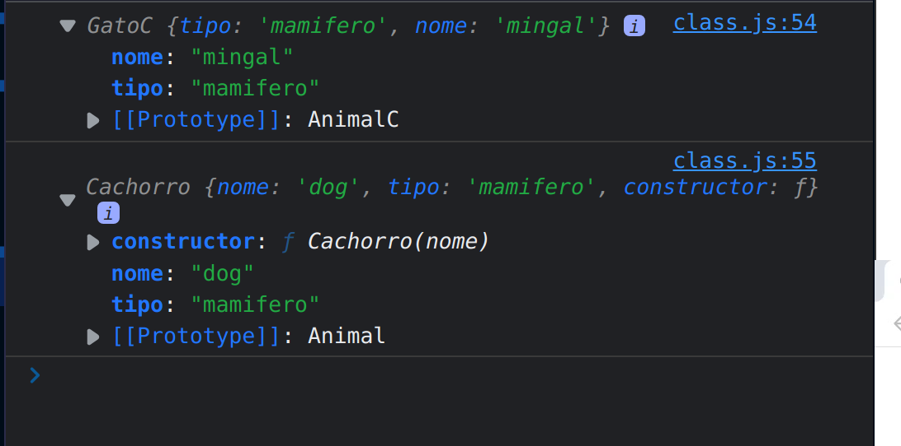

- Se executarmos a seguinte linha de codigo no console `mingal.constructor`, vemos uma `função/classe` criada para gerar o objeto `mingal`. A ligação entre `mingal.constructor` vem do seguinte lugar na cadeia de prototipos, `mingal.__proto__`.
- Onde iremos ter um objeto gerado a partir da `classe AnimalC` onde dentro dela temos uma propriedade chamada `constructor`

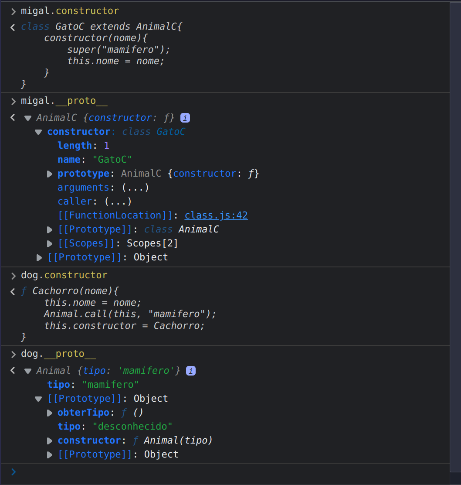

- Vamos simular esse mesmo comportamento para que o `constructor`não seja visivel. Fazendo a `ligação` do constructor, não no objeto em si, mas sim no prototipo da seguinte maneira:

~~~
Cachorro.prototype.constructor = Cachorro;
~~~

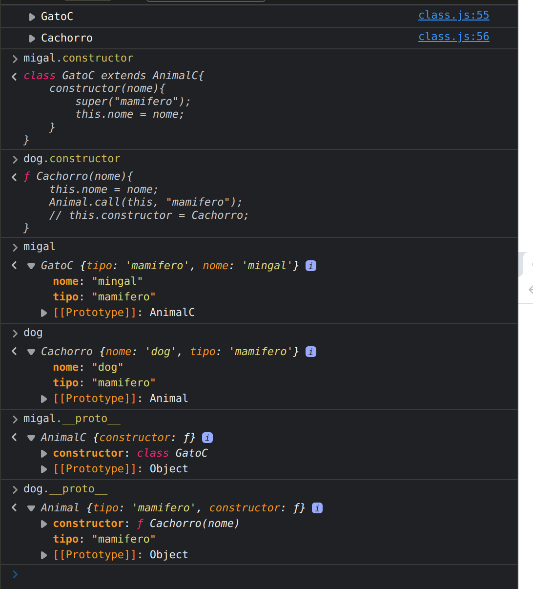

- Como podemos ver, agora so vemos as duas propriedades `nome e tipo`, e a propriedade do `constructor` esta sendo vinculada a função/classe `Animal`.
- Como esta mostrando no console `Animal = função` e `AnimalC = classe`, porem ambos são considerados com funções como vimos em aulas passadas.

Apos feita essas modificações, vamos voltar ao assunto principal da aula. O que queremos reforça é, pq quando usamos metodos e funções no `ES6` elas ficam sempre "penduradas" no `prototype`?

- Vamos pegar a nossa função construtora de `Cachorro`, podemos tanto colcoar funções diretamente no `prototype de Cachorro` , como fizemos quando criamos o metodo `obterTipo` para a função construtora de `Animal`.
- Logo poderiamos fazer a mesma coisa para a nossa função construtora de `Cachorro` criando um metodo chamado `latir()`.

~~~
[COLOCANDO METODO LATIR DENTRO DO PROTOTYPE]
// Cachorre extendendo de animal 
function Cachorro(nome){
    this.nome = nome;
    Animal.call(this, "mamifero");
    // this.constructor = Cachorro;
}

Cachorro.prototype.constructor = Cachorro;
Cachorro.prototype.latir = function(){
    console.log(`${this.nome} está latindo!`);
}

Cachorro.prototype = new Animal("mamifero"); 
let dog = new Cachorro("dog");
~~~

- Podemos tbm colocar os metodos dentro do nosso `objeto` e não no prototype.
- Para exemplificarmos vamos criar uma nova função chamada `comer` dentro da nossa função construtora que criar o objeto `Cachorro`.

~~~
// Cachorre extendendo de animal 
function Cachorro(nome){
    this.nome = nome;
    Animal.call(this, "mamifero");
    // this.constructor = Cachorro;
    this.comer = function(){
         console.log(`${this.nome} está comendo`)
    }
}

Cachorro.prototype = new Animal("mamifero"); 
Cachorro.prototype.constructor = Cachorro;
Cachorro.prototype.latir = function(){
    console.log(`${this.nome} está latindo!`);
}

let dog = new Cachorro("dog");
~~~

- Agora se vermos no console, nosso `objeto dog`possui as propriedaes `tipo e nome` e o metodo `comer()`.
- Podemos tbm usar o metodo `latir()` que esta vinculado ao `prototype de Cachorro` usando a seguinte linha de codigo: `dog.latir()`.
- Para vermos que a função `latir()` esta vinculada ao `prototype` da função construtora basta colocar no console o `dog.__proto__`, onde será mostrado a função `latir() e o constructor`.

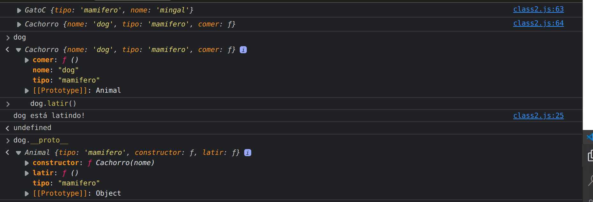

- Por que nao colocamos metodos dentro da função construtora que gera o objeto?
  - Se tivermos mais de um objeto a partir de cachorro, ou seja, 10 ou 20 objetos do tipo `Cachorro`, teremos 20 posições na memoria armazenando a mesma função.
  - Que é o que acontece com a função `Comer()`  que foi criada dentro da função condtrutora geradora do `objeto dog`.
- Por isso que usamos o `prototype`, acabamos ocupando menos posições na memoria da maquina. A função `latir()` vinculada ao prototype, so existe em um espaço de memoria e pode ser chamada por qualquer objeto gerado a partir de suas funções construtoras.
- É por isso tbm que quando utilizamos a sintaxe mais moderna do `ES6`, colocando os metodos dentro da `classe`, esses metodos são salvos dentro do `prototype`, não ficam dentro do `objeto` gerado pela `classe`. 
- Porem poderiamos utilizar o `constructor da classe`para fazer algo como:

~~~ 
class AnimalC {
    constructor(tipo){
        if(tipo) this.tipo = tipo;
        // this.tipo = tipo;
    }

    obterTipo(){
        return this.tipo;
    }

}

class GatoC extends AnimalC{
    constructor(nome){
        super("mamifero");
        this.nome = nome;
        this.comer = function(){
            console.log(`${this.nome} está comendo`);
        }
    }
}
~~~

- Quando pedimos agora para ver o `migal` que é o objeto gerado pela classe `GatoC`, podemos ver que ele possui como propriedade a função `Comer()`, logo se tivessemos 20 objetos criados por essa classe, teriamos 20 funções `comer()` iguais salvas em lugares diferentes da memoria, ocupando asism mais espaço do que necessario.
- Por essa razão colocamos todos os metodos dentro do `prototype`, economizanod recurso e deixando o codigo mais performatico.

 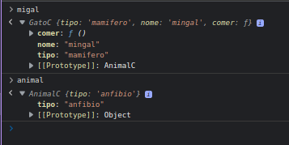

 - Vejam no codigo e imagem acima que, quando criamos o metodo fora do `constructor` da classe, ele é salvo no `prototype` e não no objeto em si.

Se tivessemos trabalhando com `factory functions` teriamos o mesmo problema. Vamos criar uma outra `factory function` para exemplificarmos isso melhor.

- Vamos copiar e colocar a `facttory function ` que fizemos em aulas passadas chamada `criarCachorro()`
- Vamos criar dois objetos usando essa `factory function` chamados de `dog1,dog2`.

~~~ 
function criarCachorro(name){
    let posicao = 0;
    return {
        name,
        latir(){
            console.log(this.name, "está latindo");
        },
        andar(distancia){
            posicao += distancia;
            console.log(this.name, "andou", distancia, " m");
        },
        get posicao(){
            console.log(`a posição atual de ${this.name} é ${posicao}`);
        }
    }
}
let dog1 = criarCachorro("dog1");
let dog2 = criarCachorro("dog2");
~~~

- Ao testarmos no browser, podemos ver que os dois objetos possuem suas proprias funções `latir() e andar()`. Ou seja, estamos ocupando muito espaço na memoria.
- Uma maneira de resolvermos isso usando os conceitos de `prototype` que aprendemos.
  - Em vez de retornarmos o objeto diretamente no `return` vamos criar uma constante chamada `obj` que será o objeto retornado pela `factory function`. 
  - Dentro deste objeto, vamos ter somente a propriedade `nome` e o `get posicao()`, que pode permanecer no objeto.
- Vamos testar o codigo refatorado abaixo no console para vermos oq ue temos.

~~~
function criarCachorro(name){
    let posicao = 0;

    const obj = {
        name,
        get posicao(){
            console.log(`a posição atual de ${this.name} é ${posicao}`);
            return posicao;
        }
    }
    return obj;
}

let dog1 = criarCachorro("dog1");
let dog2 = criarCachorro("dog2");
~~~

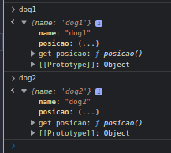

- Como podemos ver na imagem acima o `prototype` desses objetos criados pela `factory function` é o proprio objeto global `Object`. Ou seja, temos que vincular as funções que queremos na nossa `factory function` com o objeto global `Object`.
- Vejam tbm que quando colocamos no console `dog1.posicao()`, temos acesso a essa função  devido a palavra `get`, que esta dentro do objeto, porem esta mostrando como `não listado`.
- Para fazer o vinculo do `objeto` antes de retornarmos ele na `factory function` temos que criar o `vinculo`. 
  - Para criar esse `vinculo` usamos um metodo especifico do `objeto Object` chamado de `setPrototypeOf()`, onde passamos `dois objetos como parametro`.
  - `Primeiro Parametro` = objeto que queremos fazer a ligação. Ou seja, colocamos um outro objeto dentro do `prototype` do objeto `Object`.
  - `Segundo parametro` = Passamos um `objeto {}` com as funções que queremos, no caso `latir() e andar()`.

~~~ 
// factory functions

function criarCachorro(name){
    let posicao = 0;

    const obj = {
        name,
        get posicao(){
            console.log(`a posição atual de ${this.name} é ${posicao}`);
            return posicao;
        }
    }

    // vinculando ao prototype de Object
    Object.setPrototypeOf(obj, {
        latir(){
            console.log(`${this.name} está latindo!`);
        },
        andar(distancia){
            posicao += distancia;
            console.log(`${this.name} andou ${this.distancia} m`);
        }
    });

    return obj;
}

let dog1 = criarCachorro("dog1");
let dog2 = criarCachorro("dog2");
~~~

- Agora ao testarmos esse codigo no browser, podemos ver que as funções `latir() e andar()` estão dentro do `prototype` que faz parte de `Object`, como podemos ver na imagem abaixo.

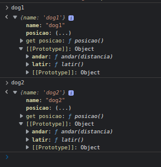

- Precisamos tomar cuidado pois toda vez que chamamos a `factory function criarCachorro()` estamos criando um outro objeto (onde temos as funções) e o vinculando ao `prototype`, porem irão ser objetos diferentes.
- Vamos fazer um teste no console.

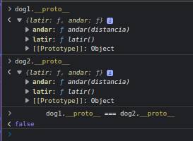

- Como podemos ver o `__proto__` não são iguais, logo apesar de parecer que melhoramos nosso codigo ele ainda criando outros objetos, que parecem ser iguais porem não são, ocupando assim outra posição na memoria, onde temos como prova o `retorno sendo como false`.
- Para melhorar isso, vamos criar uma constante chamada `cachorroProto` que irá receber o `obejto com as funções`, porem temos que criar essa constante fora da `factory function` para assim toda vez que a gente chamar essa função, não seja criada esse novo objeto.

~~~ 
// factory functions

// objeto que guarda as funções
const cachorroProto = {
    latir(){
        console.log(`${this.name} está latindo!`);
    },
    andar(distancia){
        posicao += distancia;
        console.log(`${this.name} andou ${this.distancia} m`);
    }
}

function criarCachorro(name){
    let posicao = 0;

    const obj = {
        name,
        get posicao(){
            console.log(`a posição atual de ${this.name} é ${posicao}`);
            return posicao;
        }
    }

    // vinculando ao prototype de Object
    Object.setPrototypeOf(obj,cachorroProto );

    return obj;
}

let dog1 = criarCachorro("dog1");
let dog2 = criarCachorro("dog2");
~~~

- Agora como podemos ver na imagem abaixo, tanto `dog1.__proto__` quanto `dog2.__proto__` são o mesmo objeto.

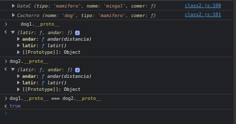

- Porem ainda temos uma pequena pegadinha, temos um objeto chamado `cachorroProto` que será vinculado ao `Object` quando chamarmos a factory function `criarCachorro()`. Nesse objeto `cachorroProto` não temos mais acesso a `variavel posicao`.
- Poderiamos tirar o metodo `andar()` para não termos mais esse problema ou podemos criar alem do `get posicao` um `set posicao()`, pois assim na função `andar()` ao invez de `posicao` receber o valor `posicao +  distancia`, usamos o `this`.

~~~
// factory functions

// objeto que guarda as funções
const cachorroProto = {
    latir(){
        console.log(`${this.name} está latindo!`);
    },
    andar(distancia){
        this.posicao += distancia;
        console.log(`${this.name} andou ${this.distancia} m`);
    }
}

function criarCachorro(name){
    let posicao = 0;

    const obj = {
        name,
        get posicao(){
            console.log(`a posição atual de ${this.name} é ${posicao}`);
            return posicao;
        }
    }

    // vinculando ao prototype de Object
    Object.setPrototypeOf(obj,cachorroProto );

    return obj;
}

let dog1 = criarCachorro("dog1");
let dog2 = criarCachorro("dog2");
~~~

- Porem o `get posicao()` somente recupera uma função e não define um valor, se testarmos o codigo acima, vemos que ele não irá funcionar corretamente.

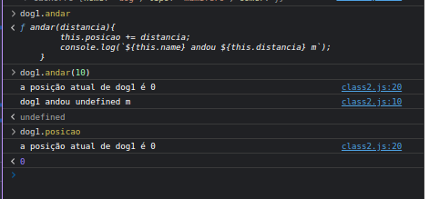

- O retorno de `dog1.posicao` não esta sendo atualizado, pois o `get`  não nos permite fazer a escrita `this.posicao`. 
- Para resolvermos isso, alem do `get` vamos precisar construir a função `set`.

~~~ 
// factory functions

// objeto que guarda as funções
const cachorroProto = {
    latir(){
        console.log(`${this.name} está latindo!`);
    },
    andar(distancia){
        this.posicao += distancia;
        console.log(`${this.name} andou ${this.distancia} m`);
    }
}

function criarCachorro(name){
    let posicao = 0;

    const obj = {
        name,
        get posicao(){
            console.log(`a posição atual de ${this.name} é ${posicao}`);
            return posicao;
        },
        set posicao(newPosition){
            console.log(`a nova posição atual de ${this.name} é ${newPosition}`);
            posicao = newPosition;
        }
    }

    // vinculando ao prototype de Object
    Object.setPrototypeOf(obj,cachorroProto );

    return obj;
}

let dog1 = criarCachorro("dog1");
let dog2 = criarCachorro("dog2");
~~~

- Agora apos criada a função `set` podemos ver que o codigo volta a funcionar.

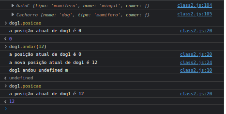

- Tudo voltou a funcionar pois externalizamos uma forma de fora da factory function `criarCachorro` termos acesso a variavel `posicao`, atraves da função `set posicao()`. 
- E no objeto prototype `cachorroProto` acessamos usando o `this.posicao` como se fosse uma propriedade, porem é uma função que esta atrelada no `set`.

 

 

## Exercicio Proposto: Criar um polyfill para String
 

A ideia é que a gente crie no `prototype` da função construtora `String`, uma função chamada `replaceAll()` caso essa função não exista.

Esse metodo irá receber uma `expressão regular` que não vimos ainda, e temos uma sintaxe da seguinte maneira:

~~~
const newStr = str.replaceAll(regexp|substr, newSubstr|function);
~~~

- Esse metodo irá receber dois parametros, o primeiro é ou uma `expressão regular || substring`, e como segundo parametro recebe ou uma `string || função`.

Antes de seguirmos para o desafio vamos criar um novo arquivo chamado `teste_instance.js` para exemplificarmos algumas teorias.

- No console do browser, vamos mostrar algumas formas de criarmos numeros.

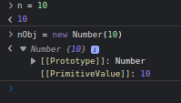

- Outra coisa interessante da gente perceber é quando, fazemos o `n.construtor`, onde o console irá nos mostrar o construtor de `n`.

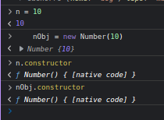

- Pela imagem acima, podemos ver que quando usamos o `n.constructor` nos é mostrado a função construtora `Number` mesmo a gente tendo usado uma `escrita literal (n = 10)` para definirmos o valor de `n`. Na imagem acima vemos que `n` e `nObj` possuem o mesmo construtor.
- Porem, se fizermos `n instanceOf Number` iremos receber o retorno como `false`. Ja o `nObj  instanceOf Number` irá nos retornar `true`.

> Valores primitivos retornam `false` quando olhamos com o `instanceOf`.

~~~ 
n = 10;

nObj = new Number(10);

console.log(n instanceof Number);
console.log(nObj instanceof Number);

console.log(n.constructor);
console.log(nObj.constructor);

// SAIDA:

❯ node teste_instance.js
false
true
[Function: Number]
[Function: Number]
~~~ 

- Vamos testar agora usando `Arrays`, de maneira literal e usando o construtor.

~~~
n = 10;

nObj = new Number(10);

console.log(n instanceof Number);
console.log(nObj instanceof Number);

console.log(n.constructor);
console.log(nObj.constructor);

console.log("----------------");

const arr1 = [];
const arr2 = new Array();

console.log(arr1 instanceof Array);
console.log(arr2 instanceof Array);

console.log(arr1.constructor);
console.log(arr2.constructor);

// SAIDA:

❯ node teste_instance.js
false
true
[Function: Number]
[Function: Number]
----------------
true
true
[Function: Array]
[Function: Array]
%  
~~~

- Podemos ver que o resultado irá sair ligeiramente diferente tendo `true` para ambos os `isntanceOF`.

Logo quando não estamos `armazenando valores primitivos` o `instanceOf` irá nos retornar o valor correto.

- Estamos exemplificando isso pois, apesar de não termos ainda visto sobre `expressões regulares`, elas da mesma forma que os `Arrays` podem ser criadas de forma `literal` ou usando o `operador new`.

~~~ 
// expressões regulares literais
const regex1 = /a/g;
// expressões regulares operador new
const regex2 = new RegExp();

console.log(regex1 instanceof RegExp);
console.log(regex2 instanceof RegExp);
console.log(regex1.constructor);
console.log(regex2.constructor);

// SAIDA:
----------------
true
true
[Function: RegExp]
[Function: RegExp]

~~~

- Logo conseguimos verificar se uma `variavel/parametro` é `instanceOf` de `RegExp`, seja utilizando a `sintaxe formal ou literal`.
- Se quisermos saber se alguma coisa é uma `função`, basta usamos o `typeof`.

~~~
// verificando se eh uma função
console.log(typeof function(){});
const fn = () => {};
console.log(typeof fn);

// SAIDA:

function
function
~~~

- Podemos tbm usar o `typeof`para verificarmos se um determinado elemento é de um determinado tipo, por exemplo, vamos ver se o `n` que criamos eh do tipo `number`.

~~~
console.log(n instanceof Number);
console.log(n instanceof Number || typeof n === "number");
console.log(nObj instanceof Number);

// SAIDA:

❯ node teste_instance.js
false
true
true
~~~

- Da mesma maneira podemos verificar se é uma função.

~~~
n = 10;

nObj = new Number(10);

console.log(n instanceof Number);
console.log(n instanceof Number || typeof n === "number");
console.log(nObj instanceof Number);

console.log(n.constructor);
console.log(nObj.constructor);

console.log("----------------");

const arr1 = [];
const arr2 = new Array();

console.log(arr1 instanceof Array);
console.log(arr2 instanceof Array);

console.log(arr1.constructor);
console.log(arr2.constructor);

console.log("----------------");

// expressões regulares literais
const regex1 = /a/g;
// expressões regulares operador new
const regex2 = new RegExp();

console.log(regex1 instanceof RegExp);
console.log(regex2 instanceof RegExp);

console.log(regex1.constructor);
console.log(regex2.constructor);

// verificando se eh uma função
console.log(typeof function(){});
const fn = () => {};
console.log(typeof fn);

console.log(typeof fn === "function");

// SAIDA:

❯ node teste_instance.js
false
true
true
[Function: Number]
[Function: Number]
----------------
true
true
[Function: Array]
[Function: Array]
----------------
true
true
[Function: RegExp]
[Function: RegExp]
function
function
true
%                                                                        
~~~

Voltando para o desafio, a ideia é criarmos o `polyfill`. No caso, podemos fazer de variavas formas, com `loops`, `indexOf`.. etc.

 

 

## Resolução: Criar um polyfill para String
 

Vamos criar um novo documento chamado de `replaceAll.js`.

- A primeira coisa que temos que fazer quando estamos desenvolvendo um `polyfill` é verificar se esse `metodo ja existe`. Para isso verificamos no `prototype` da função construtora  `String`, o metodo `replaceAll()`.

~~~
if(!String.prototype.replaceAll){
    String.prototype.replaceAll = function(){}
}else{
    console.log("Metodo existe.");
}
~~~

- Lembrando que essa função `replaceAll()` recebe dois parametros, ou uma `expressão regular = regexp` ou uma `String = substrr`, e, ou uma `nova substring = newSubstr` ou uma `funcção = function`. Vamos somente fazer a verificação da `string`.
  - `buscaStr` = string que será buscada.
  - `trocaStr` = string que será trocada pela buscada.

~~~ 
if(!String.prototype.replaceAll){
    String.prototype.replaceAll = function(buscaStr, trocaStr){}
}else{
    console.log("Metodo existe.");
}
~~~ 

- Temos varias formas de fazer essa `troca`, porem o jetio mais facil seria utilizando os `metodos de Array`, ou seja, podemos utilizar o `metodo split()` para converter uma `string em array` e depois utilizar o `metodo join()` para retornar uma `string a partir de um array`.
- Porem antes de fazermos isso, vamos ver no console quem seria o `this` e o `this.valueOf`.

~~~ 
if(!String.prototype.replaceAll){
    String.prototype.replaceAll = function(buscaStr, trocaStr){
        console.log(this);
        console.log(this.valueOf);
    }
}else{
    console.log("Metodo existe.");
}
~~~

> OBS: Como a função `replaceAll()` existe em `String`, o codigo acima irá `substituir` a função `nativa` existe. Essa pratica não é comum e nem recomendada.

~~~
if(!String.prototype.replaceAll){
    String.prototype.replaceAll = function(buscaStr, trocaStr){
        console.log(this);
        console.log(this.valueOf);
    }
}else{
    console.log("Metodo existe.");
}

let str1 = "String 1 para 2";
let str2 = "String 2 para 1";

console.log(str1.replaceAll(str1,str2));
console.log(str1.replaceAll(str2,str1));
~~~

- Vamos observar no console do browser o que o codigo acima irá gerar.

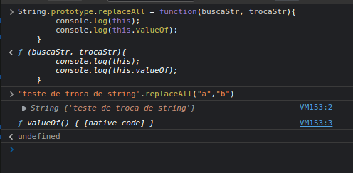

- Como vemos na imagem acima o `this` refere-se ao `objeto do tipo String` e o nosso `this.valueOf` é o `valor primitivo` do objeto.
- Logo, para constrir esse `polyfill` da maneira mais facil:

1) `this.valueOf()` = pega o valor primitivo da String.
2) `.split()` = trnasforma a string em array.
   1) `split(buscarStr)` = Passa como argumento a string que será buscada e transformada em array.
3) `.join()` = pegar o array e retorna uma string.
   1) `.join(trocaStr)` = Passa como argumento a string que será trocada dentro do array e transforma em string.

~~~ 
if(!String.prototype.replaceAll1){
    String.prototype.replaceAll1 = function(buscaStr, trocaStr){
        console.log(this);
        console.log(this.valueOf);

        return this.valueOf().split(buscaStr).join(trocaStr);
    }
}else{
    console.log("Metodo existe.");
}

let str = "Testando o repllaceAll1()";
let str1 = "a";
let str2 = "b";

console.log(str);
console.log(str1);
console.log(str.replaceAll1(str1,str2));
console.log(str2)
console.log(str.replaceAll1(str2,str1));

// SAIDA:
❯ node replaceAll.js
Testando o repllaceAll1()
a
[String: 'Testando o repllaceAll1()']
[Function: valueOf]
Testbndo o repllbceAll1()
b
[String: 'Testando o repllaceAll1()']
[Function: valueOf]
Testando o repllaceAll1()

~~~

- Para testarmos o codigo acima, ou usamos o `browser` ou renomeamos a função para `replaceAll1()`.

Outra coisa que poderiamos fazer dentro do nosso `polyfill` seria algumas verificações.

- Como exemplo de verificação, poderiamos verificar se a função esta recebendo parametro ou não, mostrando algum erro na tela.

~~~ 
if(!String.prototype.replaceAll1){
    String.prototype.replaceAll1 = function(buscaStr, trocaStr){
        console.log(this);
        console.log(this.valueOf);

        if(buscaStr instanceof RegExp){
            throw Error("first parameter must be a string");
            // throw new Error("first parameter must be a string"); // igual acima
        }

        return this.valueOf().split(buscaStr).join(trocaStr);
    }
}else{
    console.log("Metodo existe.");
}

let str = "Testando o repllaceAll1()";
let str1 = "a";
let str2 = "b";

console.log(str);
console.log(str1);
console.log(str.replaceAll1(str1,str2));
console.log(str2)
console.log(str.replaceAll1(str2,str1));

~~~

- Poderiamos usar no lugar de `buscaStr instanceOf RegExp`, poeriamos verificar se é ou não do tipo string.

~~~
if(!String.prototype.replaceAll1){
    String.prototype.replaceAll1 = function(buscaStr, trocaStr){
        console.log(this);
        console.log(this.valueOf);

        if(!(buscaStr instanceof String || typeof buscaStr === "string")){
            throw Error("first parameter must be a string");
            // throw new Error("first parameter must be a string"); // igual acima
        }

        return this.valueOf().split(buscaStr).join(trocaStr);
    }
}else{
    console.log("Metodo existe.");
}

let str = "Testando o repllaceAll1()";
let str1 = "a";
let str2 = "b";

console.log(str);
console.log(str1);
console.log(str.replaceAll1(str1,str2));
console.log(str2)
console.log(str.replaceAll1(str2,str1));
~~~ 

- Se o nossa `buscaStr` for uma string primitiva, receberemos `true`, quando uma das verfiicações é true, a avaliação será `true`, porem como queremos a negação usamos `!`, trazendo o `false`.
- Replicamos o mesmo para o parametro `trocaStr`.

~~~
if(!String.prototype.replaceAll1){
    String.prototype.replaceAll1 = function(buscaStr, trocaStr){
        console.log(this);
        console.log(this.valueOf);

        if(!(buscaStr instanceof String || typeof buscaStr === "string")){
            throw Error("first parameter must be a string");
            // throw new Error("first parameter must be a string"); // igual acima
        };

        if(!(trocaStr instanceof String || typeof trocaStr === "string")){
            throw Error("second parameter must be a string");
            // throw new Error("first parameter must be a string"); // igual acima

        }

        return this.valueOf().split(buscaStr).join(trocaStr);
    }
}else{
    console.log("Metodo existe.");
}

let str = "Testando o repllaceAll1()";
let str1 = "a";
let str2 = "b";

console.log(str);
console.log(str1);
console.log(str.replaceAll1(str1,str2));
console.log(str2)
console.log(str.replaceAll1(str2,str1));
~~~

 

 

## Classes Abstratas
 

Vamos agora voltar a falar um pouco mais sobre classes. Vamos criar um novo documento e chama-lo de `abstractClass.js && abstractClass.html` usando o `class.html` da aula passada.

Vamos ver agora o que seria uma `classe Abstrata`, que nada mais é do que uma `classe` que não pode ser utilizada diretamente, é uma classe que so pode ser `extendida`. Vamos a partir de agora usar o `ES6` diretamente.

- Vamos criar uma classe chamada `Animal` que será uma `classe Abstrata`, logo não podemos `instancia-la` usando `const animal = new Animal()`.
- Por enquanto poderemos escrever como esta abaixo, mas jaja iremos bloquear isso.
- Uma observação é que caso a gente não passe nenhum parametro para a classe, o `constructor()` pode ser omitido. Pois ele sempre é chamada quando utilizamos o `operador new`, a gente tendo programado ele ou nao.

~~~ 
class Animal {}

const animal = new Animal();
~~~

~~~
class Animal {
    constructor(){}
}

const animal = new Animal();
~~~

- A classe `Anima()`irá receber uma parametro chamado de `tipo`, logo no `constructor` temos que colocar esse parametro.

~~~
class Animal {
    constructor(tipo){
        if(tipo){
            this.tipo = tipo;
        }
    }
}

const animal = new Animal("mamifero"); 
~~~

- Vamos tbm criar uma metodo chamada `comer` para essa class `Animal`.

~~~
class Animal {
    constructor(tipo){
        if(tipo){
            this.tipo = tipo;
        }
    };

    comer(){
        console.log(`${this.tipo} esta comendo`);
    }
}

const animal = new Animal("mamifero"); 
~~~

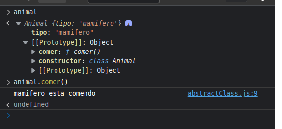

- Agora a ideia é que não queremos ter o objeto `animal` em si, mas sim um `cachorro`, `gato` etc.
- Logo vamos criar uma outra classe chamada `Gato` que irá `extender` da classe `Animal`.

~~~
class Animal {
    constructor(tipo){
        if(tipo){
            this.tipo = tipo;
        }
    };

    comer(){
        console.log(`${this.tipo} esta comendo`);
    }
}

class Gato extends Animal{
    constructor(nome){
        super("mamifero");
        this.nome = nome;
    };
}

const animal = new Animal("mamifero");
const mingal = new Gato("mingal"); 
~~~

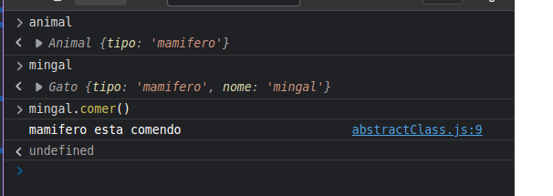

- Não queremos que a função comer seja chamada de `Animal`, ou seja, queremos que toda classe que `extenda` da classe `Animal` seja `obrigado` a implementar a função `comer()`.
- Para isso, no nosso metodo `comer()` que esta dentro de animal, vamos lançar um `erro`.

~~~
class Animal {
    constructor(tipo){
        if(tipo){
            this.tipo = tipo;
        }
    };

    comer(){
        // console.log(`${this.tipo} esta comendo`);
        throw new Error("Method 'comer()' must be implemented!");
    }
}

class Gato extends Animal{
    constructor(nome){
        super("mamifero");
        this.nome = nome;
    };
}

const animal = new Animal("mamifero");
const mingal = new Gato("mingal");
~~~

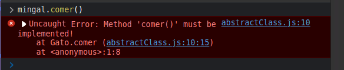

- Como podemos ver na imagem acima, ao chamarmos o metodo `comer()` o erro é mostrado. Isso nos obriga a implementar o metodo `comer()`, dentro da nossa classe `Gato`.

~~~
class Animal {
    constructor(tipo){
        if(tipo){
            this.tipo = tipo;
        }
    };

    comer(){
        // console.log(`${this.tipo} esta comendo`);
        throw new Error("Method 'comer()' must be implemented!");
    }
}

class Gato extends Animal{
    constructor(nome){
        super("mamifero");
        this.nome = nome;
    };
    comer(){
        console.log(`${this.nome} está comendo!`);
    }
}

const animal = new Animal("mamifero");
const mingal = new Gato("mingal"); 
~~~

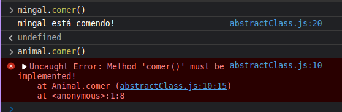

- Porem ainda temos um problema, atualmente temos um objeto que é o proprio `animal`, porem não queremos isso, queremos que a `classe Animal` so possa ser `extendida` e não que ela possa ser `instanciada`.
- Para isso, podemos fazer uma verificação no `constructor` da classe `Animal`. Primeiro vamos observar no console o que temos no `this.constructor`.

~~~
class Animal {
    constructor(tipo){
        console.log(this.constructor);
        if(tipo){
            this.tipo = tipo;
        }
    };

    comer(){
        // console.log(`${this.tipo} esta comendo`);
        throw new Error("Method 'comer()' must be implemented!");
    }
}

class Gato extends Animal{
    constructor(nome){
        super("mamifero");
        this.nome = nome;
    };
    comer(){
        console.log(`${this.nome} está comendo!`);
    }
}

const animal = new Animal("mamifero");
const mingal = new Gato("mingal");
~~~

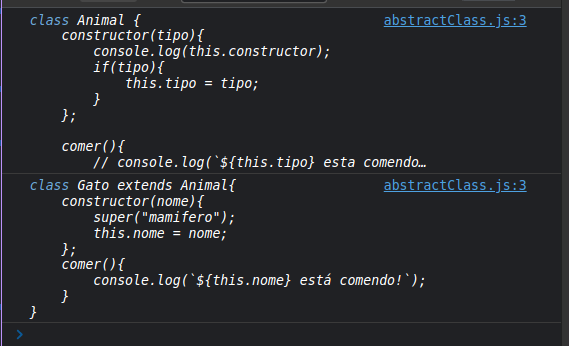

- Lembre-se que esse construtor sempre é chamado quando usamos `operador new` estando escrito ou nao na classe. Tanto é que se comentarmos a linha onde `instanciamos um animal`, mesmo chamando o metodo `super()` na classe `Gato` quando testarmos no console, so irá nos mostrar `1 construtor` que seria da classe `Gato`.

~~~
class Animal {
    constructor(tipo){
        console.log(this.constructor);
        if(tipo){
            this.tipo = tipo;
        }
    };

    comer(){
        // console.log(`${this.tipo} esta comendo`);
        throw new Error("Method 'comer()' must be implemented!");
    }
}

class Gato extends Animal{
    constructor(nome){
        super("mamifero");
        this.nome = nome;
    };
    comer(){
        console.log(`${this.nome} está comendo!`);
    }
}

// const animal = new Animal("mamifero");
const mingal = new Gato("mingal"); 
~~~

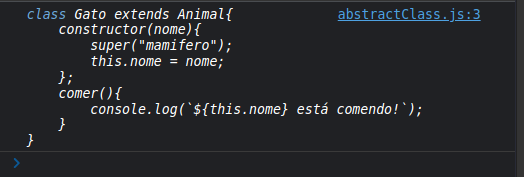

- Vamos voltar para o exemplo onde temos dois cosntrutores, como na imagem abaixo.

- Então agora como chamamos o `operador new` ao criarmos uma `instancia de Animal`, o console do `this.constructor` quando executado na primeira vez nos mostra a `class Animal`.
- Logo, para que essa classe não possa ser usada diretamente, ou seja, so possa ser `extendida` por outra classe, fazemos um verificação.

~~~
class Animal {
    constructor(tipo){
        console.log(this.constructor);
        if(this.constructor === Animal){
            throw new Error("Animal is an abstract class, can not be instanciated!");
        }
        if(tipo){
            this.tipo = tipo;
        }
    };

    comer(){
        // console.log(`${this.tipo} esta comendo`);
        throw new Error("Method 'comer()' must be implemented!");
    }
}

class Gato extends Animal{
    constructor(nome){
        super("mamifero");
        this.nome = nome;
    };
    comer(){
        console.log(`${this.nome} está comendo!`);
    }
}

const animal = new Animal("mamifero");
const mingal = new Gato("mingal"); 
~~~

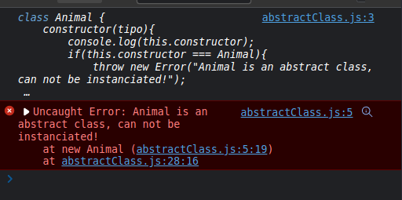

 - Agora quando tentarmos criar uma `instancia` da classe `Animal` iremos receber um erro.
 - Podendo somente agora usar a `classe Animal` para `extender` outras classes.

 

 

## Métodos Estáticos
 

Agora iremos falar sobre `metodos estaticos` que nada mais são do que `metodos` que não fazem parte das `instancias do objeto`. Ou melhor das `instancias das classes do objeto`.

`Metodos Estaticos` fazem parte da `função construtora` ou da `classe`.

- Para demonstrar, antes de vermos no codigo, temos uma classe `nativa` do javascript que seria o `Math`.

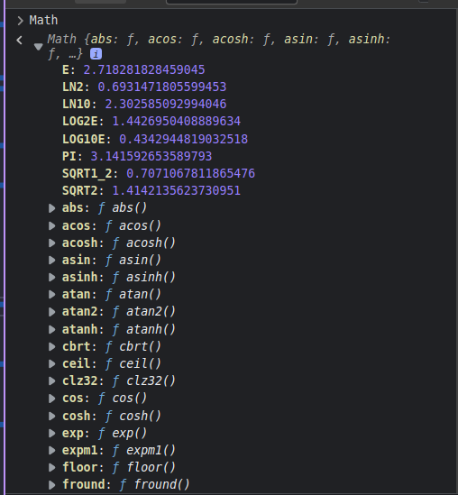

Observem que as funções desse objeto `Math` estão direto no objeto `Math`, oq ue é um pouco diferente do que ja tinhamos visto até entao. Vimos que os `metodos` ficavam no `prototype`, porem no caso do objeto `Math` é um pouco diferente.

Isso acontece pq na verdade esses metodos são `metodos estaticos`, não fazem parte das `instancias/objeto`, tanto é que não podemos criar uma `variavel n` e atribuir a ela o `new Math`, isso irá nos gerar um erro que fala que `Math` não é um `construtor`.

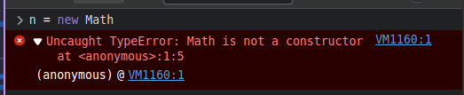

Ou seja, a `classe Math` so pode ser utilizada diretamente, e não a partir de uma `instancia/objeto`. Por isso quando usamos em aulas passadas o `Math.random()` usamos o objeto `Math` diretamente, sem criar um objeto.

- Vamos agora criar um novo documento chamado `static.js` para exemplificarmos isso melhor.
- Como vimos acima, um `metodo estatico` nada mais é do que um metodo que faz parte da `função construtora` ou da `classe`.
- Vamos criar primeiramente utilizando o `ES5`, uma função chamada `Animal` onde iremos colocar em seu `prototype` um metodo chamado `whoAmI()` e tbm um `metodo estatico` chamado de `categoria`.
- Ou seja, todo `Anima` irá possuir uma `categoria` que seria um  `ser vivo`, logo, não faz parte das instancias de cada `Animal` gerado.

~~~
// ES5  

function Animal(){};

Animal.prototype.whoAmI = function(){
    return this;
}

Animal.categoria = "ser vivo";
~~~

- Poderiamos criar uma constante chamada `dog` que irá receber o `new Animal()` e dentro de `Animal` teremos a categoria.

~~~
// ES5  

function Animal(){};

Animal.prototype.whoAmI = function(){
    return this;
}

Animal.categoria = "ser vivo";

const dog  = new Animal(); 
~~~

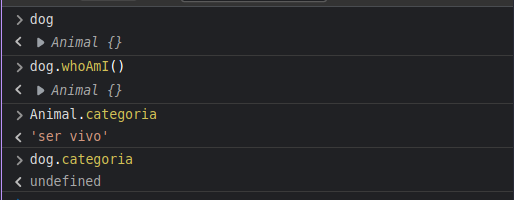

- Observem que `categoria` so pertence a `classe Animal` e não do `objeto em si`. Logo quando escrevemos `dog.categoria` recebemos como retorno o `undefined`. Pois não temos uma propriedade chamada `categoria` dentro do nosso objeto, éssa propriedade esta guardada na propria `função construtora Animal`.

Vamos agora utilizar o `ES6`, criando uma outra classe chamada `Cachorro`.

- Vamos colocar uma propriedade chamada `nome` ja que todo cachorro possui um nome, e criar um `metodo estatico` chamado `comer()` para isso, temos que colocar antes do nome do metodo a palavra-chave `static`.

~~~ 

// ES6

class Cachorro { 
    constructor(nome){
        this.nome = nome;
    }

    // metodo estatico
    static comer(){
        console.log(`${this.nome} esta comendo!`);
    }

}
~~~

- Quando usamos a palavra `static` antes de um metodo, ela nos indica que o `metodo` não irá fazer parte do `objeto/instancia` mas sim irá fazer parte do `Cachorro`. 
- Observe tbm que se colocarmos um console.log com `this` dentro da função `comer()` não teremos mais acesso ao objeto. Ja que esse `this` não faz mais referencia para o `objeto` gerado a partir de `Cachorro` mas sim, ao `Cachorro()` em si.

~~~ 

// ES6

class Cachorro { 
    constructor(nome){
        this.nome = nome;
    };

    // metodo estatico
    static comer(){
        console.log(this);
        console.log(`${this.nome} esta comendo!`);
        
    };

}

const todinho = new Cachorro("todinho");
~~~

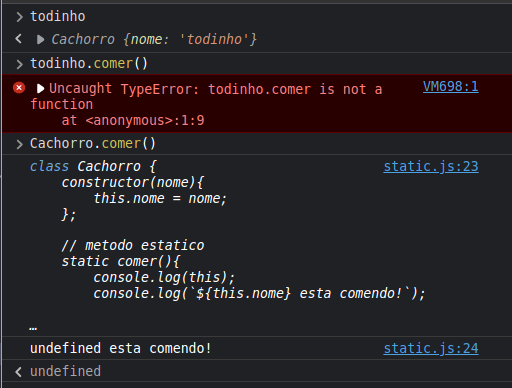

- Observem na imagem acima que não temos acesso ao `nome`, ja que o `this` não faz referencia ao objeto e sim a `classe Cachorro`.
- Podemos tbm a partir de um `metodo estatico` chamar outro `metodo estatico` usando a palavra `this`, pois ela se refere ao `Cachorro`..

~~~ 

// ES6

class Cachorro { 
    constructor(nome){
        this.nome = nome;
    };

    // metodo estatico
    static comer(){
        console.log(this);
        // console.log(`${this.nome} esta comendo!`); // não possui acesso ao nome
        console.log("esta comendo");
        this.beber();
        
    };

    static beber(){
        console.log("esta bebendo");
    }

}

const todinho = new Cachorro("todinho");
~~~

- Porem, se dentro do nosso `constructor` da classe a gente queira chamar algum `metodo estatico` não podemos utilizar o `this`, pois dentro do `constructor` o `this` será o `proprio objeto`  e não a `classe Cachorro`.
- Logo se quisermos usar um `metodo estatico` dentro do nosso `constructor` teriamos que fazer `Cachorro.beber()`.

~~~ 

// ES6

class Cachorro { 
    constructor(nome){
        this.nome = nome;
        console.log("chamando metodo estatico de dentro do constructor");
        Cachorro.beber();
    };

    // metodo estatico
    static comer(){
        console.log(this); //  classe cachorro
        // console.log(`${this.nome} esta comendo!`); // não possui acesso ao nome
        console.log("esta comendo");
        this.beber();
        
    };

    static beber(){
        console.log("esta bebendo");
    }

}

const dog2 = new Cachorro("todinho");
~~~

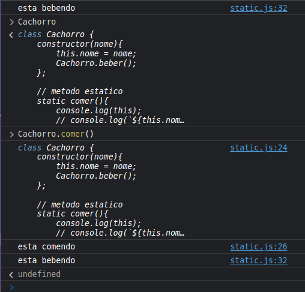

- Como o `constructor()` é executado sempre que o `operador new` é usado, no console, temos a saida direta ao atualizar a pagina.
- 

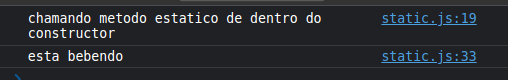

- Vejam na imagem abaixo que não temos acesso pelo `objeto dog2` aos `metodos estaticos`.
- E o `this` seria o proprio `Cachorro`.

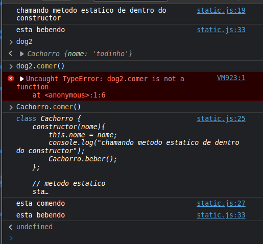

 

 

## Desafio: Classe Abstrata ContaBancaria
 

Vamos criar algumas classes que simulam uma `conta bancaria`. Para isso, vamos criar um novo arquivo chamado `Conta01.js`.

- A ideia do desafio é a seguinte:

~~~ 

1) Criar conta abstrata ContaBancaria
   1) Cliente
   2) numero
   3) saldo
   4) depositar(value) - recebem valor
   5) sacar(value) - recebe valor

~~~ 

 

 

## Resolução Desafio: Classe Abstrata ContaBancaria
 

Vamos agora desenvolver a `classe Abstrata contaBancaria`.

~~~
[CONTA BANCARIA ABSTRATA  - ANGELINA]
class ContaBancaria{
    constructor(cliente, numero, saldo){
        if(this.constructor === ContaBancaria){
            throw new Error("ContaBancaria is an Abstract Class. Can not be Instanciated");
        }
        if(cliente && numero && saldo){
            this.cliente = cliente;
            this.numero = numero;
            this.saldo = saldo;
        }
    };

    // metodo pode ser acessado pelo objeto
    depositar(value){
        this.saldo += value;
    };
    // metodo precisa ser implementado pelo objeto
    sacar(value){
        throw new Error("Method sacar() needs to be implemented!");
    }
};
~~~

- Dentro do `constructor` iremos passar somente as propriedades `cliente e numero`, pois a propriedade `saldo` irá começar em `0`. 
- Se precisarmos começar com um `saldo inicial` vamos criar um metodo chamado `depositar()` quando isso ocorrer.

~~~ 
class ContaBancariaProf{
    constructor(cliente, numero){
        this.cliente = cliente;
        this.numero = numero;
        this.saldo = 0;
    }
}
~~~

> A propriedade numero em um exemplo real poderia ser gerada `dinamicamente e aleatoriamente`. Porem vamos simplificar para somente vermos questçoes que envolvem POO.

- Vamos agora fazer os dois metodos pedidos `depositar()` e `sacar()`.
- No metodo `depositar()`, podemos escolher algumas abordagens:
  - Ou deixamos o `metodo` sendo implementado pelas `classes` que irão `extender` a `contaBancaria`. Pois ela é uma `classe abstrata`, logo poderiamos utilizar uma abordagem que não permite que `objetos` que `extendam` a classe não possam usar os metodos sem `declarar/criar` os metodos.
  - Ou podemos fazer com que os `objetos` não precisem implementar os  `metodos`.
- Para o metodo `depositar()` vamos deixar que os objetos possam usa-lo sem implementar, porem para o metodo `sacar()` vamos fazer com que cas `classes` que extendem de `contaBancaria` tenham que implementar seu proprio metodo de `saca()`.

~~~
class ContaBancariaProf{
    constructor(cliente, numero){
        this.cliente = cliente;
        this.numero = numero;
        this.saldo = 0;
    };

    depositar(value){
        this.saldo += value;
    };

    static sacar(value){
        throw new Error("Method sacar() needs to be implemented!");
    }

}
~~~

- A unica coisa que ficou faltando é que precisamos `impedir` que a `classe Abstrata contaBancaria` seja usada com o `operador new`.

~~~ 
class ContaBancariaProf{
    constructor(cliente, numero){

        if(this.constructor === ContaBancariaProf){
            throw new Error("ContaBancariaProf is an Abstract class. Can not be instanciated!");
        }

        this.cliente = cliente;
        this.numero = numero;
        this.saldo = 0;
    };

    depositar(value){
        this.saldo += value;
    };

    static sacar(value){
        throw new Error("Method sacar() needs to be implemented!");
    }
}
~~~

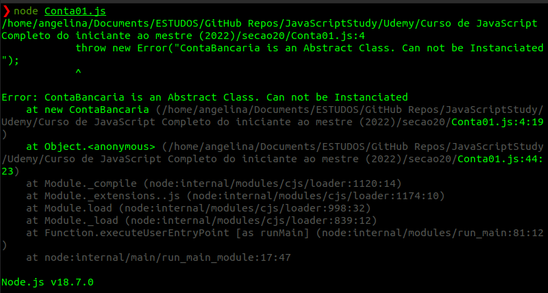

 

 

## Desafio: Classes Concretas ContaPoupança e ContaCorrente
 

Vamos agora criar um outro arquivo chamado `Conta02.js` a partir do arquivo antigo, para podermos ir objservando a evolução do nosso codigo.

O desafio agora é criar duas `classes` que `herdam` de `contaBancaria` chamadas de `ContaCorrente` e `contaPoupanca`.

`ContaCorrente` terá uma propriedade a mais chamada `limite` e `contaPoupanca` tera outra propriedade chamada `aniversario`.

 

 

## Resolução Desafio: Classes Concretas ContaPoupança e ContaCorren
 

~~~ 
[CLASSES CONCRETAS - ANGELINA]
class ContaCorrente extends ContaBancaria{
    constructor(cliente,numero, saldo){
        super("Angelina", 2, 1000);
        this.limite = 0;
    };

    // metodo sacar precisa ser implementado
    sacar(value){};
}

class ContaPoupanca extends ContaBancaria{
    constructor(cliente, numero, saldo){
        super("Pierre", 2, 500);
        this.aniversario = Date.now;
    };

    // metodo sacar precisa ser implementado
    sacar(value){

    }
}

~~~ 

- Vamos criar as `classes concretas` lembrando que a `classe abstrata` recebe dois parametros que terão que ser passados para os `construtores` das `classes concretas` sendo eles `cliente e numero`.

~~~

// classes abstratas professor
class ContaPoupancaProf extends ContaBancariaProf{
    constructor(cliente, numero){
        super("Daniel", 1);
    }
}
class ContaCorrenteProf extends ContaBancariaProf{
    constructor(cliente, numero){
        super("Ferreira", 2);
    }
} 
~~~

- Vamos agora colocar as `propriedades` individuais de cada `classe concreta`. O `limite` irá começar em `0` e o `aniversario` irá receber a data de hoje usando o `Date.now()`, lembrando que o `now()` é um `metodo estatico` do `objeto Date()`.

~~~

// classes abstratas professor
class ContaPoupancaProf extends ContaBancariaProf{
    constructor(cliente, numero){
        super("Daniel", 1);
        this.aniversario = Date.now();
    }
}
class ContaCorrenteProf extends ContaBancariaProf{
    constructor(cliente, numero){
        super("Ferreira", 2);
        this.limite = 0;
    }
}
~~~

- Vamos criar um `html` para testar nosso codigo no browser em vez do `node`.

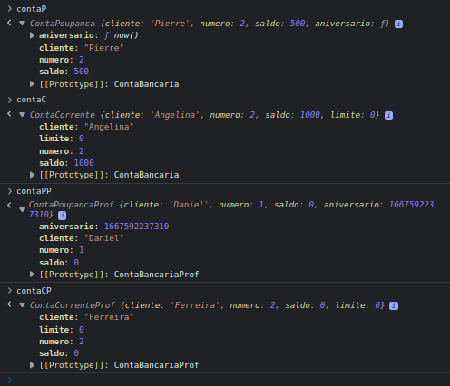

- Como podemos ver na imagem acima, as nossas contas estão funcionando, vamos testar os metodos das mesmas.

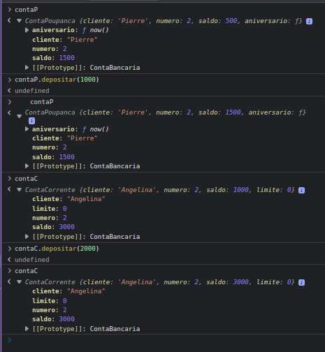

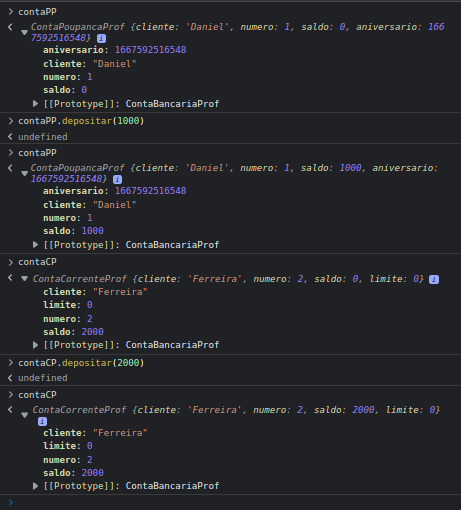

~~~
class ContaBancaria{
    constructor(cliente, numero, saldo){
        if(this.constructor === ContaBancaria){
            throw new Error("ContaBancaria is an Abstract Class. Can not be Instanciated");
        }
        if(cliente && numero && saldo){
            this.cliente = cliente;
            this.numero = numero;
            this.saldo = saldo;
        }
    };

    // metodo pode ser acessado pelo objeto
    depositar(value){
        this.saldo += value;
    };
    // metodo precisa ser implementado pelo objeto
    sacar(value){
        throw new Error("Method sacar() needs to be implemented!");
    }
};

class ContaBancariaProf{
    constructor(cliente, numero){

        if(this.constructor === ContaBancariaProf){
            throw new Error("ContaBancariaProf is an Abstract class. Can not be instanciated!");
        }

        this.cliente = cliente;
        this.numero = numero;
        this.saldo = 0;
    };

    depositar(value){
        this.saldo += value;
    };

    static sacar(value){
        throw new Error("Method sacar() needs to be implemented!");
    }
}

class ContaCorrente extends ContaBancaria{
    constructor(cliente,numero, saldo){
        super("Angelina", 2, 1000);
        this.limite = 0;
    };

    // metodo sacar precisa ser implementado
    sacar(value){};
}

class ContaPoupanca extends ContaBancaria{
    constructor(cliente, numero, saldo){
        super("Pierre", 2, 500);
        this.aniversario = Date.now;
    };

    // metodo sacar precisa ser implementado
    sacar(value){

    }
}

// classes abstratas professor
class ContaPoupancaProf extends ContaBancariaProf{
    constructor(cliente, numero){
        super("Daniel", 1);
        this.aniversario = Date.now();
    }
}
class ContaCorrenteProf extends ContaBancariaProf{
    constructor(cliente, numero){
        super("Ferreira", 2);
        this.limite = 0;
    }
}

const contaP = new ContaPoupanca("Angelina", 1, 1000);
const contaC = new ContaCorrente("Pierre", 2, 2000);
const contaPP = new ContaPoupancaProf("Daniel", 3);
const contaCP = new ContaCorrenteProf("Ferreira", 4);

console.log(contaP);
console.log(contaC);
console.log(contaPP);
console.log(contaCP);

contaP.depositar(1000);
contaC.depositar(2000);
contaPP.depositar(3000);
contaCP.depositar(4000);

console.log("Depositando nas contas");

console.log(contaP);
console.log(contaC);
console.log(contaPP);
console.log(contaCP);

~~~ 

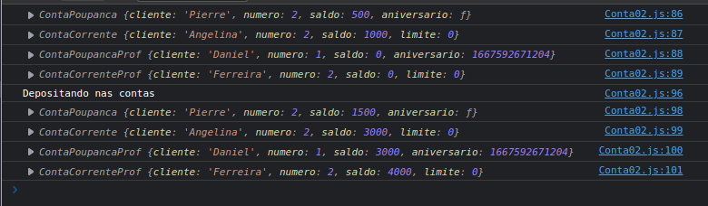

- Vamos agora determinar um `limite` para nossa `contaCorrente`.

~~~
const contaP = new ContaPoupanca("Angelina", 1, 1000);
const contaC = new ContaCorrente("Pierre", 2, 2000);
const contaPP = new ContaPoupancaProf("Daniel", 3);
const contaCP = new ContaCorrenteProf("Ferreira", 4);

console.log(contaP);
console.log(contaC);
console.log(contaPP);
console.log(contaCP);

contaC.limite = 1000;
contaCP.limite = 2000;

contaP.depositar(1000);
contaC.depositar(2000);
contaPP.depositar(3000);
contaCP.depositar(4000);

console.log("Depositando nas contas");

console.log(contaP);
console.log(contaC);
console.log(contaPP);
console.log(contaCP);

~~~ 

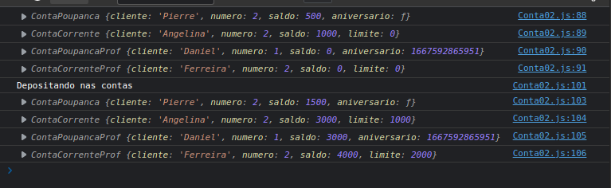

- Agora o metodo `sacar()` precisa ser `obrigatoriamente` implementado pelas `classes extendidas`. Vamos implementa-lo nas duas `classes concretas`.
- Dentro da `classe contaCorrente` vamos criar uma variavel chamada `disponivel` que irá receber o `saldo + o limite`.
  - Vamos fazer uma verificação para ver se o valor de saque passado por parametro é maior que o o valor `disponivel`. Para que não se possa sacar mais do que se tem.

~~~
class ContaCorrenteProf extends ContaBancariaProf{
    constructor(cliente, numero){
        super("Ferreira", 2);
        this.limite = 0;
    }
    sacar(value){
        let disponivel = this.saldo + this.limite;
        if(disponivel < value){
            throw new Error("Saldo Insuficiente!");
        }
        this.saldo -= value;
    }
}
~~~

- Vamos ver o `saque`no console.

~~~
console.log("Sacando das contas");

console.log(contaC);
contaC.sacar(500);
console.log(contaC);
console.log(contaCP); // saldo + limite  = 6000
contaCP.sacar(7000);
console.log(contaCP);

~~~

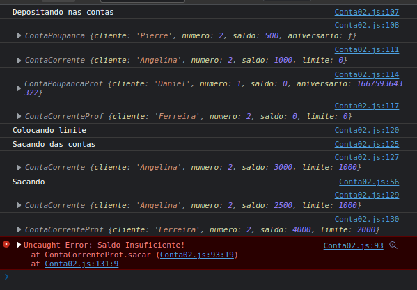

- Se vermos na imagem acima, ao tentarmos sacar um valor acima do `disponivel` temos um `erro` jogado no console. Porem se sacarmos acima do saldo mas nao do `saldo + limite` teremos um valor negativo no `saldo`.

~~~
console.log("Sacando das contas");

console.log(contaC);
contaC.sacar(500);
console.log(contaC);
contaC.sacar(3000);
console.log(contaC);
console.log(contaCP); // saldo + limite  = 6000
contaCP.sacar(7000);
console.log(contaCP);

~~~

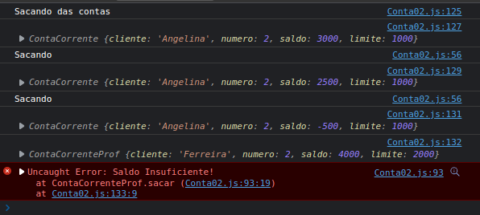

- Falta agora implementarmos o metodo de `saque()` nas `contasPoupança` para encerrarmos o desafio.

~~~ 
class ContaBancaria {
    constructor(cliente, numero, saldo){
        if(this.constructor === ContaBancaria){
            throw new Error("ContaBancaria is an Abstract Class. Can not be Instanciated");
        }
        if(cliente && numero && saldo){
            this.cliente = cliente;
            this.numero = numero;
            this.saldo = saldo;
        }
    };

    // metodo pode ser acessado pelo objeto
    depositar(value){
        console.log(`[Deposito: ${value}]\n\nCliente: ${this.cliente}\nSaldo Atual: ${this.saldo}\nSaldo Final: ${this.saldo += value}`);
        // this.saldo += value;
    };
    // metodo precisa ser implementado pelo objeto
    sacar(value){
        throw new Error("Method sacar() needs to be implemented!");
    }
};

class ContaBancariaProf{
    constructor(cliente, numero){

        if(this.constructor === ContaBancariaProf){
            throw new Error("ContaBancariaProf is an Abstract class. Can not be instanciated!");
        }

        this.cliente = cliente;
        this.numero = numero;
        this.saldo = 0;
    };

    depositar(value){
        console.log(`[DepositoP: ${value}]\n\nCliente: ${this.cliente}\nSaldo Atual: ${this.saldo}\nSaldo Final: ${this.saldo += value}`);
        // this.saldo += value;
    };

    static sacar(value){
        throw new Error("Method sacar() needs to be implemented!");
    }
}

class ContaCorrente extends ContaBancaria{
    constructor(cliente,numero, saldo){
        super("Angelina", 2, 1000);
        this.limite = 0;
    };

    // metodo sacar precisa ser implementado
    sacar(value){
        let disponivel = this.saldo + this.limite;
        if(value > disponivel){
            throw new Error("Saldo insuficiente");
        };
        console.log(`[Saque: ${value}]\n\nCliente: [${this.cliente}]\nSaldo Atual: [${this.saldo}]\nLimite: [${this.limite}]\nSaldo + Limite: [${this.saldo + this.limite}]\nSaldo Final: [${this.saldo -= value}]`);
        // this.saldo -= value;
    };
}

class ContaPoupanca extends ContaBancaria{
    constructor(cliente, numero, saldo){
        super("Pierre", 2, 500);
        this.aniversario = Date.now;
    };

    // metodo sacar precisa ser implementado
    sacar(value){
        let disponivel = this.saldo + this.limite;
        if(value > disponivel){
            throw new Error("Saldo insuficiente");
        };
        console.log(`[Saque: ${value}]\n\nCliente: [${this.cliente}]\nSaldo Atual: [${this.saldo}]\nLimite: [${this.limite}]\nSaldo Final: [${this.saldo -= value}]`);
    }
}

// classes abstratas professor

class ContaPoupancaProf extends ContaBancariaProf{
    constructor(cliente, numero){
        super("Daniel", 1);
        this.aniversario = Date.now();
    }

    sacar(value){
        let disponivel = this.saldo + this.limite;
        if(value > disponivel){
            throw new Error("Saldo insuficiente");
        };
        console.log(`[SaqueP: ${value}]\n\nCliente: [${this.cliente}]\nSaldo Atual: [${this.saldo}]\nLimite: [${this.limite}]\nSaldo Final: [${this.saldo -= value}]`);
    }
}
class ContaCorrenteProf extends ContaBancariaProf{
    constructor(cliente, numero){
        super("Ferreira", 2);
        this.limite = 0;
    }
    sacar(value){
        let disponivel = this.saldo + this.limite;
        if(disponivel < value){
            throw new Error("Saldo Insuficiente!");
        }
        console.log(`[SaqueP: ${value}]\n\nCliente: [${this.cliente}]\nSaldo Atual: [${this.saldo}]\nLimite: [${this.limite}]\nSaldo Final: [${this.saldo -= value}]`);
        // this.saldo -= value;
    }
}

const contaP = new ContaPoupanca("Angelina", 1, 1000);
const contaC = new ContaCorrente("Pierre", 2, 2000);
const contaPP = new ContaPoupancaProf("Daniel", 3);
const contaCP = new ContaCorrenteProf("Ferreira", 4);

contaP.depositar(1000);
contaP.sacar(200);

contaC.depositar(2000);
contaC.limite = 1000;
contaC.sacar(500);

contaPP.depositar(2000);
contaPP.sacar(400);

contaCP.depositar(300);
contaCP.limite = 200;
contaCP.sacar(400);

~~~

 

 

## Desafio: Composição
 

Vamos agora criar uma outra classe chamada `Cliente` que irá ser utilizada dentro das `classes concretas`. Essa classe `cliente` terá duas propriedades `nome e numeroDocumento`.

 

 

## Enunciado: Composição
 

~~~
3. criar classe Cliente e compor as classes concretas

  - nome

  - documento
~~~

 

 

## Resolução Desafio: Composição
 

~~~
class Cliente {
    constructor(nome, numeroDocumento){
        this.nome = nome;
        this.numeroDocumento = numeroDocumento;
    }
} 
~~~

- Agora no lugar onde `instanciamos` nossa contas, passamos um `objeto do tipo Cliente`.

~~~ 
// classes professor

class Cliente {
    constructor(nome, numeroDocumento){
        this.nome = nome;
        this.numeroDocumento = numeroDocumento;
    }
}

class ContaBancariaProf{
    constructor(cliente, numero){

        if(this.constructor === ContaBancariaProf){
            throw new Error("ContaBancariaProf is an Abstract class. Can not be instanciated!");
        }

        this.cliente = cliente;
        this.numero = numero;
        this.saldo = 0;
    };

    depositar(value){
        // console.log(`\n[DepositoP: ${value}]\n\nCliente: ${this.cliente}\nSaldo Atual: ${this.saldo}\nSaldo Final: ${this.saldo += value}`);
        this.saldo += value;
    };

    static sacar(value){
        throw new Error("Method sacar() needs to be implemented!");
    }
}

class ContaPoupancaProf extends ContaBancariaProf{
    constructor(cliente, numero){
        super(cliente, numero);
        this.aniversario = Date.now();
    }

    sacar(value){
        let disponivel = this.saldo + this.limite;
        if(value > disponivel){
            throw new Error("Saldo insuficiente");
        };
        // console.log(`\n[SaqueP: ${value}]\n\nCliente: [${this.cliente}]\nSaldo Atual: [${this.saldo}]\nLimite: [${this.limite}]\nSaldo Final: [${this.saldo -= value}]`);
        this.saldo -= value;
    }
}
class ContaCorrenteProf extends ContaBancariaProf{
    constructor(cliente, numero){
        super(cliente, numero);
        this.limite = 0;
    }
    sacar(value){
        let disponivel = this.saldo + this.limite;
        if(disponivel < value){
            throw new Error("Saldo Insuficiente!");
        }
        // console.log(`\n[SaqueP: ${value}]\n\nCliente: [${this.cliente}]\nSaldo Atual: [${this.saldo}]\nLimite: [${this.limite}]\nSaldo Final: [${this.saldo -= value}]`);
        // this.saldo -= value;
    }
}

const angelina = new Cliente("Angelina", 123);
const pierre  = new Cliente("Pierre", 423);

const conta1 = new ContaPoupancaProf(angelina, 1);
const conta2 = new ContaCorrenteProf(angelina, 2);
const conta3 = new ContaPoupancaProf(pierre, 3);
const conta4 = new ContaCorrenteProf(pierre, 5);

conta1.depositar(2000);
conta1.sacar(400);

conta1.depositar(300);
conta1.limite = 200;
conta1.sacar(50);

console.log(conta1);
console.log(conta2);
console.log(conta3);
console.log(conta4);

~~~

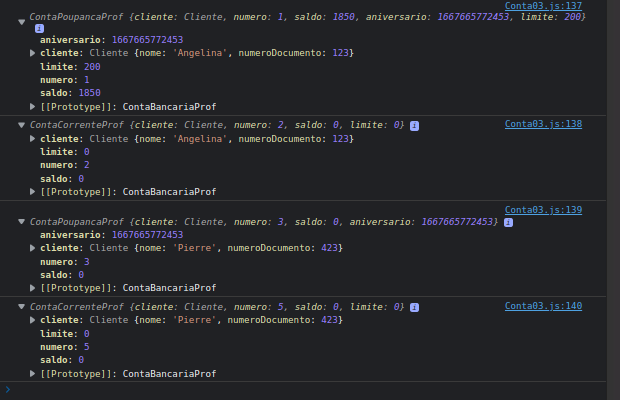

- Estamos agora passando um objeto do tipo cliente para nossas classes `contaPoupanca e contaCorrente`.
- Como podemos ver na imagem acima, se abrirmor o objeto `ContaCorrente ou ContaPoupanca` vemos que temos como propriedade desses objetos, um outro `objeto Cliente`.

 

 

## Desafio: Cliente agora é Classe Abstrata
 

Continuando, a idea é que agora tenhamos mais uma `classe abstrata` ou seja, a `classe Cliente` não terá somente uma `string com nome`, pois podemos ter clientes como `pessoa fisica` e `pessoa juridica`.

Logo vamos transformar a classe concreta `Cliente` em uma `classe abstrata` e criaremos mais duas outras classes chamadas `PessoaFisica` e `PessoaJuridica`.

No momento que criamos os clientes, não iremos mais instanciar `Cliente` e sim `PessoaFisica` ou `PessoaJuridica`.

 

 

## Enunciado: Cliente agora é Classe Abstrata
 

~~~
 4. Agora surgiu a necessidade de Cliente ser Pessoa Física ou Juridica.

   Pessoa Física tem documento CPF e Juridica tem documento CNPJ
~~~

 

 

## resolução Desafio: Cliente agora é Classe Abstrata
 

Vamos agora transformar nossa `classe Cliente` que é uma classe concreta em uma `classe Abstrata` e criar mais duas classes `PessoaFisica e PessoaJuridica`.

~~~
class PessoaFisica extends Cliente{
    constructor(nome,numeroDocumento) {
        super(nome);
        if(numCPF){
            this.numCPF = numeroDocumento;
        }
    }
}

class PessoaJuridica extends Cliente{
    constructor(nome,numeroDocumento){
        super(nome);
        if(numCNPJ){
            this.numCNPJ = numeroDocumento;
        }
    }
}

~~~

- No `super()` poderiamos fazer algo do tipo acima, colocando somente o `nome`. Porem temos um problema nessa abordagem!
- Precisamos saber se somos uma `PessoaJuridica` ou uma `PessoaFisica`para termos acesso ao documento de maneira diferente.
- A maneira mais correta, seria passar o `documento` tbm no `super()`. Ou seja, passa tanto o `nome` quanto o `numDocumento` para a classe `Cliente`.

~~~
class Cliente {
    constructor(nome, numeroDocumento){
        if(this.constructor === Cliente) {
            throw new Error("Cliente is an Abstract class. Can not be instanciated!")
        }

        if(nome && numeroDocumento){
            this.nome = nome;
            this.numeroDocumento = numeroDocumento;
        }
    }
}

class PessoaFisica extends Cliente{
    constructor(nome,numeroDocumento) {
        super(nome,numeroDocumento);
        if(numeroDocumento){
            this.CPF = numeroDocumento;
        }
    }
}

class PessoaJuridica extends Cliente{
    constructor(nome,numeroDocumento){
        super(nome,numeroDocumento);
        if(numeroDocumento){
            this.CNPJ = numeroDocumento;
        }
    }
}

class ContaBancariaProf{
    constructor(cliente, numero){

        if(this.constructor === ContaBancariaProf){
            throw new Error("ContaBancariaProf is an Abstract class. Can not be instanciated!");
        }

        this.cliente = cliente;
        this.numero = numero;
        this.saldo = 0;
    };

    depositar(value){
        // console.log(`\n[DepositoP: ${value}]\n\nCliente: ${this.cliente}\nSaldo Atual: ${this.saldo}\nSaldo Final: ${this.saldo += value}`);
        this.saldo += value;
    };

    static sacar(value){
        throw new Error("Method sacar() needs to be implemented!");
    }
}

class ContaPoupancaProf extends ContaBancariaProf{
    constructor(cliente, numero){
        super(cliente, numero);
        this.aniversario = Date.now();
    }

    sacar(value){
        let disponivel = this.saldo + this.limite;
        if(value > disponivel){
            throw new Error("Saldo insuficiente");
        };
        // console.log(`\n[SaqueP: ${value}]\n\nCliente: [${this.cliente}]\nSaldo Atual: [${this.saldo}]\nLimite: [${this.limite}]\nSaldo Final: [${this.saldo -= value}]`);
        this.saldo -= value;
    }
}
class ContaCorrenteProf extends ContaBancariaProf{
    constructor(cliente, numero){
        super(cliente, numero);
        this.limite = 0;
    }
    sacar(value){
        let disponivel = this.saldo + this.limite;
        if(disponivel < value){
            throw new Error("Saldo Insuficiente!");
        }
        // console.log(`\n[SaqueP: ${value}]\n\nCliente: [${this.cliente}]\nSaldo Atual: [${this.saldo}]\nLimite: [${this.limite}]\nSaldo Final: [${this.saldo -= value}]`);
        this.saldo -= value;
    }
}

const angelina = new PessoaFisica("angelina", "14.031.904-29");
const pierre = new PessoaJuridica("Pierre LTDA", "860.402.225/0001-01");
console.log(angelina);
console.log(pierre);

const conta1 = new ContaPoupancaProf(angelina, 1);
const conta2 = new ContaCorrenteProf(angelina, 2);
const conta3 = new ContaPoupancaProf(pierre, 3);
const conta4 = new ContaCorrenteProf(pierre, 5);

conta1.depositar(2000);
conta1.sacar(400);

conta1.depositar(300);
conta1.limite = 200;
conta1.sacar(50);

console.log(conta1);
console.log(conta2);
console.log(conta3);
console.log(conta4);

~~~

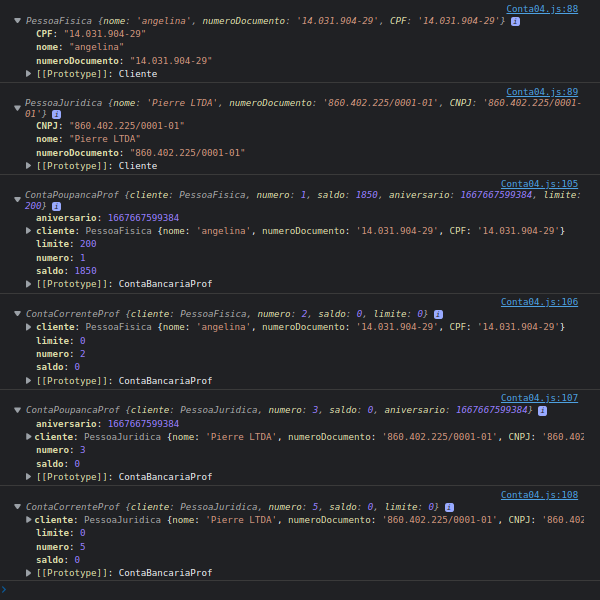

- Os dois primeiros objetos mostrados no console são nossas classes concretas `PessoaFisisca e PessoaJuridica`. Nessas classes conseguimos ver 3 propriedades, `cpf, nome, numeroDocumento`. Onde temos os valores `duplicados`, ja que utilizamos tanto no `super()`, quanto no `constructor` quando fizemos `this.cpf = numeroDocumento`. Por enquanto vamos deixar esses valores duplicados.

Vamos verificar agora qual a importancia de deixarmos tudo dentro de `numDocumento`. 

- Na nossa classe `ContaBancaria` vamos criar um metodo chamado, `dadosCliente` usando a palavra-chave `get`. Que fará com que `dadosCliente` se comporte como uma propriedade quando na verdade é uma função.

~~~
class ContaBancariaProf{
    constructor(cliente, numero){

        if(this.constructor === ContaBancariaProf){
            throw new Error("ContaBancariaProf is an Abstract class. Can not be instanciated!");
        }

        this.cliente = cliente;
        this.numero = numero;
        this.saldo = 0;
    };

    depositar(value){
        // console.log(`\n[DepositoP: ${value}]\n\nCliente: ${this.cliente}\nSaldo Atual: ${this.saldo}\nSaldo Final: ${this.saldo += value}`);
        this.saldo += value;
    };

    static sacar(value){
        throw new Error("Method sacar() needs to be implemented!");
    };

    get dadosCliente(){
        return `${this.cliente.nome}, documento: ${this.cliente.numeroDocumento}`
    }
}
~~~

- A ideia é a seguinte, como na nossa classe abstrata `ContaBancaria` não sabemos se o `cliente` é uma `pessoaFisica ou uma pessoaJuridica`, porem pelo fato de termos armazenado o `cliente` com uma propriedade chamada `documento` tanto em `PessoaFisica` quanto em `PessoaJuridica` temos a facilidade de verificar, a partir de um metodo, uma `propriedade` que esta na `classe Cliente`. 
- Nao tendo a necessidade de sabermos se o `this.cliente.documento` é uma pessoa `Fisica` ou `Juridica`.
- Se não tivessemos guardado o nosso `documento` dentro de uma propriedade `comum` chamada `numDocumento` iriamos precisar criar dentro do metodo `dadosCliente()` uma verificaçao.
- Pois se não tivessemos trabalhado com uma `propriedade comum` iriamos precisar ficar comparado os `construtores` com a verficação.

~~~ 
class ContaBancariaProf{
    constructor(cliente, numero){

        if(this.constructor === ContaBancariaProf){
            throw new Error("ContaBancariaProf is an Abstract class. Can not be instanciated!");
        }

        this.cliente = cliente;
        this.numero = numero;
        this.saldo = 0;
    };

    depositar(value){
        // console.log(`\n[DepositoP: ${value}]\n\nCliente: ${this.cliente}\nSaldo Atual: ${this.saldo}\nSaldo Final: ${this.saldo += value}`);
        this.saldo += value;
    };

    static sacar(value){
        throw new Error("Method sacar() needs to be implemented!");
    };

    get dadosCliente(){
        console.log(this.cliente.constructor);
        // return `${this.cliente.nome}, documento: ${this.cliente.numeroDocumento}`
        if(this.cliente.constructor === PessoaFisica){
            return `${this.cliente.nome}, documento: ${this.cliente.CPF}`
        }else{
        return `${this.cliente.nome}, documento: ${this.cliente.CNPJ}`
        }
    }
}

~~~

- Basicamente o melhor é deixar na `propriedade comum`.
- 

 

 

## Refatoração: Mostrar tipo de documento
 

Antes de irmos para o enunciado do proximo desafio, vamos fazer uma rapida `modificação` no nosso codigo.

Digamos que a partir dos objetos gerados pelas classes `PessoaFisica` e `PessoaJuridica`, queiramos ter acesso ao `tipo do documento`.

- Vamos para isso, criar uma nova propriedade na nossa classe abstrata `Cliente` chamada de `tipoDocumento`.

~~~ 
class Cliente {
    constructor(nome, numeroDocumento, tipoDocumento){
        if(this.constructor === Cliente) {
            throw new Error("Cliente is an Abstract class. Can not be instanciated!")
        }

        if(nome && numeroDocumento && tipoDocumento){
            this.nome = nome;
            this.numeroDocumento = numeroDocumento;
            this.tipoDocumento = tipoDocumento;
        }
    }
}
~~~

- No momento que chamamos o `super()`, iremos tbm passar o `tipo`. 

~~~ 
class PessoaFisica extends Cliente{
    constructor(nome,numeroDocumento) {
        super(nome,numeroDocumento, "CPF");
        if(numeroDocumento){
            this.CPF = numeroDocumento;
        }
    }
}

class PessoaJuridica extends Cliente{
    constructor(nome,numeroDocumento){
        super(nome,numeroDocumento, "CNPJ");
        if(numeroDocumento){
            this.CNPJ = numeroDocumento;
        }
    }
}
~~~

- Na nossa função, `get dadosCliente()` tbm iremos passar o `tipoDocumento`.

~~~
class ContaBancariaProf{
    constructor(cliente, numero){

        if(this.constructor === ContaBancariaProf){
            throw new Error("ContaBancariaProf is an Abstract class. Can not be instanciated!");
        }

        this.cliente = cliente;
        this.numero = numero;
        this.saldo = 0;
    };

    depositar(value){
        // console.log(`\n[DepositoP: ${value}]\n\nCliente: ${this.cliente}\nSaldo Atual: ${this.saldo}\nSaldo Final: ${this.saldo += value}`);
        this.saldo += value;
    };

    static sacar(value){
        throw new Error("Method sacar() needs to be implemented!");
    };

    get dadosCliente(){
        console.log(this.cliente.constructor);
        return `${this.cliente.nome}, ${this.cliente.tipoDocumento}: ${this.cliente.numeroDocumento}`
        // if(this.cliente.constructor === PessoaFisica){
        //     return `${this.cliente.nome}, ${this.cliente.tipoDocumento}: ${this.cliente.CPF}`
        // }else{
        // return `${this.cliente.nome},  ${this.cliente.tipoDocumento}: ${this.cliente.CNPJ}`
        // }
    }
}
~~~

- Agora que ja sabemos qual o `tipo de documento` podemos remover nas nossas classes as propriedades `this.CPF` e `this.CNPJ`. Que estão com valores duplicados.

~~~ 
class PessoaFisica extends Cliente{
    constructor(nome,numeroDocumento) {
        super(nome,numeroDocumento, "CPF");
        
    }
}

class PessoaJuridica extends Cliente{
    constructor(nome,numeroDocumento){
        super(nome,numeroDocumento, "CNPJ");
        
    }
}
~~~

Codigo final:

~~~ 
class Cliente {
    constructor(nome, numeroDocumento, tipoDocumento){
        if(this.constructor === Cliente) {
            throw new Error("Cliente is an Abstract class. Can not be instanciated!")
        }

        if(nome && numeroDocumento && tipoDocumento){
            this.nome = nome;
            this.numeroDocumento = numeroDocumento;
            this.tipoDocumento = tipoDocumento;
        }
    }
}

class PessoaFisica extends Cliente{
    constructor(nome,numeroDocumento) {
        super(nome,numeroDocumento, "CPF");
        
    }
}

class PessoaJuridica extends Cliente{
    constructor(nome,numeroDocumento){
        super(nome,numeroDocumento, "CNPJ");
        
    }
}

class ContaBancariaProf{
    constructor(cliente, numero){

        if(this.constructor === ContaBancariaProf){
            throw new Error("ContaBancariaProf is an Abstract class. Can not be instanciated!");
        }

        this.cliente = cliente;
        this.numero = numero;
        this.saldo = 0;
    };

    depositar(value){
        // console.log(`\n[DepositoP: ${value}]\n\nCliente: ${this.cliente}\nSaldo Atual: ${this.saldo}\nSaldo Final: ${this.saldo += value}`);
        this.saldo += value;
    };

    static sacar(value){
        throw new Error("Method sacar() needs to be implemented!");
    };

    get dadosCliente(){
        // console.log(this.cliente.constructor);
        return `${this.cliente.nome}, ${this.cliente.tipoDocumento}: ${this.cliente.numeroDocumento}`
        // if(this.cliente.constructor === PessoaFisica){
        //     return `${this.cliente.nome}, ${this.cliente.tipoDocumento}: ${this.cliente.CPF}`
        // }else{
        // return `${this.cliente.nome},  ${this.cliente.tipoDocumento}: ${this.cliente.CNPJ}`
        // }
    }
}

class ContaPoupancaProf extends ContaBancariaProf{
    constructor(cliente, numero){
        super(cliente, numero);
        this.aniversario = Date.now();
    }

    sacar(value){
        let disponivel = this.saldo + this.limite;
        if(value > disponivel){
            throw new Error("Saldo insuficiente");
        };
        // console.log(`\n[SaqueP: ${value}]\n\nCliente: [${this.cliente}]\nSaldo Atual: [${this.saldo}]\nLimite: [${this.limite}]\nSaldo Final: [${this.saldo -= value}]`);
        this.saldo -= value;
    }
}
class ContaCorrenteProf extends ContaBancariaProf{
    constructor(cliente, numero){
        super(cliente, numero);
        this.limite = 0;
    }
    sacar(value){
        let disponivel = this.saldo + this.limite;
        if(disponivel < value){
            throw new Error("Saldo Insuficiente!");
        }
        // console.log(`\n[SaqueP: ${value}]\n\nCliente: [${this.cliente}]\nSaldo Atual: [${this.saldo}]\nLimite: [${this.limite}]\nSaldo Final: [${this.saldo -= value}]`);
        this.saldo -= value;
    }
}

const angelina = new PessoaFisica("angelina", "14.031.904-29");
const pierre = new PessoaJuridica("Pierre LTDA", "860.402.225/0001-01");
// console.log(angelina);
// console.log(pierre);

const conta1 = new ContaPoupancaProf(angelina, 1);
console.log(conta1.dadosCliente);
const conta2 = new ContaCorrenteProf(angelina, 2);
console.log(conta2.dadosCliente);
const conta3 = new ContaPoupancaProf(pierre, 3);
console.log(conta3.dadosCliente);
const conta4 = new ContaCorrenteProf(pierre, 5);
console.log(conta4.dadosCliente);

conta1.depositar(2000);
conta1.sacar(400);

conta1.depositar(300);
conta1.limite = 200;
conta1.sacar(50);

// console.log(conta1);
// console.log(conta2);
// console.log(conta3);
// console.log(conta4);
~~~ 

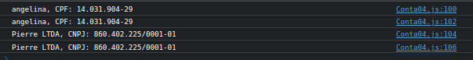

 

 

## Polimorfismo
 

Agora temos o ultimo passo do desafio da nossa `contaBancaria`. Onde veremos um conceito muito importante na POO que seria o `polimorfismo`.

`Polimorfismo` é a capacidade de passarmos uma `instancia de uma classe que herda de uma classe abstrata` e chamarmos um metodo que existe nessa classe abstrata. 

~~~
5. Polimorfismo
   Criar uma classe especializada em transferir.
   Essa classe tera um unico metodo execute(contaOrigem, contaDestino, valor) .
   Tanto contaOrigem quanto contaDestino precisam ser instancias de ContaBancaria.
   Tanto CC quanto CP tem o metodo sacar(), que tem implementações diferentes.
   Mas como sabemos que contaOrigem e contaDestino possuem o metodo sacar, independente
   se for CC ou CP podemos chamar esse metodo.
~~~

- Vamos criar a classe `Transferir` que tera somente um unico metodo.

~~~
class Transferir {
    static execute(contaOrigem, contaDestino, value){
        if(!contaOrigem instanceof ContaBancariaProf || ! contaDestino instanceof ContaBancariaProf){
            throw new Error("Accounts needed to inherit from ContaBancaria");
        }

        try {
            contaOrigem.sacar(value);
            contaDestino.depositar(value);
        } catch (error) {
            console.log("Error: ", error.message);
        }
    }

}
~~~

- Como vemos acima, temos uma `classe estatica` com somente um `metodo estatico` chamado `execute`.

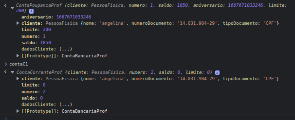

- Vamos agora testar nosso metodo tranferindo o valor de `contaP1` para `contaC1`.

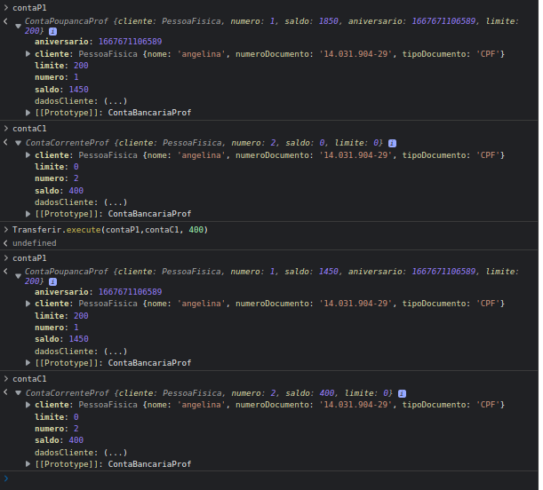

- Vejam agora que nosso metodo esta funcionando.

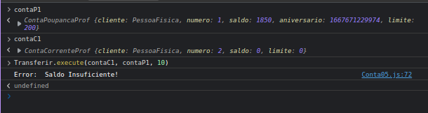

- Como podemos ver acima, caso não tenha `saldo` na conta para que a transferencia seja realizada, recebemos um `erro`.

 

 