# SEÇÃO 20 - INTRODUÇÃO A ORIENTAÇÃO A OBJETOS

 

## Introdução
 

### Orientação a Objetos (POO)

Paradigma de programação baseada na interação entre objetos.

Um objeto é uma unidade que une dados (propriedades) e suas funções (métodos). Ou seja, é um conjutno de dados formado po `chave:valor`. Vimos tbm que um `array` é uma estrutura de dados que armazena os dados baseados em um `indice`. Quando falamos de objetos, armazenamos cada valor em uma `chave`.

 

### Vantagem:

Coesão de dados e comportamentos agrupados.

- No lado esquerdo temos a lista e o telefone onde o telefone é a função e a lista os dados.
- Na esquerda temos o celular que seria a `coesão` de `dados e comportamentos` agrupados.

 

### Orientação a objetos em JS e a clássica

Em Javascript, a POO se dá através de protótipos (prototypes). 

> Na POO, um objeto pe criado a partir de um `classe`.

> Na POO, uma `classe` é uma `especificação` (um molde) para criar objetos.

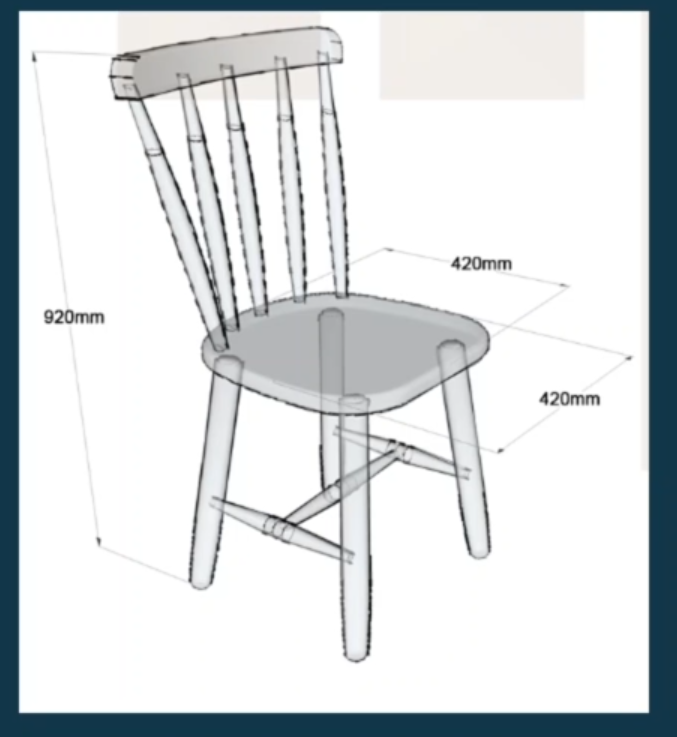

- Na imagem acima temos um `projeto` de um `objeto do tipo cadeira`. Logo é a partir de um `projeto/classe` de uma cadeira que iremos `gerar objetos do tipo cadeira`.

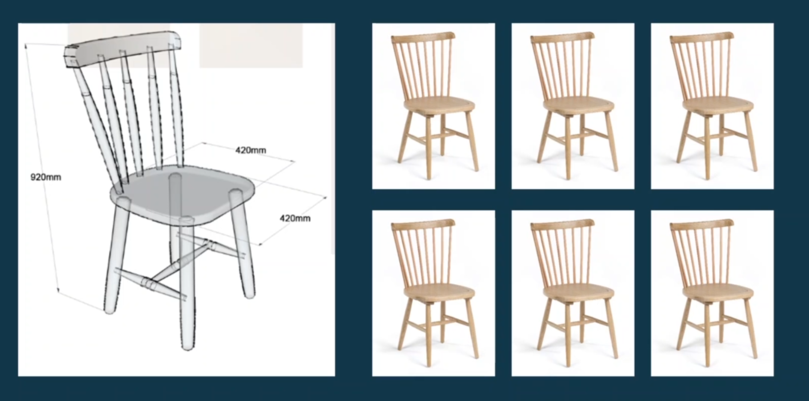

- Observem que é este `projeto/classe` cadeira, existe algumas `propriedades e metodos` como mostrado na imagem acima.

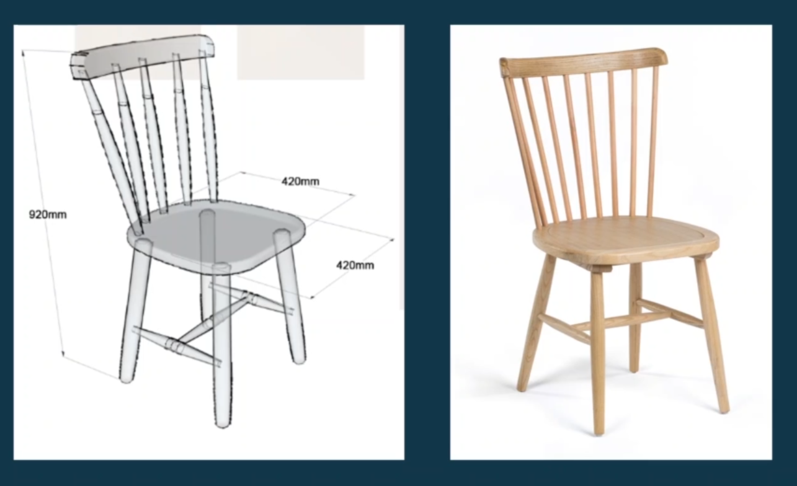

- A partir deste `projeto/classe` geramos os nossos `objetos do tipo cadeira` como mostrado na imagem acima.
- Logo, uma `especificação/projeto/classe` de uma cadeira nos permite ter `varios objetos do tipo cadeira`. Não sendo necessario termos apenas `um objeto por classe`.
- Observe tbm que `cada objeto criado` é `unico`. Se modificarmos `um objeto` não vamos `alterar a especificação/projeto/molde/classe` daquela cadeira, estamos alterando apenas `aquele objeto`.
- Porem o oposto é diferente. Se alterarmos a `especificação` da cadeira, iremos `alterar todos os objetos` gerados a partir daquela `especificação/projeto/molde/classe`.

> Sempre que falamos `criar um objeto do tipo cadeira` a partir de uma especificação/projeto/molde/classe de cadeira, estamos falando de `INSTANCIAS DA CLASSE CADEIRA`.

Logo quando criamos um `objeto do tipo cadeira` estamo na verdade criando uma `instancia da classe cadeira`.

Na POO nunca usamos diretamente a `classe` e sim trabalhamos sempre em cima dos `objetos gerados a partir daquela classe`. Ninguem senta num prototipo/projeto de uma cadeira.

Vamos observar uma outra situação onde digamos que a partir de uma `cadeira qualquer`, queremos `modifica-la`, como mostrado na imagem abaixo.

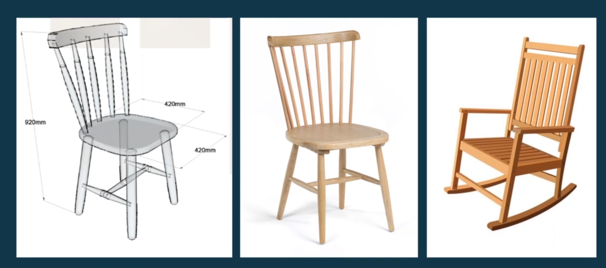

- Teriamos que criar um novo projeto? Sim, vamos precisar ter um outro projeto, porem ja aprendemos muita coisa construindo o `projeto original`. Por exemplo, ja sabemos o `material utilzado` o `numero de parafusos`...
- Logo, quando precisarmos de um outro tipo de cadeira, podemos `reaproveitar` tudo que ja fizemos no `projeto de cadeira original`. Isso é o que chamamos de `reutilizar propriedades e metodos comuns` ou comumente conhecido como `HERANÇA`.
- Onde criamos uma outra classe que irá `herdar` propriedades de metodos da `classe original` com a habilidade de se criar novas propriedades e metodos pertencentes a `nova classe` sem alterar a `classe original`.

> No javascript `Herança` ocorre por meio de seu `protótipo`.

> A POO `não é` reutilização de código.

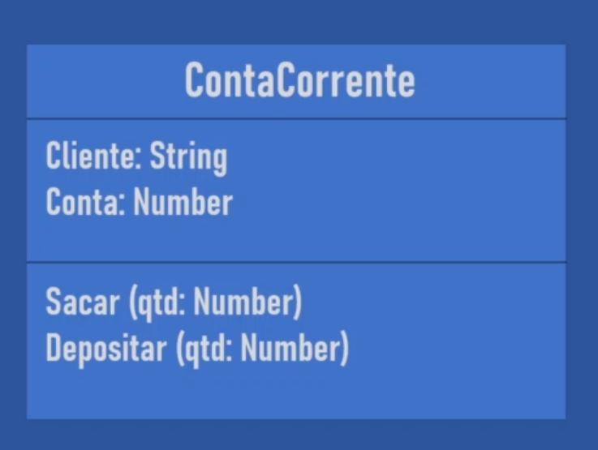

- Imagine que voce tem a `classe contaCorrente` com propriedades e metodos como mostrado na imagem acima.
- Essa classe irá gerar `objetos/instancias do tipo contaCorrente`.  

> Uma conta corrente é parecida com uma conta poupança.

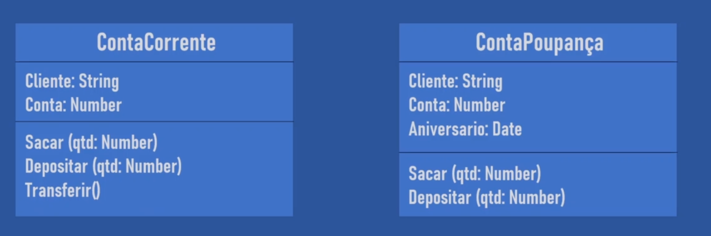

- Como não temos um tipo de conta, podemos fazer uma copia da `contaCorrente` e mudar o nome para `contaPoupanca`, tendo assim duas classes.
- Porem, se quisermos alterar o codigo, teremos que lembrar de fazer a alteração tanto na `contaCorrente` quando na `contaPoupanca`.
- Esse é o perigo em pensar em POO como `reutilização de codigo`. Quando na verdade temos que pensar em `manutenção do codigo`, onde caso tenhamos uma classe chamada `conta` e usando o conceito de `herança` criarmos duas classes `contaCorrente` e `contaPoupanca` poderemos fazer uma alteração que irá refletir nas demais classes.

> Precisamos fazer as duas contas herdarem de uma classe menos especifica.

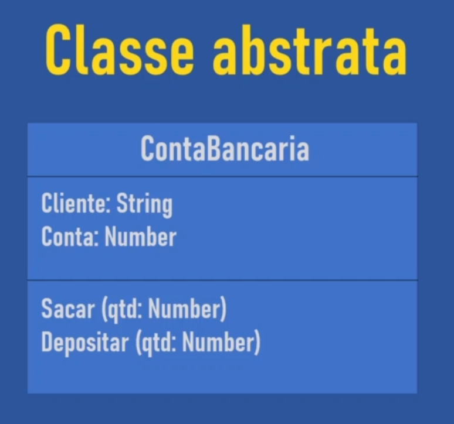

- Temos uma `classe Abstrata` chamada de `Contabancaria` onde essa `contaBancaria` precisa ser ou `contaCorrente ou contaPoupanca`.

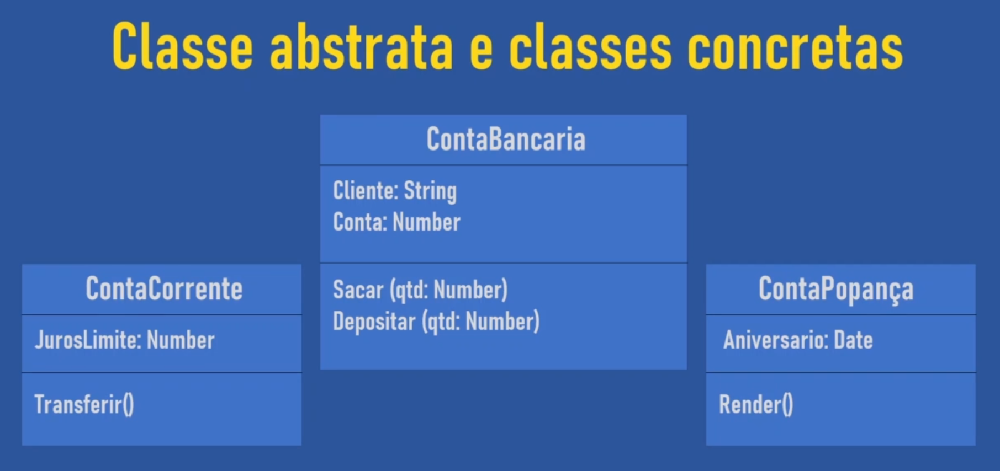

-  Na classe `contaBancaria` colocamos tudo o que será comum nas `classes concretas`.
-  O que é `especifico` para cada tipo de conta, colocamos em suas respectivas `classes Concretas`.

> `Classe Genérica` é `abstrata`.
> `Classe Específica` é `Concreta`.

### Herança

- Uma conta poupança É uma conta bancaria
- Uma conta corrente É uma conta bancaria

### Associação

- Uma conta bancária TEM um cliente.
- Uma conta bancária NÃO É um cliente.

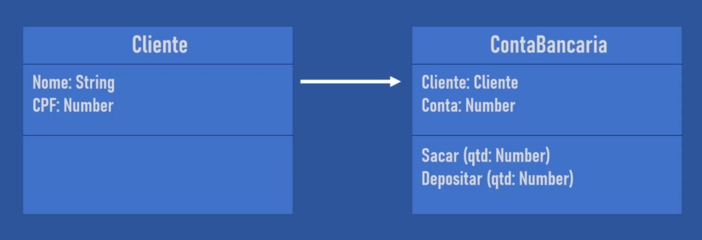

- Temos um objeto `cliente` que esta `compondo` uma `conta bancaria`.

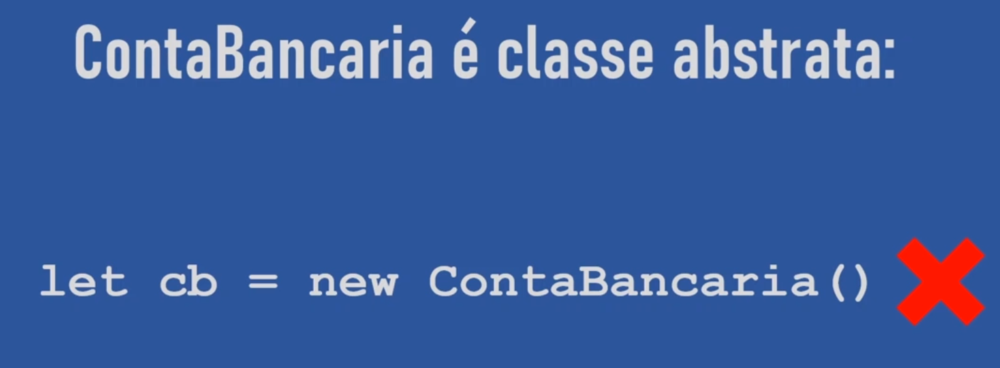

> Não podemos criar `objetos/instancias` de `CLASSES ABSTRATAS`.

 

 

## ES5 vs ES6
 

### Classes (ES6) vs Funções Construtoras(ES5)

### Prototype

É a base para `herança` no javascript. Em outtas outras linguagens teriamos o `extends` por exemplo.

 

 

 

## prototype
 

Vamos criar dois arquivos chamado `introducao.js | .html` para exemplificarmos melhor.

- Primeiro iremos criar uma função construtora chamada `Animal`.

~~~
function Animal(tipo){
    this.tipo = tipo
}

let dog = new Animal("mamifero");
~~~

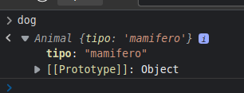

- Conseguimos ver na imagem acima o nosso objeto `dog` do tipo `Animal`.
- A nossa função construtora `Animal` possui uma propriedade chamada `prototype`.

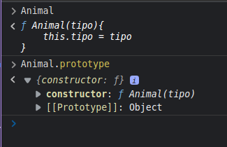

- Na imagem acima, podemos ver que a propriedade `.prototype` armazena um `objeto`, e este objeto possui uma propriedade `constructor` que armazena, faz uma `referencia` a nossa `função construtora` e temos outra propriedade chamada `__proto__` que tbm faz `referencia` a um outro `objeto`.
- Agora nos temos o nosso `objeto dog` que tbm possui uma `propriedade chamada __proto__`.

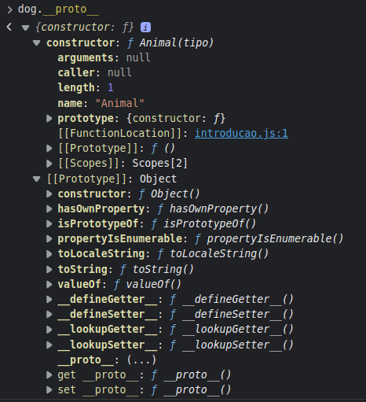

- Esta `propriedade do objeto` é uma forma de a partir do `objeto` acessar o `objeto` que esta guardado na `propriedade .prototype` da `função construtora Animal.prototype`.
- Ou seja, a nossa propriedade `.prototype` da `função construtora = Animal()` é um objeto.

> OBS: A propriedade `.prototype` de uma função construtora `armazena um objeto`.

> OBS: A partir de um `objeto/instancia` gerado pela `função construtora`, temos uma `propriedade = __proto__` que nos da `acesso ao objeto armazenado dentro de .prototype`.

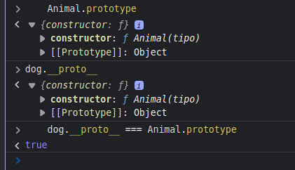

> Lembre-se que como `__proto__` é um objeto, ao fazermos a verificação de igualdade acima, estamos verificando se a `referencia`, ou seja, `posição na memoria` é igual.

- Voltando para o codigo, vamos colocar dentro da `propriedade = .prototype` da nossa função construtora `Animal`.

> Lembre-se que como `Animal.prototype = objeto` poderiamos escrever o codigo da seguinte maneira:
> ~~~
> Anima.prototype = {}
> ~~~
> Porem o ideal é colocarmos dentro do nosso `objeto Animal.prototype` `metodos`.

~~~
function Animal(tipo){
    this.tipo = tipo;
}

Animal.prototype.obterTipo = function(){
    return this.tipo;
}

let cachorro = new Animal("mamifero");
let gato = new Animal("mamifero");
let cobra = new Animal("reptil");
~~~

- Dentro do objeto `cachorro` temos uma propriedade chamada `tipo`. Onde esta nosso `metodo obterTipo`?
- Na imagem abaixo, chamamos a função `obterTipo()` e ela nos retorna o mamifero. Porem onde essa função esta sendo armazenada, poi so nosso `objeto = cachorro` não possui essa função `obterTipos()`

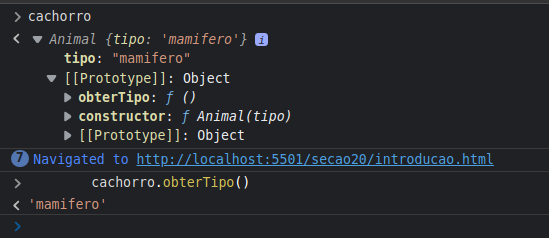

- Como utilizamos o metodo `obterTipo` a partir do objetto `cachorro` e esse metodo não existe no objeto `cachorro`, o javascript começa a procurar o metodo na `Cadeia de prototipos`.
- Dentro do objeto `Animal.prototype` temos uma `propriedade = __proto__` que dentro dela temos a função `obterTipo()`.  
- Se a função não estiver dentro de `__proto__`, ou seja, se fizermos como a imagem abaixo...

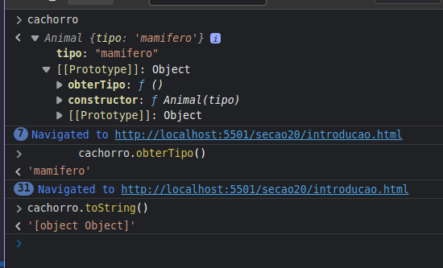

- Temos o metodo `toString()` que não existe no `objeto cachorro` e tbm não existe no `prototipo da função construtora` logo o javascript irá olhar para o `prototipo de cima` no caso, o  objeto `Object`.
- Caso não existe dentro da cadeia de prototipos, recebemos um erro.

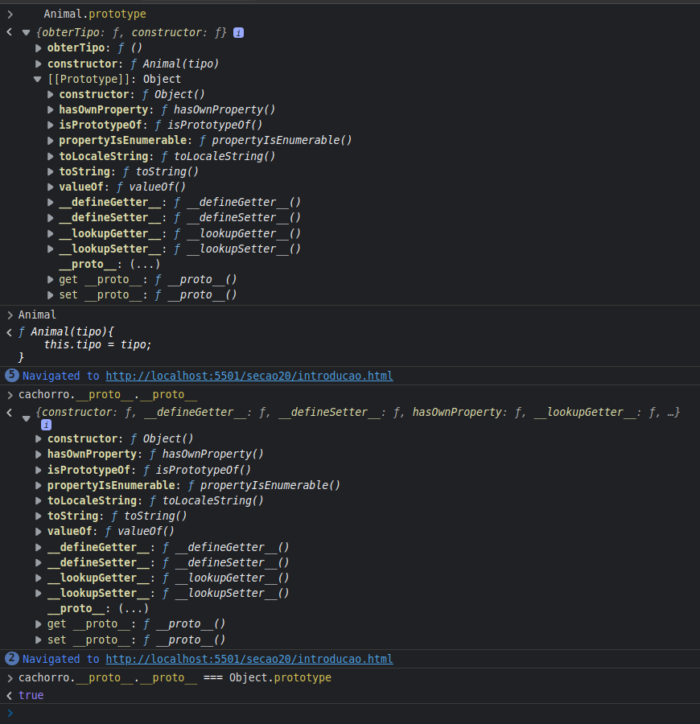

- No exemplo, colocamos uma função que é um metodo, porem tbm podemos colocar `propriedades`.

~~~
function Animal(tipo){
    this.tipo = tipo;
}

Animal.prototype.obterTipo = function(){
    return this.tipo;
}

Animal.prototype.tipo = "desconhecido";

let cachorro = new Animal("mamifero");
let gato = new Animal("mamifero");
let cobra = new Animal("reptil");

let peixe = new Animal();

// SAIDA:

peixe.tipo
undefined
peixe.obterTipo()
undefined
~~~

- Estamos recebendo o `undefined` pois no codigo acima não passamos nenhum tipo para o construtor `Animal()`.

~~~
function Animal(tipo){
    if(tipo){
        this.tipo = tipo;
    }
}

Animal.prototype.obterTipo = function(){
    return this.tipo;
}

Animal.prototype.tipo = "desconhecido";

let cachorro = new Animal("mamifero");
let gato = new Animal("mamifero");
let cobra = new Animal("reptil");

let peixe = new Animal();

// SAIDA:

peixe
Animal {}
peixe.obterTipo()
'desconhecido'
~~~ 

- Vamos criar um array para vermos a `cadeia de prototipos` desse objeto.

~~~
function Animal(tipo){
    if(tipo){
        this.tipo = tipo;
    }
}

Animal.prototype.obterTipo = function(){
    return this.tipo;
}

Animal.prototype.tipo = "desconhecido";

let cachorro = new Animal("mamifero");
let gato = new Animal("mamifero");
let cobra = new Animal("reptil");

let peixe = new Animal();

let arr = new Array(1,2,3,4,5); 
~~~

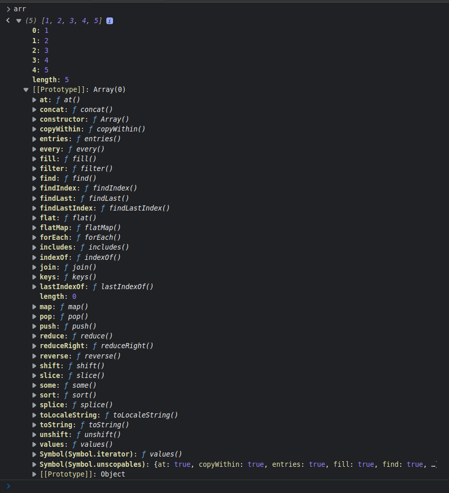

- Outra coisa que conseguimos fazer utilizando a propriedade `prototype` é a criação de `polyfilss`. Por exemplo temos um browser antigo e não temos o metodo `.map()`.
- Nesse caso, iriamos fazer `Array.prototype.map2 = function()`, criando assim o metodo `map()` para um browser que não o possui.

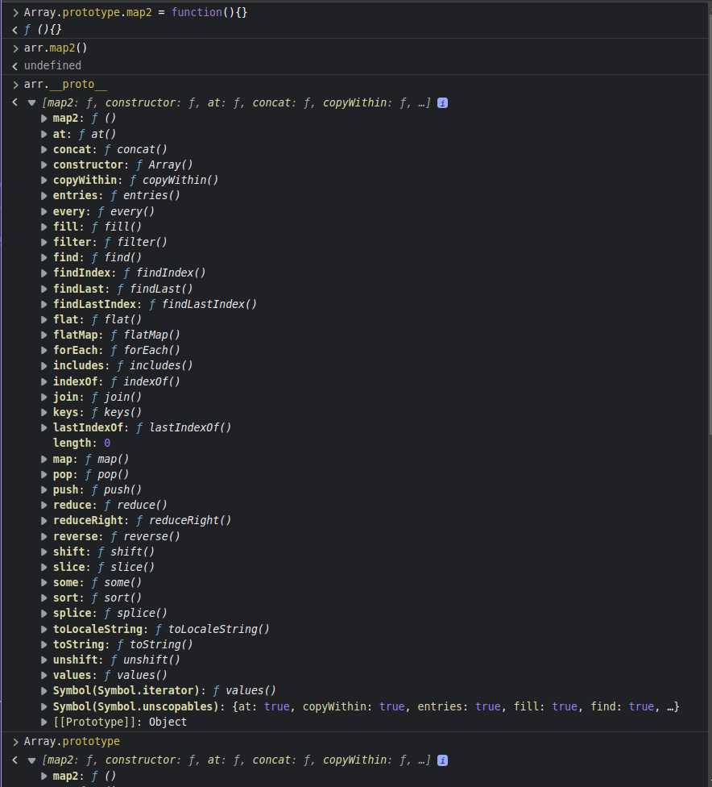

> OBS: É importante percebermos que o `prototype` é `dinamico`.

- Para vermos isso, no codigo acima, primeiro criamos os `prototipos` e depois `instanciamos os objetos`.
- Será que se `instanciarmos` primeiro, e depois colocar no `prototipo` irá funcionar?

~~~
function Animal(tipo){
    if(tipo){
        this.tipo = tipo;
    }
}

let cachorro = new Animal("mamifero");
let gato = new Animal("mamifero");
let cobra = new Animal("reptil");

let peixe = new Animal();

let arr = new Array(1,2,3,4,5);

Animal.prototype.obterTipo = function(){
    return this.tipo;
}

Animal.prototype.tipo = "desconhecido";

console.log(peixe);
console.log(peixe.tipo);
~~~

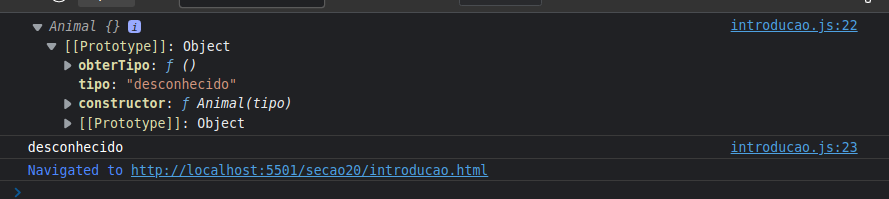

- Logo podemos colocar `objetos no prototipo` mesmo depois de termos `instanciado` os mesmos.
- Com base nessa teoria de `Animal.prototype` podemos entender melhor como funciona o `polyfill`.

### `Polyfill` Exemplo metodo Some()

~~~
if(!Array.prototype.some){
    Array.prototype.some = function(fun/*, thisArg*/){
        'use strict';

        if(this == null){
            throw new TypeError('Array.prototype.some called on null or undefined');
        }

        if(typeof fun !== 'function'){
            throw new TypeError();
        }

        var t = Object(this);
        var len = t.length >>> 0;

        var thisArg = arguments.length >= 2 ? arguments[1] : void 0;
        for(var i = 0; i < len; i++){
            if( i in t && fun.call(thisArg, t[i], i, t)){
                return true;
            }
        }
        return false;
    }
} 
~~~

 

 

## Momento de reflexão
 

Reflita o que acontece quando o seguinte codigo é executado:

~~~
function Animal(tipo){
    if(tipo) this.tipo = tipo;
}

Animal.prototype.obterTipo = function(){
    return this.tipo;
}

let sapo = {tipo: "anfibio"}
Animal.prototype.obterTipo.call(sapo);
~~~ 

Reflita sobre o código. Se não houver dúvidas sobre o seu funcionamento, avance no curso.

Caso algo ainda seja obscuro pra você, reveja a aula anterior e se ainda houver dúvidas, me pergunte ;)

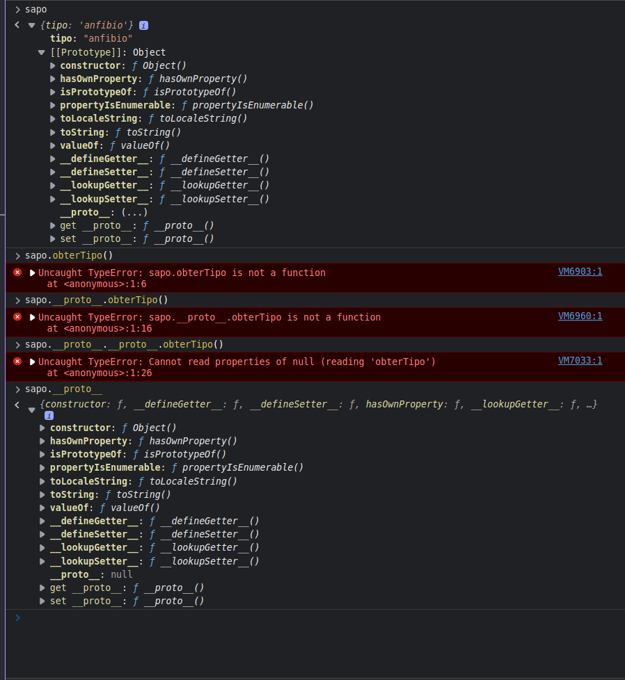

 

 

## Herança com prototype
 

Vamos agora falar sobre `herança`, onde na aula anterior, criamos uma função construtora chamada `Animal` onde criamos os objetos `cachorro,gato,cobra` a partir desta função.

Vamos ver um adendo antes de falarmos sobre `herança`.Observem no console que temos o objeto `cachorro` e esse objeto possui uma propropriedade chamada `__proto__` e tbm outra propriedade chamada `constructor`.

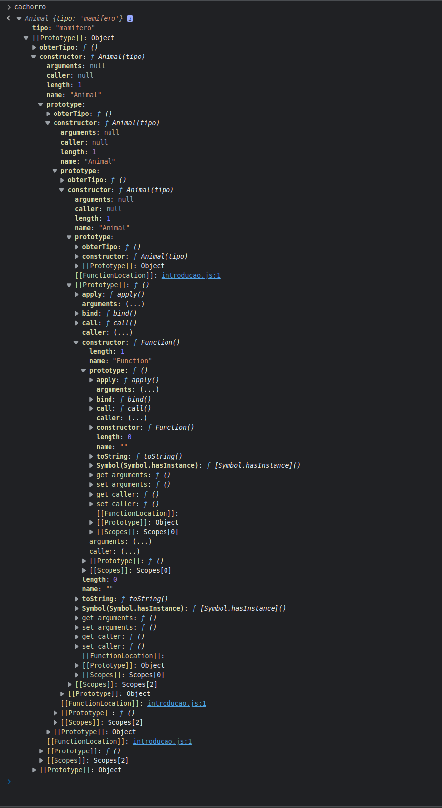

- Essa propriedade `constructor` irá nos mostrar a `função construtoa` do nosso `objeto cachorro`.

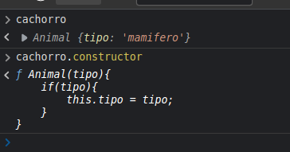

Com essa pequena introdução iremos criar um novo arquivo chamado `introducao_herança.js` para exemplificarmos melhor o conceito sobre `herança`.

~~~
function Animal(tipo){
    if(tipo){
        this.tipo = tipo;
    }
}

Animal.prototype.obterTipo = function(){
    return this.tipo;
}

Animal.prototype.tipo = "desconhecido";
~~~ 

- Vamos criar uma outra função construtora chamada `Cachorro` que irá receber um `nome` e um `tipo`.
  
~~~
function Animal(tipo){
    if(tipo){
        this.tipo = tipo;
    }
}

Animal.prototype.obterTipo = function(){
    return this.tipo;
}

Animal.prototype.tipo = "desconhecido";

function Cachorro(nome, tipo){
    this.nome = nome;
}

let rex = new Cachorro("Rex","mamifero");

~~~

- Porem apesar da nossa função construtora `cachorro` receber o `nome e o tipo`, ela simplesmente esta colocando o `nome`no objeto cachorro, e não temos as `propriedades e metodos` que foram definidos na função construtora de `Animal`.
- Ou seja, queremos usar o principio de `herança`, onde queremos que a nossa `classe cachorro` herde propriedades e metodos da nossa `classe Animal`.
- Para isso,basta que a gente chame a função `Animal` passando o `proprio objeto como argumento do this`.

~~~
function Animal(tipo){
    if(tipo){
        this.tipo = tipo;
    }
}

Animal.prototype.obterTipo = function(){
    return this.tipo;
}

Animal.prototype.tipo = "desconhecido";

function Cachorro(nome, tipo){
    this.nome = nome;
    Animal.call(this,tipo);
}

let rex = new Cachorro("Rex","mamifero");
console.log(rex);
~~~ 

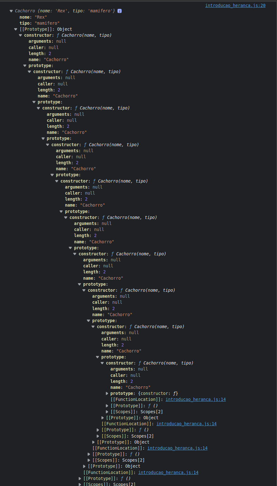

- No console vemos o `objeto do tipo cachorro` que possui agora um `nome` e um `tipo`.
- Ou seja, herdamos as propriedades que foram definidas na função construtora `Animal`.
- Ao chamarmos a propriedade `constructor` no nosso objeto `rex`, podemos ver quem é o construtor do objeto.

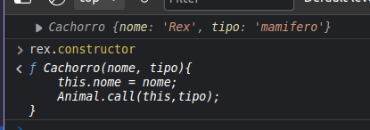

- Agora se fizermos `rex.__proto__` teremos uma propriedade que é a nossa função construtora que é o `Cachorro` e tbm teremos uma outra propriedade que seria o `__proto__` que aponto para o objeto principal do tipo `object`.
- Ou seja, não estamos criando ainda uma `cadeia de prototipos`. Vamos fazer isso agora.
- Vamos vincular o `prototipo` do nosso `Cachorro` com o `objeto do tipo Animal`.

~~~
function Animal(tipo){
    if(tipo){
        this.tipo = tipo;
    }
}

Animal.prototype.obterTipo = function(){
    return this.tipo;
}

Animal.prototype.tipo = "desconhecido";

function Cachorro(nome, tipo){
    this.nome = nome;
    Animal.call(this,tipo);
}

Cachorro.prototype = new Animal();

let rex = new Cachorro("Rex","mamifero");
console.log(rex);
~~~

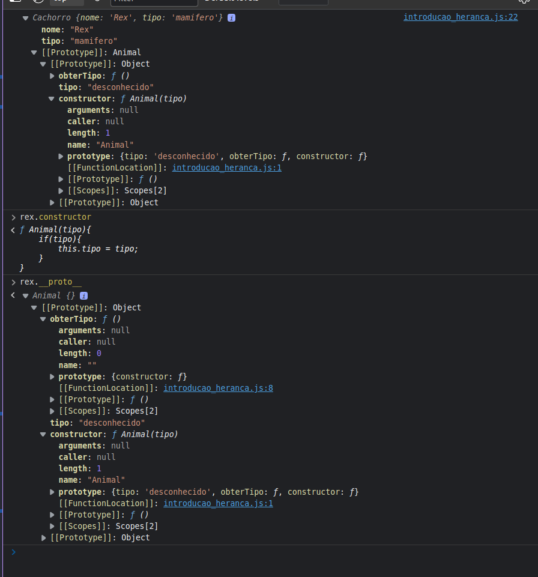

- Observem agora que o `rex.__proto__` não é mais um `Object` e sim um `Animal`.
- Observe tbm que o `rex.constructor` não é mais `Cachorro` e sim `Animal`.
- Para que a propriedade `constructor` volte a ser o construtor do `Cachorro`, temos que fazer o seguinte:

~~~
function Animal(tipo){
    if(tipo){
        this.tipo = tipo;
    }
}

Animal.prototype.obterTipo = function(){
    return this.tipo;
}

Animal.prototype.tipo = "desconhecido";

function Cachorro(nome, tipo){
    this.nome = nome;
    Animal.call(this,tipo);
    this.constructor = Cachorro; // voltando função construtora para Cachorro;
}

Cachorro.prototype = new Animal();

let rex = new Cachorro("Rex","mamifero");
console.log(rex);
~~~

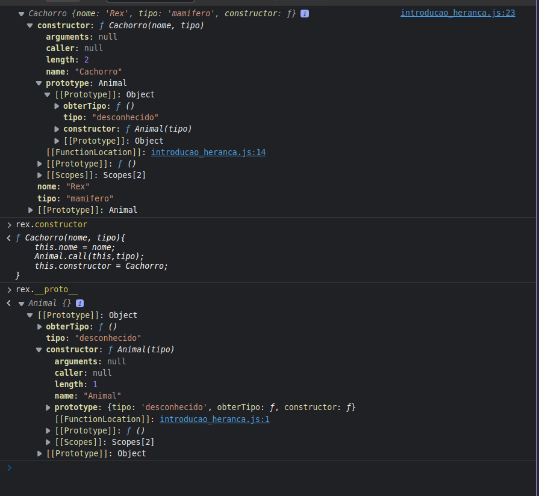

Essa era a maneira que criavamos `herança` no javascript. Porem temos uma maneira menos `verbosa` que iremos ver nas proximas aulas.

 

 

## hasOwnoperty, intanceOf, isPrototypeOf, getPrototypeOf
 

Vamos ver antes de avançarmos para o ES6, pequenos detalhes que escaparam nas aulas anteriores.

- Ja sabemos fazer loops em `objetos`, onde podemos utilizar por exemplo o loop `for in`.
- Vamos criar um loop para vermos algumas propriedades do `objeto rex` que criamos na aula anterior.

~~~
function Animal(tipo){
    if(tipo){
        this.tipo = tipo;
    }
}

Animal.prototype.obterTipo = function(){
    return this.tipo;
}

Animal.prototype.tipo = "desconhecido";

function Cachorro(nome, tipo){
    this.nome = nome;
    Animal.call(this,tipo);
    this.constructor = Cachorro;
}

Cachorro.prototype = new Animal();

let rex = new Cachorro("Rex","mamifero");
// console.log(rex);

for(let prop in rex){
    console.log(prop);
}

// SAIDA:

nome
tipo
constructor
obterTipo
~~~

- Na saida vemos as propriedades e funções que criamos `nome, tipo e obterTipo()`  e tbm temos uma propriedade chamada `constructor`.
- Ou seja, quando chamamos `rex` temos as propriedaeds `name, tipo, constructor` e temos o metodo `obterTipo` que esta armazenado na `cadeia de prototipos`.
- Logo quando fazemos o loop `for in` ele irá nos mostrar as outras propriedades que foram colocadas na `cadeia de prototipos`.

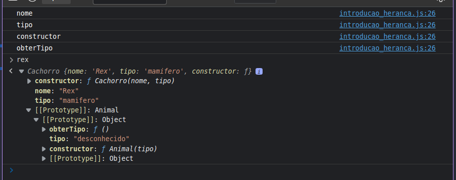

- Caso a gente queira mostrar somente as propriedades que estão dentro do `objeto rex`, fazemos o seguinte:

~~~
function Animal(tipo){
    if(tipo){
        this.tipo = tipo;
    }
}

Animal.prototype.obterTipo = function(){
    return this.tipo;
}

Animal.prototype.tipo = "desconhecido";

function Cachorro(nome, tipo){
    this.nome = nome;
    Animal.call(this,tipo);
    this.constructor = Cachorro;
}

Cachorro.prototype = new Animal();

let rex = new Cachorro("Rex","mamifero");
// console.log(rex);

for(let prop in rex){
    if(rex.hasOwnProperty(prop)){
        console.log(prop);
    }
}

~~~

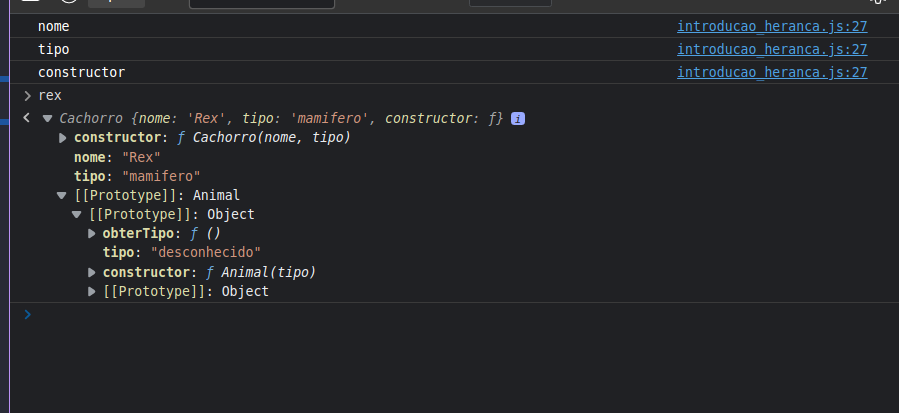

- Como mosrta a imagem acima, so esta nos sendo mostrado as propriedades que temos dentro da função construtora `Cachorro`. O `constructor` aparece pq explicitamente colocamos ele dentro da função construtora de `Cachorro`.

~~~ 
function Cachorro(nome, tipo){
    this.nome = nome;
    Animal.call(this,tipo);
    this.constructor = Cachorro;
}
~~~ 

- Ou seja, esse metodo `hasOwnProperty()` irá verifica se a propriedade faz parte do `objeto` em si, sem levar em consideração a `cadeia de prototipos`.
- Outro metodo que podemos ver é se, por exemplo quisermos saber se nosso `objeto rex` é uma `instancia` da `classe Animal`.

~~~
console.log(rex instanceof Animal); // true

~~~

- Recebemos como retorno o `true` logo qunado colocamos o `instanceOf` esta sendo buscado na `cadeia de prototipos`.
- Se fizermos `rex instanceOf Cachorro` irá continuar sendo `true`. Logo tbm esta buscando na `cadeia de prototipos`.
- O mesmo é valido para o `Object`, porem se fizermos o `instanceOf Array` iremos receber o `false`.

~~~
console.log(rex instanceof Cachorro); // true
console.log(rex instanceof Animal); // true
console.log(rex instanceof Object); // true
console.log(rex instanceof Array); // false
~~~

- Logo o `instanceOf` irá nos mostrar, na `cadeia de prototipos` se o `objeto selecionado` pertence a `cadeia de prototipos` a qual estamos buscando.
- Temos uma outra forma de fazermos isso que seria utilizando o `isPrototypeOf`.

~~~
console.log(Cachorro.prototype.isPrototypeOf(rex)); // true
~~~

- No codigo acima, estamos verificando se o `objeto prototype` que esta "pendurado" na `função construtora Cachorro` é um `prototipo/classe` do `objeto rex`.
- O mesmo é valido para `Animal e Object`.

~~~ 
console.log(Cachorro.prototype.isPrototypeOf(rex)); // true
console.log(Animal.prototype.isPrototypeOf(rex)); // true
console.log(Object.prototype.isPrototypeOf(rex)); // true
console.log(Array.prototype.isPrototypeOf(rex)); // false
~~~

- Tambem podemos recuperar o `prototype` do `objeto rex` usando um metodo do `objeto Object`.

~~~ 
console.log(Object.getPrototypeOf(rex));
console.log(rex.__proto__);
console.log(Object.getPrototypeOf(rex) === rex.__proto__); //true
~~~ 

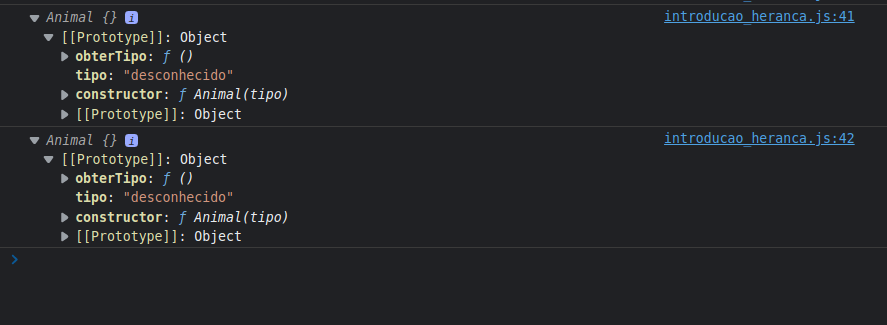

- Como vemos acima o `prototipo de rex` é a função construtora `Animal`

Agora vamos voltar para a questão do `constructor`, onde na função construtora de `Cachorro` temos o `this.constructor = Cachorro` ,que esta atribuindo/colocando um novo construtor e gerando no `loop`, que fizemos acima,a propriedade `constructor`, mesmo não sendo uma propriedade local, ou seja, fora da `cadeia de prototipos` da função construtora `Cachorro`.

O `objeto Object` do javascript permite que a gente crie propriedades que não sejam listadas.

- Ao invez de usarmos o `this.constructor = Cachorro`, a partir do `Objeto Object` temos um metedo chamado `defineProperty()`.
- Dentro deste metodo iremos definir uma propriedade dentro de `Cachorro.prototype`, com o nome de `constructor`. 

~~~
function Cachorro(nome, tipo){
    this.nome = nome;
    Animal.call(this,tipo);
    // this.constructor = Cachorro;
    Object.defineProperty(Cachorro.prototype, "constructor");
}
~~~

- Basicamente as duas linhas de codigo acima fazem a mesma coisa, porem a vantagem de utilizar o metodo `defineProperty()` é que podemos passar um `objeto de configuração` como terceiro parametro.
- Dentro deste `objeto de configuração` valor colocar uma propriedade chamada `value: Cachorro`.
- E tbm iremos passar uma outra propriedade chamada `enumerable` que recebe um booleano onde se for `true` a propriedade que estamos criando será mostrada dentro do `for in` por exmeplo, e se for `false` ela não será mostrada.

~~~
function Cachorro(nome, tipo){
    this.nome = nome;
    Animal.call(this,tipo);
    // this.constructor = Cachorro;
    Object.defineProperty(Cachorro.prototype, "constructor",{
        value: Cachorro,
        enumerable: false,
    });
}
~~~ 

- Agora não temos mais o `constructor` sendo mostrado como uma propriedade dentro do `for in`.

 

 

## Melhor lugar para inserir o construtor
 

No código anterior eu inseri uma propriedade constructor diretamente no objeto:

~~~
function Cachorro(nome, tipo) {
    this.nome = nome
    Animal.call(this, tipo)
    // propriedade construcor no objeto gerado
    this.constructor = Cachorro
}
Cachorro.prototype = new Animal()
~~~

Mas talvez seria mais interessante inserir essa propriedade não no objeto em si, mas sim no prototype da função construtora.

Pense um pouco a respeito Antes de olhar para o código abaixo. Isso faz sentido pra você

Bom, se você chegou até aqui, então eu creio que queira ver o meu código, certo?

Então aí está:

~~~
function Cachorro(nome,tipo){
    this.nome = nome;
    Anima.call(this,tipo);
}
Cachorro.prototype = new Animal();
Cachorro.prototype.constructor = Cachorro
~~~ 

Veja que estou alterando o `constructor do prototype de Animal`, e não mais incluindo diretamente o `constructor no objeto Cachorro`.

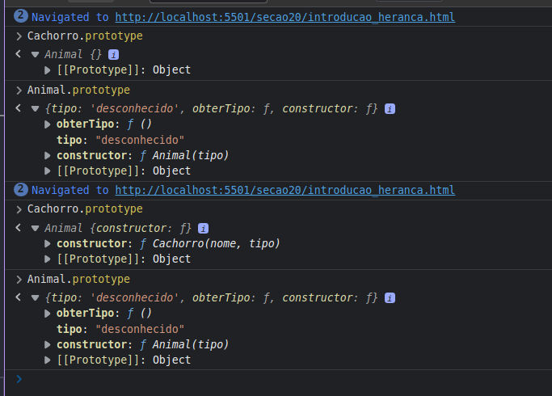

 

 

## class(ES6)
 

Agora iremos ver como criamos as classes utilizando a `sintaxe do ES6`, usando a palavra magica `class`. Para isso vamos construir a `classe Animal` que em aulas passadas construimos usando uma função construtora, porem utilizando uma sintaxe mais modeerna.

Vamos criar um novo arquivo chamado `class.js` com base no primeiro arquivo que criamos chamado `introducao.js | introducao.html`.

- Antes criamos uma função construtora chamada `Animal` que recebe um `tipo` como parametro. Vamos criar essa mesma função utilizando a `sintaxe do ES6` e chamar essa `classe` de `AnimalC` para lembrar que é uma classe e não uma função construtora.. 

~~~ 
// ES6
class AnimalC{}
~~~ 

- Toda `classe` ao ser criada, precisa ter dentro dela uma função chamada `constructor`. Ou seja, quando charmamos o `operador new` passando o `AnimalC` essa função `constructor` irá ser executada criando o objeto e fazemos as atribuições necessarias.
- Como em `Animal(tipo)` passamos o tipo, dentro da função `constructor(tipo)` de classe `AnimalC` tbm iremos passar o tipo.

~~~
// ES6

class AnimalC{
    constructor(tipo){
        if(tipo) this.tipo = tipo;
    }
}

~~~

- Temos na outra versão a função `obterTipo` sendo criada a apartir de `Animal.prototype`.
- Na versão mais nova, criamos funções dentro da nossa `classe` logo abaixo da função `constructor` da seguinte maneira:

~~~
// ES6
class AnimalC{
    constructor(tipo){
        if(tipo) this.tipo = tipo;
    }

    obterTipo(){
        return this.tipo;
    }
}

let animal = new AnimalC("anfibio");
console.log(animal);
~~~

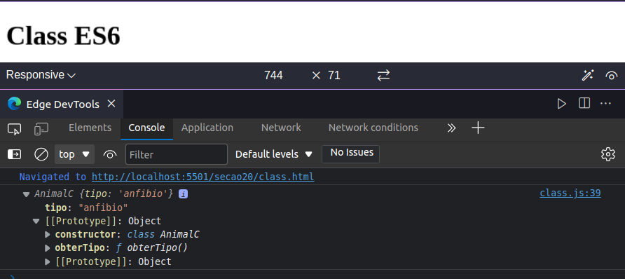

- Observem na saida do console que `animal` é um `objeto` da `classe AnimalC`.Dentro desse objeto temos a propriedade `tipo` que colocamos dentro da função obrigatoria `constructor` na classe `AnimalC`.
- Vamos ver a diferença entre criamos com a `função construtora Animal` e criamos com a `classe AnimalC`.

~~~
// ES5
function Animal(tipo){
    if(tipo){
        this.tipo = tipo;
    }
}

let gato = new Animal("mamifero");

Animal.prototype.obterTipo = function(){
    return this.tipo;
}

// ES6

class AnimalC{
    constructor(tipo){
        if(tipo) this.tipo = tipo;
    }

    obterTipo(){
        return this.tipo;
    }
}

let animal = new AnimalC("anfibio");
console.log(animal);
console.log(gato);
~~~

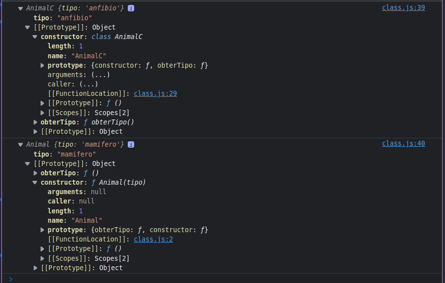

- Basicamente tanto a `função construtora`, obviamente pq tem a palavra `function`, quanto a `classe`, ambos são `funções`. Tanto é que podemos verificar fazendo o `typeof` para ambos.

~~~
console.log(typeof animal, animal); // objetos
console.log(typeof gato,gato); // objeto
console.log(typeof Animal, Animal);
console.log(typeof AnimalC, AnimalC);
~~~ 

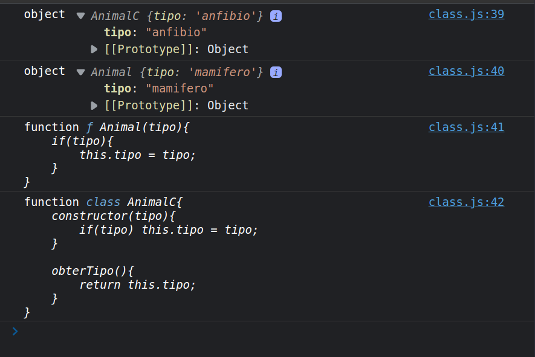

- Vamos chamar a função `obterTipo()` nos dois objetos criados de maneiras diferentes.

~~~
console.log(typeof animal.obterTipo(), animal.obterTipo());
console.log(typeof gato.obterTipo(), gato.obterTipo());

// SAIDA:

string anfibio
string mamifero
~~~

- Os dois objetos possuem a função `obterTipo()` apesar de que a mesma não esta `explicita` no objeto. Ela esta sendo recuperada da `cadeia de prototypes`.

~~~
console.log(typeof Animal.prototype, Animal.prototype);
console.log(typeof AnimalC.prototype, AnimalC.prototype);
~~~

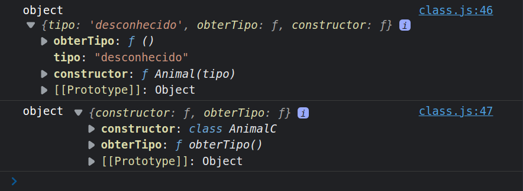

- Percebam que a unica diferença que temos é no `tipo: "desconhecido"` de resto é igual. 
- Se quisessemos colocar um `tipo:"desconhecido"` na nossa classe `AnimalC` tbm poderiamos.

~~~
// ES5
function Animal(tipo){
    if(tipo){
        this.tipo = tipo;
    }
}

Animal.prototype.obterTipo = function(){
    return this.tipo;
}

Animal.prototype.tipo = "desconhecido";

console.log(peixe);
console.log(peixe.tipo);

// ES6

class AnimalC{
    constructor(tipo){
        if(tipo) this.tipo = tipo;
    }

    obterTipo(){
        return this.tipo;
    }
}

AnimalC.prototype.tipo = "desconhecido";

let animal = new AnimalC("anfibio");
let sapo = new AnimalC();

console.log(typeof Animal.prototype, Animal.prototype);
console.log(typeof AnimalC.prototype, AnimalC.prototype);

~~~

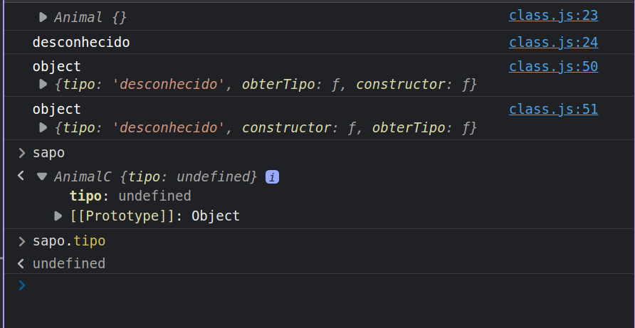

- Sapo não possui acesso ao tipo `desconhecido` logo esta vindo como `undefined` ja que não passamos nenhum parametro quando o criamos. Basta fazermos a mesma verificação que fizemos em `Animal`.

~~~

class AnimalC{
    constructor(tipo){
        if(tipo) this.tipo = tipo;
        // this.tipo = tipo;
    }

    obterTipo(){
        return this.tipo;
    }
}
~~~

- Percebam que não conseguimos `colocar uma propriedade` dentro da nossa `classe AnimalC`. Precisamos de fato acessar o `prototype` para podermos adicionar a classe.

~~~

// ES6

class AnimalC{
    constructor(tipo){
        if(tipo) this.tipo = tipo;
        // this.tipo = tipo;
    }

    obterTipo(){
        return this.tipo;
    }

    testeProto = "será que funciona?";
}
~~~

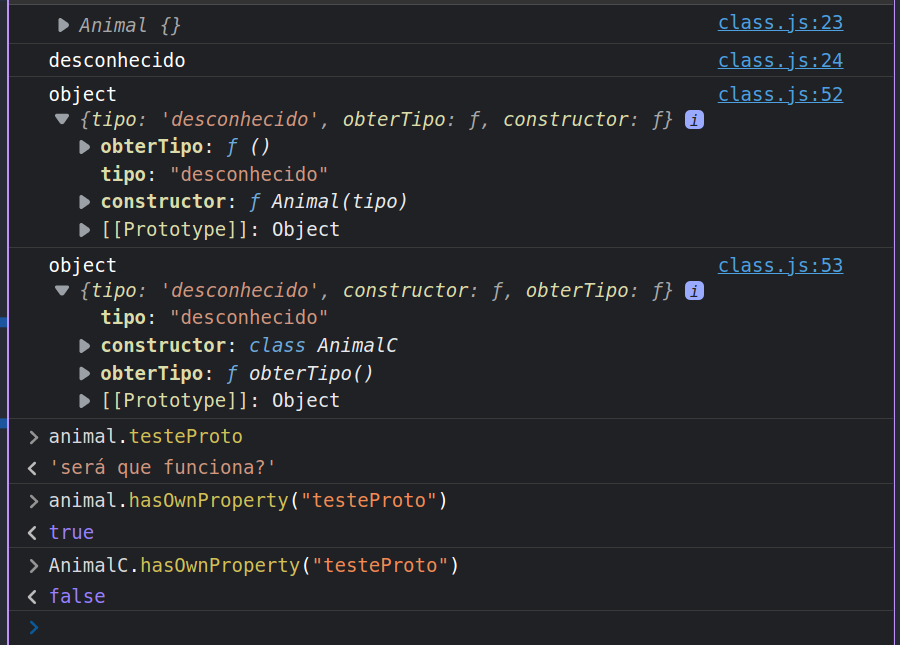

- Como podemos ver na imagem acima, o objeto criado pela `classe AnimalC` possui a propriedade `testeProto`, porem esse metodo não existe na `cadeia de prototypes`.

 

 

## extends
 

Vamos ver uma diferença quando utilizamos o `class` e para quando utilizamos a `função construtora`.

- Temos a função `Animal` e a função `AnimalC`. Ambos são funções. Porem a diferença entre utilizar a palavra `function` e a palavra `class` é que poderiamos fazer o seguinte: 

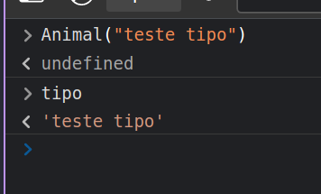

- Na imagem acima, executamos a "função" `Animal`, apos a execução, temos agora no nosso `escopo global` uma variavel que armazena essa string. O que é perigoso.
- Para resolver isso poderiamos utilizar o `use strict` ou tbm podeeriamos verificar se o `this` é `instanceOf Animal.

~~~ 
function Animal(tipo){
    if(this instanceof Animal){
        if(tipo){
            this.tipo = tipo;
        }else{
            throw new Error("Animal must be created with new operator"); 
        }
    }
}
~~~ 

- Se reproduzirmos a execução do codigo de Animal na imagem acima, iremos receber agora um erro.

> Porem quando utilizamos a palavra `class` não precisamos fazer a verificação pois ja vem com `padrão`.

Agora iremos seguir com a parte sobre `herança`. Utilizando as `funções construtoras` quando quisessemos ter uma outra `classe/função` que `extende` de uma class, por exemplo `Animal`, precisavamos fazer a `ligação entre os prototypes`.

~~~
// Cachorre extendendo de animal 
function Cachorro(nome){
    this.nome = nome;
    Animal.call(this, "mamifero");
    this.constructor = Cachorro;
}
Cachorro.prototype = new Animal("mamifero"); 

~~~

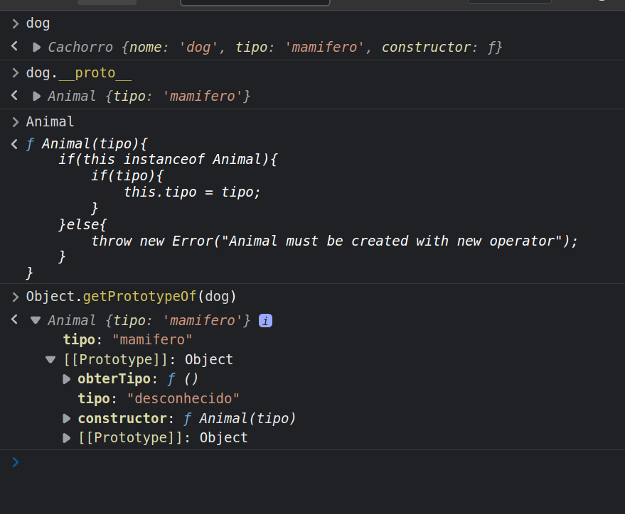

> A propriedade `__proto__`foi descontinuada, temos agora um metodo do `objeto Object` chamado de `.getPrototypeOf(dog)` para podermos recuperar o prototype de algum objeto.

Agora iremos utilizar o mesmo conceito de `herança` utilizado pelo `ES6` da mesma maneira que fizemos o conceito de `constructor->class`.

- Vamos criar uma outra classe chhamada `GatoC`.

~~~
// ES6

class AnimalC {
    constructor(tipo){
        if(tipo) this.tipo = tipo;
        // this.tipo = tipo;
    }

    obterTipo(){
        return this.tipo;
    }

}

class GatoC {
    constructor(nome){
        this.nome = nome;
    }
}
~~~ 

- Agora precisamos fazer com que `GatoC` herde o tipo de `AnimalC`. Para isso basta que a gente use a palavra chave `extends`.

~~~ 
// ES6

class AnimalC {
    constructor(tipo){
        if(tipo) this.tipo = tipo;
        // this.tipo = tipo;
    }

    obterTipo(){
        return this.tipo;
    }

}

class GatoC extends AnimalC{
    constructor(nome){
        this.nome = nome;
    }
}

AnimalC.prototype.tipo = "desconhecido";

let animal = new AnimalC("anfibio");
let sapo = new AnimalC();
let migal = new GatoC("mingal");

console.log(migal);
~~~ 

- Recebemos um erro ao executar o codigo acima pois toda vez que usarmos o `extends` temos que chamar a classe que esta sendo `extendida` no caso `AnimalC`.
- Para isso, temos que passar para o `constructor` da classe `GatoC` o metodo `super()` passando como parametro para ele os valores que a `classe herdada` precisa, no caso um `tipo`.

~~~
// ES6

class AnimalC {
    constructor(tipo){
        if(tipo) this.tipo = tipo;
        // this.tipo = tipo;
    }

    obterTipo(){
        return this.tipo;
    }

}

class GatoC extends AnimalC{
    constructor(nome){
        super("mamifero");
        this.nome = nome;
    }
}

AnimalC.prototype.tipo = "desconhecido";

let migal = new GatoC("mingal");
console.log(migal);
~~~

- `super()` refere-se a classe acima, ela é equivalente na função construtora quando escrevemos `Animal.call(this, "mamifero")`.

 

 

## Porque metodos ficam no protótipo?
 

 

 

## Exercicio Proposto: Criar um polyfill para String
 

 

 

## Resolução: Criar um polyfill para String
 

 

 

## Classes Abstratas
 

 

 

## Métodos Estáticos
 

 

 

## Desafio: Classe Abstrata ContaBancaria
 

 

 

## Resolução Desafio: Classe Abstrata ContaBancaria
 
 

 

 

## Desafio: Classes Concretas ContaPoupança e ContaCorrente
 

 

 

## Resolução Desafio: Classes Concretas ContaPoupança e ContaCorren
 

 

 

## Desafio: Composição
 

 

 

## Enunciado: Composição
 

 

 

## Resolução Desafio: Composição
 

 

 

## Desafio: Cliente agora é Classe Abstrata
 

 

 

## resolução Desafio: Cliente agora é Classe Abstrata
 
 

 

 

## Enunciado: Cliente agora é Classe Abstrata
 
 

 

 

## Resolução Desafio: Classe Abstrata Cliente
 

 

 

## Refatoração: Mostrar tipo de documento
 

 

 

## Polimorfismo
 

 

 