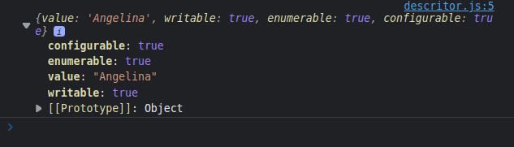
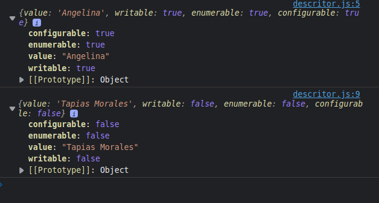

# SEÇÃO 21 - OBJETOS PART 2

 

## getters e setters
 

~~~ 
// ESCOPO GLOBAL

// podemos proteger essa variavel criando um objeto ou um array que tenha os valores permitidos.
let tipo = ""; 
// Criamos esse objeto para que a gente nao tenha que fazer varios 'ifs'. Poderia ser feito com array
// const tiposPermitidos = {
//     "mamifero": true,
//     "anfibio": true,
//     "reptil": true,
// }; 

const tiposPermitidos = ['mamifero', 'anfibio'];

// objeto literal
const cachorro = {
    name: "Rex",
    // encarado com propriedade, porem dentro do objeto é uma função
    get tipo(){
        return tipo;
    },
    set tipo(_tipo){

        // padrão objeto

        // if(tiposPermitidos[_tipo]) tipo = _tipo;

        // if(tiposPermitidos[_tipo]){
        //     tipo = _tipo;
        // }else{
        //     throw new Error("Tipo não permitido");
        // }

        // padrao array
        if(tiposPermitidos.indexOf(_tipo) >= 0){
            tipo = _tipo;
        }
    }
};

// ESCOPO FUNÇÃO ANONIMA

 
// IIFE PARA EVETIR SUJAR ESCOPO GLOBAL
(function(){

    let tipo = ""; 
    const tiposPermitidos = ['mamifero', 'anfibio'];

    const gato = {
        name: "migal",
        get tipo(){
            return tipo;
        },
        set tipo(_tipo){
            if(tiposPermitidos.indexOf(_tipo) >= 0){
                tipo = _tipo;
            };
        },
    }

    // window.gato = gato; // não funciona no node!
    this.gato = gato;
    
})()
~~~ 

 

 

## Exercicio proposto
 

Crie um objeto `Produto`. Esse produto tem uma unica propriedade chamada quantidade. Proteja essa propriedade para que receba apenas numeros maiores que 0, toda vez que o valor de quantidade for consultado, mostra no console um contador. Evite variaveis no escopo global.

 

 

## Resolução Exercicio Proposto
 

~~~
(function(){
    let _quantidade = 0;
    let _contador = 0;

    // this.produto disponibiliza o objeto no escopo global.
    this.produto = {
        get quantidade(){
            console.log(`Quantidade foi consultada: ${++_contador} vez${_contador > 1 ? 'es': ''}`);
            return _quantidade;
        },
        set quantidade(value){
            if(value > 0){
                _quantidade = value;
            }
        }
    }

})()

produto.quantidade = 20;
console.log(produto.quantidade);
produto.quantidade = 21;
console.log(produto.quantidade);
produto.quantidade = 22 ;
console.log(produto.quantidade); 
~~~

 

 

## Desafio: getters and setters
 

Crie um objeto Pessoa. Deve ter uma propriedade get chamada usuarios que deve armazenar uma array de strings. Deve ter uma propriedade get chamada usuario que deve retornar o ultimo usuario da array. Sempre que alterar o usuario (set), nçao deve substituir, mas sim colocar num array, se ja não existir na array usuarios. Deve ter uma propriedade get usuarios para recuperar o historico de usuarios.

 

 

## Resolução Desafio
 

~~~
(function(){

    let usuarios = [];
    this.pessoa = {
        get usuario(){
            // retorna o ultimo indice do array de usuarios.
            if(usuarios.length > 0){
                return usuarios[usuarios.length - 1]; // não usamos o metodo pop() pois ele é destrutivo.
            }
        },
        set usuario(_usuario){
            if(usuarios.indexOf(_usuario) < 0){
                // usuarios não existe, logo colocamos no array
                usuarios.push(_usuario);
            }
        },
        get usuarios(){
            return usuarios;
        },
    }
})()

~~~

 

 

## Evite exportar Referencias
 

No exemplo anterior, falamos sobre como poderiamos proteger nossa `array de usuarios` para que não fosse possivel utilizarmos `metodos de array` para alterar essa `array`.

Iamos falar sobre o `Object.freeze()` porem essa forma de 'proteção' é um pouco mais dificil de se manipular o objeto uma vez que o mesmo é 'congelado'.

~~~
get usuarios(){
    Object.freeze(usuarios);
    return usuarios;
}, 
~~~

- O codigo acima faz com que o programador não consiga utilizar metodos como `push(), pop()...`.
- Vamos ver nesse exemplo uma alternativa ao `Object.freeze()`, ou seja, ao invez de retornarmos uma `referencia` a nossa `array de usuarios`, vamos retornar uma `copia` dela, ou seja, vao apontar para endereços de memoria diferentes.
- Existem varias formas para se alcançar esse objetivo, poderiamos utilizar o `spread`, o `Array.from()` e a maneira antiga de se fazer.
- Vamos utilizar a maneira antiga, que seria `retornar` uma array vazia `[]` utilizando o metodo `.concat()` passando como propriedade deste metodo nossa `array de usuarios`.

~~~
get usuarios(){
            return [].concat(usuarios);
        }, 
~~~

- No codigo acima, estamos criando uma `array nova` e `concatenando` com a nossa `array de usuarios`.

 

 

## Introdução à Descritores
 

Vamos agora provocar a nossa curiosidade, temos um objeto `pessoa`, onde não temos nenhuma propriedade, porem temos o `get e set` de `usuarios` dentro deste objeto. 

O que acontece quando no console fazemos um loop `for in`?

~~~
for(let p in pessoa){
    console.log(p);
} 
~~~

- Quando usamos o `loop` vemos que o objeto `pessoa` possui duas propriedades:
  - `usuario`
  - `usuarios`
- Temos tbm o objeto nativo `String.prototype`, onde ao abrirmos esse objeto, podemos ver varias propriedades e metodos. Porem vamos fazer um loop para vermos as propriedades e metodos do objeto nativo `String` igual fizemos acima com o nosso objeto.

~~~
for(let p in String.prototype){
    console.log(p);
}
~~~ 

- Quando rodamos o codigo acima no console do browser, temos o `undefined` como retorno, isso acontece pq algumas propriedades podem ser `enumeraveis` ou nao.
- Se tivermos falando sobre uma propriedade `enumeravel` vamos conseguir visualizar essa propriedade no `loop`.
- Existem tbm outros tipos de configurações que podemos dar a uma `propriedade` dentro de um objeto, por exemplo:
  - `reescrita`
  - `configuravel`
  - ...

Vamos ver uma propriedade chamada `getOwnPropretyDescriptor()`, esse description/descritor, é um `objeto de configuração` dessa propriedade. Vamos criar um novo documento chamado de `descritor.js/html` para exemplificarmos melhor.

- Vamos criar um objeto chamado pessoa e colocar uma propriedade chamada `nome`.
- Podemos pedir que se mostre no console a `descrição` da propriedade `nome`, usando o metodo `getOwnPropertyDescriptor()` que recebe duas `parametros`:
  - `objeto` que queremos testar.
  - `propriedade` que queremos testar.

~~~
const pessoa = {
    nome: "Angelina",
} 
console.log(Object.getOwnPropertyDescriptor(pessoa, "nome"));

~~~

- Podemos ver na saida do console, um `objeto`com as seguintes propriedades:
  - `configurable:`
  - `enumerable: `
  - `value: `
  - `writable:`
- Ou seja, conseguimos `configurar`, `enumerar = loop`, coseguimos colocar valor e a possibilidade de `reescrever`esse valor.

Vamos utilizar um outro metodo do objeto `Object` chamada, `.defineProperty()`, esse metodo serve para definirmos uma propriedade dentro de um `objeto` semelhante ao `nome: "Angelina"`.

- Porem, utilizando esse metodo, conseguimos mudar o `descritor`, objeto de configuração.

> Se tentarmos definir uma propriedade existente,usar o metodo irá alterar o `descritor` desta propriedade. Caso ela não exista, sera criada.

- Esse metodo recebe `3 parametros` o primeiro sendo o `objeto` utilizado, o segundo a `propriedade` que queremos criar/alterar, e o terceiro é o objeto `descritor`.

~~~
const pessoa = {
    nome: "Angelina",
}

console.log(Object.getOwnPropertyDescriptor(pessoa, "nome"));
Object.defineProperty(pessoa, "sobrenome", {
    value: "Tapias Morales",
})
console.log(Object.getOwnPropertyDescriptor(pessoa, "nome"));

~~~

- Vejam na imagem acima que todas as propriedades do objeto de configuração da propriedade que criamos estao com o valor de `false`.
- Quando criamos uma propriedade da maneira que criamos `nome`, os valores colocados dentro das propriedades do objeto de configuração irão vir como `true`, porem, quando criamos a propriedade utilizando o metodo `defineProperty()` o valor padrão de `false` será colocado.
- Com isso, não podemos alterar essa propriedade. Caso a gente não esteja utilizando o `use strict` o codigo abaixo não irá gerar um erro, porem a propriedade tbm não será alterada. Caso a gente esteja utilizando o `use strict`, um erro será gerado no console quando tentarmos alterar uma propriedade onde sua configuração esta somente como `read-only`.

~~~ 
'use strict';

const pessoa = {
    nome: "Angelina",
}

console.log(Object.getOwnPropertyDescriptor(pessoa, "nome"));
Object.defineProperty(pessoa, "sobrenome", {
    value: "Tapias Morales",
})
console.log(Object.getOwnPropertyDescriptor(pessoa, "sobrenome"));
pessoa.sobrenome = "lalalal";
console.log(Object.getOwnPropertyDescriptor(pessoa, "sobrenome"));

~~~

- A propriedade de configuração `enumerable` irá nos permitir ou nao, mostrar as propriedades do objeto no `loop`.

~~~
'use strict';

const pessoa = {
    nome: "Angelina",
}

console.log(Object.getOwnPropertyDescriptor(pessoa, "nome"));
Object.defineProperty(pessoa, "sobrenome", {
    value: "Tapias Morales",
})
console.log(Object.getOwnPropertyDescriptor(pessoa, "sobrenome"));
// pessoa.sobrenome = "lalalal";
console.log(Object.getOwnPropertyDescriptor(pessoa, "sobrenome"));

for( let prop in pessoa){
    console.log(prop); // so mostra a propriedade nome
} 
~~~

- Para mudarmos isso, basta passarmos para a função `.getOwnPropertyDescriptor()`, o valor do `enumerable` como `true`.

~~~
'use strict';

const pessoa = {
    nome: "Angelina",
}

console.log(Object.getOwnPropertyDescriptor(pessoa, "nome"));
Object.defineProperty(pessoa, "sobrenome", {
    value: "Tapias Morales",
    enumerable: true,
})
console.log(Object.getOwnPropertyDescriptor(pessoa, "sobrenome"));
// pessoa.sobrenome = "lalalal";
console.log(Object.getOwnPropertyDescriptor(pessoa, "sobrenome"));

for( let prop in pessoa){
    console.log(prop); // so mostra a propriedade nome
} 
~~~

- Ja a propriedade `configurable`, ela não permite mais alterarmos as `definições` inclusive `deletar`.

~~~ 
'use strict';

const pessoa = {
    nome: "Angelina",
}

console.log(Object.getOwnPropertyDescriptor(pessoa, "nome"));
Object.defineProperty(pessoa, "sobrenome", {
    value: "Tapias Morales",
    enumerable: true,
})
console.log(Object.getOwnPropertyDescriptor(pessoa, "sobrenome"));
// pessoa.sobrenome = "lalalal";
console.log(Object.getOwnPropertyDescriptor(pessoa, "sobrenome"));
delete pessoa.sobrenome;

for( let prop in pessoa){
    console.log(prop); // so mostra a propriedade nome
}

~~~

- Agora se alterarmos o `configurable` para `true`, irá nos ser permitido deletar essa propriedade `sobrenome`.

~~~ 
'use strict';

const pessoa = {
    nome: "Angelina",
}

console.log(Object.getOwnPropertyDescriptor(pessoa, "nome"));
Object.defineProperty(pessoa, "sobrenome", {
    value: "Tapias Morales",
    enumerable: true,
    configurable: true, //  permite deletar a propriedade
})
console.log(Object.getOwnPropertyDescriptor(pessoa, "sobrenome"));
// pessoa.sobrenome = "lalalal";
console.log(Object.getOwnPropertyDescriptor(pessoa, "sobrenome"));
delete pessoa.sobrenome;

for( let prop in pessoa){
    console.log(prop); // so mostra a propriedade nome
}

~~~

- Com o codigo acima, podemos agora deletar ou alterar a propriedade `sobrenome`.
- Se voltarmos o valor do `configurable` para `false` e depois definirmos chamando o `.defineProperty()` como `true` novamente, não irá funcionar.

~~~
'use strict';

const pessoa = {
    nome: "Angelina",
}

console.log(Object.getOwnPropertyDescriptor(pessoa, "nome"));
Object.defineProperty(pessoa, "sobrenome", {
    value: "Tapias Morales",
    enumerable: true,
    configurable: false,
})
console.log(Object.getOwnPropertyDescriptor(pessoa, "sobrenome"));
// pessoa.sobrenome = "lalalal";
console.log(Object.getOwnPropertyDescriptor(pessoa, "sobrenome"));
Object.defineProperty(pessoa, "sobrenome", {
    configurable: true,
})
// delete pessoa.sobrenome;
for( let prop in pessoa){
    console.log(prop); // so mostra a propriedade nome
}

// SAIDA:
Uncaught TypeError: Cannot redefine property: sobrenome
    at Function.defineProperty (<anonymous>)
    at descritor.js:16:8
~~~

- Porem o contrario do codigo acima é valido!
- Temos uma observação, a unica configuração possivel depois que colocarmos o `configurable` para `false` seria em relação ao `writable`.
- Não conseguimos fazer o caminho do `false` valor padrão, para o `true` como o codigo abaixo.

~~~
'use strict';

const pessoa = {
    nome: "Angelina",
}

console.log(Object.getOwnPropertyDescriptor(pessoa, "nome"));
Object.defineProperty(pessoa, "sobrenome", {
    value: "Tapias Morales",
    enumerable: true,
    configurable: true,
})
console.log(Object.getOwnPropertyDescriptor(pessoa, "sobrenome"));
// pessoa.sobrenome = "lalalal";
console.log(Object.getOwnPropertyDescriptor(pessoa, "sobrenome"));
Object.defineProperty(pessoa, "sobrenome", {
    configurable: false,
});
Object.defineProperty(pessoa, "sobrenome", {
    writable: true,
})
// delete pessoa.sobrenome;
for( let prop in pessoa){
    console.log(prop); // so mostra a propriedade nome
}

~~~

- Porem o inverso é valido mesmo com o `configurable` tendo seu valor como `false`.

~~~
'use strict';

const pessoa = {
    nome: "Angelina",
}

console.log(Object.getOwnPropertyDescriptor(pessoa, "nome"));
Object.defineProperty(pessoa, "sobrenome", {
    value: "Tapias Morales",
    enumerable: true,
    configurable: true,
    writable: true,
})
console.log(Object.getOwnPropertyDescriptor(pessoa, "sobrenome"));
// pessoa.sobrenome = "lalalal";
console.log(Object.getOwnPropertyDescriptor(pessoa, "sobrenome"));
Object.defineProperty(pessoa, "sobrenome", {
    configurable: false,
});
Object.defineProperty(pessoa, "sobrenome", {
    writable: false,
})
// delete pessoa.sobrenome;
for( let prop in pessoa){
    console.log(prop); // so mostra a propriedade nome
}

~~~

- Podemos tbm colocar mais de uma propriedade ao mesmo tempo usando o metodo `.defineProperties()`. 
- Passamos o objeto que iremos alterar como primeiro parametro. No segundo parametro em vez de passarmos uma `string` que seria o nome da propriedade, passamos um outro `objeto` com as propriedades.

~~~
'use strict';

const pessoa = {
    nome: "Angelina",
}

Object.defineProperty(pessoa, "sobrenome", {
    value: "Tapias Morales",
    enumerable: true,
    configurable: true,
    writable: true,
})

Object.defineProperty(pessoa, "sobrenome", {
    configurable: false,
});
Object.defineProperty(pessoa, "sobrenome", {
    writable: false,
})
Object.defineProperties(pessoa, {
    prop1: {
        value: "prop 1",
        writable: true,
    },
    prop2: {
        writable: false,
        value: 10,
    }
});
console.log(pessoa);
console.log(Object.getOwnPropertyDescriptor(pessoa, "sobrenome"));
console.log(Object.getOwnPropertyDescriptor(pessoa, "prop1"));
console.log(Object.getOwnPropertyDescriptor(pessoa, "prop2"));
~~~

 

 

## Object.create()
 

Vamos ver alguns outros metodos do objeto `Object`, para isso criaremos um novo documento chamado `metodos.js`.

 

 

## Object.assign()
 

 

 

## Object.keys() value e entries()
 

 

 

## destructuring
 

 

 

## Congelar propriedades de um objeto
 

 

 

## deep freeze
 

 

 

## Diferença entre keys() e getOwnPropertyNames()
 

 

 

## isFrozen()
 

 

 

## Outros métodos de checagem
 

 

 

## Symbols
 

 

 

## Sumbol como propriedade de objeto
 

 

 

## BUG FIX: propriedades funcionam no node
 

 

 

## Manter o symbol isolado
 

 

 

## Map e WeakMap
 

Vamos agora ver duas novas estruturas de dados que se chamam `map` e `weakMap`. São estruturas de dados que assim como o `objeto` possuem `chave e valor`.

A diferenaça é que em um objeto tradicional, o `nome` da chave, a `referencia` para aquela chave é uma `string`. Vamos criar um novo documento chamado `weakMap_map.js` para exemplificarmos melhor.

- Vamos criar uma constante chamada `myMap` onde irá receber um novo `Map()`.
- Vamos tbm criar um objeto para termos como referencia.

~~~
const myMap = new Map(); // mapa
const myObj = new Object();

myObj.prop1 = "prop 1";

~~~

- Toda vez que criamos uma chave `prop1` ela será considerada uma `string`. Porem nas versões mais novas, conseguimos colocar qualquer valor como chave, inclusive um `array`, um `objeto` e uma `string` tbm.
- Porem para definirmos um novo valor no metodo, precisamos utilizar um metodo chamado `set()` e dentro deste metodo colocamos nossa `chave-valor`.
- Para recuperarmos o valor utilizamos o metodo `get()`, passando a chave que queremos.

~~~
const myMap = new Map(); // mapa
const myObj = new Object();

myObj.prop1 = "prop 1";

myMap.set("prop1", "prop 1");

console.log(myMap.get("prop1")); // prop1
~~~

- A grande diferença é que conseguimos definir qualquer coisa usando o metodo `set()` ou seja, podemos utilizar valores booleanos.

~~~
const myMap = new Map(); // mapa
const myObj = new Object();

myObj.prop1 = "prop 1";

myMap.set("prop1", "prop 1");
myMap.set(true, false);

console.log(myMap.get("prop1")); // prop1
console.log(myMap.get(true)); // false

~~~

- Poderiamos tbm utilizar um objeto, vamos utilizar nosso objeto criado como referencia do nosso MAP.

~~~
const myMap = new Map(); // mapa
const myObj = new Object();

myObj.prop1 = "prop 1";

myMap.set("prop1", "prop 1");
myMap.set(true, false);
myMap.set(myObj, "meu objeto");

console.log(myMap.get("prop1")); // prop1
console.log(myMap.get(true)); // false
console.log(myMap.get(myObj)); // false
~~~

- Poderiamos tbm fazer o mesmo com o `array`.

~~~
const myMap = new Map(); // mapa
const myObj = new Object();
const arr = [];

myObj.prop1 = "prop 1";

myMap.set("prop1", "prop 1");
myMap.set(true, false);
myMap.set(myObj, "meu objeto");
myMap.set(arr, myObj);

console.log(myMap.get("prop1")); // prop 1
console.log(myMap.get(true)); // false
console.log(myMap.get(myObj)); // meu objeto
console.log(myMap.get(arr)); // meu objeto

~~~

- Ou seja, podemos definir qualquer valor como chave do nossa `mapa`.
- Tbm conseguimos criar o nosso `map` ja passando os valores, ou seja, os conjuntos de chave e valor.
- Vamos criar uma constante chamada `myMap2`. A sintaxe é um pouco confusa, mas vamos la:
  - Passamos um `array` como parametro, de dentro deste array teremos varios outros `arrays`.
  - Dentro de cada um desses `arrays` teremos pares de `chave e valor`.

~~~
const myMap2 = new Map([
    [0, "zero"],
    [1,"um"],
    [2, "dois"],
]);

console.log(myMap2.get(0));
console.log(myMap2.get(1));
console.log(myMap2.get(2));

~~~

- Assim de uma unica vez, criamos nosso mapa e ja definimos as chaves e os valores.
- Temos alguns metodos interessantes, que podemos visualizar ao digitarmos `myMap2.`.
  - Por exemplo o metodo `keys()`

~~~
const myMap2 = new Map([
    [0, "zero"],
    [1,"um"],
    [2, "dois"],
]);

console.log(myMap2.get(0));
console.log(myMap2.get(1));
console.log(myMap2.get(2));

console.log(myMap2.keys()); // [Map Iterator] { 0, 1, 2 }
~~~

- Usando o metodo `.has()` verificamos se possui uma propriedade ou nao.

~~~
const myMap2 = new Map([
    [0, "zero"],
    [1,"um"],
    [2, "dois"],
]);

console.log(myMap2.get(0));
console.log(myMap2.get(1));
console.log(myMap2.get(2));

console.log(myMap2.keys()); // [Map Iterator] { 0, 1, 2 }

console.log(myMap2.has(2));
~~~

- Outro metodo que temos seria o `.values()`, que irá nos mostrar os valores que temos nas chaves.

~~~
const myMap2 = new Map([
    [0, "zero"],
    [1,"um"],
    [2, "dois"],
]);

console.log(myMap2.get(0));
console.log(myMap2.get(1));
console.log(myMap2.get(2));

console.log(myMap2.keys()); // [Map Iterator] { 0, 1, 2 }

console.log(myMap2.has(2));

console.log(myMap2.values()); // [Map Iterator] { 'zero', 'um', 'dois' }
~~~

- outro metodo que temos seria o `.entries()`, que nos mostra todas as chaves e valores que temos nessa constante.

~~~ 
const myMap2 = new Map([
    [0, "zero"],
    [1,"um"],
    [2, "dois"],
]);

console.log(myMap2.get(0));
console.log(myMap2.get(1));
console.log(myMap2.get(2));

console.log(myMap2.keys()); // [Map Iterator] { 0, 1, 2 }

console.log(myMap2.has(2));

console.log(myMap2.values()); // [Map Iterator] { 'zero', 'um', 'dois' }

console.log(myMap2.entries()); // [Map Entries] { [ 0, 'zero' ], [ 1, 'um' ], [ 2, 'dois' ] }
~~~

- Vamos criar uma variavel para fazermos um `loop` usando o metodo `keys()`.

~~~ 
const myMap2 = new Map([
    [0, "zero"],
    [1,"um"],
    [2, "dois"],
]);

console.log(myMap2.get(0));
console.log(myMap2.get(1));
console.log(myMap2.get(2));

console.log(myMap2.keys()); // [Map Iterator] { 0, 1, 2 }

console.log(myMap2.has(2));

console.log(myMap2.values()); // [Map Iterator] { 'zero', 'um', 'dois' }

console.log(myMap2.entries()); // [Map Entries] { [ 0, 'zero' ], [ 1, 'um' ], [ 2, 'dois' ] }

let keys = myMap2.keys();

for(let k of keys){
    console.log(k);
}
~~~

- Podemos fazer o mesmo para os `valores`.

~~~ 
const myMap2 = new Map([
    [0, "zero"],
    [1,"um"],
    [2, "dois"],
]);

console.log(myMap2.get(0));
console.log(myMap2.get(1));
console.log(myMap2.get(2));

console.log(myMap2.keys()); // [Map Iterator] { 0, 1, 2 }

console.log(myMap2.has(2));

console.log(myMap2.values()); // [Map Iterator] { 'zero', 'um', 'dois' }

console.log(myMap2.entries()); // [Map Entries] { [ 0, 'zero' ], [ 1, 'um' ], [ 2, 'dois' ] }

let keys = myMap2.keys();

for(let k of keys){
    console.log(k);
}

for(let value of myMap2.values()){
    console.log(value);
}
~~~ 

Agora vamos ver a diferença entre o `Map()` e o `WeakMap()`. Essa diferença advem em forma de `performace`. Ja que no `WeakMap()` se utilizarmos um metodo com uma propriedade de um objeto, e esse objeto não for mais acessivel, o nosso lugar na memoria que armazena esse mapa, será marcado para que possa ser limpo. Ou seja, pode liberar a memoria / limpar, caso ela não esteja mais sendo utilizada.

- Logo a grande diferença seria quando precisamos de performace.
- Outro detalhe importante é que no `WeakMap`, não conseguimos fazer `iteração` como fizemos acima no `Map()`.
- Vamos criar um objeto chamado `Contador` para exemplificarmos melhor.

~~~
class Contador{
    constructor(){
        this.contador = 0;
    };
    increment(){
        this.contador++;
        console.log(this.contador);
    }

}
~~~

- Simplesmente por questçoes didaticas, se criassemos uma constante chamada `c1` atribuindo a nossa classe `Contador`, sabemos que a propriedade `contador` estará exposta ao `c1`.
- Porem não queremos isso, vamos criar uma variavel chamada `_contador`, fora do escopo da classe, e essa variavel irá receber o `WeakMap()`.

~~~
let _contador = new WeakMap();

class Contador{
    constructor(){
        this.contador = 0;
    };
    increment(){
        this.contador++;
        console.log(this.contador);
    }

} 
~~~

- Esse `_contador` irá armazenar propriedades privadas.
- Vamos deixar o `this.contador=0` como propriedade do objeto que será criado pela class `Contador`, mas tbm iremos falar que o novo `WeakMap` terá um valor, onde vamos utilizar o metodo `.set()` para settar esse valor.
- A referencia desse nvoo valor será o proprio objeto, no caso o `this` e o valor será igual a `0`.

~~~
let _contador = new WeakMap();

class Contador{
    constructor(){
        this.contador = 0;
        _contador.set(this, 0);
    };
    increment(){
        this.contador++;
        console.log(this.contador);
    }

}
~~~ 

- Quando chamarmos o metodo `increment()`, iremos utilizar o `set()` para tbm passar a referencia e o incremento do valor.

~~~ 
let _contador = new WeakMap();

class Contador{
    constructor(){
        this.contador = 0;
        _contador.set(this, 0);
    };
    increment(){
        this.contador++;
        console.log(this.contador);
        _contador.set(this, _contador.get(this) + 1);
        console.log(_contador.get(this));
    }
}
~~~

- Vamos tbm criar um metodo `get()` para recuperar o valor de `_contador`.

~~~
let _contador = new WeakMap();

class Contador{
    constructor(){
        // this.contador = 0;
        _contador.set(this, 0);
    };
    increment(){
        // this.contador++;
        console.log(this.contador);
        _contador.set(this, _contador.get(this) + 1);
        console.log(_contador.get(this));
    };
    get contador(){
        return _contador.get(this);
    }
}

console.log("-----");

const c1 = new Contador();
c1.increment();
console.log(c1.contador);
c1.increment();
c1.increment();
c1.increment();
console.log(c1.contador);

// SAIDA:

-----
0
1
1
1
2
2
3
3
4
4

~~~

- Lembrando que não temos como `interar` sobre o `WeakMap`.

 

 

## Como o Babeljs lida com propriedades privadas
 

Na especificação do javascript, existe a possiblidade de termos propriedades privadas nativamente sem termos que recorrer a metodos para tornar essas propriedades privadas.

Ou seja, existe uma especificação na TC39, para que tenhamos propriedades privadas nativas.

Vamos ver como antes dessa TC39, como era feito para se ter propriedades privadas dentro do javascript.

Temos que entrar no site [babelJs](https://babeljs.io); Esse site irá transformar javascript em javascript, não mudando a linguagem. Onde ele pega um javascript mais novo e transforma em um javascript mais velho.

Vamos ver qual a transformação da seguinte linha de codigo para o javascript mais antigo.

~~~
 class MyClass{
	public = 0;
}
~~~

- Temos a transformação para um javascript mais antigo da seguinte maneira:

~~~
"use strict";

function _defineProperty(obj, key, value) { 
    if (key in obj) {
        Object.defineProperty(obj, key, { 
            value: value, 
            enumerable: true, 
            configurable: true, 
            writable: true 
        }); 
    } else { 
        obj[key] = value; 
    } 
    return obj; 
}

class MyClass {
  constructor() {
    _defineProperty(this, "public", 0);
  }
}
~~~

- A ideia é vermos sobre `propriedades privadas`. Onde segundo a nova especificação em andamento (2020), para termos uma propriedade privada, utilizamos um `hash-tag`(`#`) na frente.

~~~
class MyClass{
	#privado = 0;

}
~~~

- Esse codigo irá criar uma variavel chamada `_privado` no escopo global, atribuindo para essa variavel um novo `WeakMap`.
- Dentro do objeto, teremos um `writable:true` e o `value:0`.
- Como usamos o `WeakMap()` temos um mapa onde atribuimos `chave e valor` sendo que a `chave` pode ser qualquer coisa, não somente `string` como tbm um objeto.
- O `this` é o objeto referencia para acessar o valor `0`.

~~~
"use strict";

function _classPrivateFieldInitSpec(obj, privateMap, value) { 
    _checkPrivateRedeclaration(obj, privateMap); 
    privateMap.set(obj, value); 
}
function _checkPrivateRedeclaration(obj, privateCollection) { 
    if (privateCollection.has(obj)) { 
        throw new TypeError("Cannot initialize the same private elements twice on an object"); 
    } 
}
var _privado = /*#__PURE__*/new WeakMap();
class MyClass {
  constructor() {
    _classPrivateFieldInitSpec(this, _privado, {
      writable: true,
      value: 0
    });
  }
}
~~~

 

 

## Plugin requerido plugin-proposal-class-properties
 

Olá,

Para que propriedades privadas sejam transpiladas corretamente com o babel, precisamos adicionar um plugin chamado plugin-proposal-class-properties, como mostra a imagem abaixo

 

 

## Atualização sobre suporte às propriedades privadas
 

Passando aqui uma rápida atualização sobre o suporte às propriedades privadas no Javascript

Conforme muito bem alertado pelo aluno Edson Mota Valença Filho, na documentação da ECMAScript de 2022, edição 13ª, de junho, já consta a feature de propriedades privadas em classes no Javascript.

Referências:

[ECMAScript 2022 13ª edição](https://262.ecma-international.org/13.0/);

[Caniuse](https://caniuse.com/mdn-javascript_classes_private_class_fields);

[MDN private class feature](https://developer.mozilla.org/en-US/docs/Web/JavaScript/Reference/Classes/Private_class_fields);

[Github TC39 estágio da proposta private class feature](https://github.com/tc39/proposals/blob/main/finished-proposals.md);

 

 

## Set e weakSet
 

Agora que ja falamos sobre o `Map()` e o `WeakMap` vamos aproveitar para falar sobre o `set` e o `weakSet`. 

A diferença é, basicamente no utilizando o `Map` trabalhamos com `chave e valor`. No caso de `set` é mais parecido com um `array` do que com um objeto, ou seja, vamos armazenar valores sem nos preocuparmos com a `chave` em si.

Vamos criar uma novo documento chamado `set_weakSet.js` para exemplificarmos melhor. Basicamente irá funcionar como o `Map`, vamos criar uma constante chamada `_set` e atribuir a ela o `Set()`. Vamos fazer a mesma coisa para o `WeakSet()`.

~~~
const _set = new Set();
const _weakSet = new WeakSet();
~~~

- A principal diferença é que o `Set()` possui valores `unicos`. Vamos adicionar alguns numeros a nossa variavel `_set` e usar o `.size` para vermos o `length`.

~~~
const _set = new Set();
const _weakSet = new WeakSet();

const arr = [1, 2, 3, 4, 2, 3, 5];

_set.add(1);
_set.add(2);
_set.add(3);

console.log(_set.size); // 3 
~~~

- Agora, se adicionarmos o numero `2` novamente, continuaremos tendo um `size` de `3`, pois ele não irá colocar valores duplicados nessa estrutura de dados.
- Para deletarmos um valor dentro da estrutura usamos o `.delete()` passando como parametro o valor que queremos deletar.

~~~
const _set = new Set();
const _weakSet = new WeakSet();

const arr = [1, 2, 3, 4, 2, 3, 5];

_set.add(1);
_set.add(2);
_set.add(3);
_set.add(2);
_set.add(6);

console.log(_set.size); // 3
_set.delete(6);
console.log(_set.size); // 3

~~~

- Podemos tbm procurar um valor dentro da estrutura usando o metodo `.has()`.

~~~
const _set = new Set();
const _weakSet = new WeakSet();

const arr = [1, 2, 3, 4, 2, 3, 5];

_set.add(1);
_set.add(2);
_set.add(3);
_set.add(2);
_set.add(6);

// console.log(_set.size); // 4
console.log(_set.has(6)); // 
_set.delete(6);
// console.log(_set.size); // 3
console.log(_set.has(6)); // 3

~~~

- Podemos tbm fazer uma `iteração` sobre os valores dentro do `Set()`. 
- Para fazermos essa iteração utilizamos o loop `for of`. Pois não conseguimos acessar atraves do indice, somente atraves do seu valor.

~~~ 
const _set = new Set();
const _weakSet = new WeakSet();

const arr = [1, 2, 3, 4, 2, 3, 5];

_set.add(1);
_set.add(2);
_set.add(3);
_set.add(2);
_set.add(6);

// console.log(_set.size); // 4
console.log(_set.has(6)); // 
_set.delete(6);
// console.log(_set.size); // 3
console.log(_set.has(6)); // 3

for(let elemento of _set){
    console.log(elemento);
}

~~~

- Podemos tbm utilizar o metodo `keys()` para pegarmos as `chaves` dos valores dentro da estrutura do `Set()`.
- O mesmo vale para o metodo `.values()`.

~~~
const _set = new Set();
const _weakSet = new WeakSet();

const arr = [1, 2, 3, 4, 2, 3, 5];

_set.add(1);
_set.add(2);
_set.add(3);
_set.add(2);
_set.add(6);

// console.log(_set.size); // 4
console.log(_set.has(6)); // 
_set.delete(6);
// console.log(_set.size); // 3
console.log(_set.has(6)); // 3

for(let elemento of _set){
    console.log(elemento);
};

for(let elemento of _set.keys()){
    console.log(elemento);
};

for(let elemento of _set.values()){
    console.log(elemento);
};

~~~

- O metodo `add` coloca os valores na ordem em que é adicionado, vamos alterar os valores iniciais para podermos ver isso.

~~~ 
const _set = new Set();
const _weakSet = new WeakSet();

const arr = [1, 2, 3, 4, 2, 3, 5];

_set.add(1);
_set.add(5);
_set.add(7);
_set.add(2);
_set.add(2);
_set.add(6);

// console.log(_set.size); // 4
console.log(_set.has(6)); // 
_set.delete(6);
// console.log(_set.size); // 3
console.log(_set.has(6)); // 3
console.log("-------");

for(let elemento of _set){
    console.log(elemento);
};

console.log("------- keys");

for(let elemento of _set.keys()){
    console.log(elemento);
};
console.log("------- values");

for(let elemento of _set.values()){
    console.log(elemento);
};

// SAIDA:

❯ node set_weakSet.js
true
false
1
2
3
1
2
3
1
2
3
❯ node set_weakSet.js
true
false
-------
1
5
7
2
------- keys
1
5
7
2
------- values
1
5
7
2

~~~ 

- Observe na saida que as chaves são iguais aos valores.
- A diferença entre o `Set()` e o `WeakSet()` é basicamente igual a diferença entre o `Map()` e o `WeakMap()`. Ou seja, se utilizarmos uym `Set()` dentro de uma função autoinvocavel, e se não tivermos mais acesso aquela variavel dentro da função, o `garbage collector` remove a referencia do `WeakSet()` da memoria liberando o espaço, deixando o codigo mais performatico.

Vamos criar uma função autoinvocavel para exemplificarmos melhor isso.

- Dentro desta função, vamos criar dois objetos.

~~~
(function(){
    let obj1 = {
        foo: "bar",
    };
    let obj2 = {
        foo2: "bar2",
    };

})();
~~~

- Dentro desta função autoinvocavel iremos adicionar o `obj1` dentro do nosso `_set` e o `obj2` dentro do nosso `_weakSet`.

~~~
(function(){
    let obj1 = {
        foo: "bar",
    };
    let obj2 = {
        foo2: "bar2",
    };

    _set.add(obj1);
    _weakSet.add(obj2);

})(); 
~~~

- Algo importante que precisamos perceber é que no `Set()` conseguimos colocar tanto objetos, quanto valores primitivos. Ja no `WeakSet()` não conseguimos colocar valores primitivos.
- Quando colocarmos valores primitivos no `Set`, a `chave e o valor` serão iguais.
- Ja no `WeakSet()` isso não é possivel. Pois a ideia do `weakSet()` é que assim que o `objeto` passado por referencia, for "excluido", ou seja, não temos mais como alcança-lo, o nosso `WeakSet()` será limpo. A referencia para o objeto será limpada, por isso que não funciona com numeros primitivos.
- Se tentarmos fazer um `loop` iremos receber um `erro`.Pois não conseguimos fazer `iteração` no `WeakSet()`. Que serve simplesmente para armazenar referencias aos objetos.

~~~

(function(){
    let obj1 = {
        foo: "bar",
    };
    let obj2 = {
        foo2: "bar2",
    };

    _set.add(obj1);
    _weakSet.add(obj2);

})();

for(let x of _set){
    console.log(x);
}
for(let x of _weakSet){
    console.log(x);
}
~~~

- Não conseguimos tbm usar o `size()` no `WeakSet()` pois quando estamos trabalhando com ele queremos saber se aquele objeto ja existe numa coleção de objetos unicos.
- Logo não teremos o `size()`, `loop` e nem iremos conseguir iterar sobre ele. A unica coisa que iremos ter são os metodos `.add()`, `.delete()` e `.has()`.

~~~
(function(){
    let obj1 = {
        foo: "bar",
    };
    let obj2 = {
        foo2: "bar2",
    };

    _set.add(obj1);
    _weakSet.add(obj2);

})();

for(let x of _set){
    console.log(x);
}
for(let x of _weakSet){
    console.log(x);
}

console.log("XXXXXXXXX");
console.log(_set.size);
console.log(_weakSet.has(obj2));
~~~

- Recebemos um erro pois o `obj2` esta dentro da função autoinvocavel. para "burlar" o erro, antes da função vamos criar uma variavel chamada `obj2`, que é uyma referencia. O o`obj2` dentro da função é uma outra referencia pertencente somente ao escopo desta função.

~~~ 
console.log("------- CALLBACK");

let obj2 = {};
(function(){
    let obj1 = {
        foo: "bar",
    };
    let obj2 = {
        foo2: "bar2",
    };

    _set.add(obj1);
    _weakSet.add(obj2);

})();

for(let x of _set){
    console.log(x);
}
// for(let x of _weakSet){
//     console.log(x);
// }

console.log("XXXXXXXXX");
console.log(_set.size);
console.log(_weakSet.has(obj2));

// SAIDA:
------- CALLBACK
1
5
7
2
{ foo: 'bar' }
XXXXXXXXX
5
false
~~~

 

 

